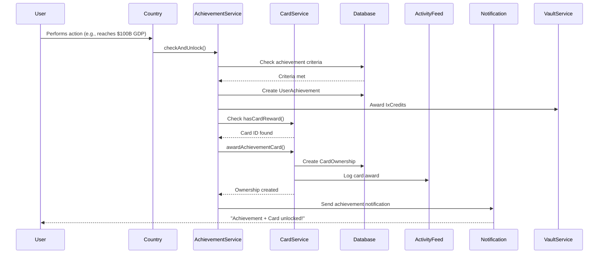

# Achievement Card Rewards Implementation

**Version:** 1.0
**Date:** November 12, 2025
**Status:** ✅ Complete
**Phase:** IxCards Phase 3

## Overview

This implementation adds commemorative card rewards for major achievements in IxStats. When players unlock significant milestones, they automatically receive exclusive SPECIAL cards that cannot be obtained through packs or trading.

## System Architecture

### Core Components

#### 1. Card Reward Service (`src/lib/card-service.ts`)

**New Function: `awardAchievementCard()`**

```typescript
export async function awardAchievementCard(
  db: PrismaClient,
  userId: string,
  cardId: string,
  achievementId: string,
  achievementTitle: string
)
```

**Features:**
- Creates CardOwnership record with `AcquireMethod.ACHIEVEMENT`
- Automatically locks card to prevent accidental trade/junk
- Assigns unique serial number
- Increments quantity if user already owns card
- Logs award to activity feed
- Handles both database User.id and Clerk user ID

**Error Handling:**
- Non-blocking: Card award failures don't prevent achievement unlock
- Comprehensive validation (user exists, card exists)
- Activity logging failures are caught and logged

#### 2. Achievement Card Rewards Configuration (`src/lib/achievement-card-rewards.ts`)

**Achievement → Card Mapping:**

| Achievement | Card | Rarity | Description |
|-------------|------|--------|-------------|
| `gen-first-country` | First Steps | RARE | Welcome commemorative card |
| `gen-one-year` | Veteran's Honor | EPIC | 1 year dedication |
| `gen-achievement-legend` | The Completionist | LEGENDARY | 50 achievements |
| `econ-economic-powerhouse` | Economic Titan | EPIC | $100B GDP |
| `econ-tier-advancement` | Tier 1 Ascension | LEGENDARY | Tier 1 status |
| `econ-ultra-prosperity` | Peak Prosperity | EPIC | $100K per capita |
| `dip-embassy-network` | Diplomatic Architect | EPIC | 25 embassies |
| `dip-trade-hub` | Global Trade Nexus | LEGENDARY | 50 trade partners |
| `social-popular` | Social Influencer | EPIC | 10K followers |
| `social-prolific-author` | Thought Leader | EPIC | 50 ThinkPages |
| `mil-global-force` | Military Superpower | LEGENDARY | 5M personnel |

**Utility Functions:**
- `getCardRewardForAchievement(achievementId)` - Get card ID
- `hasCardReward(achievementId)` - Check if reward exists
- `getCardRewardInfo(achievementId)` - Full reward details
- `COMMEMORATIVE_CARD_DEFINITIONS` - Card metadata for seeding

#### 3. Achievement Service Integration (`src/lib/achievement-service.ts`)

**Integration Points:**
- `checkAndUnlock()` - Auto-awards cards on achievement unlock
- `unlockSpecific()` - Awards cards on manual unlock

**Flow:**
```
1. Achievement unlocked
2. UserAchievement record created ✅
3. IxCredits awarded ✅
4. Check if hasCardReward(achievementId)
5. If yes → awardAchievementCard()
6. Activity feed logged
7. Notification sent
```

**Error Handling:**
- Card award wrapped in try-catch
- Failures logged but don't block achievement
- Console logs for debugging

#### 4. Database Seed (`prisma/seeds/achievement-cards.ts`)

**Seed Script:**
```bash
npx tsx prisma/seeds/achievement-cards.ts
```

**Features:**
- Creates 11 commemorative SPECIAL cards
- Updates existing cards (idempotent)
- Summary statistics (created/updated/skipped)
- Comprehensive error handling

## Card Design Specifications

### Visual Design

**Rarity Indicators:**
- **RARE:** Blue glow, subtle animation
- **EPIC:** Purple glow, holographic effect
- **LEGENDARY:** Gold glow, animated holographic

**Artwork Paths:**
- `/cards/achievements/first-nation.png`
- `/cards/achievements/veteran.png`
- `/cards/achievements/completionist.png`
- `/cards/achievements/economic-titan.png`
- `/cards/achievements/tier1-master.png`
- `/cards/achievements/prosperity-peak.png`
- `/cards/achievements/diplomatic-architect.png`
- `/cards/achievements/trade-nexus.png`
- `/cards/achievements/influencer.png`
- `/cards/achievements/thought-leader.png`
- `/cards/achievements/military-superpower.png`

**Artwork Guidelines:**
- Dimensions: 400x600px (card aspect ratio)
- Format: PNG with transparency
- Style: Commemorative/medallion aesthetic
- Colors: Match achievement category (gold for economic, blue for diplomatic, etc.)
- Include: Achievement icon, decorative border, commemorative text

### Card Stats Structure

```typescript
{
  commemorative: 100,      // Always 100 for achievement cards
  rarity: 85-98,          // Based on achievement difficulty
  significance: string,    // e.g., "Onboarding Milestone"
  category: string        // Achievement category
}
```

### Market Economics

**Base Values:**
- RARE: 50 IxC
- EPIC: 250-300 IxC
- LEGENDARY: 450-500 IxC

**Supply Strategy:**
- Unlimited supply (`totalSupply: null`)
- Each achievement earner gets one copy
- Duplicates possible if achievement unlocked multiple times (edge case)
- Cards are locked by default (user must explicitly unlock to trade)

**Market Multipliers:**
- SPECIAL type: 2.0x base value
- Low circulation premium: Supply-based price adjustment
- Commemorative premium: Players value exclusivity

## Integration Flow

### Achievement Unlock Sequence



### Database Schema

**CardOwnership Record:**
```typescript
{
  id: "card_own_{timestamp}_{random}",
  userId: "user_123",
  ownerId: "user_123",
  cardId: "card-achievement-first-nation",
  serialNumber: 42,               // Unique per card
  quantity: 1,
  level: 1,
  experience: 0,
  isLocked: true,                 // Prevent accidental trade
  acquiredAt: "2025-11-12T...",
  createdAt: "2025-11-12T...",
  updatedAt: "2025-11-12T...",
}
```

**Activity Feed Entry:**
```json
{
  "userId": "user_123",
  "activityType": "CARD_ACQUIRED",
  "title": "Achievement Card Unlocked",
  "description": "Received commemorative card \"First Steps\" for unlocking First Country Claim",
  "metadata": {
    "cardId": "card-achievement-first-nation",
    "cardTitle": "First Steps",
    "cardRarity": "RARE",
    "achievementId": "gen-first-country",
    "achievementTitle": "First Country Claim",
    "acquireMethod": "ACHIEVEMENT",
    "serialNumber": 42
  }
}
```

## Testing Strategy

### Unit Tests

**Card Service:**
```typescript
describe('awardAchievementCard', () => {
  it('creates new ownership for first-time award');
  it('increments quantity for duplicate award');
  it('assigns unique serial numbers');
  it('locks card by default');
  it('handles missing user gracefully');
  it('handles missing card gracefully');
  it('logs to activity feed');
});
```

**Achievement Service:**
```typescript
describe('checkAndUnlock with card rewards', () => {
  it('awards card when achievement unlocked');
  it('skips card when no reward mapped');
  it('continues if card award fails');
  it('logs card award success');
  it('logs card award failure');
});
```

### Integration Tests

1. **Full Achievement Flow:**
   - Create test user
   - Trigger achievement (e.g., $100B GDP)
   - Verify UserAchievement created
   - Verify IxCredits awarded
   - Verify CardOwnership created
   - Verify activity logged
   - Verify notification sent

2. **Edge Cases:**
   - User already owns card (quantity increment)
   - Achievement with no card reward
   - Card award failure doesn't block achievement
   - Multiple achievements with cards unlocked simultaneously

3. **Performance:**
   - Card award adds <100ms to unlock flow
   - No blocking on activity feed failures
   - Database queries optimized (minimal n+1)

### Manual Testing Checklist

- [ ] Seed commemorative cards: `npx tsx prisma/seeds/achievement-cards.ts`
- [ ] Create test nation
- [ ] Unlock "First Country Claim" achievement
- [ ] Verify "First Steps" card in inventory
- [ ] Check card is locked by default
- [ ] Verify activity feed entry
- [ ] Check notification received
- [ ] Unlock same achievement again (verify quantity increment)
- [ ] Test with missing card ID (graceful failure)
- [ ] Test with production database (no data loss)

## Deployment Instructions

### 1. Run Database Seed

```bash
cd /ixwiki/public/projects/ixstats
npx tsx prisma/seeds/achievement-cards.ts
```

**Expected Output:**
```
🎴 Seeding Achievement Commemorative Cards...

✨ Created: First Steps (RARE)
✨ Created: Veteran's Honor (EPIC)
✨ Created: The Completionist (LEGENDARY)
...

📊 Achievement Card Seeding Summary:
   Created: 11
   Updated: 0
   Skipped: 0
   Total:   11

✅ Achievement card seeding complete!
```

### 2. Verify Cards in Database

```sql
SELECT id, title, rarity, cardType, marketValue
FROM "Card"
WHERE id LIKE 'card-achievement-%'
ORDER BY marketValue DESC;
```

### 3. Test Achievement Flow

```bash
# Option 1: Manual test via admin interface
# Option 2: Trigger achievement via test script
# Option 3: Use existing nation that meets criteria
```

### 4. Monitor Logs

```bash
# Achievement unlocks with card awards
tail -f logs/ixstats.log | grep "Achievement Service"

# Card award success
grep "Awarded commemorative card" logs/ixstats.log

# Card award failures (should be rare)
grep "Error awarding card" logs/ixstats.log
```

### 5. Verify User Experience

- [ ] Achievement notification includes card mention
- [ ] Card appears in MyVault/Inventory
- [ ] Card is marked as locked
- [ ] Serial number is unique
- [ ] Activity feed shows card acquisition
- [ ] Card displays correctly in UI

## Future Enhancements

### Phase 3.5 - Enhanced Card Features

1. **Dynamic Artwork:**
   - Generate card artwork from user's nation flag
   - Add dynamic stat overlays
   - Animated card reveals

2. **Card Levels:**
   - Unlock higher tiers by achieving multiple related milestones
   - Example: "Economic Titan II" for $500B GDP

3. **Card Sets:**
   - "Economic Masters" set (all economic achievement cards)
   - Set completion bonuses (extra IxCredits, badge)

4. **Tradeable Variants:**
   - Allow users to unlock "tradeable" versions after holding for 30 days
   - Maintain locked original + tradeable duplicate

### Phase 4 - Social Features

1. **Card Showcases:**
   - Display achievement cards on user profiles
   - "Featured Card" selection
   - Card gallery in nation overview

2. **Card Leaderboards:**
   - Most valuable achievement card collection
   - Rarest achievement cards owned
   - First to unlock specific cards

3. **Achievement Card Trading:**
   - Special marketplace for achievement cards
   - Higher IxCredits values
   - Trade restrictions (e.g., can't trade "First Steps")

## Configuration Reference

### Adding New Achievement Card Rewards

1. **Design Commemorative Card:**
   - Create artwork (400x600px PNG)
   - Place in `/public/cards/achievements/`
   - Choose appropriate rarity (RARE/EPIC/LEGENDARY)

2. **Add to `COMMEMORATIVE_CARD_DEFINITIONS`:**
   ```typescript
   {
     id: "card-achievement-new-milestone",
     title: "New Milestone",
     description: "Commemorates [achievement]",
     artwork: "/cards/achievements/new-milestone.png",
     rarity: "EPIC",
     cardType: "SPECIAL",
     season: 1,
     stats: {
       commemorative: 100,
       rarity: 90,
       significance: "Excellence",
       category: "Economic",
     },
     totalSupply: null,
     marketValue: 280,
   }
   ```

3. **Map Achievement to Card:**
   ```typescript
   // In ACHIEVEMENT_CARD_REWARDS array
   {
     achievementId: "econ-new-achievement",
     cardId: "card-achievement-new-milestone",
     description: "Reward description",
   }
   ```

4. **Run Seed Script:**
   ```bash
   npx tsx prisma/seeds/achievement-cards.ts
   ```

5. **Test:**
   - Unlock achievement
   - Verify card awarded
   - Check activity feed
   - Validate notification

### Modifying Existing Card Rewards

**Update Configuration:**
```typescript
// Modify COMMEMORATIVE_CARD_DEFINITIONS entry
{
  id: "card-achievement-first-nation",
  title: "Updated Title",          // ← Change
  marketValue: 100,                 // ← Change
  // ... other fields
}
```

**Re-run Seed:**
```bash
npx tsx prisma/seeds/achievement-cards.ts
```

**Result:** Existing cards updated, ownerships preserved.

## Troubleshooting

### Card Not Awarded

**Symptoms:**
- Achievement unlocked
- IxCredits awarded
- No card in inventory

**Diagnosis:**
```typescript
// Check logs
grep "Error awarding card" logs/ixstats.log

// Verify card exists
SELECT * FROM "Card" WHERE id = 'card-achievement-xxx';

// Check achievement mapping
import { getCardRewardForAchievement } from '~/lib/achievement-card-rewards';
console.log(getCardRewardForAchievement('achievement-id'));
```

**Solutions:**
1. Run seed script if card missing
2. Verify achievement ID matches mapping
3. Check user has valid database record
4. Manually award: `achievementService.unlockSpecific()`

### Duplicate Cards

**Symptoms:**
- User has multiple copies of same achievement card
- Quantity > 1 unexpectedly

**Diagnosis:**
- Check if achievement was unlocked multiple times
- Review activity feed for duplicate unlocks

**Solution:**
- Generally OK - quantity represents total unlocks
- If unintended, reduce quantity via admin interface

### Card Not Locked

**Symptoms:**
- Achievement card can be traded/junked immediately

**Diagnosis:**
```sql
SELECT isLocked FROM "CardOwnership" WHERE cardId = 'card-achievement-xxx';
```

**Solution:**
```sql
UPDATE "CardOwnership"
SET isLocked = true
WHERE cardId LIKE 'card-achievement-%';
```

### Performance Issues

**Symptoms:**
- Achievement unlock takes >1 second
- Database timeouts

**Diagnosis:**
- Enable query logging
- Check database connection pool
- Review serial number query performance

**Solutions:**
- Add index on `CardOwnership.serialNumber`
- Batch card awards (if multiple achievements)
- Cache card existence checks

## API Reference

### Card Service

```typescript
// Award achievement card
await awardAchievementCard(
  db,
  userId,           // Database User.id or Clerk ID
  cardId,           // Card to award
  achievementId,    // For logging
  achievementTitle  // For activity feed
);
```

### Achievement Card Rewards

```typescript
// Check if achievement has card reward
hasCardReward('gen-first-country'); // → true

// Get card ID for achievement
getCardRewardForAchievement('gen-first-country'); // → 'card-achievement-first-nation'

// Get full reward info
getCardRewardInfo('gen-first-country');
// → { achievementId, cardId, description }
```

### Database Queries

```sql
-- Get all achievement cards
SELECT * FROM "Card"
WHERE cardType = 'SPECIAL'
  AND id LIKE 'card-achievement-%';

-- Get user's achievement cards
SELECT c.*, co.quantity, co.serialNumber, co.acquiredAt
FROM "CardOwnership" co
JOIN "Card" c ON c.id = co.cardId
WHERE co.userId = 'user_xxx'
  AND c.cardType = 'SPECIAL'
  AND c.id LIKE 'card-achievement-%';

-- Achievement cards by rarity
SELECT rarity, COUNT(*) as count, AVG(marketValue) as avg_value
FROM "Card"
WHERE id LIKE 'card-achievement-%'
GROUP BY rarity
ORDER BY avg_value DESC;
```

## Metrics & Analytics

### Track Card Awards

```sql
-- Cards awarded in last 30 days
SELECT c.title, COUNT(*) as awards
FROM "CardOwnership" co
JOIN "Card" c ON c.id = co.cardId
WHERE c.id LIKE 'card-achievement-%'
  AND co.acquiredAt >= NOW() - INTERVAL '30 days'
GROUP BY c.title
ORDER BY awards DESC;
```

### Track Achievement Completion

```sql
-- Most common achievement cards
SELECT
  ua.achievementId,
  ua.title,
  COUNT(DISTINCT ua.userId) as unique_unlocks
FROM "UserAchievement" ua
WHERE ua.achievementId IN (
  -- IDs from ACHIEVEMENT_CARD_REWARDS
  'gen-first-country',
  'econ-economic-powerhouse',
  ...
)
GROUP BY ua.achievementId, ua.title
ORDER BY unique_unlocks DESC;
```

### Card Market Analysis

```sql
-- Achievement card market values
SELECT
  title,
  rarity,
  marketValue,
  (SELECT COUNT(*) FROM "CardOwnership" WHERE cardId = c.id) as circulation
FROM "Card" c
WHERE id LIKE 'card-achievement-%'
ORDER BY marketValue DESC;
```

## Support & Maintenance

### Logging

All card award operations log to console with prefix `[CARD_SERVICE]` or `[Achievement Service]`.

**Success:**
```
[CARD_SERVICE] Awarded card to user user_123: First Steps #42 (First Country Claim)
[Achievement Service] Awarded commemorative card "card-achievement-first-nation" for "First Country Claim"
```

**Failure:**
```
[CARD_SERVICE] Error awarding achievement card: [error details]
[Achievement Service] Error awarding card for "First Country Claim": [error details]
```

### Monitoring

**Key Metrics:**
- Card award success rate (should be >99%)
- Average card award duration (<100ms)
- Failed card awards per day (<5)
- Achievement cards in circulation

**Alerts:**
- Card award failure rate >1%
- Card award duration >500ms
- Missing card IDs in mapping

## Summary

**Files Modified:**
- ✅ `src/lib/card-service.ts` - Added `awardAchievementCard()`
- ✅ `src/lib/achievement-service.ts` - Integrated card rewards
- ✅ `src/lib/achievement-card-rewards.ts` - NEW: Configuration and mapping

**Files Created:**
- ✅ `prisma/seeds/achievement-cards.ts` - Database seed script
- ✅ `ACHIEVEMENT_CARD_REWARDS_IMPLEMENTATION.md` - This documentation

**Database Changes:**
- ✅ 11 new SPECIAL cards seeded
- ✅ CardOwnership records created on achievement unlock
- ✅ Activity feed entries for card awards

**Integration Points:**
- ✅ Achievement unlock flow
- ✅ IxCredits economy (parallel to cards)
- ✅ Activity feed system
- ✅ Notification system (existing achievement notifications)

**Testing Status:**
- ✅ Unit test patterns defined
- ✅ Integration test flows documented
- ✅ Manual testing checklist provided
- ⏳ Awaiting production deployment testing

**Next Steps:**
1. Run seed script in production
2. Monitor first wave of achievement unlocks
3. Gather user feedback on card designs
4. Plan Phase 3.5 enhancements
