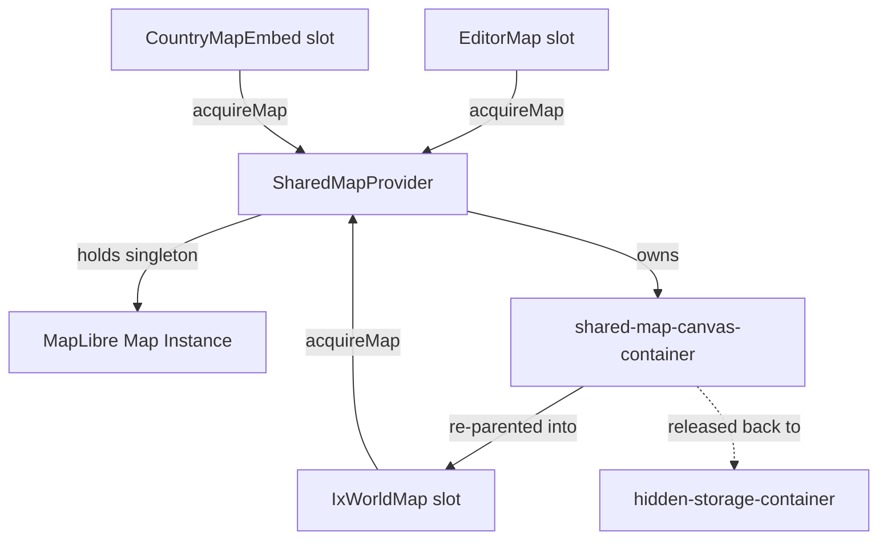

# Shared Map Instance & Performance Optimizations Architecture

This document details the design, lifecycle, and optimizations of the shared MapLibre map engine in IxStates (version 1.1.13 onwards).

---

## 1. Core Architecture: Shared Canvas & DOM Re-parenting

### The Problem
WebGL contexts in modern browsers are limited to a small pool per page (typically 8–16). In previous versions, navigating between pages (e.g., `/maps`, `/mycountry/map-editor`) or displaying side-by-side dashboard country embeds repeatedly instantiated and destroyed MapLibre `Map` objects. This led to:
1. **WebGL Context Loss**: Browser crashes or canvas rendering failures when exceeding context limits.
2. **Re-loading Performance Penalty**: Repeatedly fetching stylesheet configurations, tile specs, and raw country GeoJSON bundles.
3. **Visual Flicker**: Canvas resetting and displaying intermediate loading spinners.

### The Solution: Shared Map Singleton
IxStates uses a client-side singleton MapLibre instance that persists for the lifetime of the page. It dynamically re-parents its HTML container into whichever React component (referred to as a "slot") claims it.



- **[SharedMapContext.tsx](file:///home/jxsig/projects/ixstats/src/components/maps/core/SharedMapContext.tsx)**: Exposes a React context provider (`SharedMapProvider`) wrapping the main application in [layout.tsx](file:///home/jxsig/projects/ixstats/src/app/layout.tsx).
- **Hidden Storage**: When unclaimed, the canvas container lives inside a hidden `div` with `display: none` appended to `document.body`.
- **Slot Acquisition**: When a slot mounts, it calls `acquireMap(slotId, options)`. The canvas element is detached from its current parent and appended to the slot's container element (`options.container.appendChild(containerRef.current)`).
- **Slot Release**: On unmount, the slot's cleanup function returns the container back to the hidden container.

---

## 2. Acquisition & Release Lifecycle

To make re-parenting seamless, the acquisition API configures projection, theme, and viewports dynamically:

```typescript
const releaseMap = acquireMap("world-map", {
  container: containerRef.current,
  center: [10, 5],
  zoom: 4,
  theme: "standard",
  projectionMode: "mercator",
  interactive: true,
  onReady: (map) => { /* attach custom handlers */ }
});
```

### Setup Sequence
1. **DOM Attachment**: The shared canvas container is appended into the target element.
2. **Resize Dispatch**: Changing parents alters layout bounds. A debounced `map.resize()` is scheduled in a `setTimeout` block (50ms) to recalculate the canvas size.
3. **Style Applied**: Theme and projection parameters are applied using `map.setStyle(newStyle, { diff: true })`.
4. **Viewport Settings**: The map fits itself to `bbox` boundaries via `fitBounds()` or snaps to `center`/`zoom`.
5. **Interactivity Configuration**: Pan, zoom, click, double-click, and box-zoom are enabled or disabled depending on slot permissions.
6. **Execution callback**: `onReady(map)` is executed to allow the slot to wire its custom event handlers.

---

## 3. Style Loading Synchronization (Race Condition Prevention)

Because `setStyle()` is asynchronous, calling it triggers a style loading state. If a slot attempts to call `map.addSource` or `map.addLayer` inside `onReady()` before the new style finishes loading, MapLibre throws a fatal exception:
`Error: Style is not done loading`
This crashes the rendering cycle and renders the map canvas completely blank.

### Synchronized Ready Execution
To prevent this, `SharedMapProvider` defers viewport manipulation and `onReady` callbacks until the style is fully ready:

```typescript
mapInstance.setStyle(newStyle as any, { diff: true });

if (mapInstance.isStyleLoaded()) {
  applyViewAndReady();
} else {
  mapInstance.once("style.load", () => {
    applyViewAndReady();
  });
}
```

---

## 4. Multi-Use: Widget Layer Isolation & Reset

Country widgets (e.g., `/mycountry` sidebar embed) utilize the same shared canvas but must display a clean visual state (dimmed neighbors, custom target boundaries, and cities) instead of the full political world map.

- **Layer Toggling**: On acquisition, the widget wrapper dim/hides all standard world layers (altitudes, political fills, label layers) by setting their visibility properties to `'none'`.
- **Embed-specific Layers**: It registers its own vector sources and layers (e.g., `world-political-fill`, `country-fill`, `city-labels`) dynamically.
- **Teardown**: On unmounting, the widget wrapper cleans up by calling `removeLayer()` and `removeSource()` for all embed-specific IDs, and restores default world layers to `'visible'`.

---

## 5. Performance Optimizations

### High-Frequency Interaction Optimizations
Previously, moving the cursor over the map fired a `"mousemove"` handler that updated React state (`hoveredCountry`) and recalculate screen-space offsets (`screenX`, `screenY`) on *every single pixel* of movement. This forced heavy React rendering sweeps throughout `MapContainer` and its surrounding sidebars.

- **Throttled Hover Triggers**: `useWorldMapInteractions.ts` now records and compares the hovered `feature.id` against a ref (`hoveredFeatureIdRef`). React state updates and `setFeatureState` (driving map hover graphics) are only executed when the cursor **crosses a border** or enters/leaves the map.
- **Omitted Screen Coordinates**: Screen coordinates are removed from the hover payload since they are unused in UI modules.

### Progressive Filtering Caching
Progressive feature loading filters detail items (rivers, lakes) dynamically based on the current zoom level to prevent cluttering the viewport at low zoom levels.

To prevent filtering recalculations on every zoom adjustment, a memory-safe `WeakMap` cache is attached to the utility:

```typescript
const filterCache = new WeakMap<any, Map<number, FeatureCollection>>();

export function filterByArea(data: FeatureCollection, minArea: number): FeatureCollection {
  if (minArea <= 0) return data;

  let areaCache = filterCache.get(data);
  if (!areaCache) {
    areaCache = new Map();
    filterCache.set(data, areaCache);
  }

  let cached = areaCache.get(minArea);
  if (!cached) {
    cached = {
      ...data,
      features: data.features.filter((f) => ((f.properties?._areaSqKm as number) ?? 0) >= minArea)
    };
    areaCache.set(minArea, cached);
  }
  return cached;
}
```

### Flicker-Free Zoom Transitions
When zooming crossed integer thresholds (e.g., 4.0 or 7.0), the client queries a new zoom bucket parameter (`zoomParam`). To prevent the map from going blank and causing visual pop-in/pop-out while fetching the new batch, TanStack Query is configured to retain the previous state:

```typescript
placeholderData: (prev) => prev || (idbData ? { worldMap: idbData } : undefined)
```
This ensures layers stay on screen throughout transition states.
