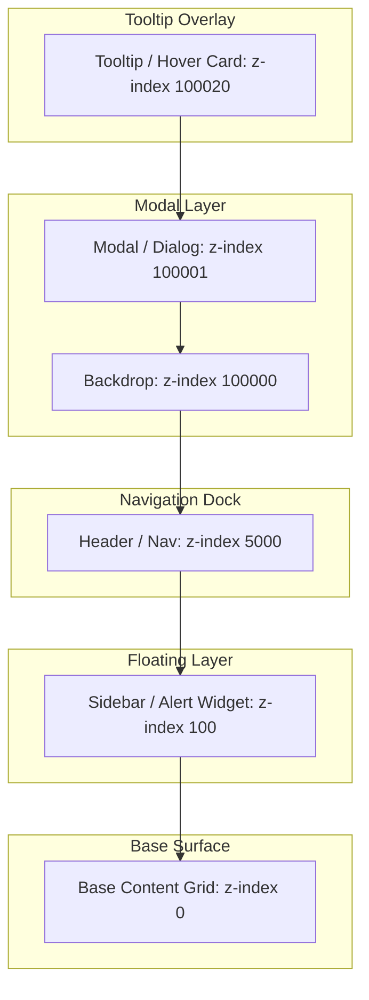
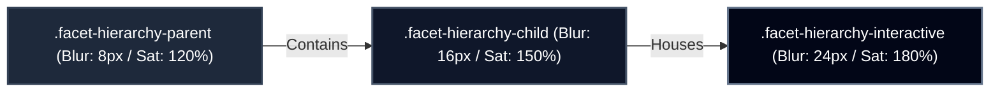

# Facet Design System - Reference & Style Guide

Welcome to the official **Facet Design System** Reference and Style Guide. Facet is the physics-driven visual language of the IxStates platform. It combines volumetric satin glass backgrounds, dynamic Z-axis depth levels, edge glare refraction, physical textures, and spring-based animations to create a premium, cohesive, and tactile user interface.

This guide outlines the core architecture, visual philosophy, material library, performance boundaries, and implementation patterns of the Facet system.

---

## 1. Visual Philosophy & Naming Absorption

Facet treats the UI screen as a physical workspace containing materials with varying visual properties (thickness, blur, friction, reflectivity).

### The Naming Absorption
Historically, parts of this design system were referred to as **"Glass Physics"** and the contextual hub was branded **"Dynamic Island"**. To create a unified visual specification, these concepts have been absorbed into the modern **Facet** language:
* **"Glass Physics"** is now **"Facet"** (all variables, classes, and React primitives use the `facet-` prefix).
* **"Dynamic Island"** is now **"Halo"** (represented by the unified `.facet-halo-*` design guidelines).
* Legacy `glass-` selectors and components are maintained strictly as backwards-compatible aliases, which map directly to Facet specifications under the hood.

---

## 2. Volumetric Z-axis Depth Scale

Facet organizes elements along a physical Z-axis. Instead of arbitrary z-index numbers, elements must strictly align with the platform's volumetric depth scale defined in [tokens.css](file:///ixwiki/public/projects/ixstats/src/styles/facet/tokens.css):

| CSS Variable | Depth Value | Z-Index | UI Element Categories |
| --- | --- | --- | --- |
| `--z-depth-background` | -1 | -1 | Background maps, base gradients, canvas grids |
| `--z-depth-surface` | 0 | 0 | Default page content layout, static list feeds |
| `--z-depth-floating` | 100 | 100 | Sidebars, navigation panels, sticky buttons |
| `--z-depth-navigation` | 5000 | 5000 | Global headers, floating navigation docks |
| `--z-depth-backdrop` | 100000 | 100000 | Modal overlays, dialog backdrops |
| `--z-depth-modal` | 100001 | 100001 | Modals (`Dialog`, `Sheet`), warning alerts |
| `--z-depth-popover` | 100010 | 100010 | Dropdown menus, command palettes, custom selects |
| `--z-depth-tooltip` | 100020 | 100020 | Context hover popovers, information tooltips |
| `--z-depth-toast` | 100050 | 100050 | Toast alerts, live status push banners |

### Stacking Hierarchy Visualized


---

## 3. Blur & Saturation Compounding Hierarchies

A key architectural feature of Facet is **nested blur physics**. When cards or popovers are nested inside each other, they inherit and compound the backdrop filter's blur and saturation coefficients to maintain visual contrast against complex page backdrops.

These classes are defined in [hierarchy.css](file:///ixwiki/public/projects/ixstats/src/styles/facet/hierarchy.css):

### Hierarchy Classes
1. **`.facet-hierarchy-parent`**: Used for root cards or navigation shells.
   * **Blur**: Subtle (`8px`), Saturation: `120%`.
   * **Background**: `rgba(255, 255, 255, 0.08)` (Dark) / `rgba(255, 255, 255, 0.9)` (Light).
2. **`.facet-hierarchy-child`**: Used for nested cards or list items.
   * **Blur**: Moderate (`16px`), Saturation: `150%`.
   * **Background**: `rgba(255, 255, 255, 0.1)` (Dark) / `rgba(255, 255, 255, 0.95)` (Light).
3. **`.facet-hierarchy-interactive`**: Used for interactive hoverable rows, buttons, or inputs.
   * **Blur**: Prominent (`24px`), Saturation: `180%` (expands to `32px` / `200%` on hover).
   * **Background**: `rgba(255, 255, 255, 0.15)` (Dark) / `rgba(255, 255, 255, 0.98)` (Light).

### Compounding Flow


---

## 4. Physical Materials Library

Facet implements a physical materials library in [materials.css](file:///ixwiki/public/projects/ixstats/src/styles/facet/materials.css) that responds to cursor/pointer coordinates dynamically.

### 1. Satin (`.facet-material-satin`)
* **Behavior**: Translucent volumetric glass backing with dynamic pointer sheen highlights.
* **Light Mode**: Translucent warm white with high blur (`20px`) and saturation (`190%`).
* **Dark Mode**: Translucent deep slate (`rgba(30, 41, 59, 0.45)`).
* **Hover Interaction**: Fades in a radial pointer sheen (`rgba(255, 255, 255, 0.12)` in light, `0.06` in dark) tracked at `--pointer-x` and `--pointer-y`.

### 2. Paper (`.facet-material-paper`)
* **Behavior**: Warm, opaque tactile surface mimicking physical paper.
* **Light Mode**: Warm off-white (`#fafaf9`).
* **Dark Mode**: Warm off-black (`#1c1917`).
* **Hover Interaction**: Offsets ambient shadows (`var(--pointer-offset-x)` / `var(--pointer-offset-y)`) opposite to the cursor position, creating the illusion of elevation.

### 3. Rubber (`.facet-material-rubber`)
* **Behavior**: High-friction matte background, chamfered borders, and soft deep shadows.
* **Light/Dark Mode**: Matte zinc-800 (`#27272a`) in light / zinc-900 (`#18181b`) in dark.
* **Hover Interaction**: Casts a subtle matte cursor diffusion highlight.

### 4. Metal (`.facet-material-metal`)
* **Behavior**: Brushed linear gradients with anisotropic linear reflection bands.
* **Light Mode**: Linear slate metallic gradients (`#cbd5e1` to `#e2e8f0`).
* **Dark Mode**: Linear slate-950/900 dark metallic gradients.
* **Hover Interaction**: Projects an anisotropic reflection band that follows the mouse horizontally across the surface.

---

## 5. Adaptive Texture Patterns

To prevent flat surfaces from feeling sterile, Facet exposes repeating background texture patterns. These patterns dynamically adjust their contrast between dark and light modes by referencing the `--facet-texture-color` token:

| CSS Selector | Description | Ideal Use Cases |
| --- | --- | --- |
| `.facet-texture-dots` | Radial circle grid | Modal headers, user profile cards |
| `.facet-texture-grid` | 12x12px square mesh grid | Interactive map side panels, canvas canvases |
| `.facet-texture-noise` | Concentrated micro-dots | Dashboard blurbs, system status widgets |
| `.facet-texture-crosshatch` | Angled double lines | Inactive tabs, disabled UI sections |
| `.facet-texture-diagonal` | Single angled slash lines | Pending auction lists, summary charts |
| `.facet-texture-paper-grain` | Interwoven linear grain lines | Article cards, wiki summaries |

---

## 6. Edge Glare Refraction & Dark Mode Overrides

The signature Facet look is achieved using edge refraction sheens which mimic a 1px chamfered glass boundary catching the light.

### Edge Glare Refraction (`.facet-refraction` / `.glass-refraction`)
* ** Chamfered border**: Implemented using a dual-gradient pad sheen on a `::before` pseudo-element with `mask-composite: xor`.
* **Top sheen**: Implemented via a horizontal line gradient on an `::after` pseudo-element to simulate a light glare at the top edge.

### The Dark Mode Refraction Override (Critical Rule)
High-opacity white edge glares look artificial and distracting in dark mode. Therefore, the Facet stylesheet applies critical dark mode adjustments:
1. **Edge Opacities Reduced**: Edge glares on pseudo-elements run at a minimized base opacity of `0.08` (fading to `0.15` on hover) in dark mode, compared to `0.2` (fading to `0.4` on hover) in light mode.
2. **Surface Smoothness**: Dark mode backgrounds are smooth-toned slate gradients (`rgba(30, 32, 40, 0.75)` to `rgba(18, 20, 24, 0.85)`) coupled with thin dark borders (`rgba(255, 255, 255, 0.08)`) to maintain maximum readability without glare overlays.

---

## 7. Performance Boundaries: Refraction-Free Fields

Applying double pseudo-elements (`::before`, `::after`) and heavy backdrop-filter blurs to active, editable text elements can cause high input latency, typing lag, and rendering stutters on slower machines.

### The Input Exception Rules
Any input element (`input`, `textarea`, `select`, or `[contenteditable]`) must bypass edge refraction sheens:
1. **No Pseudo-elements**: Pseudo-elements are disabled on interactive text fields (`display: none !important` and `content: none !important` via `.facet-refraction-none` overrides).
2. **Minimal Backdrop Blur**: Blur on active text fields is scaled down to a maximum of `4px` (`--blur-subtle`) to reduce rasterization costs.
3. **Contrast Borders**: Employs simple high-contrast solid borders (soft grey in light mode, thin translucent white in dark mode) to ensure letters remain highly readable while typing.

---

## 8. React Component Implementations

To implement Facet primitives inside React code, utilize the `<FacetContainer>` component from [facet-container.tsx](file:///ixwiki/public/projects/ixstats/src/components/ui/facet-container.tsx).

### 1. Primitives Usage
```tsx
import { FacetContainer, FacetCard, FacetModal, FacetNavigation } from "@/components/ui/facet-container";

// Base Facet Container
export default function MyWidget() {
  return (
    <FacetContainer variant="mycountry" depth={2} interactive="hover">
      <p>My Country Sim details...</p>
    </FacetContainer>
  );
}

// Specialized Card (Depth 1, Hover Interactive)
const CustomCard = () => (
  <FacetCard>
    <h2>Card Header</h2>
  </FacetCard>
);

// Specialized Modal Dialog (Depth 4, Non-Interactive)
const WarningDialog = () => (
  <FacetModal>
    <p>System Warning Message</p>
  </FacetModal>
);
```

### 2. The useFacetDepth Hook
For state-driven spring elevation changes (e.g., card lift animations):
```tsx
import { useFacetDepth, FacetCard } from "@/components/ui/facet-container";

export default function InteractiveCard() {
  const { depth, increaseDepth, resetDepth } = useFacetDepth(1);

  return (
    <FacetCard 
      depth={depth} 
      onMouseEnter={increaseDepth} 
      onMouseLeave={resetDepth}
    >
      <p>Hover me to lift this card in 3D space</p>
    </FacetCard>
  );
}
```

---

## 9. Compatibility Layer: Glass Physics Migration Mapping

For legacy components undergoing updates, use this mapping guide to translate legacy "Glass" concepts to the unified "Facet" system:

| Legacy Class / Component | Unified Facet Equivalent | Action / CSS Substitution |
| --- | --- | --- |
| `.glass-refraction` | `.facet-refraction` | Replaced or mapped as direct alias |
| `GlassContainer` | `FacetContainer` | Swap imports in TSX |
| `GlassCard` | `FacetCard` | Swap imports in TSX |
| `GlassModal` | `FacetModal` | Swap imports in TSX |
| `GlassNavigation` | `FacetNavigation` | Swap imports in TSX |
| `useGlassDepth` | `useFacetDepth` | Swap hook import |
| `.glass-hierarchy-*` | `.facet-hierarchy-*` | Replace selectors in styling |
| `.glass-composer-editor` | `.facet-refraction-none` | Replace custom composer overrides |
| `Dynamic Island` | `Halo` | Align branding definitions |
