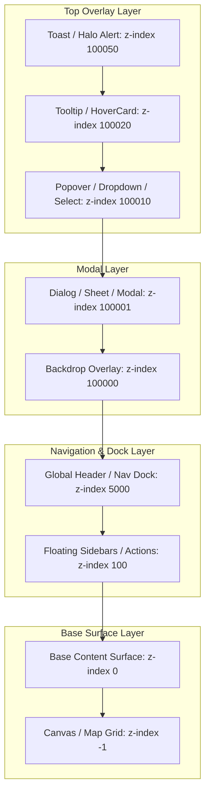

# Facet Design System & Interaction Bible (v2)

Welcome to the canonical **Facet Design System & Interaction Bible**. 

**Facet** is the physics-driven, tactile design language powering every interface across the IxStates platform. It unifies volumetric glass materials, dynamic Z-axis depth scaling, edge glare refraction, physical textures, spring-based animations, the **Halo** wayfinding system, and the **Cuelume** audio-tactile engine into a coherent, Apple-inspired human interface experience.

---

## 1. Executive Philosophy & System Absorption

Facet treats the screen as a physical workspace inhabited by layered surfaces with authentic physical properties (optical refraction, thickness, friction, blur compounding, and auditory resonance).

```mermaid
graph TD
    subgraph Facet Layer ["1. Facet Glass & Materials"]
        M["Physical Materials (Satin, Paper, Rubber, Metal)"]
        H["4-Tier Compounding Blur Hierarchy (8px → 16px → 24px → 32px)"]
        R["Edge Refraction & Dark Mode Overrides"]
    end
    
    subgraph Primitive Layer ["2. Headless Radix Primitives (src/components/ui/)"]
        P["30+ Primitives (Button, Dialog, Sheet, Popover, Select, etc.)"]
        S["Slot & asChild Polymorphism"]
        D["data-slot Selectors & Tailwind v4 @theme Tokens"]
        I["Iconoir-React Exclusivity"]
    end

    subgraph AudioTactile Layer ["3. Cuelume Audio-Tactile Engine"]
        E["17 Synthesized Sound Cues (bloom, whisper, droplet, tick, toggle, press)"]
        B["Root Delegated Event Listeners"]
        V["Master Gain & Restraint Calibration (0.12 - 0.25)"]
    end

    subgraph Motion Layer ["4. Apple & Emil Kowalski Motion Physics"]
        T["Tactile Press Compression (active:scale-0.98)"]
        SP["Spring Dynamics & Interruptible Transitions"]
        O["Origin-Aware Popovers & Centered Modals"]
        U["Unslop Motion Rules (0ms on shortcuts, fast exits)"]
    end

    Facet Layer --> Primitive Layer
    Primitive Layer --> AudioTactile Layer
    Primitive Layer --> Motion Layer
```

### The Architectural Absorption
Historically, fragments of the design system were referred to by legacy names:
- **"Glass Physics" → Facet**: The design system name is **Facet** (`FACET_VERSION` in the version registry). All styles, tokens, and React primitives use the `.facet-*` namespace. Legacy `glass-*` classes remain strictly as backward-compatible aliases.
- **"Dynamic Island" → Halo**: The contextual floating notification and wayfinding hub is **Halo** (represented by `.facet-halo-*` and `<Halo />`).
- **"Directives" vs "Statecraft"**: **Directives** is the universal user-facing executive brand across all UI triggers (`"Declare Directive"`, `"Tune Custom Directive"`). **Statecraft** is the backend simulation engine powering goal classification and CivCap throughput.

---

## 2. Volumetric Z-Axis Depth Scale

Facet organizes all UI elements along a physical Z-axis. Instead of arbitrary ad-hoc z-index values, components must strictly adhere to the volumetric depth scale defined in [`src/styles/facet/tokens.css`](file:///home/jxsig/projects/ixstats/src/styles/facet/tokens.css):

| CSS Variable | Depth Value | Z-Index | UI Category & Elements |
|---|---|---|---|
| `--z-depth-background` | `-1` | `-1` | Canvas grids, background map terrain, ambient backlights |
| `--z-depth-surface` | `0` | `0` | Default page layout, data tables, main content feeds |
| `--z-depth-floating` | `100` | `100` | Sidebars, dock panels, floating action buttons |
| `--z-depth-navigation` | `5000` | `5000` | Top headers, primary navigation bars, wayfinding docks |
| `--z-depth-backdrop` | `100000` | `100000` | Modal backdrops, drawer overlays (`AlertDialogBackdrop`) |
| `--z-depth-modal` | `100001` | `100001` | Dialogs, sheets, metric detail modals (`DialogContent`, `SheetContent`) |
| `--z-depth-popover` | `100010` | `100010` | Dropdown menus, selects, command palettes (`SelectContent`, `CommandDialog`) |
| `--z-depth-tooltip` | `100020` | `100020` | Information tooltips, rich hover cards (`TooltipContent`, `HoverCardContent`) |
| `--z-depth-toast` | `100050` | `100050` | Halo dynamic island notifications, live alert push banners (`DynamicIsland`) |

### Volumetric Stacking Hierarchy


---

## 3. Blur & Saturation Compounding Hierarchies

Facet uses **nested blur compounding** to maintain visual legibility against complex background maps, charts, and feeds. As elements nest inside each other, they inherit progressive blur and saturation increments:

| Hierarchy Class | Depth Level | Blur Radius | Color Saturation | Dark Background | Light Background |
|---|---|---|---|---|---|
| `.facet-hierarchy-parent` | Level 1 (Shell) | `8px` | `120%` | `rgba(255, 255, 255, 0.08)` | `rgba(255, 255, 255, 0.90)` |
| `.facet-hierarchy-child` | Level 2 (Card) | `16px` | `150%` | `rgba(255, 255, 255, 0.10)` | `rgba(255, 255, 255, 0.95)` |
| `.facet-hierarchy-interactive` | Level 3 (Input/Row) | `24px` (`32px` on hover) | `180%` (`200%` on hover) | `rgba(255, 255, 255, 0.15)` | `rgba(255, 255, 255, 0.98)` |
| `.facet-hierarchy-modal` | Level 4 (Modal) | `32px` | `200%` | `rgba(18, 20, 24, 0.85)` | `rgba(255, 255, 255, 0.98)` |

---

## 4. Physical Materials & Adaptive Textures

Facet defines four tactile surfaces in [`src/styles/facet/materials.css`](file:///home/jxsig/projects/ixstats/src/styles/facet/materials.css) that react dynamically to pointer coordinates (`--pointer-x`, `--pointer-y`, `--pointer-offset-x`, `--pointer-offset-y`):

### 1. Satin (`.facet-material-satin`)
- **Visual**: Volumetric translucent glass backing with a smooth pointer-following sheen highlight.
- **Light Mode**: Translucent warm white with `20px` blur and `190%` saturation.
- **Dark Mode**: Translucent deep slate (`rgba(30, 41, 59, 0.45)`).
- **Interaction**: Fades in a radial pointer sheen following the mouse across the card surface.

### 2. Paper (`.facet-material-paper`)
- **Visual**: Warm, opaque tactile surface mimicking physical parchment.
- **Light Mode**: `#fafaf9` (warm off-white). **Dark Mode**: `#1c1917` (warm off-black).
- **Interaction**: Casts an ambient shadow offset opposite to cursor coordinates (`var(--pointer-offset-x)`), producing an authentic 3D lift illusion.

### 3. Rubber (`.facet-material-rubber`)
- **Visual**: High-friction matte background with chamfered borders and deep ambient absorption.
- **Light / Dark Mode**: Matte zinc-800 (`#27272a`) / zinc-900 (`#18181b`).
- **Interaction**: Subtle cursor diffusion highlight.

### 4. Metal (`.facet-material-metal`)
- **Visual**: Brushed anisotropic reflection bands simulating milled aluminum.
- **Light / Dark Mode**: Linear slate-200 / slate-950 metallic gradients.
- **Interaction**: Projects an anisotropic reflection band that tracks the cursor horizontally.

### Adaptive Textures
Background texture overlays give surfaces tactile grain while dynamically scaling contrast via `--facet-texture-color`:
- `.facet-texture-dots`: Radial circle matrix (User profiles, modal headers).
- `.facet-texture-grid`: 12×12px square mesh (Interactive map sidebars, canvas grids).
- `.facet-texture-noise`: Micro-dot grain (System status widgets, feed blurbs).
- `.facet-texture-crosshatch`: Angled double lines (Disabled tabs, inactive states).
- `.facet-texture-paper-grain`: Interwoven grain lines (Wiki reader, article summaries).

---

## 5. Edge Refraction & Dark Mode Governance

The signature Facet finish is a 1px chamfered edge glare that catches ambient light.

### Refraction Sheens (`.facet-refraction` / `.glass-refraction`)
- **Chamfered border**: Dual-gradient pad sheen on a `::before` pseudo-element with `mask-composite: xor`.
- **Top glare**: Horizontal line glare on an `::after` pseudo-element simulating top-down light.

### Dark Mode Low-Opacity Governance (Critical Rule)
High-opacity white edge glares appear distracting in dark mode. Facet enforces calibrated opacities:
- **Light Mode**: `0.20` base opacity (fades to `0.40` on hover).
- **Dark Mode**: `0.08` base opacity (fades to `0.15` on hover).
- **Dark Surfaces**: Smooth slate gradient backgrounds (`rgba(30, 32, 40, 0.75)` to `rgba(18, 20, 24, 0.85)`) with subtle `rgba(255, 255, 255, 0.08)` borders to maximize reading ergonomics.

### Performance Boundary: Refraction-Free Inputs
> [!IMPORTANT]
> Pseudo-element blurs and double-layer masks on editable text fields cause severe input latency and typing lag.
- All `input`, `textarea`, and `[contenteditable]` elements must use `.facet-refraction-none` (`display: none !important` on `::before`/`::after`).
- Backdrop blur on editable inputs is capped at `4px` (`--blur-subtle`).

---

## 6. Headless Primitive Standards (`src/components/ui/`)

All UI primitives in IxStates are built upon a strict headless architecture:

1. **Radix UI Single Standard**: `@radix-ui/react-*` is the sole headless primitive foundation.
2. **Strict Encapsulation**: All primitives live in `src/components/ui/`. Feature components must **never** import `@radix-ui/*` directly.
3. **Polymorphic Triggers (`asChild`)**: Always use `@radix-ui/react-slot` (`asChild`) for custom triggers to maintain valid HTML markup and prevent nested interactive button errors.
4. **`data-slot` Architecture**: Primitives expose explicit `data-slot="..."` attributes (`data-slot="dialog-content"`, `data-slot="select-trigger"`), enabling clean Tailwind CSS v4 styling without brittle class cascading.
5. **Icon Standard**: `iconoir-react` is the sole standard icon library. `lucide-react` is strictly prohibited.
6. **Semantic Tokens**: Core styling must use Tailwind v4 CSS variables (`bg-background`, `text-foreground`, `border-border`, `bg-card`, `bg-popover`, `ring-ring`) rather than arbitrary hardcoded hex values or manual `dark:` overrides.

---

## 7. Cuelume Audio-Tactile Engine

IxStates integrates **Cuelume** ([`src/lib/sound/cuelume.ts`](file:///home/jxsig/projects/ixstats/src/lib/sound/cuelume.ts)), providing Web Audio synthesized interaction sounds adhering to the four core interaction principles: *causality, harmony, utility, restraint*.

### Root Event Delegation
[`CuelumeSoundProvider`](file:///home/jxsig/projects/ixstats/src/components/providers/CuelumeSoundProvider.tsx) in [`src/app/layout.tsx`](file:///home/jxsig/projects/ixstats/src/app/layout.tsx) automatically initializes the sound engine on application boot and delegates event listeners to the entire `document`. Route transitions fire a subtle `soundEffects.arrival()` cue.

### Standardized Primitive Audio Matrix

| Primitive | Target Element | Audio Binding | Trigger Event |
|---|---|---|---|
| **Button** | `<Button>` | `data-cuelume-press` + `data-cuelume-release` | Pointer Down / Up |
| **Dialog** | `<DialogContent>` / `<DialogClose>` | `soundEffects.bloom()` / `data-cuelume-press="droplet"` | Mount / Pointer Down |
| **Sheet** | `<SheetContent>` / `<SheetClose>` | `soundEffects.bloom()` / `data-cuelume-press="droplet"` | Mount / Pointer Down |
| **AlertDialog** | `<AlertDialogContent>` / `<AlertDialogClose>` | `soundEffects.bloom()` / `data-cuelume-press="droplet"` | Mount / Pointer Down |
| **Popover** | `<PopoverContent>` / `<PopoverClose>` | `soundEffects.whisper()` / `data-cuelume-press="droplet"` | Mount / Pointer Down |
| **HoverCard** | `<HoverCardContent>` / `<HoverCardTrigger>` | `soundEffects.whisper()` / `data-cuelume-hover="tick"` | Mount / Pointer Enter |
| **Tooltip** | `<TooltipTrigger>` | `data-cuelume-hover="tick"` | Pointer Enter |
| **Tabs** | `<TabsTrigger>` | `data-cuelume-press="page"` + `data-cuelume-hover="tick"` | Pointer Down / Enter |
| **Checkbox** | `<Checkbox>` | `data-cuelume-toggle` | Click |
| **Switch** | `<AppleSwitch>` / `<Switch>` | `data-cuelume-toggle` | Click / Drag Toggle |
| **Toggle** | `<Toggle>` | `data-cuelume-toggle` | Click |
| **ToggleGroup** | `<ToggleGroupItem>` | `data-cuelume-press="tick"` + `data-cuelume-hover="tick"` | Pointer Down / Enter |
| **Accordion** | `<AccordionTrigger>` | `data-cuelume-press="toggle"` + `data-cuelume-hover="tick"` | Pointer Down / Enter |
| **Select** | `<SelectTrigger>` / `<SelectItem>` | `data-cuelume-press="press"` / `data-cuelume-press="tick"` + `data-cuelume-hover="tick"` | Pointer Down / Enter |
| **DropdownMenu** | `<DropdownMenuItem>`, `<RadioItem>`, `<CheckboxItem>` | `data-cuelume-press="tick"` + `data-cuelume-hover="tick"` | Pointer Down / Enter |
| **Command** | `<CommandItem>` | `data-cuelume-press="press"` + `data-cuelume-hover="tick"` | Pointer Down / Enter |
| **Slider** | `<SliderThumb>` | `data-cuelume-press="tick"` + `data-cuelume-hover="tick"` | Pointer Down / Enter |

### Calibrated Restraint
- Master volume default is pegged to **`0.25`** with localStorage persistence.
- Individual synthesized cue gains are calibrated between **`0.12`** and **`0.20`** so interactions remain comfortable and non-fatiguing even at 100% system speaker volume.

---

## 8. Apple Design & Emil Kowalski Motion Physics

Facet follows the design engineering motion principles defined by Apple Human Interface Guidelines and Emil Kowalski:

### 1. Tactile Pointer-Down Compression
Pressable elements must provide instant mechanical confirmation on `:active`:
```css
/* Tactile Button Feedback */
.btn-tactile {
  transition: transform 140ms cubic-bezier(0.23, 1, 0.32, 1);
}
.btn-tactile:active {
  transform: scale(0.98);
}
```

### 2. Origin-Aware Popovers vs Centered Modals
- **Popovers, Selects, Dropdowns**: Must animate in from their trigger anchor using `transform-origin: var(--radix-popover-content-transform-origin)`.
- **Modals & Dialogs**: Must stay centered (`transform-origin: center`) as they are viewport-anchored rather than trigger-anchored.

### 3. Unslop Motion Discipline
- **Zero Animation on Keyboard Actions**: Command palettes, search toggles, and shortcut-initiated dialogs have **0ms animation** for instant response.
- **Duration Ceiling**: Standard UI transitions must stay strictly under **250ms**.
- **Asymmetric Timing**: Pressing/triggering can be deliberate, but release/exit must always be instantaneous (100–180ms `ease-out`).
- **Never Animate from `scale(0)`**: Entrances start from `scale(0.95)` with `opacity: 0`—nothing in the real world appears from zero.
- **Hardware-Accelerated GPU Transforms**: Animate only `transform` and `opacity`. Never animate `width`, `height`, `margin`, or `padding`.

---

## 9. 3-Mode Navigation Architecture & Dynamic Repulsion Physics

All pages in IxStates conform to one of three universal navigation modes:

1. **Mode 1: DEFAULT (Global Scroll-Hide & Morph)**: Standard pages (Home, MyCountry, Dashboard, Vault, ThinkPages, Forum, Countries, Admin, Sports, Settings) sit in the top anchor zone (<50px). Morphs tabs inwards (40px → 100px), scroll down hides with cubic-bezier/spring transitions, and scroll up reveals instantly.
2. **Mode 2: HIDDEN (Immersion & Canvas Focus)**: Surfaces requiring distraction-free focus (`/messages`, `/builder`, `/mycountry/editor`, `/wiki/*`, `/blurbs/*`) start with navbar translated `-100%`, revealing smoothly on upward scroll (>10px) or top-edge hover (<=16px) while the dedicated `WikiHalo` or `Halo` pill remains interactive.
3. **Mode 3: MAPS (Chromeless Standalone)**: Standalone spatial surfaces (`/maps`) cleanly bypass global navigation chrome, handing off navigation and wayfinding entirely to `MapDynamicIsland`.

### Dynamic Repulsion Physics Formula
When any sub-header, toolbar, or filter strip sits below the sticky Halo:
$$\text{repulsionProgress} = \text{clamp}\left(\frac{\text{scrollY}}{56}, 0, 1\right)$$

- **Center Branding Glide**: Translates `y: -repulsionProgress * 40px`, scales `scale(1 - repulsionProgress * 0.1)`, and fades `opacity: 1 - repulsionProgress`.
- **Seamless Action Tuck**: Action buttons slide inward directly beneath the floating Halo pill.
- **Ambient Refraction Glow**: Subtle blue/purple radial glow appears during transition (`0 0 (1 - repulsionProgress) * 12px`).
- **Desktop Sticky Rails Clearance**: All page sidebars and rails must use `lg:sticky lg:top-20` (80px) to guarantee a clean 16px buffer beneath the 64px floating/sticky header. Never use `top-6` or `top-0` on page-level sidebars.

---

## 10. Zero-Hex Color System & Semantic Tokens

IxStates strictly bans raw, arbitrary hex codes (`[#...]` or `style={{ color: "#..." }}`) across all components and stylesheets:

- **100% Semantic Token Rule**: All colors must use Tailwind v4 semantic utility classes (`text-foreground`, `bg-card`, `border-border/40`, `text-muted-foreground`, `text-primary`, `bg-popover`, `text-destructive`).
- **Domain Accents**: Domain-specific accents use semantic CSS variables (`var(--color-amber-500)`, `var(--wikios-accent)`, `var(--onoma-primary)`).
- **Light/Dark Contrast**: Every color pair must meet WCAG AA contrast standards across both light and dark themes without manual `dark:` overrides.

---

## 11. Domain Themes & Semantic Palette

IxStates applies distinctive ambient color accents across its major platform pillars:

| Domain | Accent Color | Semantic Variable | System Pillars |
|---|---|---|---|
| **MyCountry** | Gold / Amber | `--color-amber-500` | Executive command suite, Directives, statecraft loop |
| **Global / Maps** | Sky / Blue | `--color-blue-500` | World map viewer, Factbook profiles, atlas |
| **ThinkPages** | Emerald / Jade | `--color-emerald-500` | ThinkPages feed, ThinkTanks, ThinkShare messaging |
| **Vault** | Amber / Copper | `--color-amber-600` | Cards, packs, credit market, collectibles |
| **Forum** | Orange | `--color-orange-500` | Community discourse, town hall debates, bulletins |
| **Intelligence & Defense** | Crimson / Indigo | `--color-rose-500` / `--color-indigo-500` | Security monitors, defense readiness, alerts |

---

## 12. Developer Cookbook & Component Recipes

### 1. Standard Interactive Facet Card
```tsx
import { FacetCard } from "@/components/ui/facet-container";
import { soundEffects } from "~/lib/sound/cuelume";

export function DirectiveCard({ title, description }: { title: string; description: string }) {
  return (
    <FacetCard
      depth={2}
      className="p-5 cursor-pointer active:scale-[0.98] transition-transform duration-140"
      data-cuelume-press="press"
      data-cuelume-hover="tick"
      onClick={() => soundEffects.bloom()}
    >
      <h3 className="text-sm font-semibold text-foreground">{title}</h3>
      <p className="text-xs text-muted-foreground mt-1">{description}</p>
    </FacetCard>
  );
}
```

### 2. Dialog Modal with Cuelume & Apple Tactile Physics
```tsx
import {
  Dialog,
  DialogContent,
  DialogHeader,
  DialogTitle,
  DialogTrigger,
  DialogClose,
} from "~/components/ui/dialog";
import { Button } from "~/components/ui/button";

export function ConfirmDirectiveDialog() {
  return (
    <Dialog>
      <DialogTrigger asChild>
        <Button variant="default">Declare Directive</Button>
      </DialogTrigger>
      <DialogContent className="sm:max-w-md">
        <DialogHeader>
          <DialogTitle>Confirm National Directive</DialogTitle>
        </DialogHeader>
        <p className="text-xs text-muted-foreground">
          Commit CivCap allocation to initiate legislative review.
        </p>
        <div className="flex justify-end gap-2 mt-4">
          <DialogClose asChild>
            <Button variant="outline">Cancel</Button>
          </DialogClose>
          <Button variant="default">Confirm</Button>
        </div>
      </DialogContent>
    </Dialog>
  );
}
```

### 3. Dynamic Island / Halo Push Notification
```tsx
import { useNotify } from "~/hooks/useNotify";

export function useDirectiveNotification() {
  const notify = useNotify();

  const notifySuccess = (title: string, message: string) => {
    // Automatically plays soundEffects.success() and renders in Halo
    notify.success({ title, message });
  };

  return { notifySuccess };
}
```
