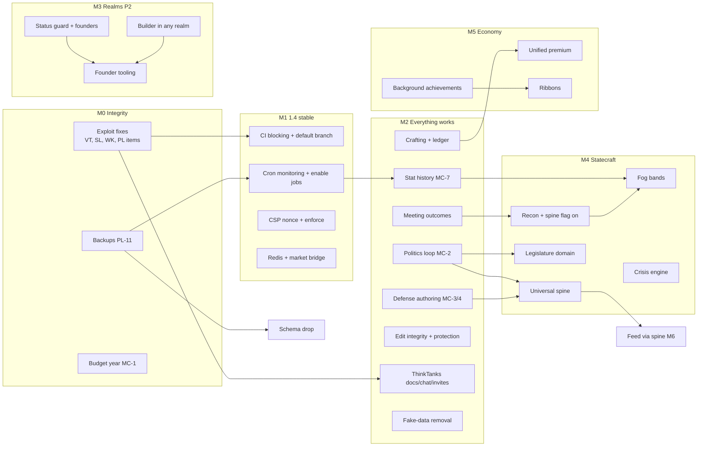

# IxStates Feature Roadmap

**Updated:** 2026-10-05 · **Baseline:** `rose-garden` @ `b7cc2392`, statuses re-checked at `6d53b0c` (1.4.0 "Lobster Crosby", Release Candidate)
**Backlog:** [backlog.md](backlog.md), the single list of open items with their evidence. It keeps the code audit's
IDs (`MC-`, `AT-`, `WK-`, `VT-`, `SL-`, `PL-`) and cites the old doc-based backlog's sections as `PF§1`–`PF§7`. The
source audits are kept in [docs/history/roadmap/](../history/roadmap/) ·
[System Status](../systems/SYSTEM_STATUS.md) (what is live)

> **2026-10-05:** statuses below include PRs #48–#49 and the 2026-10-05 security, CI, ops and cron commits. Items done
> in code are marked ✅; [ACTION_PLAN_2026-10-05.md](ACTION_PLAN_2026-10-05.md) has the evidence and the ordered next
> steps.

This is the plan: what to do, in what order, and why. Items refer to the backlog above, which keeps the evidence
(file paths, callers, sizes). Milestones are ordered by risk and dependency, not by calendar. Version targets are
proposals for the version registry (`src/lib/buildVersion.ts`).

**Size:** S under a day · M 1–3 days · L more than 3 days. **Priority:** P0 must happen before release · P1 this milestone ·
P2 when capacity allows.

## Contents

- [Principles](#principles)
- [Milestones at a glance](#milestones-at-a-glance)
- [M0 — Integrity: security & economy exploits](#m0--integrity-security--economy-exploits)
- [M1 — Ship 1.4 stable: release & operations baseline](#m1--ship-14-stable-release--operations-baseline)
- [M2 — Everything on screen works (1.5)](#m2--everything-on-screen-works-15)
- [M3 — Realms Phase 2: open worlds (1.6)](#m3--realms-phase-2-open-worlds-16)
- [M4 — The living nation: statecraft depth (1.7)](#m4--the-living-nation-statecraft-depth-17)
- [M5 — Economy, collectibles & premium (1.8)](#m5--economy-collectibles--premium-18)
- [M6 — Social & knowledge](#m6--social--knowledge)
- [M7 — Labs](#m7--labs)
- [Continuous: code health](#continuous-code-health)
- [Decisions needed](#decisions-needed)
- [Dependency map](#dependency-map)

---

## Principles

1. **Integrity before features.** Anything that mints currency, destroys other players' property, lets one user act as
   another, or loses data comes first, however small.
2. **Nothing on screen may lie.** A control that does nothing, a number that's made up, or a setting that isn't enforced
   either gets wired up or gets hidden. Don't leave it and add more.
3. **Finish before starting.** Partly built loops (politics, defense, crafting, ThinkTanks) come before new pillars.
4. **Restore with a caller.** When a plan-312 deletion is restored, the UI that calls it lands in the same PR, so the zero-caller
   census doesn't delete it again.
5. **Decide, then build or drop.** Dead schema and half-built systems wait on an owner decision
   ([Decisions needed](#decisions-needed)) rather than lingering.

## Milestones at a glance

| Milestone | Goal | Items | Rough size | Exit criteria |
|---|---|---|---|---|
| **M0** Integrity | Close every exploit and data-loss risk | 19 | ~10–14 days | No known way to mint IxC, act as another user, or edit without authorization; backups restore |
| **M1** 1.4 stable | Promote rose-garden to production (via development and master) and run it safely | 18 | ~12–16 days | CI fully blocking and green; jobs enabled with alerts; nightly backups; CSP enforced |
| **M2** 1.5 | Every visible feature works; no fake data | ~45 | ~30–40 days | The "nothing lies" rule holds in every system; broken loops restored |
| **M3** 1.6 | Realms Phase 2: founders run their own worlds | 15 | ~20–25 days | A founder runs a realm end to end without a site admin |
| **M4** 1.7 | Statecraft depth: the living nation | ~20 | ~35–50 days | IN → SEE → OUT → RIPPLE is closed for issues, politics, diplomacy and crises |
| **M5** 1.8 | Economy, collectibles & premium | ~15 | ~25–35 days | Ribbons and NATION cards live; one premium definition; payments decided |
| **M6** ongoing | Social & knowledge depth | ~15 | ~20–30 days | Feed, notifications, privacy and WikiOS editing complete |
| **M7** ongoing | Labs | ~20 | Open-ended | Per-lab roadmaps |

M0 and M1 run back to back. After M2, M3 to M6 can run in parallel tracks when there's more than one contributor. The
code-health track runs throughout.

---

## M0 — Integrity: security & economy exploits

**Goal:** close every known exploit before rose-garden reaches players. All items are S or M, with regression tests.

| # | Item | Refs | Size | P | Status |
|---|---|---|---|---|---|
| 1 | Server-side `purchaseStoreItem(itemId)` that reads the price and prerequisites from `VaultStoreItem`; remove or admin-gate `spendCredits` | VT-1 | S–M | P0 | Merged ([#36](https://github.com/algolds/ixstats/pull/36)) |
| 2 | NationStates deck import: consume or expire the verification, count only newly owned cards, grant a one-time bonus per nation | VT-2 | S | P0 | Merged ([#36](https://github.com/algolds/ixstats/pull/36)) |
| 3 | `junkCards` pays out from the `deleteMany` count inside the transaction | VT-3 | S | P0 | Merged ([#36](https://github.com/algolds/ixstats/pull/36)) |
| 4 | `grantBonus` one-time payouts through `earnCreditsOnce` with an idempotency key | VT-6 | S | P0 | Merged ([#36](https://github.com/algolds/ixstats/pull/36)) |
| 5 | NationStates takedown: exact nation match, `NS_IMPORT` cards only, rate-limited; make `refreshCardValues` admin-only or rate-limited | VT-7, VT-22, PL-3 | S | P0 | Merged ([#36](https://github.com/algolds/ixstats/pull/36)) |
| 6 | `createAuction` locks with a conditional `updateMany` | VT-24 | S | P0 | Merged ([#36](https://github.com/algolds/ixstats/pull/36)) |
| 7 | ThinkTank authorization: every procedure uses `ctx.auth.userId`; owner, admin and member guards; group type enforced on join; resolve names (not `User abc123`) | SL-1, SL-2, SL-12 | M | P0 | Merged ([#38](https://github.com/algolds/ixstats/pull/38)) |
| 8 | Delete the made-up Discord reactors fallback; move the guild ID to env | SL-3 | S | P0 | Merged ([#38](https://github.com/algolds/ixstats/pull/38)) |
| 9 | Forum linking requires proof (a code on the XenForo profile, like wiki verification); audit existing links | WK-1 | S–M | P0 | Merged ([#38](https://github.com/algolds/ixstats/pull/38)) |
| 10 | Lorewards admin mutations use `adminProcedure`; mask the Narrator LLM key | WK-9, WK-12 | S | P0 | Merged ([#38](https://github.com/algolds/ixstats/pull/38)) |
| 11 | Anonymous Kokoro access: protect or rate-limit `suggestPhonemes` / `wakeKokoroServer`; rate-limit public usage counters | PL-3 | S | P0 | Merged ([#38](https://github.com/algolds/ixstats/pull/38)) |
| 12 | The admin audit log actually persists: check `result.ok`, log every admin mutation | PL-1 | S | P0 | Merged ([#38](https://github.com/algolds/ixstats/pull/38)) |
| 13 | `collectMatchRevenue` pays per home match, not per click (with the sponsor `winBonus` fix) | SL-14 | S | P0 | Merged ([#43](https://github.com/algolds/ixstats/pull/43)); run `db:mark-match-revenue-collected` at deploy (ops) |
| 14 | Budget year: one IxTime-based year for writers, readers and the zod bound (it breaks on 2027-01-01) | MC-1 | S | P0 | Merged ([#37](https://github.com/algolds/ixstats/pull/37)) |
| 15 | Backups: a working `db:backup` / `db:restore` for Postgres, a `pg_dump` in `deploy-production.sh` before `db push`, and a tested restore | PL-11 | M | P0 | Merged ([#37](https://github.com/algolds/ixstats/pull/37)); a `db:backup` → `db:restore` round trip passed on a scratch catalog DB (2026-10-05); restoring a production dump is still to do (ops) |
| 16 | Rotate the `ixstats_readonly` password (it's in git history) | PF§1 | S | P0 (ops) | Open (ops) |
| 17 | After 1–4: audit `vault_transactions` for exploit rows and correct balances | — | S | P0 | Report ([#36](https://github.com/algolds/ixstats/pull/36)) and `audit:vault-exploits:apply` ([#40](https://github.com/algolds/ixstats/pull/40)); run on production (ops) |
| 18 | Small hardening: take the audit IP from `cf-connecting-ip`, drop the `X-RateLimit-Identifier` echo, compare secrets in constant time | PL-20 | S | P1 | Done ([#38](https://github.com/algolds/ixstats/pull/38), [#39](https://github.com/algolds/ixstats/pull/39)) |
| 19 | Rate-limit the 243 unlimited mutations | PL-3, PF§3 | M | P1 | ✅ Done (2026-10-05) outside `wikios`: `rateLimitedMutationProcedure` / `premiumMutationProcedure` (60/min per user per mutation); an architecture test blocks new unlimited mutations. `wikios` (20) waits on #52 |
| 20 | Sports commentary: a caller-supplied LLM/TTS config no longer receives the server keys; `generateMatchCommentary` is rate-limited and only the league manager can force a regenerate. Admin gates on lorewards `getCrossValidationHistory` / `getBlacklist` and sports `getAdminGlobalStats` / `testLLMNarrator` | action plan 0.1 | S | P0 | Done (2026-10-05) |

**Exit:** every P0 merged with tests; a backup restored into a scratch database; the exploit audit is done.

---

## M1 — Ship 1.4 stable: release & operations baseline

**Goal:** promote rose-garden through `development` to `master` (production) and make it safe to run: jobs on, CI trustworthy, security headers enforced.

**Repository & CI**
| Item | Refs | Size | Status |
|---|---|---|---|
| Branch model (D13, decided): promote `rose-garden` → `development` → `master`; `master` stays production and the default branch; Dependabot targets `rose-garden` (done); obsolete Dependabot PRs closed (done) | PL-14, PL-15 | S | Partial: CI and the security scan run on `master`, `development` and `rose-garden`; `dependabot.yml` cleaned up (2026-10-05). Dependabot and scheduled workflows read config from `master` only, so these take effect after promotion |
| Fix or delete the failing scheduled workflows (security scan → `bun audit`; image validation; Gemini triage and review need `GEMINI_API_KEY` or removal) | PL-14 | S | Partial: the security scan uses `bun audit` and `image-validation.yml` is deleted (2026-10-05); Gemini (D15) open |
| Fix the 5 rules-of-hooks errors, set `--max-warnings` to ~160, make `lint:strict` blocking | PL-17 | S | ✅ Done (2026-10-05): 0 errors and 25 warnings; `--max-warnings 25` and the CI step is blocking |
| Typecheck tests, `proxy.ts`, `instrumentation.ts`, `content` and `scripts/` in CI; add `typecheck:db` | PL-16 | S | Mostly done (2026-10-05): `typecheck:db` and `typecheck:scripts` (scripts, prisma seeds, proxy, instrumentation, content) run in CI. Left: `src/tests` (≈890 type errors) — ratchet it down before adding it |
| Fix the 7 package scripts that fail on import | PL-5 | S | ✅ Done (2026-10-05); the `check:script-imports` CI step keeps them working |
| `audit:arch`: split the 15 files over the ceiling or add them to `RELAXED_FILES`, then make it blocking | PF§6 | M | ✅ Done (2026-10-05): the oversized files are split (or the navigation table relaxed; the WikiOS templates router frozen until #52), no cross-router imports remain, and the CI step is blocking |

**Deploy & runtime**
| Item | Refs | Size | Status |
|---|---|---|---|
| Deploy rose-garden via [the runbook](../operations/deploy-rose-garden-2026-09.md) (Realms schema, backfill, Eurth) | runbook | M | Open (ops) |
| Redis in production (required for realtime across processes and for shared rate limits) | PF§5 | S | Partial: `/api/health` reports Redis state and `verify:environment` recommends `REDIS_ENABLED` in production (2026-10-05); enabling it on the server is ops |
| Market WebSocket Redis bridge | PL-4 | M | ✅ Done (2026-10-05, `src/server/market-broadcast-bridge.ts`) |
| Commit `ecosystem.config.example.cjs`; run the web process under PM2 | PL-12 | S | Partial: the template (cron, ws, ixtwitter) is committed and a failed PM2 reload fails the deploy (2026-10-05); the web app still runs from `start-production.sh` |
| Rewrite the rollback script around tags and the real restart | PL-13 | S | ✅ Done (2026-10-05): `rollback-deployment.sh` checks out a rollback branch from the `master` remote, optionally restores a pre-deploy dump and redeploys |
| CSP: ~~propagate the nonce on request headers~~ (done, [#46](https://github.com/algolds/ixstats/pull/46)) → remove the nginx override and check for violations → drop `'unsafe-inline'` | PL-2, PF§1 | M | Partial: production no longer allows `http:` images or `ws:` sockets (2026-10-05); nginx override and `'unsafe-inline'` remain |

**Scheduled jobs** (order matters; see [code audit §9](../history/roadmap/code-audit-2026-09-30.md#9-cron-job-readiness))
| Item | Refs | Size | Status |
|---|---|---|---|
| Cron monitoring: a `CronRun` row per run, a Discord alert on failure, last success in `/api/health` | PL-10 | M | ✅ Done (2026-10-05) |
| Page through cron reads (the 1,000-row cap); log when the cap is hit | PL-7 | S | ✅ Done (2026-10-05): `db.ts` logs when the cap is hit; `findAllById` pages diplomatic-drift, politics-drift, thinkpages-trending, passive-income, national-issues and policy-maintenance |
| Make `policy-maintenance` idempotent with a per-period key (confirm the `totalBudget` debit design) | PL-8 | S | ✅ Done (2026-10-05): one upkeep debit per policy per IxTime budget year (marker row in `PolicyEffectLog`); the annual period needs owner sign-off |
| Enable the 21 jobs one per cycle, in the [runbook's order](../operations/deploy-rose-garden-2026-09.md#7-turn-cron-jobs-on-one-per-cycle) (now including `db-backup`, `log-retention`, `stat-progression`, `thinkpages-trending` and `achievements-evaluate`) | VT-15, §9 | S | Open (ops) |
| New jobs: log retention; nightly backup | PL-6, PL-11 | S | ✅ Done: `db-backup` (#37) and `log-retention` (2026-10-05) |
| Replace the cron job lock's long transaction with a lease row | PL-9 | M | ✅ Done (2026-10-05, `job_leases`) |

**Exit:** the version registry reads 1.4.x Stable; CI is fully blocking and green; jobs are enabled with alerting; backups
run nightly; CSP is enforced.

---

## M2 — Everything on screen works (1.5)

**Goal:** apply principle 2 across the product. Restore the loops that plan 312 and earlier deletions broke, finish the
half-built features players can already see, and remove every fabricated number.

### M2.1 Restore broken core loops
| Item | Refs | Size | Depends on |
|---|---|---|---|
| ✅ **Done (#49):** first elections are scheduled once a legislature has at least 2 parties, candidates come from the parties, resolution seats them and bills can pass (D1 option a; seat-by-vote-share not built) | MC-2, PF§2 | M–L | Decision D1 |
| ✅ **Done (2026-10-05):** `meetings.concludeMeeting` records the outcome and one decision per agenda item; `CabinetMeetingsPanel` in the Cabinet tab. Left: decisions don't reach the event spine or become policies (M4) | PF§2 | M | — |
| ✅ **Done (2026-10-05):** `policies.repealPolicy` (Repeal on passed bills), expiry in `policy-maintenance`, CivCap released (the shared sum counts active policies only); upkeep debited once per IxTime budget year (PL-8) | MC-5 | S–M | — |
| Defense: force-structure authoring (branches and units) → meaningful PvNPC and PvP results. **Partial:** PvP conflicts resolve after `maxDuration` via `security.concludePvPConflict` (MC-4, 2026-10-05) using the PvNPC strength calculation; force structure (MC-3) still waits on D2 | MC-3, MC-4 | L | Decision D2 |
| ✅ **Done:** pending invites (#48), the diplomacy Inbox (#49), and NPC targets answer at invite time from their personality's alliance prediction (2026-10-05) | MC-10 | S–M | — |
| ✅ **Done (2026-10-05):** `diplomatic-drift` completes exchange missions when the exchange ends (cancels them with it); embassy details show elapsed-time progress | MC-11 | S | — |
| ✅ **Done (#49):** the `stat-progression` job persists current stats and one `HistoricalDataPoint` per IxTime month; off until enabled | MC-7 | M | M1 jobs |
| Crafting end to end. **Mostly done:** ownership IDs (#48); `resultCardId` granted, criteria validated, `successRate` 0–1, seed fixed (2026-10-05). Left: the workbench sends card IDs where crafting expects ownership IDs; the crafting seed is not in `db:seed`; MYTHIC recipe (D6) | VT-14, PF§2 | M | Decision D6 (rarity enum) |
| ✅ **Done:** packs, junk payouts and lore requests go through the ledger (VT-4, VT-5, #48); the earning kill switch covers EARN_BONUS and EARN_CARDS (VT-23, 2026-10-05; REFUND stays allowed) | VT-4, VT-5, VT-23 | M | M0 |
| ✅ **Done (2026-10-05):** `guaranteedRarity` and `themeFilter` enforced, SPECIAL and crafted cards excluded, empty tiers fall back, typed `PackError`s | VT-18, PF§3 | S–M | — |
| ✅ **Done (2026-10-05):** the 11 achievement cards are defined in `src/lib/achievements/card-rewards.ts`; the seed upserts them, back-grants earlier unlocks and runs in `db:seed` (production: `bun prisma/seeds/achievement-cards.ts`) | VT-17 | S | — |
| ✅ **Done:** the owned state shows (VT-11); every owned perk applies (VT-13, 2026-10-05) | VT-11, VT-13 | S | M0 #1 |
| WikiOS edit integrity: conflict detection → Turnstile → cache purge on revert → page protection (admin UI + `WikiLog`) | WK-2, WK-4, WK-16, WK-3 | M | — |
| WikiOS uploads (and the Commons tab fix) | WK-5, WK-6 | M | Decision D3 |
| ✅ **Done:** Docs and Chat tabs and username invites (#48); an invites inbox with accept/decline and join-by-code on the existing `inviteCode` (SL-13, 2026-10-05) | PF§3, SL-22, SL-13 | M | M0 #7 |
| ✅ **Done (2026-10-05):** routes and hubs are saved with the owning country's realm, with `db:backfill-transport-realm` (dry run, then `--apply`); `flags.resolveBatch` filters by realm | AT-1, AT-18 | S | — |
| ✅ **Done (2026-10-05):** ocean labels and the tour only on IxWorld; map wiki lookups use the realm's lore-index wiki source | AT-2, AT-12 | S | — |
| ✅ **Done:** the admin role counts as admin in the map editor, and `/mycountry/map-editor` renders the editor full-screen | AT-13, PF§2 | S–M | — |
| Vexel. **Partial (2026-10-05):** attaching a design with no image now refuses instead of blanking the coat of arms, and Vexel is in the Labs menu. Left: render a PNG on attach (no render utility exists, so attach always refuses today) | PF§2 | M | — |

### M2.2 Remove fabricated data (the trust pass)
Replace each with real data, or show an empty state. All S or S–M.
- ✅ **Ribbons:** the fake ribbon rack renders nothing (VT-8, #48); #49 derives ribbons from real unlocks.
- ✅ **Leaderboard:** no made-up defaults (VT-20).
- ✅ **MyCountry:** editorial profile prose removed (MC-12); budget utilisation (MC-15); embassy shared data removed
  (MC-8); the `NotificationRow.tsx` text leak (MC-9), read-only stability, border and security-assessment queries with
  real recent policies (MC-13), and real embassy tiers (MC-14) on 2026-10-05.
- ✅ **Passport realm tiles:** real values (AT-4).
- ✅ **Sports standings form:** computed from the last 5 matches (SL-17).
- ✅ **LiveDataCard:** empty state instead of a fake GDP series (SL-26).
- ✅ **Maps:** the "Private Beta" notice is removed (AT-17); the Labs pipeline's placeholder enrichment is labelled sample data (AT-9). Real enrichment stays in M7.

### M2.3 Settings that do nothing: wire or hide
✅ **Done (2026-10-05)**, each wired or hidden:
- **Privacy & Safety:** blocks and mutes filter the ThinkPages and activity feeds, and a block stops new DMs; every
  control the server doesn't enforce is hidden (SL-4). Blocking also covers group chats: messages, unread counts,
  previews and notifications.
- **Notifications:** per-user categories and minimum urgency are enforced; email and push toggles hidden (SL-5). Admin
  notices to one user and sports results respect preferences; country-wide and global broadcasts are unfiltered by design.
- **Admin panels:** card rake, capacity and junk batch limit wired (VT-9); the unused vault price keys removed (VT-10);
  the ThinkPages account limit wired and unread Stash/ThinkPages controls hidden (WK-11); Loreward weights read by the
  scorer (WK-8); the unused `showDefenseTab` and Intelligence switches removed.
- **WikiOS reader toggles:** citation tooltips and open-in-new-tab work (WK-14).
- **ThinkPages→Discord feed:** `saveThinkpagesDiscordFeedConfig` and a real admin card (WK-10).

### M2.4 Quick navigation fixes (all S)
- ✅ **Halo:** Sign Out actually signs out (SL-19); Mark-all-read reaches the server (SL-20).
- ✅ **Links:** Create League/Club (SL-21); mention notifications (SL-11, #49); ThinkPages topic links go to
  `/blurbs/<slug>` (2026-10-05).
- ✅ **Pages:** the `/explore` mobile filters (SL-24); `/admin/calculations` has a page; the WikiOS export link passes a
  slug (WK-15, 2026-10-05).
- ✅ **Labs gate:** `/labs/*` pages check on the server the same rule the sidebar uses (signed in, `showLabsTab` or the
  admin / `labs.access` bypass) (SL-27, 2026-10-05).

### M2.5 Help centre
✅ **Done:** all 63 articles are registered in `src/app/help/_lib/help-sections.ts` (8 added on 2026-10-05: Blurbs, MyLeague/MyClub, Onoma, Vexel, the Canvas editor, Explore, Settings and Halo); the admin article is rewritten
(WK-21); Realms, the IxnayID passport, Atlas maps, WikiOS, Stash, Forum, Economy and Premium have articles.

**Exit:** a walkthrough of every system finds no inert control, no fabricated number and no dead link; help covers every
shipped system.

---

## M3 — Realms Phase 2: open worlds (1.6)

**Goal:** a realm's founder can run their world without a site admin. Spec: [realms-framework-spec.md](../architecture/realms-framework-spec.md).

| Order | Item | Refs | Size |
|---|---|---|---|
| 1 | ✅ **Done (2026-10-05):** `isRealmOpen()` status guard for the hub and claims (later reused by jobs and payouts) | AT-7 | S |
| 2 | Assign founders (`ownerId`, thumbnail, delete realm). **Partial (2026-10-05):** site admins assign founders in `/admin/realms`; thumbnail upload and delete are open | AT-8 | S |
| 3 | Claimants see pending and rejected claims; rejection notifies | AT-5 | S |
| 4 | Builder creates nations in any realm (realm input, nation cap), with prefill from a claimed nation page. **Partial (#49):** the builder is realm-aware with nation caps; prefill is open | AT-3, PF§4 | M |
| 5 | ✅ **Done (#49):** nation switcher in the nav and on the passport | PF§4 | M |
| 6 | Realm directory filtered by visibility and status. **Partial:** `/realms` lists open realms (#49) and has a sidebar entry in the Realms group (2026-10-05) | AT-6 | M |
| 7 | Founder tooling: settings, moderation, removing nations, succession using `lastSeenAt` | PF§4 | L |
| 8 | Archived realms: read-only; excluded from jobs and payouts; every job made realm-aware | PF§4, code audit §9 | M |
| 9 | Public founding application (decisions 6–7) | PF§4 | M |
| 10 | Per-realm ThinkPages feed plus a global-feed setting. **Partial (#49):** a realm filter on the ThinkPages feed and realm boards; the dashboard feed and trending are not realm-scoped | PF§4 | M |
| 11 | WikiOS portal to every realm's lore; realm-tagged forum | PF§4 | M |
| 12 | Per-realm calendar label (a new settings key; there is no `yearOffset` field today) | PF§4 | S–M |
| 13 | Procedural realm generation: wizard option plus `Realm.seed` / `generationParams` writes (the pipeline already supports it) | AT-15, PF§4 | M |
| 14 | ✅ **Done (2026-10-05):** PNG realms get adjacency (`rebuildAdjacency` after import) | AT-16 | S |
| 15 | ✅ **Done (2026-10-05):** Admin Realm Users tab supports several realms per user | AT-19 | S |
| 16 | ✅ **Done (2026-10-05):** NationStates-style realm pages: banner and stats strip, factbook, founder and officers with powers, embassies with cross-posting, realm poll, census, happenings, board mutes and bans, Manage tab, leaving a realm, directory tags, search and sort ([design](../specs/2026-10-05-realm-regions-design.md)) | — | L |

**Exit:** a test founder creates a realm (by application), approves claims, moderates, archives it, and nothing leaks into
IxWorld.

---

## M4 — The living nation: statecraft depth (1.7)

**Goal:** close the Statecraft loop (IN → SEE → OUT → RIPPLE) for issues, politics, diplomacy and crises. Sources:
[design PRDs](../systems/mycountry-design-philosophy-and-prds.md), [game loops](../systems/statecraft/statecraft-game-loops.md).

**Foundations** (in order)
1. **Universal event spine:** diplomacy, defense, elections and meetings write to it (PRD Rule 6). *Needs M2 politics, meetings and defense.*
2. **Recon returns minutes and cables; `STATECRAFT_SPINE` on by default.** *Needs meeting outcomes (M2).*
3. **Information fog bands:** mask previews into qualitative bands at governance-competence thresholds. *Needs MC-7 history.*
4. **Intelligence dashboard:** threshold alerts are read and resolved (MC-17); `/mycountry/intelligence` gets its own surface.

**Living world**
- **Crisis engine:** a producer, the lifecycle state machine, player response postures, an admin UI; `auto-post.ts` wired
  (PF§3).
- **NPC AI:** trait drift applied; responses to embassies, alliances and treaties; event-fatigue dampening.
- **Diplomatic Response AI;** relative-development asymmetry used in trade maths.

**Depth** (from the PRDs, roughly in dependency order)
- **Legislature domain:** party red lines; bills as intent nodes. Mandate as a gate and multiplier. *Needs M2 politics.*
- **Foreign Affairs domain:** `ForeignMission`, treaties as programs, summits as meetings, playable embassy missions.
- **Deliberation meeting loop** with 7 categories and participant profiles.
- **Intent DAG:** Vision, Strategic and Operational layers; government-generated Plans A/B/C.
- **Morning briefing and "since last visit";** the Decide / Review / Monitor / Celebrate state engine. *Needs MC-7.*
- **Reactive/proactive issue inbox;** a public governance ledger on the country profile.
- **Frameworks 1–4:** Milestone, Coalition, Geography, Crisis.
- **Live ERI, embassy synergy and GDP projection;** PII.
- **Directives that change transport network speeds.**

**Exit:** a player can go from issue to recon to decision to consequence in each domain, and every step is recorded on
the spine.

---

## M5 — Economy, collectibles & premium (1.8)

| Item | Refs | Size | Depends on |
|---|---|---|---|
| Unify the three premium definitions → apply the real yield multiplier → enforce tier limits | PF§3 | M | — |
| Payments/checkout (or keep premium admin-granted) | PF§4 | L | Decision D4 |
| ✅ **Done (#49):** background evaluation (event hooks and the `achievements-evaluate` job) and 19 account-level achievements that need no nation. `db.ts` still runs `syncAchievements` at startup | PF§2–3, VT-26 | M | — |
| Ribbons: model, award pipeline, Ribbons tab, signature shelf. **Partial (#49):** ribbons derived from real unlocks and a pinned shelf on the passport; the Ribbons tab and community ribbons are open | PF§4, VT-8 | L | Background evaluation |
| NATION card minting per country; then `card-values` does real work | PF§3 | M | — |
| Lore-first schema cleanup and the `CardRarity` enum; 40/25/20/10/4/1 distribution | PF§4 | M | — |
| Vault reorder (Lore Gallery primary, category filters); themed packs; seasons | PF§4 | M | — |
| Cosmetics visible to other players (a public equipped-cosmetics query) | VT-12 | M | — |
| ✅ **Done (2026-10-05):** the permanently disabled inventory bulk Move and List Market buttons are removed | VT-21 | S | — |
| Exchange (₷) economy: build (fix `spend`, 0 ₷ seed, conversion) or drop 11 models | VT-16 | L | Decision D5 |
| Crafting extensions (catalysts, discovery, guilds, bulk) | PF§4 | L | M2 crafting |

---

## M6 — Social & knowledge

**Feed & notifications**
- ✅ **Activity producers (SL-7, 2026-10-05):** every remaining producer is called where its event happens (embassies,
  public alliances, laws passed, economic tier milestones, achievements, nations founded or claimed); producers with
  no real event were deleted.
- ✅ **Engagement and trending (SL-8, SL-9):** the `thinkpages-trending` job scores posts with engagement decay over
  reactions, replies, reposts and daily distinct views, sets the `trending` flag and reconciles the like/reply/repost
  counters (#49); post views are counted once per viewer per day (2026-10-05); persona follows have real counts.
- **Notifications:** email and push digests if wanted (SL-5). The 12 unused hooks are removed and a test keeps the admin
  registry to hooks that fire (SL-6).
- **Privacy:** full enforcement of the remaining toggles (SL-4). *Needs M0 #7.*
- ✅ **Moderation (SL-10, 2026-10-05):** a Saved posts list for bookmarks; an admin flag queue that dismisses flags or
  removes the post.
- ✅ **Follows:** persona follows with real counts, notifications and a Following feed (SL-9, #49).
- **ThinkShare encryption:** build it or drop the fields (Decision D7).

**WikiOS**
- **Restorations (each with its UI):** move/archive (WK-7); Margin reactions, delete, Stash tab and Inspect tab; Stash
  notes and ordering (the welcome guide no longer promises notes, WK-13).
- **Stash share links** with a visibility field.
- **Watchlist notifications** (WK-19).
- **Guardian:** mass-blanking and homoglyph abuse filter (after M2 protection).
- **Durable export queue** and per-user attribution, or skip both if Stage 3 makes MediaWiki read-only.
- **Stage 3 MediaWiki isolation cutover;** Workstream C packaging; the portability fix for the hard-coded `ixwiki.com` and
  the Lorewards state-file path.
- **Duplicate `/wiki` and `/util` routes** consolidated; real BlurHash (WK-17).

---

## M7 — Labs

| Lab | Next items | Refs |
|---|---|---|
| MyLeague / MyClub | Boxing bout engine; ✅ rivalries created from match results (SL-16, 2026-10-05); Golden Box stage config and double elimination; patron-saint MyClub UI; promotion/relegation bulletin; broadcast mode, athlete cards, scouting/academy | PF§3–4 |
| Onoma | ✅ Publish path for language packs (SL-18, 2026-10-05) → phases 4, 5, 8, 9 finished → phases 6, 10 (LLM) → platform integration (toponyms, demonyms, dynasties) | [onoma-roadmap.md](../systems/onoma-roadmap.md) |
| Vexel | External ornaments, Commons charge seed, attribution, autosave, `[id]/preview`, P1 templates and conflicts | [Vexel PRD](../specs/2026-07-15-vexel-prd.md) |
| Map pipeline | Real enrichment (AT-9); storylines (AT-14). SmartPlacement and coast snapping (AT-11) are wired. The editor Wiki tab (AT-10) is wired | [backlog](backlog.md#atlas-realms--identity-at) |
| Strata, Dynas | Not started; scope first | — |

---

## Continuous: code health

Run throughout, preferably in PRs that already touch the area.

- **Dead schema:** drop the 57 fully dead models, and the always-empty ones once their feature is decided ([backlog §5](backlog.md#5-dead-schema)).
  Needs M0 backups and Decisions D1, D2, D5 and D9.
- **Dead code:** re-check the remaining MC-18 components. PL-18, WK-18 and SL-25 are done (2026-10-05), as is AT-16. (The dead intelligence calculator, `calculator.ts` and
  `live-data-transformers.ts`, is already deleted; the models it alone wrote remain in the schema.)
- **Tests:** router tests for the 35 untested routers, largest first (thinkpages, lore-cards, national-issues, forum, blurbs,
  card-market).
- **Size ratchet:** reduce the 52 files of 800+ lines; `audit:arch` becomes blocking in M1. The baseline holds real
  line counts since 2026-10-05, so a file can no longer grow past its recorded size unnoticed.
- **Refactors:** a service layer over direct `ctx.db` in 199 router files; one shared CivCap module (MC-21).
- **Other decisions:** logging framework decision; design-token cleanup (hex colours, blur and pulse counts) from the
  Facet audits. Done: env hygiene (PL-19); Prisma logs only slow queries (PL-22); IxTime fields store IxTime (MC-16); `alert()` → `notify` in the map editor (AT-20); `editableByOwner` enforced (PL-21).
- **Dependencies:** Prisma 7 migration (dependabot #25), after M0 backups.

---

## Decisions needed

Owner calls that block or reshape roadmap items. For each, the recommendation from the audit comes first.

| # | Decision | Options | Recommendation | Blocks |
|---|---|---|---|---|
| D1 | How politics gets candidates | (a) restore candidate registration and scheduled elections; (b) seat parties by vote share when the legislature is configured, with elections as an optional layer | (b) first: it unblocks bills fast, and (a) can follow | M2 politics, M4 legislature |
| D2 | Defense force structure | (a) restore branch/unit authoring; (b) derive branches from builder defense data | (b) plus light editing: less for players to set up | M2 defense, Premium value |
| D3 | Where WikiOS images live | (a) MediaWiki keeps hosting; (b) WikiOS stores them natively (Stage 3 direction) | (b), if Stage 3 cutover is still the plan | WK-5, Stage 3 |
| D4 | Premium & payments | (a) build checkout; (b) keep admin-granted premium, drop the pricing copy | (b) until the core loops are solid | M5 |
| D5 | Exchange (₷) economy | (a) build conversion, companies and contracts; (b) keep only what MyClub uses and drop 11 models | (b) | Schema drop, M5 |
| D6 | Card rarity model | `CardRarity` enum without MYTHIC (lore-first spec) vs the current strings | Enum per the spec | Crafting fix |
| D7 | ThinkShare encryption | Build real end-to-end encryption, or drop the schema fields and the flag | Drop | Schema drop |
| D8 | ThinkPages follows | Build following, or remove the follower counters | Remove the counters for now | SL-9 |
| D9 | Unused Prisma models | Approve the drop list in [backlog §5](backlog.md#5-dead-schema) (57 models) | Approve after M0 backups | Code health |
| D10 | Narrator/LLM | Wire it into issues and decisions, or retire it | Retire until M4 needs it | WK-12 |
| D11 | ScheduledChange pipeline | Use it for impact-delayed edits, or delete it | Delete unless M4 needs delays | MC-6 |
| D12 | Forum moderation | In-app, or XenForo only | XenForo only; fix the help copy | WK-20 |
| D13 | Branch model | **Decided (2026-09-30):** `rose-garden` is the maintainer's nightly branch, `development` the junior devs' stable-but-experimental branch, `master` production; work is promoted up by merge PRs ([contributing.md](../processes/contributing.md#branches)) | — | PL-14 |
| D14 | Vercel | Keep the `vercel.json` disable, or disconnect the integration | Disconnect | — |
| D15 | Gemini workflows | Add `GEMINI_API_KEY`, or delete the workflows | Delete (Codex review already runs) | PL-14 |

---

## Dependency map

