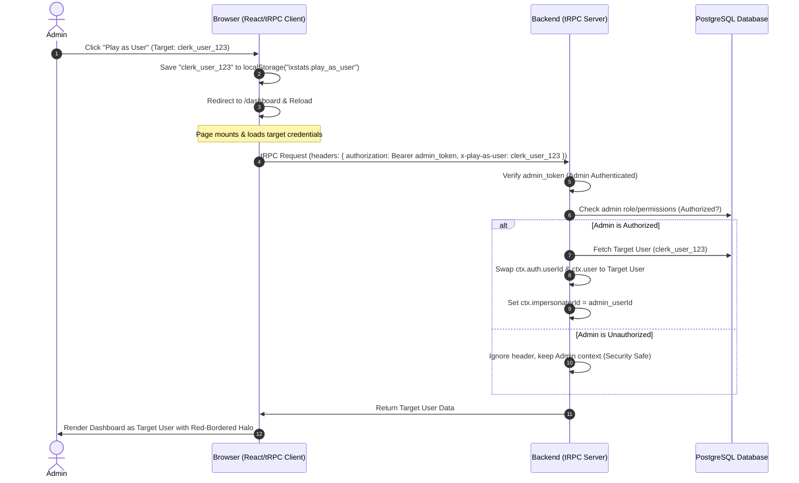

# Design Document: View/Play as User Impersonation

## Purpose
This feature allows system administrators (System Owners, owners, admins, or staff with role level $\le$ 20) to temporarily take control ("Play as") of any user/country account. This capability is critical for reproducing user bugs, verifying country-specific logic, and performing account maintenance.

While impersonation is active, a prominent visual indicator (red border/glow on the Halo/Dynamic Island) is shown to ensure the admin is always aware they are acting on behalf of another user.

---

## Architecture & Data Flow

---

## Detailed Components

### 1. Client-Side HTTP Header Injection
* **File:** `src/trpc/react.tsx`
* **Changes:**
  * In `httpBatchStreamLink.headers`, detect if `window` is defined.
  * Retrieve target Clerk User ID: `localStorage.getItem("ixstats.play_as_user")`.
  * If found, append it as a custom header `x-play-as-user` to all queries and mutations.

### 2. Backend Context Swapping & Security
* **File:** `src/server/api/trpc.ts`
* **Changes:**
  * In `createTRPCContext`:
    * Look for request header `x-play-as-user`.
    * If present, load the calling user's profile from the database or cache.
    * Check authorization: `isSystemOwner(auth.userId)` or `role.level <= 20` or role name in `["owner", "admin", "staff"]`.
    * If authorized:
      * Swap `activeUserId` for target user's Clerk ID.
      * Set `impersonatorId = auth.userId` in context.
    * If unauthorized:
      * Silently log warning on server and proceed under the admin's original credentials (no privilege escalation).
  * In `auditLogMiddleware`:
    * If `ctx.impersonatorId` is present, record it in the audit log details under `metadata.impersonatorId`.

### 3. Admin User Management UI Buttons
* **File:** `src/app/admin/_components/UserManagement.tsx`
* **Changes:**
  * For each user in Linked Users, Unlinked Users, and User Role Assignments, add a "Play as User" button (styled with a testing icon or `UserPlus`).
  * On click:
    * Set `localStorage.setItem("ixstats.play_as_user", clerkUserId)`.
    * Redirect the browser to `/dashboard` using `window.location.href`.

### 4. Halo (Dynamic Island) Visual Indicator & Exit Mechanism
* **File:** `src/components/ui/dynamic-island.tsx`
* **Changes:**
  * Track local state `isImpersonating` by reading `localStorage.getItem("ixstats.play_as_user")` on mount.
  * If active, render `dynamic-island-main` with border class `border-red-500/80 dark:border-red-500/60` and add a distinctive red shadow/glow `shadow-[0_0_15px_rgba(239,68,68,0.45)]`.
* **File:** `src/components/DynamicIsland/ExpandedView.tsx` (or `CompactView.tsx`)
  * Add a clear "Stop Impersonating" option/button in the expanded view.
  * On click:
    * Clear `localStorage.removeItem("ixstats.play_as_user")`.
    * Redirect back to `/admin/user-management` via `window.location.href`.

---

## Security Verification
1. **No Privilege Escalation:** If a non-admin manually sets `x-play-as-user` in headers or localStorage, the backend `createTRPCContext` checks the authenticated caller's DB role level. Since the caller lacks admin rights, the header is ignored.
2. **Read-Only Mode Compliance:** When `DATABASE_READONLY=true` is enabled, impersonation still works because it reads from the database and runs entirely in memory without writing data (except audit logs which are bypassed in read-only mode).
