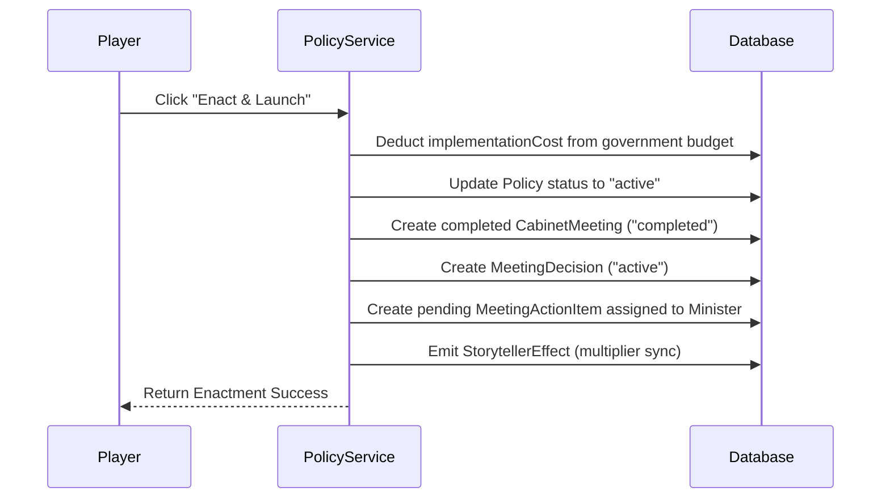

# Policy Strategy Rework Design Spec

This document details the architecture and design for the reworked Policy Strategy system in MyCountry. It merges pre-defined Policy Decretals (Approach 1) with dynamic configure-able sliders (Approach 3) and fully integrates policy enactments with the Cabinet Meeting system, Cabinet Decisions, Action Items, and the National Issues trigger engine.

## Goal Description
The current free-form policy system allows players to type arbitrary text and manually input GDP multipliers that directly affect the simulation. This lacks structure, narrative immersion, and gameplay friction. The reworked system introduces a formal registry of structured Policy Decretals (like *Universal Basic Income* or *Border Tariffs Act*) configured via sliders. Enacting a policy automatically logs completed Cabinet Meetings and assigns Action Items to ministers, while extreme settings trigger backlash events via the National Issues engine.

---

## 1. Registry of Policy Decretals

We will define a static registry in `src/lib/policies/registry.ts` containing predefined decretals. Additionally, the system will dynamically query and translate any custom database-backed `QuickActionTemplate` records of type `policy` to ensure administrative flexibility.

### Decretal Schema
```typescript
export interface DecretalSliderOption {
  label: string;
  value: number; // multiplier or baseline factor
}

export interface DecretalSlider {
  key: string;
  label: string;
  options: DecretalSliderOption[];
}

export interface PolicyDecretal {
  key: string;
  name: string;
  description: string;
  category: string;     // e.g. "fiscal", "trade", "labor", "healthcare", "defense", "infrastructure"
  policyType: string;   // e.g. "economic", "social", "diplomatic", "governance"
  sliders: DecretalSlider[];
  calculate: (settings: Record<string, number>, countryMetrics: any) => {
    implementationCost: number;
    maintenanceCost: number;
    gdpEffect: number;
    employmentEffect: number;
    inflationEffect: number;
    taxRevenueEffect: number;
    stabilityEffect: number;
  };
}
```

### Dynamic DB Fallback
When database templates of type `policy` (`QuickActionTemplate` table) are retrieved, they are parsed and mapped to the standard `PolicyDecretal` format. Custom templates default to a standard 4-tier funding slider scaling costs and modifiers linearly (e.g. $1\times, 2\times, 3\times, 4\times$ multipliers).

---

## 2. Cabinet Enactment Integration

To maintain fast-paced gameplay without losing narrative depth, enacting a policy automatically generates retrospective cabinet records:



1. **Treasury Deduction**: Deducts `implementationCost` from the country's `governmentStructure.totalBudget`.
2. **Auto-Cabinet Meeting**: Creates a completed `CabinetMeeting` titled `Cabinet Session: Enactment of [Policy Name]`.
3. **Auto-Cabinet Decision**: Creates a `MeetingDecision` detailing active multipliers (GDP, Unemployment, Inflation) and annual maintenance costs, linked to the meeting and policy.
4. **Auto-Action Item**: Creates a pending `MeetingActionItem` assigned to the minister role matching the policy's category (e.g. Minister of Finance for `fiscal`). Players can complete this task in the Decision Center to boost government stability.
5. **Storyteller Effects Sync**: Creates a corresponding `StorytellerEffect` (tagged with `POLICY:[id]`) representing the active simulation multipliers.

---

## 3. National Issues & Backlash Engine

Policies are integrated bi-directionally with the National Issues system:

### Crisis Resolution
* Issues can define a `requiredPolicyKey`.
* When viewing an active issue, if the corresponding policy is active, the player can select the option: *"Resolve via Active Policy: [Policy Name]"*.
* Resolving an issue this way yields optimal narrative outcomes and rewards stability/credits.

### Slider Backlash
* During the periodic issues generation cron job, the engine evaluates active policies and their slider values.
* Custom trigger rules are run against settings. For example:
  * **UBI Backlash**: Stipend level set to *Generous* while country debt is $>120\%$ of GDP triggers *Inflationary Welfare Spiral*.
  * **Tariff Backlash**: Tariff slider set to *Maximum* triggers a *Trade Dispute Retaliation* crisis.
  * **Oversight Backlash**: Surveillance slider set to *Maximum* triggers *Civil Liberty Protests*.

---

## 4. Verification Plan

### Automated Tests
* Add unit tests in `src/lib/__tests__/policy-effects-sync.test.ts` to verify:
  * Proper slider calculations for code-defined decretals.
  * Successful database transaction executing budget deductions and retrospective cabinet meeting, decision, and action creation.
  * Storyteller effect emission and cleanup upon deactivation.
* Verify tRPC endpoint logic in `crud.ts` and `integration.ts`.

### Manual Verification
* Navigate to the **Policy Strategy** section in MyCountry.
* Select UBI or Tariff policies, adjust sliders, and verify that costs and predicted modifiers update live.
* Enact the policy, and verify:
  * Treasury budget decreases by the implementation cost.
  * The Cabinet Meeting list immediately shows a completed enactment session.
  * A new pending Action Item appears in the Decision Center.
* Verify that changing sliders to extreme values triggers the appropriate National Issue backlash.
