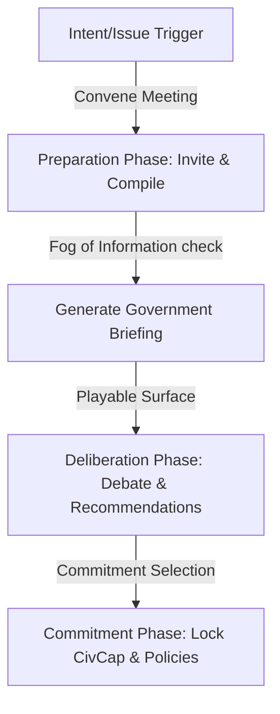

# Executive Meeting System Design Spec

This document details the architectural design and technical specifications for the **Executive Meeting System** (MyCountry v4). If the **Intent Engine** acts as the brain of the executive command hub, the **Meeting System** is the heart where deliberative governance, conflict negotiation, and commitments are actively played out.

---

## 1. Goal Description

Most strategy games bypass the deliberation phase entirely, shifting from a player's decision click directly to a statistical result. The **Executive Meeting System** introduces **Deliberation** as a playable mechanic:
- Major choices (Policies, Projects, Budgets, Treaties) are debated in structured, thematic meetings.
- Attendees (Ministers, Power Brokers, Ambassadors) possess their own agendas, influence, and levels of confidence.
- Meetings generate multi-stage plans (dynamic recommendations) with explicit trade-offs.
- A "Fog of Information" limits forecasting and cost estimation based on government efficiency.
- Completing a meeting commits the government to an intent (stored in the Intent Engine) and logs the discussion, votes, and outcomes in the country's persistent historical timeline.

---

## 2. Database Schema Extensions

To support deliberation phases, dynamic recommendations, participant profiles, and history logs, we will extend `prisma/schema/government.prisma` with:

```prisma
model MeetingParticipant {
  id              String             @id @default(cuid())
  meetingId       String
  officialId      String?
  name            String
  role            String             // e.g. "minister_finance", "power_broker", "ambassador"
  influence       Float              @default(50.0)     // 0-100 rating
  approvalRating  Float              @default(50.0)     // 0-100 player alignment
  agendaDesc      String?            // Dynamic string detailing participant objective
  
  meeting         CabinetMeeting     @relation(fields: [meetingId], references: [id], onDelete: Cascade)
  official        GovernmentOfficial? @relation(fields: [officialId], references: [id])

  @@index([meetingId])
  @@index([officialId])
}

model MeetingRecommendation {
  id              String             @id @default(cuid())
  meetingId       String
  planKey         String             // e.g. "plan_a_state_run", "plan_b_incentives"
  title           String
  description     String
  pros            String             // Serialized JSON array of strings
  cons            String             // Serialized JSON array of strings
  civCapCost      Float              @default(0)
  budgetCost      Float              @default(0)
  brokerSupport   String             // Serialized JSON of Broker ID -> Support level
  
  meeting         CabinetMeeting     @relation(fields: [meetingId], references: [id], onDelete: Cascade)

  @@index([meetingId])
}
```

And link these new tables to the existing `CabinetMeeting` model.

---

## 3. The Deliberation Loop & tRPC API

Meetings transition through three playable phases: **Preparation**, **Deliberation**, and **Commitment**. We will extend `quickActionsMeetingsRouter` in `src/server/api/routers/quickactions/meetings.ts`:



### tRPC Endpoints:
1. **`conveneMeeting`**: Initializes a meeting tied to an active `NationalIntent` or `NationalIssue`.
   * *Input*: `{ countryId: string, intentId?: string, issueId?: string, category: "cabinet" | "budget" | "security" | "foreign" }`
   * *Side Effects*: Spawns `MeetingParticipant` profiles matching the required department categories and active Power Brokers.
2. **`getMeetingBriefing`**: Computes the preparation level and returns the government briefing context.
   * *Input*: `{ meetingId: string }`
   * *Returns*: Estimated budget, CivCap, known risks, and dynamic recommendations. If `governmentEffectiveness < 45%`, estimates are masked with qualitative uncertainties.
3. **`submitDeliberationChoice`**: Registers the player's selected option.
   * *Input*: `{ meetingId: string, selectedRecId: string, modifications?: string }`
   * *Side Effects*:
     - Transitions meeting status to `completed`.
     - Inserts a `MeetingDecision` with outcomes.
     - Spawns a `NationalIntent` node or `Policy` draft on the Intent Engine.
     - Reserves matching `civCapCost`.

---

## 4. Subsystem Plugins (Meeting Categories)

Meetings are categorized by domain, targeting specific departments and power broker groups:

| Category | Participating Departments | Expected Output (Commitments) |
|---|---|---|
| **Executive Cabinet** | All active ministries | Broad national priorities, legislative proposals. |
| **Budget Session** | Finance, Commerce | Budget allocations, tax rate changes, deficit approvals. |
| **Security Council** | Defense, Interior, Intelligence | Troop deployments, procurement directives, counter-intelligence. |
| **Foreign Summit** | Foreign Affairs, Commerce | Treaties, embassy expansions, trade agreements. |
| **Infrastructure Council** | Interior (Infrastructure, Energy) | Major public works, rail expansion, energy grid building. |

---

## 5. Verification Plan

### Automated Tests
* Add unit tests in `src/server/api/routers/quickactions/__tests__/meetings.test.ts` to verify:
  - Convening a meeting successfully maps the correct ministry officials as participants.
  - Briefing forecasts are correctly masked under low government effectiveness.
  - Completing a meeting triggers the creation of commitments on the Intent Engine.

### Manual Verification
* Access the new `/mycountry/governance/table` dashboard and check:
  - Meeting preparation details, attendee agendas, and dynamic options list.
  - Completing a deliberation choice successfully executes policy/budget mutations and updates the history timeline.
