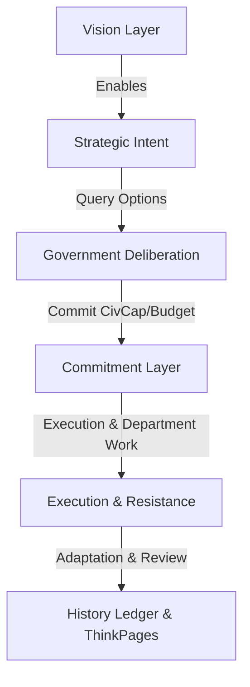

# Intent Engine: The Government Operating System Design Spec

This document details the architectural design and technical specifications for the **Intent Engine**, the foundational operating system of **MyCountry v4**. It re-imagines every major subsystem (Politics, Defense, Economy, Diplomacy, Infrastructure, and National Issues) as a modular plugin to a unified, graph-structured player intent framework.

---

## 1. Goal Description

Traditional nation simulators force players to interact directly with raw statistics or mechanical menus (e.g., clicking a button to launch an isolated "Border Tariffs" policy and getting a static +0.2% GDP boost). This creates gameplay that feels like spreadsheet micromanagement.

The **Intent Engine** shifts the gameplay grammar to be **intent-first**:
1. The player declares a high-level outcome they wish to achieve (e.g., "Make housing affordable").
2. The government bureaucracy (the engine) analyzes the feasibility and proposes concrete options (Plan A, B, C) with associated trade-offs, budgets, and Civil Capacity (CivCap) reservation costs.
3. The player selects a plan, creating an active **Commitment**.
4. The simulation generates targeted resistance, bottlenecks, and "Issues" directly in response to this execution.
5. The player adapts to complications, and the results are permanently written to the nation's searchable history.

---

## 2. Database Schema (Intents as a Directed Graph)

To support complex governmental programs where goals build upon, block, or unlock others, intents are stored as a **Directed Acyclic Graph (DAG)** in the database.

We will add two new models to `prisma/schema/government.prisma`:

```prisma
model NationalIntent {
  id             String             @id @default(cuid())
  countryId      String
  title          String
  description    String?
  layer          String             // "VISION" | "STRATEGIC" | "OPERATIONAL"
  status         String             @default("proposed") // "proposed" | "active" | "completed" | "suspended" | "failed"
  category       String             // "fiscal" | "trade" | "labor" | "healthcare" | "defense" | "infrastructure" | "social" | "foreign"
  civCapCost     Float              @default(0)         // Capacity reserved when active
  budgetCost     Float              @default(0)         // Ongoing budget cost
  progress       Float              @default(0.0)       // 0.0 to 100.0 percent
  outcomeSummary String?            // Log of the final result (success/failure details)
  createdAt      DateTime           @default(now())
  updatedAt      DateTime           @updatedAt

  country        Country            @relation("CountryIntents", fields: [countryId], references: [id], onDelete: Cascade)
  
  // Graph relations (Self-relations)
  parentIntents  IntentDependency[] @relation("DependentIntents")
  childIntents   IntentDependency[] @relation("PrerequisiteIntents")
  
  // Existing system hooks
  policies       Policy[]
  meetings       CabinetMeeting[]
  decisions      MeetingDecision[]
  actionItems    MeetingActionItem[]

  @@index([countryId])
  @@index([layer])
  @@index([status])
}

model IntentDependency {
  id             String             @id @default(cuid())
  parentIntentId String
  childIntentId  String
  dependencyType String             @default("prerequisite") // "prerequisite" | "blocker" | "unlocks"
  createdAt      DateTime           @default(now())

  parentIntent   NationalIntent     @relation("DependentIntents", fields: [parentIntentId], references: [id], onDelete: Cascade)
  childIntent    NationalIntent     @relation("PrerequisiteIntents", fields: [childIntentId], references: [id], onDelete: Cascade)

  @@unique([parentIntentId, childIntentId])
  @@index([parentIntentId])
  @@index([childIntentId])
}
```

---

## 3. The Lifecycle Pipeline & tRPC API

All subsystems enter through the same governing pipeline. We will implement `src/server/api/routers/intent/root.ts` handling the following lifecycle phases:



### API Procedure Specs:
1. **`getIntentsGraph`**: Queries and returns the full intents DAG for a country.
   * *Input*: `{ countryId: string }`
   * *Returns*: Nodes (Intents) and Edges (Dependencies) mapped for visualization.
2. **`declareIntent`**: Creates a proposed `NationalIntent` node.
   * *Input*: `{ countryId: string, title: string, description: string, layer: "VISION" | "STRATEGIC", parentIntentIds?: string[] }`
3. **`deliberateIntentOptions`**: Returns candidate plans dynamically generated by ministries.
   * *Input*: `{ intentId: string }`
   * *Returns*: Array of plan choices (e.g. Plan A: state-run, Plan B: private-incentives) detailing budget, CivCap upkeeps, expected departments, and Power Broker support.
4. **`authorizeCommitment`**: Selects a plan, updates intent status to `active`, and reserves CivCap.
   * *Input*: `{ intentId: string, chosenPlanKey: string }`
   * *Side Effects*:
     - Creates matching `MeetingDecision` and assigns `MeetingActionItem`s.
     - Spawns draft `Policy` objects in target categories.
     - Reserves required `civCapCost` in `getPolicyReconContext`.
5. **`completeIntent`**: Marks the intent as `completed` or `failed`, recording the narrative outcome and releasing reserved CivCap.
   * *Input*: `{ intentId: string, outcomeSummary: string, wasSuccessful: boolean }`
   * *Side Effects*: Triggers `CountryEventSpine` to post ledger logs and publish ThinkPages articles.

---

## 4. Subsystem Integration & "Operating System" Plugins

Every major game loop connects directly to the Intent Engine DAG:

| Subsystem | Legacy Flow (Direct) | New Flow (Intent Plugin) |
|---|---|---|
| **Meetings** | Player schedules a random topic. | Player schedules a meeting *to deliberate/finalize an active Intent*. Agenda is scoped by the Intent's node status. |
| **Policies** | Player drafts custom sliders directly. | Policies are drafted *as tools of a Commitment*. The slider options are suggested during Deliberation. |
| **CivCap & Fog** | Policies cost static CivCap. | `used` CivCap is calculated as the sum of all active `NationalIntent` nodes. Low Efficiency masks node preview estimates. |
| **National Issues** | Random events generated on timers. | Cron scans active `NationalIntent`s and generates contextual resistance issues matching the active nodes. |
| **Politics / Brokers**| Factions react to raw stat drift. | Power Brokers react directly to commitments that align or conflict with their platforms (e.g. Magnates block environmental nodes). |
| **Diplomacy** | Instantly sign agreements. | Create a "Regional Alliance" intent. This generates a multi-stage treaty negotiation loop. |

---

## 5. Verification Plan

### Automated Tests
* Add tests in `src/lib/__tests__/intent-engine-graph.test.ts` to verify:
  - Directed Graph dependency cycles are blocked on creation.
  - Active nodes successfully reserve CivCap and treasury funds via the balance sheets.
  - Completing an intent unlocks child intents (changes status from `blocked` to `proposed`).

### Manual Verification
* Deploy a mock graph to `/mycountry/agenda` and verify:
  - Visualizing intent layers (Vision vs Strategic vs Operational).
  - Activating an intent triggers warnings on low CivCap/Budget in `MyCountryRouter`.
  - Intention-based issues appear in the Issues Inbox after intent activation.
