# Design Document: Unified Global Developer Configuration Registry (`src/lib/config.ts`)

**Date**: 2026-08-18  
**Status**: Approved (Approach 1: Hierarchical Strongly-Typed `GLOBAL_CONFIG` Registry)  
**File**: [`src/lib/config.ts`](file:///home/jxsig/projects/ixstats/src/lib/config.ts)

---

## 1. Executive Summary

This specification establishes a centralized, strongly-typed developer configuration registry at [`src/lib/config.ts`](file:///home/jxsig/projects/ixstats/src/lib/config.ts). It unifies all high-level system controls, simulation parameters, feature flags, and subsystem defaults across the codebase under a single, immutable, autocomplete-friendly namespace (`IX_CONFIG` / `GLOBAL_CONFIG`), while re-exporting individual domain constants for modular consumer compatibility.

---

## 2. Architecture & Type Design

```mermaid
graph TD
    ConfigRegistry["src/lib/config.ts (IX_CONFIG)"]
    
    ConfigRegistry --> Platform["platform (Version, Channel, IxTime Epoch)"]
    ConfigRegistry --> Flags["features (Gameplay Flags, Sandbox, Feature Toggles)"]
    ConfigRegistry --> Maps["maps (Projections, Zoom, Layers, Elevation)"]
    ConfigRegistry --> WorldGen["worldgen (100k Mesh, Lloyd, Coastal Dampening)"]
    ConfigRegistry --> Cards["cards (Inventory Caps, Daily Packs, Auction Rake)"]
    ConfigRegistry --> Vault["vault (Credit Conversions, Rakes, Limits)"]
    ConfigRegistry --> Sports["sports (Match Intervals, Presets, Notify Config)"]
    ConfigRegistry --> Military["military (Upkeep, Readiness, Equipment Eras)"]
    ConfigRegistry --> Statecraft["statecraft (CivCap, Power Brokers, Recon)"]
    ConfigRegistry --> Issues["nationalIssues (Spawn Modes, Weekly Caps)"]
    ConfigRegistry --> Wiki["wiki (User-Agent, API Endpoints, Cache TTLs)"]
    ConfigRegistry --> System["system (Memory Bounds, Rate Limiter, Logs)"]
```

### Type-Safety Guarantees
- Implemented with TypeScript 5 `as const satisfies GlobalConfigRegistry`.
- Read-only (`readonly` deep property inference) preventing accidental runtime mutations.
- Type definitions (`GlobalConfigRegistry`, `PlatformConfig`, `MapsConfig`, `CardsConfig`, etc.) exported for full IntelliSense support.

---

## 3. Subsystem Domain Coverage

### 3.1. Platform & Versioning (`IX_CONFIG.platform`)
- Sourced from [`src/lib/buildVersion.ts`](file:///home/jxsig/projects/ixstats/src/lib/buildVersion.ts) & [`src/lib/ixtime/`](file:///home/jxsig/projects/ixstats/src/lib/ixtime/).
- Fields: `appVersion`, `channel`, `releaseName`, `buildVersion`, `epochStart`, `tickMultiplier`.

### 3.2. Gameplay & Feature Toggles (`IX_CONFIG.features`)
- Sourced from [`src/lib/gameplay-flags.ts`](file:///home/jxsig/projects/ixstats/src/lib/gameplay-flags.ts).
- Fields: `enableDirectives`, `enableRealms`, `enableWikiOS`, `enableSportsSim`, `enableMarketplace`.

### 3.3. Maps & Geospatial (`IX_CONFIG.maps`)
- Sourced from [`src/lib/maps/map-config.ts`](file:///home/jxsig/projects/ixstats/src/lib/maps/map-config.ts) & [`src/lib/maps/elevation-config.ts`](file:///home/jxsig/projects/ixstats/src/lib/maps/elevation-config.ts).
- Fields: `defaultCenter`, `defaultZoom`, `minZoom`, `maxZoom`, `demotedCountries`, `elevationZones`, `layerConfigs`.

### 3.4. WorldGen UPG v2 (`IX_CONFIG.worldgen`)
- Sourced from [`src/lib/worldgen/v2/config.ts`](file:///home/jxsig/projects/ixstats/src/lib/worldgen/v2/config.ts).
- Fields: `meshResolution` (100,000 cells), `lloydIterations` (5), `defaultPlates` (10), `defaultContinents` (6), `oceanRatio` (0.65).

### 3.5. Cards & Stash System (`IX_CONFIG.cards`)
- Sourced from [`src/lib/cards/general-settings.ts`](file:///home/jxsig/projects/ixstats/src/lib/cards/general-settings.ts).
- Fields: `maxInventoryCards` (2500), `dailyFreePacks` (1), `dailyPackCooldownHours` (24), `auctionHouseRakePct` (5), `maxJunkBatchSize` (100), `allowPlayerMinting` (0).

### 3.6. Vault & Economy (`IX_CONFIG.vault` & `IX_CONFIG.economy`)
- Sourced from [`src/lib/vault/exchange-config.ts`](file:///home/jxsig/projects/ixstats/src/lib/vault/exchange-config.ts) & [`src/lib/economy/`](file:///home/jxsig/projects/ixstats/src/lib/economy/).
- Fields: `creditExchangeRate`, `maxTransactionCredits`, `defaultTaxRate`, `budgetDepartmentCategories`.

### 3.7. Sports (MyLeague) (`IX_CONFIG.sports`)
- Sourced from [`src/lib/sports/presets.ts`](file:///home/jxsig/projects/ixstats/src/lib/sports/presets.ts) & [`src/lib/sports/notify-config.ts`](file:///home/jxsig/projects/ixstats/src/lib/sports/notify-config.ts).
- Fields: `matchIntervalMs`, `raceIntervalMs`, `seasonsPerYear`, `availableSports`, `defaultRatingVector`.

### 3.8. Military & Defense (`IX_CONFIG.military`)
- Sourced from [`src/lib/military/config.ts`](file:///home/jxsig/projects/ixstats/src/lib/military/config.ts).
- Fields: `upkeepCostFraction`, `readinessThresholds`, `equipmentCategories`, `techLevels`.

### 3.9. Statecraft & Government (`IX_CONFIG.statecraft`)
- Sourced from [`src/lib/statecraft/`](file:///home/jxsig/projects/ixstats/src/lib/statecraft/) & [`src/lib/government/`](file:///home/jxsig/projects/ixstats/src/lib/government/).
- Fields: `civCapBase`, `powerBrokerCategories`, `reconIntervalDays`, `stabilityResolutionPeriodHours`.

### 3.10. National Issues (`IX_CONFIG.nationalIssues`)
- Sourced from [`src/lib/national-issues/config.ts`](file:///home/jxsig/projects/ixstats/src/lib/national-issues/config.ts).
- Fields: `maxIssuesPerSession` (3), `maxIssuesPerWeek` (5), `spawnMode` ("probability"), `decayHours` (168).

### 3.11. WikiOS & MediaWiki Integration (`IX_CONFIG.wiki`)
- Sourced from [`src/lib/wiki/config.ts`](file:///home/jxsig/projects/ixstats/src/lib/wiki/config.ts).
- Fields: `userAgent` (`DEFAULT_USER_AGENT = "IxStats-Builder"`), `requestTimeoutMs`, `cacheTTLSeconds`.

### 3.12. System & Performance Guardrails (`IX_CONFIG.system`)
- Sourced from [`src/lib/system/dev-memory-config.ts`](file:///home/jxsig/projects/ixstats/src/lib/system/dev-memory-config.ts) & [`src/lib/cache/`](file:///home/jxsig/projects/ixstats/src/lib/cache/).
- Fields: `maxOldSpaceSizeMb` (6144), `redisFallbackEnabled`, `userLogDirectory`.

---

## 4. Verification & Testing Strategy

1. **Typecheck & Inference Validation**: Validate that `IX_CONFIG` provides complete compile-time types without explicit `any`.
2. **Automated Unit Tests**:
   - Create `src/lib/__tests__/global-config.test.ts` verifying that all nested domain configurations match their subsystem defaults exactly.
3. **Compatibility & Non-Regression**:
   - Run the complete test suite across all packages (`bun run test -- sports national-issues economy maps utils government statecraft nationstates military onoma websocket wiki`).
