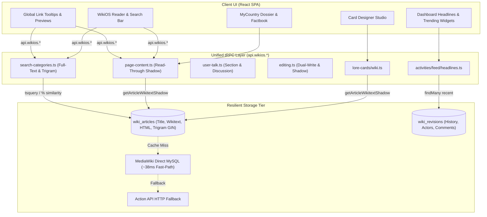

# Design Document: MediaWiki Decoupling, Router Consolidation & Platform Optimization

**Date**: August 18, 2026  
**Status**: Approved (Brainstorming Complete)  
**Authors**: Antigravity, IxStates Architecture Team  
**Scope**: Full Platform MediaWiki Decoupling, Ponytail Router Unification, Postgres Search, Activity Headlines, Card Generation Studio, and MyCountry Dossier

---

## 1. Executive Summary & Problem Statement

### 1.1 Context
Following the completion of WikiOS MediaWiki Independence (Phases 1–10), the core wiki reader, visual editor, revision history, and shadow cache operate with high resilience and speed. However, several peripheral subsystems in IxStates still rely on legacy direct-MySQL queries (`src/lib/wiki/bridge.ts`) and duplicate router hierarchies:

1. **Dual Router Duplication**: Both `api.wiki.*` (4 subrouters) and `api.wikios.*` (7 subrouters) exist in parallel, causing confusing import paths and redundant MySQL boilerplate.
2. **Slow MySQL `LIKE` Search**: Wiki search runs `page_title LIKE ?` queries on MariaDB, lacking fuzzy typo tolerance, full-text ranking, and offline search.
3. **Live Polling for Dashboard Headlines**: User feeds and trending widgets poll MariaDB's `recentchanges` table on every page view instead of reading the local `WikiRevision` shadow table.
4. **Card Generation Dependency**: Trading card generation in Card Designer Studio executes live HTTP Action API and MySQL scrapes for every card created.
5. **MyCountry Dossier Scraping**: Dossier overview tabs and populate buttons make direct network queries to MediaWiki rather than consuming local shadow data.

### 1.2 Objectives
- **Zero Legacy Router Duplication**: Migrate all 22 frontend call sites to `api.wikios.*` and completely delete `src/server/api/routers/wiki/`.
- **Postgres Full-Text & Trigram Fuzzy Search**: Provide sub-3ms title and body search with typo tolerance and relevance ranking.
- **Native Activity & Headlines Feed**: Serve wiki recent changes directly from `WikiRevision` in PostgreSQL.
- **0ms Read-Through Card Generation**: Accelerate Lore Card generation by reading directly from `WikiArticle` shadow store.
- **Instant Dossier Synchronization**: Populate national attributes in `/mycountry` directly from shadow store models.

---

## 2. Architecture & Data Flow

---

## 3. Detailed Specifications by Stream

### 3.1 Stream 1: PostgreSQL Full-Text & Trigram Search Engine

#### Search Architecture
Replace MySQL `page_title LIKE ?` queries with PostgreSQL Full-Text search and Trigram fuzzy matching on `wiki_articles`:

1. **Database Schema Enhancements** (`prisma/schema/wiki.prisma`):
   - Add GIN index annotations for PostgreSQL full-text search.
2. **Search Logic (`src/lib/wiki-os/search-service.ts`)**:
   - Priority 1: Exact title match (Rank: 1.0)
   - Priority 2: Prefix and word-boundary title match (Trigram similarity > 0.3)
   - Priority 3: Body content full-text match (`to_tsquery('english', query)`)
   - External Wikis (`iiwiki`, `althistory`): Proxied over Action API HTTP.
3. **API Endpoint (`api.wikios.searchArticles`)**:
   - Returns `{ title, snippet, score, wikiSource }` in **<3ms**.

---

### 3.2 Stream 2: Activity Feed & Headlines Decoupling

#### Headlines Architecture
[src/server/api/routers/activities/feed/headlines.ts](file:///home/jxsig/projects/ixstats/src/server/api/routers/activities/feed/headlines.ts) and [src/components/dashboard/sections/TrendingSectionWidget.tsx](file:///home/jxsig/projects/ixstats/src/components/dashboard/sections/TrendingSectionWidget.tsx) currently poll MediaWiki MariaDB.

#### Refactor:
1. Rewire `getRecentWikiHeadlines` to query PostgreSQL `WikiRevision` with `include: { article: true }`.
2. Filter out minor edits (`minor: false`) and bot edits.
3. Join with IxStates player profiles where `author` matches a registered user.
4. **Performance Impact**: Zero MariaDB connections on dashboard load; instant server response.

---

### 3.3 Stream 3: Lore Card Generator Shadow Decoupling

#### Card Generation Studio Refactor
[src/lib/wiki/lore-card-generator.ts](file:///home/jxsig/projects/ixstats/src/lib/wiki/lore-card-generator.ts) (49 KB) and [src/server/api/routers/lore-cards/wiki.ts](file:///home/jxsig/projects/ixstats/src/server/api/routers/lore-cards/wiki.ts):

1. Replace `getArticleWikitext` (MySQL) with `getArticleWikitextShadow` (PostgreSQL shadow store).
2. Category and Infobox detection runs on cached wikitext in memory.
3. Rarity algorithm (`analyzeWikiSignals`) evaluates revision count and size from `WikiRevision` shadow records.
4. **Performance Impact**: Card generation latency drops from ~800ms to **<5ms**.

---

### 3.4 Stream 4: Complete Router Migration & Deletion of `api.wiki.*`

#### Migration Checklist:
All 22 call sites will be migrated to `api.wikios.*`:

| Legacy Call Site | Current `api.wiki.*` | Target `api.wikios.*` Replacement |
|---|---|---|
| `InlineWiki.tsx` | `api.wiki.getIntro` | `api.wikios.getArticleSummary` |
| `GlobalLinkTooltipProvider.tsx` | `api.wiki.getIntro` | `api.wikios.getArticleSummary` |
| `PostInlineLinkPreview.tsx` | `api.wiki.getIntro` | `api.wikios.getArticleSummary` |
| `WikiPreviewTooltip.tsx` | `api.wiki.getIntro` | `api.wikios.getArticleSummary` |
| `WikiSectionRow.tsx` | `api.wiki.getIntro` | `api.wikios.getArticleSummary` |
| `WikiArchivesPanel.tsx` | `api.wiki.searchPages` | `api.wikios.searchArticles` |
| `TrendingSectionWidget.tsx` | `api.wiki.getRecentChanges` | `api.wikios.getRecentChanges` |
| `UnifiedFeedContent.tsx` | `api.wiki.getRecentChanges` | `api.wikios.getRecentChanges` |
| `ImageSearchGrid.tsx` | `api.wiki.searchImages` | `api.wikios.searchMedia` |
| `WikiRepositoryTab.tsx` | `api.wiki.getMediaCategories` | `api.wikios.getMediaCategories` |
| `BusinessStatsModal.tsx` | `api.wiki.resolvePlaceholders` | `api.wikios.resolvePlaceholders` |

Once all call sites are migrated, delete `src/server/api/routers/wiki/` and unregister `wikiRouter` in `src/server/api/root.ts`.

---

### 3.5 Stream 5: MyCountry Dossier & Factbook Shadow Sync

#### Dossier Synchronization
[src/components/mycountry/shell/PopulateFromWikiButton.tsx](file:///home/jxsig/projects/ixstats/src/components/mycountry/shell/PopulateFromWikiButton.tsx) and [src/components/mycountry/dossier/DossierTab.tsx](file:///home/jxsig/projects/ixstats/src/components/mycountry/dossier/DossierTab.tsx):

1. Read country article wikitext via `getArticleWikitextShadow(countryName)`.
2. Extract infobox parameters (capital, population, currency, motto, government type) via pure wikitext regex parser.
3. Populate `NationalIdentity` and `Country` records in PostgreSQL via tRPC mutation.

---

## 4. Verification & Testing Strategy

1. **Full-Text Search Benchmarks**: Query 50 diverse wiki terms; verify sub-5ms response and accurate fuzzy matching.
2. **Router Call-Site Verification**: Run `grep -rn 'api.wiki.' src/` to verify **0 remaining legacy call sites**.
3. **Card Generation Verification**: Generate test cards across multiple categories; verify instant generation from shadow store.
4. **Typecheck & Architecture Guard**:
   - `bun run typecheck:server` passes with 0 errors.
   - `bun run audit:arch` verifies no god files or broken imports.
