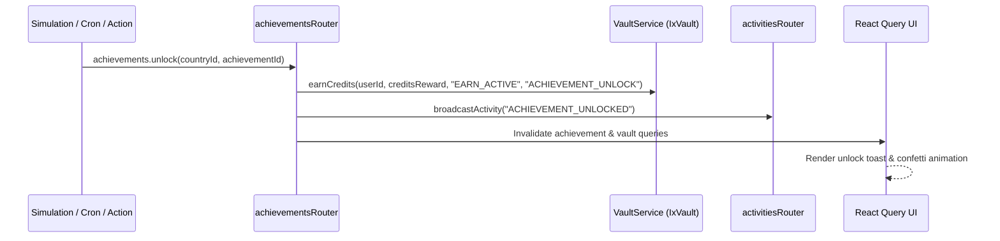

# 💎 Achievements & Progression Showcase

**Parent App Suite:** Vault (`VAULT_VERSION = 2`, dev codename `IxVault`)  
**Subsystem:** Achievements & Leaderboards (`ACHIEVEMENTS_VERSION = 2`)  
**Primary Action:** `PROGRESS` | **Domain Accent:** Burnished Copper (`#D97706` / `--color-amber-600`)  
**Routes:** `/achievements`, `/leaderboards` | **Status:** 📀 Gold Master (100% Ready)  

The Achievements system rewards milestone progress across economic, diplomatic, social, defense, and sovereign governance domains. Unlocks grant persistent ribbon racks, profile badges, and direct IxCredit / Booster Pack dividend payouts. Wiki authoring medals are recognized through **Wiki Awards** under WikiOS.

---

## Architecture & Versioning

In accordance with [reference/revision.md](../reference/revision.md), the system operates on **Achievements v2**, which introduces automatic collector resync on page load, ribbon awards, and dual reward payouts (badges + IxCredits).

### Frontend Modules
- `src/app/achievements/page.tsx` – Main achievement index, category filters, progress tracks, and unlocked ribbon showcases
- `src/app/leaderboards/page.tsx` – Global and regional leaderboards hub with sortable metrics
- `src/components/achievements/` – Badges, ribbon racks, milestone progress bars, unlock modal dialogs
- `src/components/dashboard/_components/EnhancedCountryCard.tsx` – Country card achievement badge highlights

### Backend Routers
All achievement operations route through the modularized tRPC API:
- `src/server/api/routers/achievements/` (`index.ts`, `core.ts`, `leaderboards.ts`) – Achievement queries, category tracking, per-country unlock mutations, and global rankings
- `src/server/api/routers/lorewards/` – Wiki editing medals, contribution tiers, and author awards
- `src/server/api/routers/activities/` – Social broadcast feed for achievement unlock announcements
- `src/server/api/routers/notifications/` – Unlock toasts and leaderboard movement push alerts
- `src/server/api/routers/users/` – Player metadata resolution for leaderboards

---

## Data Models

The system is backed by Prisma models in `prisma/schema/core.prisma` and `prisma/schema/wiki.prisma`:
- `Achievement`: Master definition with category, rarity, required thresholds, badge asset, and `ixCreditsReward`
- `AchievementCategory`: Groupings (ECONOMIC, DIPLOMATIC, MILITARY, SOCIAL, LORE, SPECIAL)
- `AchievementProgress`: Per-country progression towards locked achievements
- `UserAchievement`: User-level unlocked achievements with timestamp and reward status
- `LoreWard`: Wiki contribution awards linked to MediaWiki edits and page creations

---

## Unlock & Reward Lifecycle

1. **Progress Evaluation**: Engine services or scheduled cron jobs calculate milestone criteria across domains.
2. **Atomic Unlock & Payout**: `achievements.unlock` verifies criteria, inserts `UserAchievement`, and awards IxCredits via `vaultService.earnCredits()`.
3. **Collector Resync (v2 Leap)**: On visiting `/achievements`, the client triggers an automatic collector resync checking for backfilled historical milestones.
4. **Social Broadcast**: A notification and public activity post are generated for the global feed.
5. **Leaderboard Indexing**: Leaderboard aggregation tables recompute periodically via cron or on-demand cache refresh.

---

## Integration Points

- **IxVault**: Unlocking achievements directly awards IxCredits (`EARN_ACTIVE`) and special collectible cards (`AcquireMethod.ACHIEVEMENT`).
- **MyCountry**: National standing and prestige scores factor total achievement points into the composite rating.
- **WikiOS / Wiki Awards**: Editing wiki pages and expanding nation lore awards dedicated **Wiki Awards** (formerly LoreWards) medals displayed on country profiles.

---

## Related Documentation

- [API Reference: Achievements Router](../reference/api-complete.md#achievements-router)
- [IxCredits Economy Guide](./ixcredits.md)
- [WikiOS System Guide](./wikios.md)
- [Help: Achievements](/help/achievements)
