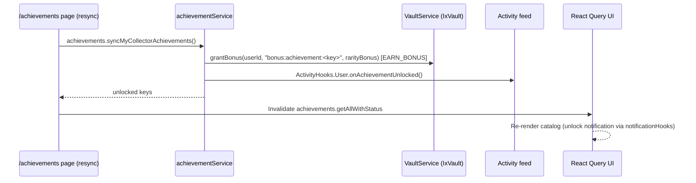

# 💎 Achievements & Progression Showcase

**Parent App Suite:** Vault (`IXVAULT_VERSION = 2`, dev codename `IxVault`)  
**Subsystem:** Achievements & Leaderboards (`ACHIEVEMENTS_VERSION = 2`)  
**Primary Action:** `PROGRESS` | **Domain Accent:** Burnished Copper (`#D97706` / `--color-amber-600`)  
**Routes:** `/achievements`, `/leaderboards` | **Status:** Release Candidate (platform 1.4.0) — ribbons are derived from unlocks, see [Ribbons](#ribbons)  

The Achievements system rewards milestone progress across economic, military, diplomatic, government, social, and general domains — 76 definitions in `src/lib/achievements/definitions.ts` (Economic 17, Military 10, Diplomatic 12, Government 10, Social 7, General 20). Unlocks grant IxCredits, optional commemorative cards / packs / titles (per `rewardsJson`), and a showcase shelf entry. Wiki authoring medals are recognized through **Wiki Awards** (Lorewards) under WikiOS.

---

## Architecture & Versioning

In accordance with [reference/revision.md](../reference/revision.md), the system operates on **Achievements v2**, which introduces automatic collector resync on page load. Ribbons are derived from real unlocks (see [Ribbons](#ribbons)); the separate OOC community ribbons in [the ribbons design spec](../specs/2026-08-10-achievements-ribbons-design.md) are not built.

### Frontend Modules
- `src/app/achievements/page.tsx` – Header card (Total Unlocked, Achievement Points, Global Rank), optional Showcase shelf, and the full catalog
- `src/app/leaderboards/page.tsx` – Standalone global leaderboards (`LeaderboardTab`)
- `src/components/achievements/tabs/` – `AllAchievementsTab` (category/rarity filters, search, grid/list toggle, secret reveal), `ShowcaseTab`, `LeaderboardTab`
- `src/components/achievements/FloatingRibbonRack.tsx` – `RibbonBar`, `FloatingRibbonRack` and `CountryOwnerRibbonRack`: ribbons drawn from the owner's real unlocks (see [Ribbons](#ribbons))

### Backend Routers
All achievement operations route through the modularized tRPC API:
- `src/server/api/routers/achievements/` (`index.ts`, `country.ts`, `progress.ts`, `management.ts`) – `getAllWithStatus`, `getRecentByCountry`, `getAllByCountry`, `getLeaderboard`, `getCountryLeaderboard`, and the `syncMyCollectorAchievements` / `unlock` mutations
- `src/lib/achievements/` (`definitions.ts`, `service.ts`, `sync.ts`, `scaling.ts`, `card-rewards.ts`) – Condition evaluation (`checkAndUnlock`), reward payout, percentile-scaled thresholds
- `src/lib/achievements/scope.ts` – Which achievements are account-level (evaluate without a country) and which need one
- `src/lib/achievements/queue.ts` – Background evaluation queue (`queueAchievementCheck`), drained by the worker in `service.ts`
- `src/lib/achievements/evaluate-cron.ts` – The `achievements-evaluate` cron job
- `src/server/api/routers/lorewards/` – Wiki editing medals, contribution tiers, and author awards
- Unlock side effects use `ActivityHooks.User.onAchievementUnlocked` (`src/lib/activity/hooks.ts`) and `notificationHooks.onAchievementUnlock` (`src/lib/notifications/hooks.ts`)

---

## Data Models

The system is backed by Prisma models in `prisma/schema/core.prisma` and `prisma/schema/wiki.prisma`:
- `Achievement`: Master definition keyed by `key`, with `category` and `rarity` (strings), `points`, `iconUrl`, `triggerType`, `conditionJson`, and `rewardsJson` (cards, packs, titles). Credit rewards come from rarity-based bonus config, not a column.
- `UserAchievement`: User-level unlock (denormalized title/category/rarity, `metadata`, `unlockedAt`), unique per `userId` + `achievementId`
- `LorewardEntry`, `LorewardUserStats`, `LorewardCrossValidation`: Wiki contribution awards and scoring

Categories are plain strings (`Economic`, `Military`, `Diplomatic`, `Government`, `Social`, `General`); there are no separate category or per-country progress tables — progress is evaluated from live account data and, when the user has one, live country data.

---

## Unlock & Reward Lifecycle

```mermaid
sequenceDiagram
    participant Engine as /achievements page (resync)
    participant Router as achievementService
    participant Vault as VaultService (IxVault)
    participant Feed as Activity feed
    participant Client as React Query UI

    Engine->>Router: achievements.syncMyCollectorAchievements()
    Router->>Vault: grantBonus(userId, "bonus:achievement:<key>", rarityBonus) [EARN_BONUS]
    Router->>Feed: ActivityHooks.User.onAchievementUnlocked()
    Router-->>Engine: unlocked keys
    Engine->>Client: Invalidate achievements.getAllWithStatus
    Client-->>Client: Re-render catalog (unlock notification via notificationHooks)
```

1. **Progress Evaluation**: `achievementService.checkAndUnlock(clerkUserId, countryId | null)` evaluates the active definitions. Unlocks are keyed by the Clerk user id (`UserAchievement.userId`).
   - **Account-level achievements** (19 built-ins, listed in `scope.ts`) read only data that follows the person: account tenure (`gen-welcome`, `gen-one-week` … `gen-one-year`, `vid-annual`), the number of achievements held (`gen-achievement-*`, `vid-end-of-days`, `meme-ns-ref`), the user's own ThinkPages posts (`social-first-thinkpage`, `social-thinkpage-author`, `social-prolific-author`, `social-trending`, `lore-scholar`) and the card collection (`collect-lore-keeper`, `collect-archaeologist`, `collect-diplomat`). They evaluate and unlock for users **without a country**. An admin-authored achievement without a built-in definition is account-level when its `conditionJson` rule reads one of those metrics.
   - **Country achievements** (the other 57: GDP, population, military, diplomacy, government, a country's followers, `gen-first-country`) are evaluated only against a country, and never pass without one. The country is the user's **active** country, so switching nations can unlock the same scale achievements again.
   - Unlocks that raise the achievement count are re-evaluated in the same run (up to 3 passes), so the meta achievements they qualify for unlock immediately.
2. **When evaluation runs**:
   - **Page visit**: on `/achievements`, the client calls `achievements.syncMyCollectorAchievements` for any signed-in user, with or without a country.
   - **Event hooks**: one-line, non-blocking `queueAchievementCheck(userId)` calls at account creation, country creation (builder) and nation claims, pack opening, NationStates deck import, ThinkPages post creation and national-issue responses. The event bus (`country:updated`, `diplomacy:updated`, … fed by `ActivityHooks`) feeds the same queue. The queue lives in Redis (`achievements:queue`) when `REDIS_ENABLED`, otherwise in process (capped at 10,000 entries); the worker in `service.ts` drains one item a second and evaluates the user against their active country. Credit earns are not hooked, because no achievement reads credits.
   - **Cron**: `achievements-evaluate` (hourly at :41, off unless listed in `CRON_ENABLED_JOBS`) evaluates up to 500 users seen in the last 90 minutes (`User.lastSeenAt`), with or without a country. It is the backstop for anything the in-process queue loses on restart.
3. **Unlock & Payout**: A `UserAchievement` row is inserted (unique per user + achievement, so a concurrent run pays nothing) and IxCredits are granted once per achievement via `grantBonus()` with `oneTime` (idempotency key `bonus:achievement:<key>:<User.id>`; `EARN_BONUS`, uncapped: Common 100 → Legendary 2,500 IxC); any `rewardsJson` cards, packs and titles are awarded too (titles are stored in `UserAchievement.metadata` and are not rendered anywhere). `achievements.unlock` does the same for a named achievement key without evaluating criteria.
4. **Social Broadcast**: A notification and public activity post are generated for the global feed.
5. **Leaderboards**: `getLeaderboard` / `getCountryLeaderboard` aggregate unlocks on demand per query (no stored aggregation tables).

---

## Ribbons

A ribbon is an unlocked achievement worn as a service ribbon. There is no ribbon table: every `UserAchievement` row (keyed by Clerk id) is one ribbon.

- **Style:** the stripe comes from the achievement's category (Economic emerald, Military red, Diplomatic cyan, Government indigo, Social blue, General amber); the star device from its rarity (bronze Common → white Legendary). Mappings: `ribbonStripe` / `ribbonDevice` in `FloatingRibbonRack.tsx`.
- **Order:** pinned ribbons first (in pin order), then rarest, then newest (`toRibbons`, `src/server/modules/identity/identity.showcase.ts`).
- **Signature ribbons:** the owner pins up to 3 on the passport's back face (`PassportPreference.pinnedRibbonKeys`); pins are kept only for achievements the owner has unlocked. Without pins, the rarest three lead.
- **Queries:** `ixnayid.getRibbons({ handle })` (every ribbon of a passport holder) and `ixnayid.getCountryRibbons({ countrySlug })` (the country owner's top 3 plus the total). Both return nothing when the owner hides achievements on their passport.
- **Where they show:** the passport showcase (signature shelf and the full ribbon rack) and the `/countries/[slug]` header, which renders nothing for a country with no active owner or an owner with no ribbons.

See [IxnayID Passport](./ixnayid-passport.md).

---

## Integration Points

- **IxVault**: Unlocking achievements directly awards IxCredits (`EARN_BONUS`) and, where configured, commemorative cards and packs (`UserPack.acquiredMethod = "ACHIEVEMENT"`).
- **Country profiles**: `CountryOwnerRibbonRack` shows the owning user's top 3 ribbons on `/countries/[slug]` headers, or nothing.
- **IxnayID Passport**: the passport showcase lists unlocked achievements, the ribbon rack and the signature shelf ([IxnayID Passport](./ixnayid-passport.md)).
- **WikiOS / Wiki Awards**: Editing wiki pages and expanding nation lore awards dedicated **Wiki Awards** (formerly LoreWards) medals displayed on country profiles.

---

## Known Gaps

- The OOC community ribbons from the [2026-08-10 spec](../specs/2026-08-10-achievements-ribbons-design.md) (WikiOS archivist, forum pioneer and so on) and the `/achievements?tab=ribbons` tab are not built; `FORUM_RIBBONS` in `constants.ts` is now unused. Ribbons today are the achievement-derived ones above.
- Background evaluation from the in-process queue runs only in the process that loads the achievements router (the web server); without Redis, a restart drops queued checks until the `achievements-evaluate` cron (when enabled) or a page visit picks the user up.
- The activity-feed post for an unlock is written only when the user has an active country (the feed is country-scoped); the notification is sent either way.
- `achievements.unlock` (grant a specific achievement to any `userId`) is admin-only; the app itself has no caller.

---

## Related Documentation

- [API Reference](../reference/api-complete.md)
- [IxCredits Economy Guide](./ixcredits.md)
- [WikiOS System Guide](./wikios.md)
- Help: Achievements, in-app at `/help/gameplay/achievements` (source: [`src/content/help/gameplay/achievements.md`](../../src/content/help/gameplay/achievements.md))
