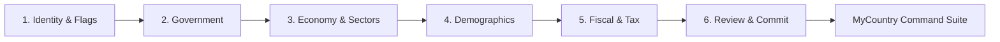

# MyCountry Builder System

**Last updated:** August 2026  
**Status:** Production Ready (Beta) — Builder v3  
**Hierarchy:** Standalone Core Feature System (`BUILDER_VERSION = 3` in Version Registry).

The builder lets players establish and configure a new nation from scratch: national identity, government structure, economic baseline, demographics, and fiscal policy. It combines wiki ingestion, atomic component libraries, and template archetypes to accelerate onboarding.

---

## Architecture & Versioning

Builder v3 features unified statecraft and tax builder subsystems, template pre-population, and persistent Redis/DB caching for external wiki data.

### Routes & Components
- `src/app/builder/page.tsx` – Primary multi-step nation creation wizard
- `src/app/builder/components/` – Step panels:
  - `IdentityStep`: Country name, official title, motto, leader name, flag selector, coat of arms
  - `GovernmentStep`: Atomic government components, political system, head of state type
  - `EconomyStep`: Baseline GDP, growth, economic tier, sector distribution
  - `DemographicsStep`: Population, urbanization, life expectancy, healthcare/education baselines
  - `FiscalStep`: Tax rates, revenue sources, budget allocations, passive income projections
  - `ReviewStep`: Final summary, compliance verification, persistence trigger
- `src/components/atomic/` – Atomic component selectors (`UnifiedAtomicComponentSelector`, atomic theme badges)

### Backend Routers
- `src/server/api/routers/builderDraft.ts` – Draft persistence (autosaving wizard progress so users can leave and resume)
- `src/server/api/routers/atomicGovernment.ts` – Government component catalog, synergy matrix, and conflict rules
- `src/server/api/routers/atomicEconomic.ts` – Economic policy component catalog and impact modifiers
- `src/server/api/routers/atomicTax.ts` & `src/server/api/routers/taxSystem/` – Tax system components and revenue models
- `src/server/api/routers/wikiImporter/` & `src/server/api/routers/wikiCache.ts` – Wiki infobox parsing, image retrieval, and 24-hour caching
- `src/server/api/routers/countries/` (`createCountry`, `updateCountry`) – Final nation record persistence

---

## Wizard Workflow

1. **Identity & Media**: Configures name, flag (via `useUnifiedFlags` or MediaWiki asset fetch), and national symbols.
2. **Government**: Selects atomic government components with live synergy score calculation and conflict warnings.
3. **Economy & Sectors**: Sets baseline GDP per capita and sector splits (Agriculture, Industry, Services, Tech).
4. **Demographics**: Defines population, growth expectations, and demographic distribution.
5. **Fiscal & Policy**: Configures tax brackets, budget allocations, and models daily dividend projections.
6. **Review & Commit**: Persists records via `$transaction`, seeds historical data points, initializes `MyVault`, and transitions to `/mycountry`.

---

## Key Optimizations & Stability Guardrails

- **Wiki API Compliance**: All MediaWiki infobox imports strictly use the centralized user-agent `IxStats-Builder` (`src/lib/wiki-os/config.ts`). Never make ad-hoc fetch calls.
- **Persistent Wiki Cache**: Parsed infoboxes are cached in Redis / database for 24 hours to prevent upstream MediaWiki rate limiting.
- **Draft Autosaving**: `builderDraftRouter` automatically syncs step state so browser refreshes do not lose configuration.
- **Archetype Context**: Selecting a government or economic archetype dynamically populates context-aware defaults for subsequent steps.
- **Safe Comparison Hooks**: Uses Lodash `isEqual` comparisons in React hooks to prevent `Maximum update depth exceeded` re-render loops.

---

## Related Documentation

- [Economic Calculations Guide](./calculations.md)
- [Government Components & Synergies](../SYNERGY_REFERENCE.md)
- [Tax System Guide](./economy.md)
- [MyCountry Command Suite](./mycountry.md)
- [Help: Getting Started](/help/getting-started)
