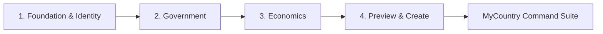

# 🏛️ Country Builder — Sovereign Creation & Onboarding Wizard

**Parent App Suite:** MyCountry Suite (`MYCOUNTRY_VERSION = 6`)  
**Subsystem:** Country Builder (`BUILDER_VERSION = 4`)  
**Primary Action:** `CREATE` | **Domain Accent:** Amber Gold (`#F59E0B` / `--color-amber-500`)  
**Route:** `/builder` (create) · `/mycountry/editor` (edit) | **Status:** 📀 Gold Master (100% Ready)  

The Country Builder serves as the sovereign onboarding and creation suite for MyCountry. It lets players configure a new nation across four build steps — foundation & identity, government, economics, and preview/commit — plus a wiki import path.

---

## Architecture & Versioning

Builder v4 adds the guided wizard stepper, progressive disclosure tiers, and the archetype default engine on top of v3's unified statecraft/tax builders, template pre-population, and cached wiki data. The same `BuilderRouter` serves create mode (`/builder`) and edit mode (`/mycountry/editor`).

### Routes & Components
- `src/app/builder/page.tsx` – Thin entry rendering `<BuilderRouter mode="create" />` (`/builder/import` redirects to `?section=import`)
- `src/app/builder/components/BuilderRouter.tsx` – Single-page section router (`useState` + `pushState`, `?section=` deep links)
- `src/app/builder/lib/builder-theme.ts` – Section definitions (`foundation`, `identity`, `government`, `economics`, `preview`, `import`); the header stepper merges foundation + identity into one "Foundation" step
- `src/app/builder/components/enhanced/` – Step content:
  - `steps/FoundationStep.tsx` + `CountrySelector.tsx`: Starting/reference country grid (skipped when starting from scratch, importing, or editing)
  - `NationalIdentitySection.tsx`: Country name, official title, motto, leader, capital, flag & coat of arms
  - `steps/GovernmentStep.tsx`: Atomic government components (15-component cap), structure, departments, budget/revenue
  - `EconomyBuilderPage.tsx` + `tabs/`: Economic components, sectors, labor, demographics, tax system
  - `sections/BuilderPreviewStep.tsx`: Final review and commit
- `src/app/builder/components/sections/ImportSection.tsx` – Wiki import flow
- `src/components/shared/atomic/UnifiedAtomicComponentSelector.tsx` – Shared atomic component selector

### Backend Routers
- `src/server/api/routers/builderDraft.ts` – Draft persistence (`get` / `save` / `clear`) so users can leave and resume
- `src/server/api/routers/countries/` (`createCountry`, `updateCountry`, `getEligibleCountries`, `searchWiki`, `parseInfobox`, `getWikiPageImages`) – Foundation grid, wiki import, and final nation record persistence
- `src/server/api/routers/economics/` (`getEconomyBuilderState`, `autoSaveEconomyBuilder`) – Economy builder state sync
- `src/server/api/routers/economicArchetypes/` & `src/server/api/routers/customTypes.ts` – Archetype presets and user-defined government types
- `src/server/api/routers/government/` & `src/server/api/routers/taxSystem/` – Existing structure/tax data in edit mode
- `src/server/api/routers/wikiCache.ts` (`builderDeepScan`) – Cached wiki deep scan
- Component catalogs (government, economic, tax) are static client data (`src/components/mycountry/domains/government/atoms/`, `src/lib/economy/data/`, `src/lib/government/tax/atomic-tax-components.ts`); conflicts/synergies are re-checked server-side on save via `src/lib/government/synergy.ts`

---

## Wizard Workflow

```mermaid
graph LR
    A[1. Foundation & Identity] --> B[2. Government]
    B --> C[3. Economics]
    C --> D[4. Preview & Create]
    D --> E[MyCountry Command Suite]
```

1. **Foundation & Identity**: Picks a reference country (or scratch/import), then configures name, flag (via `useUnifiedFlags` or MediaWiki asset fetch), and national symbols.
2. **Government**: Selects atomic government components with live synergy score calculation and conflict warnings, then structure, departments, and budget.
3. **Economics**: Economic components, sector splits, labor, demographics, and the tax system.
4. **Preview & Create**: `countries.createCountry` persists everything in one `$transaction` (identity, demographics, fiscal/tax, government structure & components, economy builder state), assigns the nation to the user, grants the new-player (and wiki-import) IxCredit bonus, and routes to `/mycountry`.

---

## Key Optimizations & Stability Guardrails

- **Wiki API Compliance**: All MediaWiki infobox imports strictly use the centralized user-agent `IxStats-Builder` (`DEFAULT_USER_AGENT` in `src/lib/wiki-os/config.ts`). Never make ad-hoc fetch calls.
- **Persistent Wiki Cache**: Wiki lookups go through `WikiCacheService` (Redis → database → API) and the deep scan through `IntelligentLoreCache`, preventing upstream MediaWiki rate limiting.
- **Draft Autosaving**: `builderDraftRouter` (`useBuilderPersistence`) syncs step state so browser refreshes do not lose configuration.
- **Archetype Context**: Selecting a government or economic archetype dynamically populates context-aware defaults for subsequent steps.
- **Safe Comparison Hooks**: Uses the deep `isEqual` helper (`src/lib/utils/common.ts`) in React hooks to prevent `Maximum update depth exceeded` re-render loops.

---

## Related Documentation

- [Economic Calculations Guide](./calculations.md)
- [Government Components & Synergies](../reference/synergies.md)
- [Economy & Tax System Guide](./economy.md)
- [MyCountry Command Suite](./mycountry.md)
- [Help: Your First Country](../../src/content/help/getting-started/first-country.md) (served at `/help/getting-started/first-country`)
