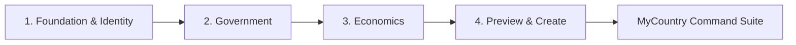

# 🏛️ Country Builder — Sovereign Creation & Onboarding Wizard

**Parent App Suite:** MyCountry Suite (`MYCOUNTRY_VERSION = 6`)  
**Subsystem:** Country Builder (`BUILDER_VERSION = 4`)  
**Primary Action:** `CREATE` | **Domain Accent:** Amber Gold (`#F59E0B` / `--color-amber-500`)  
**Route:** `/builder` (create) · `/mycountry/editor` (edit) | **Status:** ✅ Live for the 4-step wizard and wiki import; guide, diagnostics and autosave are 🟡 Partial (see [SYSTEM_STATUS.md](SYSTEM_STATUS.md))  

The Country Builder serves as the sovereign onboarding and creation suite for MyCountry. It lets players configure a new nation across four build steps — foundation & identity, government, economics, and preview/commit — plus a wiki import path.

---

## Architecture & Versioning

Builder v4 adds the guided wizard stepper, progressive disclosure tiers, and the archetype default engine on top of v3's unified statecraft/tax builders, template pre-population, and cached wiki data. The same `BuilderRouter` serves create mode (`/builder`) and edit mode (`/mycountry/editor`).

### Routes & Components
- `src/app/builder/page.tsx` – Thin entry rendering `<BuilderRouter mode="create" />` (`/builder/import` redirects to `?section=import`)
- `src/app/builder/components/BuilderRouter.tsx` – Single-page section router (`useState` + `pushState`, `?section=` deep links)
- `src/app/builder/lib/builder-theme.ts` – Section definitions (`foundation`, `identity`, `government`, `economics`, `preview`, `import`); the header stepper merges foundation + identity into one "Foundation" step
- `src/app/builder/components/enhanced/` – Step content:
  - `steps/FoundationStep.tsx` + `CountrySelector.tsx`: Starting/reference country grid (skipped when starting from scratch, importing, or editing)
  - `NationalIdentitySection.tsx`: Country name, official title, motto, leader, capital, flag & coat of arms
  - `steps/GovernmentStep.tsx`: Atomic government components (15-component cap), structure, departments, budget/revenue
  - `EconomyBuilderPage.tsx` + `tabs/`: Economic components, sectors, labor, demographics, tax system
  - `sections/BuilderPreviewStep.tsx`: Final review and commit
- `src/app/builder/components/sections/ImportSection.tsx` – Wiki import flow
- `src/components/shared/atomic/UnifiedAtomicComponentSelector.tsx` – Shared atomic component selector

### Backend Routers
- `src/server/api/routers/builderDraft.ts` – Draft persistence (`get` / `save` / `clear`) so users can leave and resume
- `src/server/api/routers/countries/` (`createCountry`, `updateCountry`, `getEligibleCountries`, `searchWiki`, `parseInfobox`, `getWikiPageImages`) – Foundation grid, wiki import, and final nation record persistence
- `src/server/api/routers/economics/` (`getEconomyBuilderState`, `autoSaveEconomyBuilder`) – Economy builder state sync
- `src/server/api/routers/economicArchetypes/` & `src/server/api/routers/customTypes.ts` – Archetype presets and user-defined government types
- `src/server/api/routers/government/` & `src/server/api/routers/taxSystem/` – Existing structure/tax data in edit mode
- `src/server/api/routers/wikiCache.ts` (`builderDeepScan`) – Cached wiki deep scan
- Component catalogs (government, economic, tax) are static client data (`src/components/mycountry/domains/government/atoms/`, `src/lib/economy/data/`, `src/lib/government/tax/atomic-tax-components.ts`); conflicts/synergies are re-checked server-side on save via `src/lib/government/synergy.ts`

---

## Wizard Workflow

```mermaid
graph LR
    A[1. Foundation & Identity] --> B[2. Government]
    B --> C[3. Economics]
    C --> D[4. Preview & Create]
    D --> E[MyCountry Command Suite]
```

1. **Foundation & Identity**: Picks a reference country (or scratch/import), then configures name, flag (via `useUnifiedFlags` or MediaWiki asset fetch), and national symbols.
2. **Government**: Selects atomic government components with live synergy score calculation and conflict warnings, then structure, departments, and budget.
3. **Economics**: Economic components, sector splits, labor, demographics, and the tax system.
4. **Preview & Create**: `countries.createCountry` persists everything in one `$transaction` (identity, demographics, fiscal/tax, government structure & components, economy builder state), assigns the nation to the user, grants the new-player (and wiki-import) IxCredit bonus, and routes to `/mycountry`. The new nation becomes the one the player acts as.

### Realm and nation cap

- `createCountry` takes an optional `realmId`. Without one it uses the realm of the nation the player acts as, else IxWorld (`resolveBuilderRealm`, `src/server/modules/realms/realms.builder.ts`).
- The realm must exist and be `active` (IxWorld always is): an unknown realm is `NOT_FOUND`, a closed one `FORBIDDEN`.
- The player must be under their nation cap in that realm, otherwise `CONFLICT` with a message naming the limit. The builder never hands back an existing nation instead.
- A name already used in the realm is a `CONFLICT` before anything is written. Slugs stay globally unique (`-2`, `-3`, … suffixes).
- The cap is `min(realm cap, tier cap)`, computed by `nationCapacity` (`realms.nation-cap.ts`). The realm cap is `Realm.settings.maxNationsPerUser` (default 1, admins set 1–20). The tier cap is `NATION_TIER_CAPS`: 1 for free accounts, 5 for MyCountry Premium (`hasPremiumTier`). The same helper gates claims and `assignNation`, which re-checks the cap inside the create transaction.
- On the Preview step the footer shows a realm picker (`BuilderRealmPicker`, fed by `realms.builderRealms`) when more than one realm is open to the player. The list holds IxWorld plus active realms that are public, that the player founded, or where they hold a nation; each shows held/cap, and full realms are disabled. With one realm the footer only says so when the player is at the cap there. The choice is stored as `builderState.realmId`.
- Foundation templates are always IxWorld nations, whatever the target realm.

---

## Country Editor (edit mode)

`/mycountry/editor` renders `BuilderRouter mode="edit"` for the player's country. It reuses the builder's sections but not the wizard chrome:

- **Shell** (`src/app/builder/components/editor/`): `EditorHeader` shows a link back to MyCountry, the country's flag and name (live from the edit state), the autosave status, the guided/expert toggle and the guide. Its section tiles (Identity, Government, Economy, Review) jump straight to any section; each shows how many of its fields changed (`countChangesBySection`, `lib/edit-changes.ts`) and an icon when the section has errors. `EditorSectionFooter` links the previous and next section; on Review it offers **Save and return to MyCountry** (the confirmation dialog with GDP/currency warnings, then `countries.updateCountry`). Foundation and wiki import are creation-only (`?section=foundation|import` opens Identity). Step-completion toasts are off in edit mode.
- **Saving**: edit mode autosaves to `countries.updateCountry` 1.5 s after the last change (owner decision, plan 004). `useBuilderPersistence` tracks whether the server has the current state (`hasUnsyncedChanges`, `lastSyncedAt`); a failed save is retried on the next change or from the save bar instead of being treated as saved. What the builder derives from the loaded country in its first 600 ms is part of the loaded state, so opening the editor does not write to the country. After each save the `countries`, `mycountry`, `government`, `taxSystem` and `economics` queries are marked stale (`useInvalidateCountryData`, no immediate refetch) and flag lookups refetch, so MyCountry and the country page show the new data.
- **Save bar** (`EditorSaveBar`): always visible. It counts the fields changed since the country was opened or last saved with **Save**, says whether the autosave landed (with **Try again** on failure), and offers Undo (50 steps), Discard (back to that version; undoable) and Save. ⌘S saves and ⌘⇧D discards in the editor.
- **Leaving**: while the server lacks the latest changes, `EditorLeaveGuard` asks before leaving — the browser prompt on reload/close, and a *Save and leave / Leave without saving / Stay* dialog for in-app links.
- **Loading and errors**: the editor always refetches the country, government, tax system and editor relations on open and waits for that fetch before hydrating, so it never starts from a cached pre-save copy. `EditorSkeleton` (also the route's `loading.tsx`) matches the layout; if any of those loads fails, the editor shows a retry card instead of hydrating defaults that autosave could write over the real data.
- **Recovered edits**: the local copy (`builder_state_<countryId>`) is read before this visit's autosave can replace it. When it is newer than the country and differs from it, `EditorDraftBanner` offers **Restore** (the fields become changes and autosave sends them) or **Discard** (`lib/recovered-draft.ts`).
- **Government component nudges**: adding Social Democracy or a Free Market System adjusts tax revenue once, when added (`lib/government-component-nudges.ts`). It no longer re-applies on every section switch or when the editor loads a country that already has the component.

---

## Key Optimizations & Stability Guardrails

- **Wiki API Compliance**: All MediaWiki infobox imports strictly use the centralized user-agent `IxStats-Builder` (`DEFAULT_USER_AGENT` in `src/lib/wiki-os/config.ts`). Never make ad-hoc fetch calls.
- **Persistent Wiki Cache**: Wiki lookups go through `WikiCacheService` (Redis → database → API) and the deep scan through `IntelligentLoreCache`, preventing upstream MediaWiki rate limiting.
- **Draft Autosaving**: `builderDraftRouter` (`useBuilderPersistence`) syncs step state so browser refreshes do not lose configuration.
- **Archetype Context**: Selecting a government or economic archetype dynamically populates context-aware defaults for subsequent steps.
- **Safe Comparison Hooks**: Uses the deep `isEqual` helper (`src/lib/utils/common.ts`) in React hooks to prevent `Maximum update depth exceeded` re-render loops.

---

## Related Documentation

- [Economic Calculations Guide](./calculations.md)
- [Government Components & Synergies](../reference/synergies.md)
- [Economy & Tax System Guide](./economy.md)
- [MyCountry Command Suite](./mycountry.md)
- [Help: Your First Country](../../src/content/help/getting-started/first-country.md) (served at `/help/getting-started/first-country`)
