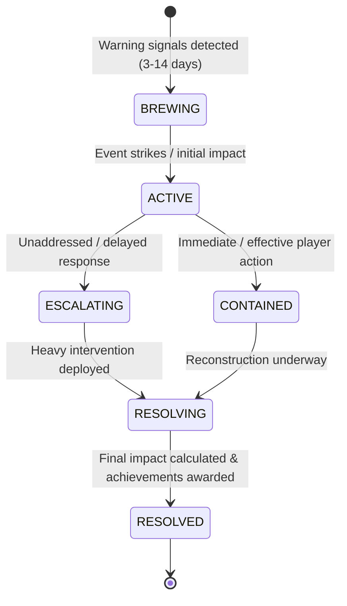

# Crisis Events Management System

**Last updated:** August 2026  
**Status:** Production Ready (Beta)  
**Hierarchy:** Subsystem of Concord Living-World Engine (`CONCORD_ENGINE_VERSION = 2`) & MyCountry.

The Crisis Events Management System generates natural disasters, economic crises, diplomatic incidents, social unrest, and security threats with realistic progression, compounding escalation, and player response choices.

---

## Event Taxonomy

1. **Natural Disasters**: Earthquakes, riverine/coastal floods, hurricanes/typhoons, wildfires, droughts, volcanic eruptions. Triggered by geography, climate biomes, and random environmental events.
2. **Economic Crises**: Market crashes, hyperinflation, banking solvency failures, sovereign debt defaults, commodity trade shocks.
3. **Diplomatic Incidents**: Border disputes, embassy expulsions, sanction threats, treaty violations, espionage leaks.
4. **Social Unrest**: Protests, general strikes, riots, civil disobedience, regional separatist movements.
5. **Security Threats**: Border incursions, cyber warfare, terrorism, sabotage.

---

## Event Lifecycle State Machine

- **BREWING**: Early warning signs detected; visible in Intelligence briefing with preventive mitigation options.
- **ACTIVE**: Incident occurs; initial casualty and GDP damage applied; response timer starts on Command Surface.
- **ESCALATING**: Unaddressed crisis deepens; damages compound and international scrutiny increases.
- **CONTAINED**: Effective player response halts escalation; reputation bonus awarded.
- **RESOLVING / RESOLVED**: Reconstruction phase; final economic impacts tallied and logged to `CountryEventSpine`.

---

## Response Options & Mechanics

Players select from 4 response postures in the Issue Detail Brief:

| Response Mode | Speed / Window | Upfront Cost | Outcomes & Risks |
| :--- | :--- | :--- | :--- |
| **Immediate Response** | 24–72 hours | High (150–200%) | Minimizes casualties (40–60% reduction), boosts public approval (+5 to +10), halts escalation |
| **Measured Response** | 3–7 days | Baseline (100%) | Balanced expenditure, manageable recovery, moderate approval (+2 to +5) |
| **Delayed Response** | 1–3 weeks | Low upfront (60%) | High escalation risk (60–80%), approval penalty (-5 to -15), compounding long-term costs |
| **International Aid** | Varies | Shared (50–70%) | Diplomatic relationship bonus with donor partners (+8 to +15), reduced fiscal drain |

---

## API & Backend Integration

- **Router**: `src/server/api/routers/crisis-events.ts`
- **Queries**: `getActiveCrises`, `getHistory`, `getStatistics`
- **Mutations**: `submitResponse`, `requestAid`, `adminTrigger`
- **Consequences**: Applied atomically via `CountryEventSpine` to update GDP growth, public approval, stability, and post news to ThinkPages.

---

## Related Documentation

- [Economic Calculations Guide](./calculations.md)
- [Diplomacy System Guide](./diplomacy.md)
- [Intelligence System Guide](./intelligence.md)
- [API Reference: Crisis Events](../reference/api-complete.md#crisis-events-router)
