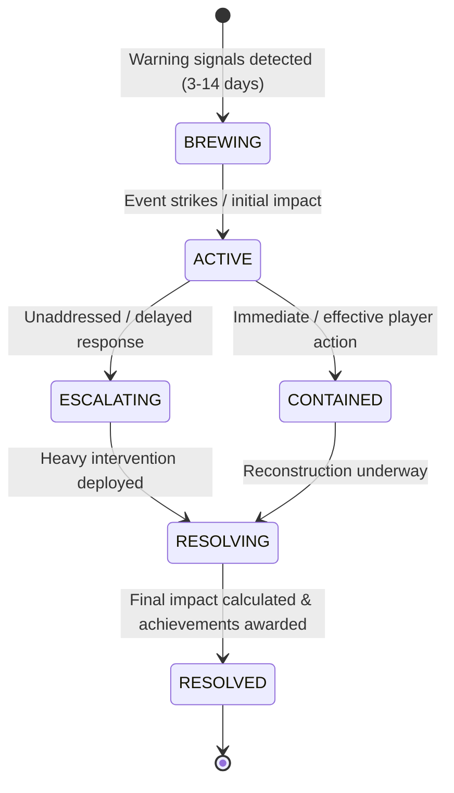

# ⚙️ Dynamic Crisis Events Engine

**Parent Engine:** Concord Simulation Engine (`CONCORD_ENGINE_VERSION = 2`)  
**Subsystem:** Incident Triage & Emergency Response Loop  
**Primary Action:** `RESOLVE` | **Domain Accent:** Crimson Rose (`#F43F5E` / `--color-rose-500`)  
**Route:** read-only, surfaced as the crisis signal on the MyCountry Overview (`CrisisSignal.tsx`) | **Status:** 🚧 Partial — read-only, and nothing writes `CrisisEvent` rows; generation & response engine not built  

The Crisis Events Engine is designed to generate algorithmic natural disasters, economic crises, diplomatic incidents, social unrest, and security threats with realistic progression, compounding escalation, and player response choices.

> **Implementation status (2026-10-05):** Only the read side exists. `CrisisEvent` rows (`prisma/schema/diplomacy.prisma`: type, title, severity, affected countries, casualties, economic impact, `responseStatus`) have no writer at all: the demo seed that created them is gone (checked 2026-10-05). The `crisisEvents` router exposes `getActive` and `getStatistics`, `CrisisSignal` on the MyCountry Overview reads `getStatistics` for the nation's active-crisis count (it renders nothing while there are none, which is always today). The taxonomy, lifecycle state machine, response postures, and consequence wiring below are **design targets** and are not implemented. There is no `/admin/crisis-events` page and no generator, response mutation, or spine integration for `CrisisEvent`. The one working event producer is the separate admin world-events (Storyteller) tool, described below. Player-facing "crises" today are urgent National Issues (see [MyCountry](./mycountry.md)).

---

## Admin World Events (Storyteller): the only producer today

Admins can author world events at `/admin/storyteller` (`src/app/admin/storyteller/`, `EventWizard`, `WorldTimeline`, `SandboxMode`), backed by `src/server/api/routers/admin/worldEvents.ts` (`getWorldEvents`, `createWorldEvent`, `updateWorldEvent`, `simulateWorldEvent`, plus diplomatic-option CRUD and `getUpcomingEvents`). `createWorldEvent` writes a `WorldEvent` (`prisma/schema/government.prisma`: name, type such as `economic_crisis`, `natural_disaster` or `pandemic`, severity 0-1, duration in IxTime years, affected countries, optional chain) and, when `generateEffects` is set, one `StorytellerEffect` per affected country (negative for severity >= 0.5). Those effects feed the `IxStatsCalculator` projection (see [Economy](./economy.md)), and creation is written to `AdminAuditLog`. `updateWorldEvent` with `isActive: false` deactivates the linked effects. This tool does not create `CrisisEvent` rows, so the `getActive` crisis feed above stays empty outside the demo seed.

---

## Event Taxonomy (planned)

1. **Natural Disasters**: Earthquakes, riverine/coastal floods, hurricanes/typhoons, wildfires, droughts, volcanic eruptions. Triggered by geography, climate biomes, and random environmental events.
2. **Economic Crises**: Market crashes, hyperinflation, banking solvency failures, sovereign debt defaults, commodity trade shocks.
3. **Diplomatic Incidents**: Border disputes, embassy expulsions, sanction threats, treaty violations, espionage leaks.
4. **Social Unrest**: Protests, general strikes, riots, civil disobedience, regional separatist movements.
5. **Security Threats**: Border incursions, cyber warfare, terrorism, sabotage.

---

## Event Lifecycle State Machine (planned)

```mermaid
stateDiagram-v2
    [*] --> BREWING : Warning signals detected (3-14 days)
    BREWING --> ACTIVE : Event strikes / initial impact
    ACTIVE --> ESCALATING : Unaddressed / delayed response
    ACTIVE --> CONTAINED : Immediate / effective player action
    ESCALATING --> RESOLVING : Heavy intervention deployed
    CONTAINED --> RESOLVING : Reconstruction underway
    RESOLVING --> RESOLVED : Final impact calculated & achievements awarded
    RESOLVED --> [*]
```

- **BREWING**: Early warning signs detected; visible in Intelligence briefing with preventive mitigation options.
- **ACTIVE**: Incident occurs; initial casualty and GDP damage applied; response timer starts on Command Surface.
- **ESCALATING**: Unaddressed crisis deepens; damages compound and international scrutiny increases.
- **CONTAINED**: Effective player response halts escalation; reputation bonus awarded.
- **RESOLVING / RESOLVED**: Reconstruction phase; final economic impacts tallied and logged to `CountryEventSpine`.

---

## Response Options & Mechanics (planned)

Players would select from 4 response postures:

| Response Mode | Speed / Window | Upfront Cost | Outcomes & Risks |
| :--- | :--- | :--- | :--- |
| **Immediate Response** | 24–72 hours | High (150–200%) | Minimizes casualties (40–60% reduction), boosts public approval (+5 to +10), halts escalation |
| **Measured Response** | 3–7 days | Baseline (100%) | Balanced expenditure, manageable recovery, moderate approval (+2 to +5) |
| **Delayed Response** | 1–3 weeks | Low upfront (60%) | High escalation risk (60–80%), approval penalty (-5 to -15), compounding long-term costs |
| **International Aid** | Varies | Shared (50–70%) | Diplomatic relationship bonus with donor partners (+8 to +15), reduced fiscal drain |

---

## API & Backend Integration

- **Router**: `src/server/api/routers/crisis-events.ts` (`crisisEvents`)
- **Queries (built)**: `getActive` (pending / in-progress / monitoring events), `getStatistics` (counts by timeframe)
- **Mutations (planned, not built)**: `submitResponse`, `requestAid`, `adminTrigger`
- **Consequences (planned)**: Would apply through `CountryEventSpine` to update GDP growth, public approval, stability, and post news to ThinkPages.

---

## Related Documentation

- [Economic Calculations Guide](./calculations.md)
- [Diplomacy System Guide](./diplomacy.md)
- [Intelligence System Guide](./intelligence.md)
- [API Reference: Crisis Events](../reference/api-complete.md#defense--security)
