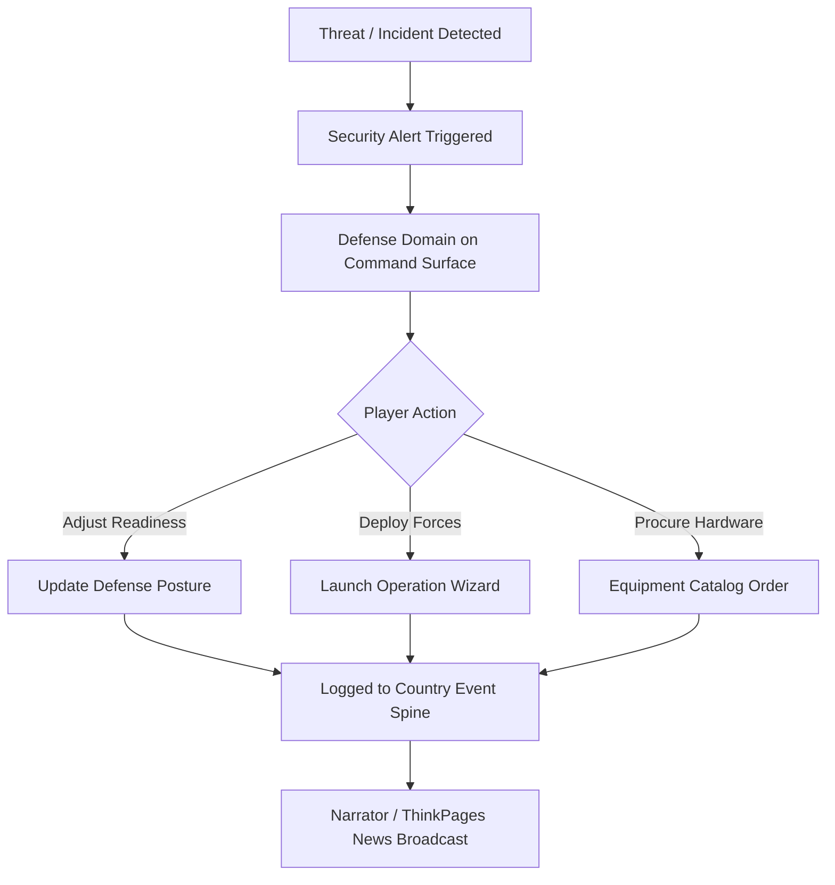

# 🏛️ MyCountry Defense & Security Domain (Preview)

**Parent App Suite:** MyCountry Suite (`MYCOUNTRY_VERSION = 5`)  
**Engine:** Statecraft Simulation Engine (`MYCOUNTRY_ENGINE_VERSION = 4`)  
**Primary Action:** `SECURE` | **Domain Accent:** Crimson Indigo (`#4F46E5` / `--color-indigo-600`)  
**Route:** `/mycountry/defense` | **Status:** 🧪 Developer Preview (Not in Active Public Navigation)  

> **⚠️ Status Note:** The Defense & Security module is currently under development in developer preview and is not part of the active public navigation suite.

Defense capabilities model national force readiness, crisis response, operational deployments, equipment procurement, and strategic defense infrastructure postures.

---

## Architecture & Surface Integration

Under MyCountry's Command Surface architecture (`CommandSurface.tsx`), defense is integrated as a first-class domain mode:

### UI Surfaces
- `src/components/mycountry/DomainSurface.tsx` (Defense Domain) – Executive readiness view, operational posture, branch allocations, and threat level indicators
- `src/components/mycountry/DrillSheets.tsx` – Slide-over defense inspection and policy tuning sheet
- `src/components/defense/` – Defense modules, equipment inventory, readiness cards
- `src/components/defense/OperationsPanel.tsx` – Military operations management
- `src/components/defense/operations/` – `ActiveOperations`, `DeploymentWizard`, `PvPConflictPanel`

### Backend Routers
- `src/server/api/routers/security/` (`index.ts`, `overview.ts`, `threats.ts`) – National security posture, threat detection hooks, defense module configs
- `src/server/api/routers/militaryEquipment/` – Military hardware and equipment catalog (aircraft, naval, armor)
- `src/server/api/routers/smallArmsEquipment/` – Infantry weapons and manufacturer catalogs
- `src/server/api/routers/crisis-events.ts` – Dynamic crisis and security incident management
- `src/server/api/routers/intelligence/` – Security feeds and threat assessment overlays

---

## Data Models

Defined in `prisma/schema/military.prisma` and `prisma/schema/core.prisma`:
- `DefenseModule`: Installed defense infrastructure, radar, and air defense assets
- `DefenseReadiness`: Readiness score (0–100), alert level, branch readiness splits
- `DefenseIncident`: Active/historical border clashes, security breaches, and incursions
- `MilitaryEquipment` / `SmallArmsEquipment`: Comprehensive equipment catalogs with stats, unit costs, and maintenance upkeep

---

## Core Workflows

1. **Posture & Readiness**: Players tune readiness posture across branches (Army, Navy, Air Force, Cyber, Homeland Security), consuming budget allocation.
2. **Operations & Deployments**: Players plan deployments or peacekeeping missions with automated success probability factoring equipment and readiness.
3. **Equipment Management**: Procurement from domestic and international catalogs directly modifies military strength ratings on Nation Cards.
4. **Crisis Response**: Security incidents trigger alerts in the Command Surface briefing rail, with decisions logged via the `CountryEventSpine`.

---

## Related Documentation

- [MyCountry Command Suite](./mycountry.md)
- [Intelligence System](./intelligence.md)
- [Crisis Events Guide](./crisis-events.md)
- [API Reference: Security & Military Routers](../reference/api-complete.md#security-router)
