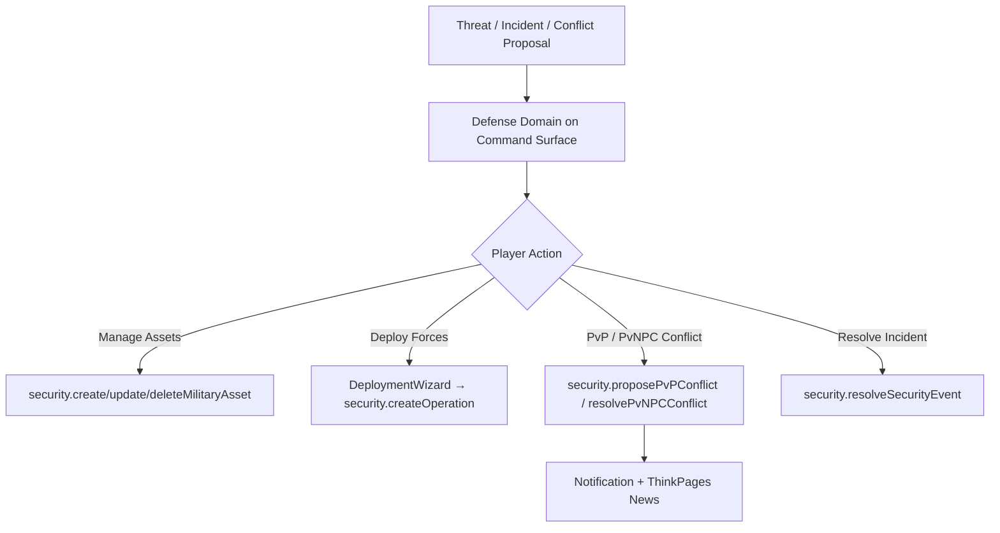

# 🏛️ MyCountry Defense & Security Domain (Premium)

**Parent App Suite:** MyCountry Suite (`MYCOUNTRY_VERSION = 6`)  
**Engine:** Statecraft Simulation Engine (`MYCOUNTRY_ENGINE_VERSION = 4`)  
**Primary Action:** `SECURE` | **Domain Accent:** Crimson Red (`text-red-500`, `DOMAIN_META.defense`)  
**Route:** `/mycountry/defense` (also serves `/mycountry/intelligence`) | **Status:** 💎 Premium-gated  

> **⚠️ Access Note:** Defense is a premium MyCountry section (`ability.can("access", "MyCountryFeature", "defense")` in `src/lib/auth/ability.ts`). Non-premium users see it locked behind `PremiumPreviewFrame`. The sidebar hides it unless an admin enables the teaser toggle (`api.admin.getNavigationSettings().showDefenseTab`). All defense mutations use `premiumProcedure`. On test builds, `NEXT_PUBLIC_PREMIUM_FOR_ALL="true"` opens all of this to every user (see [premium-features.md](../reference/premium-features.md)).

Defense capabilities model military branches and assets, force readiness, operational deployments, PvP/PvNPC conflicts, border security, internal stability, and equipment catalogs.

---

## Architecture & Surface Integration

Under MyCountry's Command Surface architecture (`CommandSurface.tsx`), defense is integrated as a first-class domain mode:

### UI Surfaces
- `src/components/mycountry/shell/DomainSurface.tsx` (Defense Domain) – Lazy-loads `DefenseCommandPanel` inside `PremiumPreviewFrame`
- `src/components/mycountry/shell/rails/DefenseRail.tsx` – Defense context rail
- `src/components/mycountry/domains/defense/` – `DefenseCommandPanel`, `CommandPanel`, `AssetManager`, `OperationsPanel`, `StabilityPanel`, `BorderThreatPanel`
- `src/components/mycountry/domains/defense/command/` – `ReadinessOverviewCard` (DEFCON posture), `BudgetManagementCard`
- `src/components/mycountry/domains/defense/assets/` – Asset cards/dialogs and `EquipmentBrowser`
- `src/components/mycountry/domains/defense/operations/` – `ActiveOperations`, `DeploymentWizard`, `PvPConflictPanel`
- `src/components/mycountry/domains/defense/stability/` – Stability metrics and security events

### Backend Routers
- `src/server/api/routers/security/` (`assessment.ts`, `borders.ts`, `conflicts.ts`, `defense.ts`, `military.ts`, `operations.ts`, `stability.ts`) – Security assessment, border security, PvP/PvNPC conflicts, defense budget, branches & assets, operations, internal stability & security events
- `src/server/api/routers/militaryEquipment/` – Military hardware catalog, manufacturers, analytics (aircraft, naval, armor)
- `src/server/api/routers/smallArmsEquipment/` – Infantry weapons and manufacturer catalogs

---

## Data Models

Defined in `prisma/schema/military.prisma`:
- `MilitaryBranch`, `MilitaryUnit`, `MilitaryAsset`: Force structure, unit readiness, and owned hardware
- `DefenseBudget`: Defense spending allocation
- `SecurityThreat`, `ThreatIncident`, `SecurityAssessment`, `NeighborThreatAssessment`, `BorderSecurity`: Threat and border posture
- `InternalStabilityMetrics`, `SecurityEvent`: Domestic stability and incidents

`security.getInternalStability` recalculates stability from the formula (`src/lib/statecraft/stability-formulas.ts`) on every view through `recalculateInternalStability` (`src/lib/statecraft/stability-store.ts`). Each row stores the formula values it was last computed from (`formulaSnapshot`); on recalculation, the gap between a stored field and its snapshot value (the delta that national issues or other events wrote through `CountryEventSpine`) is added to the new formula value, bounded to 0-100 (rates: at least 0). A row without a snapshot keeps its stored values once and tracks the formula from then on. The formula inputs still use placeholder budgets and several defaulted fields.
- `MilitaryOperation`, `Deployment`, `MilitaryConflict`: Operations, deployments, and PvP/PvNPC conflicts
- `MilitaryEquipmentCatalog` / `DefenseManufacturer` / `SmallArmsEquipment` / `SmallArmsManufacturer` / `WeaponEra`: Equipment catalogs

---

## Core Workflows

```mermaid
graph TD
    A[Threat / Incident / Conflict Proposal] --> B[Defense Domain on Command Surface]
    B --> C{Player Action}
    C -->|Manage Assets| D[security.create/update/deleteMilitaryAsset]
    C -->|Deploy Forces| E[DeploymentWizard → security.createOperation]
    C -->|PvP / PvNPC Conflict| F[security.proposePvPConflict / resolvePvNPCConflict]
    C -->|Resolve Incident| G[security.resolveSecurityEvent]
    F --> H[Notification + ThinkPages News]
```

1. **Posture & Readiness**: DEFCON-style posture and branch/unit readiness; deployments drain unit readiness (−10) and recalls restore part of it (+5 per unit).
2. **Operations & Deployments**: Peacekeeping, defense pact, blockade, intervention, and training operations deploy units/assets and carry a daily operating cost (personnel × $200/day + 1.5× asset maintenance) while active.
3. **Equipment Management**: Assets are added from the equipment catalogs via `EquipmentBrowser`.
4. **Conflicts & Crises**: PvP conflict proposals notify the defender and publish news; security events are resolved from the stability panel. Defense actions are not yet routed through `CountryEventSpine`.

---

## Related Documentation

- [MyCountry Command Suite](./mycountry.md)
- [Intelligence System](./intelligence.md)
- [Crisis Events Guide](./crisis-events.md)
- [API Reference: Security & Military Routers](../reference/api-complete.md#defense--security)
