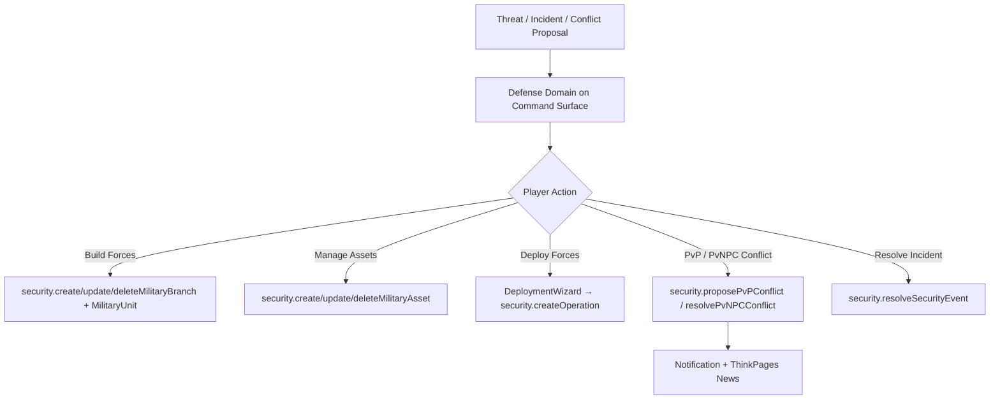

# 🏛️ MyCountry Defense & Security Domain (Premium)

**Parent App Suite:** MyCountry Suite (`MYCOUNTRY_VERSION = 6`)  
**Engine:** Statecraft Simulation Engine (`MYCOUNTRY_ENGINE_VERSION = 4`)  
**Primary Action:** `SECURE` | **Domain Accent:** Crimson Red (`text-red-500`, `DOMAIN_META.defense`)  
**Route:** `/mycountry/defense` (also serves `/mycountry/intelligence`) | **Status:** 💎 Premium-gated  

> **⚠️ Access Note:** Defense is a premium MyCountry section (`ability.can("access", "MyCountryFeature", "defense")` in `src/lib/auth/ability.ts`). Non-premium users see it locked behind `PremiumPreviewFrame`. The sidebar shows the Defense row only to MyCountry Premium users and beta testers (`requires: "mycountry-premium"` in `src/lib/navigation/app-sections.ts`); the old admin teaser switch (`showDefenseTab`) was removed on 2026-10-05. All defense mutations use `premiumMutationProcedure` (premium plus a per-procedure rate limit). On test builds, `NEXT_PUBLIC_PREMIUM_FOR_ALL="true"` opens all of this to every user (see [premium-features.md](../reference/premium-features.md)).

Defense capabilities model military branches and assets, force readiness, operational deployments, PvP/PvNPC conflicts, border security, internal stability, and equipment catalogs.

---

## Architecture & Surface Integration

Under MyCountry's Command Surface architecture (`CommandSurface.tsx`), defense is integrated as a first-class domain mode:

### UI Surfaces
- `src/components/mycountry/shell/DomainSurface.tsx` (Defense Domain) – Lazy-loads `DefenseCommandPanel` inside `PremiumPreviewFrame`
- `src/components/mycountry/shell/rails/DefenseRail.tsx` – Defense context rail
- `src/components/mycountry/domains/defense/` – `DefenseCommandPanel`, `CommandPanel`, `AssetManager`, `OperationsPanel`, `StabilityPanel`, `BorderThreatPanel`
- `src/components/mycountry/domains/defense/forces/` – `ForceStructurePanel` (totals, combat strength, branch list; the Branches and readiness tab), `BranchCard`, `BranchSheet`, `UnitSheet`, `StarterForceDialog`, and `ArsenalPanel` (branch picker for `AssetManager`; the Forces and arsenal tab)
- `src/components/mycountry/domains/defense/command/` – `ReadinessOverviewCard` (DEFCON posture), `BudgetManagementCard`
- `src/components/mycountry/domains/defense/assets/` – Asset cards/dialogs and `EquipmentBrowser`
- `src/components/mycountry/domains/defense/operations/` – `ActiveOperations`, `DeploymentWizard`, `PvPConflictPanel`
- `src/components/mycountry/domains/defense/stability/` – Stability metrics and security events

### Backend Routers
- `src/server/api/routers/security/` (`assessment.ts`, `borders.ts`, `conflicts.ts`, `defense.ts`, `force-structure.ts`, `military.ts`, `operations.ts`, `stability.ts`) – Security assessment, border security, PvP/PvNPC conflicts, defense budget, branch and unit authoring, order of battle and assets, operations, internal stability & security events
- `src/server/api/routers/militaryEquipment/` – Military hardware catalog, manufacturers, analytics (aircraft, naval, armor)
- `src/server/api/routers/smallArmsEquipment/` – Infantry weapons and manufacturer catalogs

---

## Data Models

Defined in `prisma/schema/military.prisma`:
- `MilitaryBranch`, `MilitaryUnit`, `MilitaryAsset`: Force structure, unit readiness, and owned hardware
- `DefenseBudget`: Defense spending allocation
- `SecurityThreat`, `ThreatIncident`, `SecurityAssessment`, `NeighborThreatAssessment`, `BorderSecurity`: Threat and border posture
- `InternalStabilityMetrics`, `SecurityEvent`: Domestic stability and incidents

`security.getInternalStability` computes stability from the formula (`src/lib/statecraft/stability-formulas.ts`) on every view through `computeInternalStability` (`src/lib/statecraft/stability-store.ts`), without writing (MC-13). Each row stores the formula values it was last computed from (`formulaSnapshot`); on recalculation, the gap between a stored field and its snapshot value (the delta that national issues or other events wrote through `CountryEventSpine`) is added to the new formula value, bounded to 0-100 (rates: at least 0). Rows are written by the issue path (`ensureInternalStabilityMetrics`) and re-persisted by the `stat-progression` job (`refreshStoredInternalStability`). A row without a snapshot keeps its stored values until that job first recalculates it, then tracks the formula. The formula's recent-policy term reads active policies enacted in the last 90 IxTime days. Its other inputs still use placeholder budgets and several defaulted fields. `security.getBorderSecurity` returns schema defaults for a country with no row instead of creating one.
- `MilitaryOperation`, `Deployment`, `MilitaryConflict`: Operations, deployments, and PvP/PvNPC conflicts
- `MilitaryEquipmentCatalog` / `DefenseManufacturer` / `SmallArmsEquipment` / `SmallArmsManufacturer` / `WeaponEra`: Equipment catalogs

---

## Core Workflows

```mermaid
graph TD
    A[Threat / Incident / Conflict Proposal] --> B[Defense Domain on Command Surface]
    B --> C{Player Action}
    C -->|Build Forces| BF[security.create/update/deleteMilitaryBranch + MilitaryUnit]
    C -->|Manage Assets| D[security.create/update/deleteMilitaryAsset]
    C -->|Deploy Forces| E[DeploymentWizard → security.createOperation]
    C -->|PvP / PvNPC Conflict| F[security.proposePvPConflict / resolvePvNPCConflict]
    C -->|Resolve Incident| G[security.resolveSecurityEvent]
    F --> H[Notification + ThinkPages News]
```

1. **Force structure**: owners author branches and units (see below); assets belong to a branch.
2. **Posture & Readiness**: DEFCON-style posture and branch/unit readiness; deployments drain unit readiness (−10) and recalls restore part of it (+5 per unit).
3. **Operations & Deployments**: Peacekeeping, defense pact, blockade, intervention, and training operations deploy units/assets and carry a daily operating cost (personnel × $200/day + 1.5× asset maintenance) while active. `DeploymentWizard` lists the nation's units and assets by branch and sets deployed personnel from the selected units; `security.createOperation` refuses unit or asset ids outside the nation's active branches.
4. **Equipment Management**: Assets are added from the equipment catalog via `EquipmentBrowser`, which lists the active `MilitaryEquipmentCatalog` rows edited at `/admin/military-equipment` (`militaryEquipment.getPlayerCatalog`).
5. **Conflicts & Crises**: PvP conflict proposals notify the defender and publish news. An accepted PvP conflict runs for its rules' `maxDuration` (default 14 IxTime days); after that either side resolves it with `security.concludePvPConflict`, which uses the same strength calculation as a PvNPC strike (`src/lib/military/conflict-outcome.ts`). Security events are resolved from the stability panel. Defense actions are not yet routed through `CountryEventSpine`.

---

## Force structure and combat strength

Plan 312 deleted branch and unit CRUD, which left every nation at zero strength (MC-3). Decision D2 (2026-10-06, option a) restored authoring in `security/force-structure.ts`:

| Procedure | Who | Notes |
|---|---|---|
| `security.createMilitaryBranch` / `updateMilitaryBranch` / `deleteMilitaryBranch` | Owner, acting user or privileged role (`assertCountryWriteAccess`) | Delete is a hard delete; units and assets cascade |
| `security.createMilitaryUnit` / `updateMilitaryUnit` / `deleteMilitaryUnit` | Same, through the unit's branch | |
| `security.previewStarterForceStructure` (query) / `seedStarterForceStructure` | Same | Only for a nation with no active branches |
| `security.create/update/deleteMilitaryAsset` (`military.ts`) | Same (admins included since 2026-10-06) | Operational count may not exceed quantity |

All mutations are `premiumMutationProcedure`. Bounds live in `FORCE_LIMITS` (`src/lib/military/force-structure.ts`): at most 20 active branches per nation, 200 units and 500 assets per branch; active duty up to 10M, reserves 20M, civilian staff 5M and unit personnel 1M per row; budgets up to 1e14; levels 0 to 100; text fields length-capped and image URLs http(s) only. Two cross-row rules: active duty plus reserves across a nation's active branches may not exceed 25% of its population, and a branch's units may not hold more personnel than its active duty plus reserves (shrinking a branch below its units is refused too).

**Starter force:** the empty state offers "Start from my nation's data". It creates an army, navy and air force with 0.5% of the population on active duty (split 55/25/20, reserves half of active duty), funded from the builder's Defense line in `GovernmentBudget.spendingCategories` (either storage shape), else the stored `DefenseBudget.totalBudget`, else 2% of GDP. A Defense figure above half of GDP is ignored as bad data.

**Combat strength** (`militaryStrength` in `src/lib/military/force-structure.ts`, re-exported from `conflict-outcome.ts`) is the sum over active branches of:

- personnel: each unit's personnel × its readiness, plus active duty no unit holds × branch readiness, plus unassigned reserves × branch readiness × 0.25 (unit personnel is drawn from active duty first, then reserves, so nobody counts twice);
- assets: for each non-retired asset, min(operational, quantity) × 10 × (0.5 + modernization);
- times a quality factor of 0.75 + mean(technology, training, morale) / 2, so 0.75 to 1.25 and 1.0 at the default 50s.

PvNPC strikes and `security.concludePvPConflict` feed both sides' strength to `computeConflictOutcome`. The force-structure panel, each branch card and the Defense rail show the same figure, computed client-side from `getMilitaryBranches` with the same function. `SecurityAssessment.militaryStrength` is a separate 0 to 100 index that nothing writes yet; it does not feed battles.

---

## Related Documentation

- [MyCountry Command Suite](./mycountry.md)
- [Intelligence System](./intelligence.md)
- [Crisis Events Guide](./crisis-events.md)
- [API Reference: Security & Military Routers](../reference/api-complete.md#defense--security)
