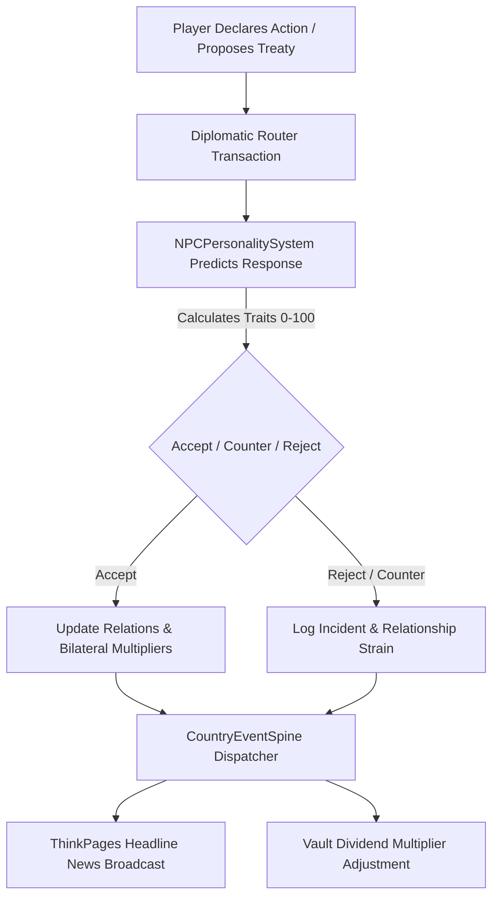

# 🏛️ MyCountry Diplomacy Domain

**Parent App Suite:** MyCountry Suite (`MYCOUNTRY_VERSION = 5`)  
**Engine:** Concord Living-World Simulation Engine (`CONCORD_ENGINE_VERSION = 2`)  
**Primary Action:** `ALLIED` | **Domain Accent:** Cyan Blue (`#06B6D4` / `--color-cyan-500`)  
**Route:** `/mycountry` (Diplomacy Domain) | **Status:** 📀 Gold Master (100% Ready)  

The diplomacy domain handles international relations, embassy networks, missions, cultural exchanges, multilateral alliances, foreign policy scenarios, and autonomous NPC reactions. Direct diplomatic communications route through **ThinkShare** (`/messages`).

---

## Architecture & Surfaces

### UI Surfaces
- `src/components/mycountry/DomainSurface.tsx` (Diplomacy Domain) – Full-screen diplomacy command view with relationship matrix, active missions, and embassy network
- `src/components/mycountry/DrillSheets.tsx` – Slide-over relations sheet and foreign policy tuning drawer
- `src/app/mycountry/intelligence/_components/DiplomaticOperationsHub.tsx` – Embassy reach, missions, and bilateral influence
- `src/components/mycountry/domains/diplomacy/LiveDiplomaticFeed.tsx` – Real-time event ticker powered by Socket.IO
- `src/components/diplomacy/alliances/` – Alliance creation, collective actions, and treaty dashboards
- `src/components/diplomacy/ForeignPolicyPanel.tsx` – Foreign policy action management (sanctions, free trade, defense pacts)

### Backend Routers
- `src/server/api/routers/diplomacy/` (`index.ts`, `core.ts`, `embassies.ts`, `cultural.ts`, `policies.ts`, `inbox.ts`) – Embassies, bilateral missions, cultural programs, and policy enactments
- `src/server/api/routers/diplomatic-intelligence/` – Executive intelligence briefings and relationship threat assessments
- `src/server/api/routers/diplomaticScenarios/` – Dynamic scenario templates and player choices
- `src/server/api/routers/npcPersonalities/` – Autonomous NPC personality traits, tone calculation, and response prediction
- `src/server/api/routers/thinkpages/` & `src/server/api/routers/messages/` – ThinkShare unified messaging

---

## Data Models

Defined in `prisma/schema/diplomacy.prisma`:
- `DiplomaticRelation`: Bilateral relationship strength (0–100), state (ALLIED, FRIENDLY, NEUTRAL, TENSE, HOSTILE, WAR)
- `Embassy`: Physical diplomatic mission with level, budget, and specialization (ECONOMIC, CULTURAL, SECURITY, GENERAL)
- `EmbassyMission`: Active operations with duration, success probability, risk level, and reward yield
- `CulturalExchange`: Bilateral cultural programs boosting soft power and synergy
- `DiplomaticEvent`: Timestamped historical record of treaties, expulsions, summits, and sanctions

---

## Core Diplomatic Engines

### 1. Diplomatic Response AI (`src/lib/diplomatic-response-ai.ts`)
Generates emergent geopolitical events weighted by tension levels, economic competition, and past player choices. Features an **Event Fatigue Mechanic** to prevent overwhelming players with excessive concurrent incidents.

### 2. NPC Personality-Driven Auto-Response (`src/lib/diplomatic-npc-personality.ts`)
Computes 8 core traits (Assertiveness, Cooperativeness, Economic Focus, Cultural Openness, Risk Tolerance, Ideological Rigidity, Militarism, Isolationism) mapping to 6 behavioral archetypes. Predicts NPC reactions to player proposals with naturalistic drift over time.

### 3. Unified Messaging (ThinkShare)
Diplomatic channels are first-class `ThinkshareConversation` records with security classifications (`PUBLIC`, `RESTRICTED`, `CONFIDENTIAL`, `SECRET`, `TOP_SECRET`), digital signatures, and end-to-end encryption.

---

## Related Documentation

- [NPC AI & Personality System](./npc-ai.md)
- [Crisis Events Management](./crisis-events.md)
- [Social & Collaboration System](./social.md)
- [MyCountry Command Suite](./mycountry.md)
- [API Reference: Diplomacy Routers](../reference/api-complete.md#diplomacy-routers)
