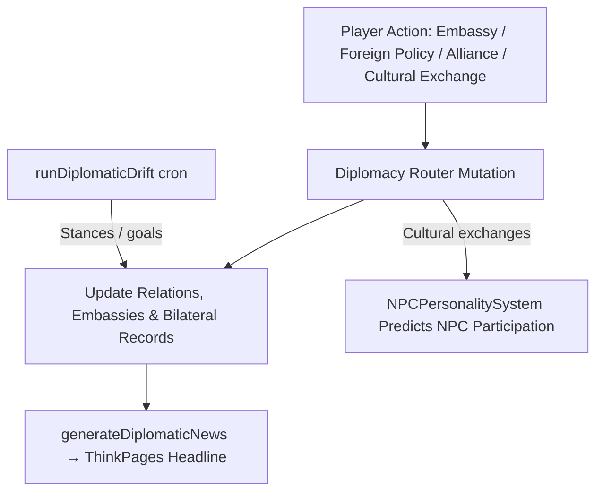

# 🏛️ MyCountry Diplomacy Domain

**Parent App Suite:** MyCountry Suite (`MYCOUNTRY_VERSION = 6`)  
**Engine:** Concord Living-World Simulation Engine (`CONCORD_ENGINE_VERSION = 2`)  
**Primary Action:** `ALLIED` | **Domain Accent:** Cyan Blue (`#06B6D4` / `--color-cyan-500`)  
**Route:** `/mycountry/diplomacy` (Diplomacy Domain) | **Status:** 🟡 Partial: see [SYSTEM_STATUS.md](SYSTEM_STATUS.md); embassies, stances and cultural exchange work, consent-based flows do not  

The diplomacy domain handles international relations, embassy networks, cultural exchanges, multilateral alliances, foreign policy actions, diplomatic scenarios, and NPC reactions to cultural exchanges. Direct diplomatic communications route through **ThinkShare** (`/messages`).

---

## Architecture & Surfaces

### UI Surfaces
- `src/components/mycountry/shell/DomainSurface.tsx` (Diplomacy Domain) – Full-screen diplomacy view rendering `EmbassiesAndRelationsPanel`
- `src/components/mycountry/shell/rails/RelationsRail.tsx` – Relations context rail with fogged foreign intel (`src/lib/statecraft/diplo-intel.ts`)
- `src/components/mycountry/shell/DrillSheets.tsx` – Slide-over relations sheet
- `src/components/mycountry/domains/diplomacy/` – Embassy network (`embassy-network/`, `EmbassyCreatorSheet`, `EmbassyDetailSheet`), relations list, cultural exchange wizard/program, `DiplomaticEventsHub`, `ScenarioModal`, shared data
- `src/components/mycountry/domains/diplomacy/alliances/` – `AllianceDashboard`, `CollectiveActionsPanel` (alliance creation via `AllianceCreatorSheet`)

### Backend Routers
- `src/server/api/routers/diplomacy/core/` (`diplomaticCore`) – Relationships, stances (`setDiplomaticGoal`), follows, shared data, diplomatic options
- `src/server/api/routers/diplomacy/embassies/` (`diplomaticEmbassies`) – Establish, close, reopen, delete, profile, establishment cost
- `src/server/api/routers/diplomacy/cultural/` (`diplomaticCultural`) – Cultural exchanges, artifacts, votes, scenarios, NPC responses
- `src/server/api/routers/diplomacy/policies/` (`diplomaticPolicies`) – Foreign policy actions and alliances (create, invite, leave, collective actions, votes)
- `src/server/api/routers/diplomaticScenarios/` – Scenario templates and player choices
- `src/server/api/routers/npcPersonalities/` – NPC personality admin CRUD and assignment
- `src/server/api/routers/thinkpages/` & `src/server/api/routers/messages/` – ThinkShare unified messaging

---

## Data Models

Defined in `prisma/schema/diplomacy.prisma`:
- `DiplomaticRelation`: Bilateral relationship (`relationship` label, `strength` 0–100, `status`, per-side goals/stances)
- `Embassy`: Diplomatic mission with level, budget, influence, and reputation
- `EmbassyMission`: Mission records (cost, influence/reputation rewards) — no player-facing mission procedure is currently exposed
- `CulturalExchange` (+ participants, artifacts, scenarios, outcomes, votes): Bilateral cultural programs
- `ForeignPolicyAction`, `BilateralTrade`, `Alliance` (+ members, actions, votes, documents)
- `DiplomaticEvent`: Timestamped historical record of treaties, expulsions, summits, and sanctions

---

## Core Diplomatic Engines

```mermaid
graph TD
    A[Player Action: Embassy / Foreign Policy / Alliance / Cultural Exchange] --> B[Diplomacy Router Mutation]
    B --> C[Update Relations, Embassies & Bilateral Records]
    B -->|Cultural exchanges| D[NPCPersonalitySystem Predicts NPC Participation]
    C --> E[generateDiplomaticNews → ThinkPages Headline]
    F[runDiplomaticDrift cron] -->|Stances / goals| C
```

### 1. Relation Drift & Stances (`src/lib/diplomacy/drift-cron.ts`)
Each side can set a diplomatic goal ("stance") via `diplomaticCore.setDiplomaticGoal`; the scheduled `runDiplomaticDrift` job nudges relationship strength toward those goals. `src/lib/diplomacy/relation-bands.ts` maps raw strength to qualitative standing bands (shown on embassy cards), and `relative-development.ts` labels economic asymmetry between partners.

### 2. NPC Personality-Driven Auto-Response (`src/lib/diplomacy/npc-personality.ts`)
Computes 8 core traits (Assertiveness, Cooperativeness, Economic Focus, Cultural Openness, Risk Tolerance, Ideological Rigidity, Militarism, Isolationism) mapping to 6 behavioral archetypes. Today it predicts NPC participation in cultural exchanges (`diplomaticCultural.getNPCCulturalResponses`, `src/lib/diplomacy/npc-cultural-participation.ts`). See [NPC AI](./npc-ai.md).

### 3. Unified Messaging (ThinkShare)
Diplomatic channels are `ThinkshareConversation` / `DiplomaticChannel` records carrying security classifications (`PUBLIC` → `TOP_SECRET`), message signatures, and encryption flags.

---

## Known Gaps

- **Cooperative foreign policy cannot be accepted.** `free_trade` and `military_alliance` (`COOPERATIVE_FP` in `diplomacy/policies/foreignPolicy.ts`) are created with status `proposed` and no effects, awaiting the target's consent, but there is no accept/decline procedure and no UI, so they stay proposed. Hostile actions are enacted immediately.
- **Alliance invites skip consent**: inviting a nation makes it a member at once (`policies/alliances.ts`).
- **Shared data is synthesised** and the cultural-exchange analysis shows randomised percentages in the UI.
- Embassy missions and upgrades were deleted (plan 312); no mission is playable.

---

## Related Documentation

- [NPC AI & Personality System](./npc-ai.md)
- [Crisis Events Management](./crisis-events.md)
- [Social & Collaboration System](./social.md)
- [MyCountry Command Suite](./mycountry.md)
- [API Reference: Diplomacy Routers](../reference/api-complete.md#intelligence--diplomacy)
