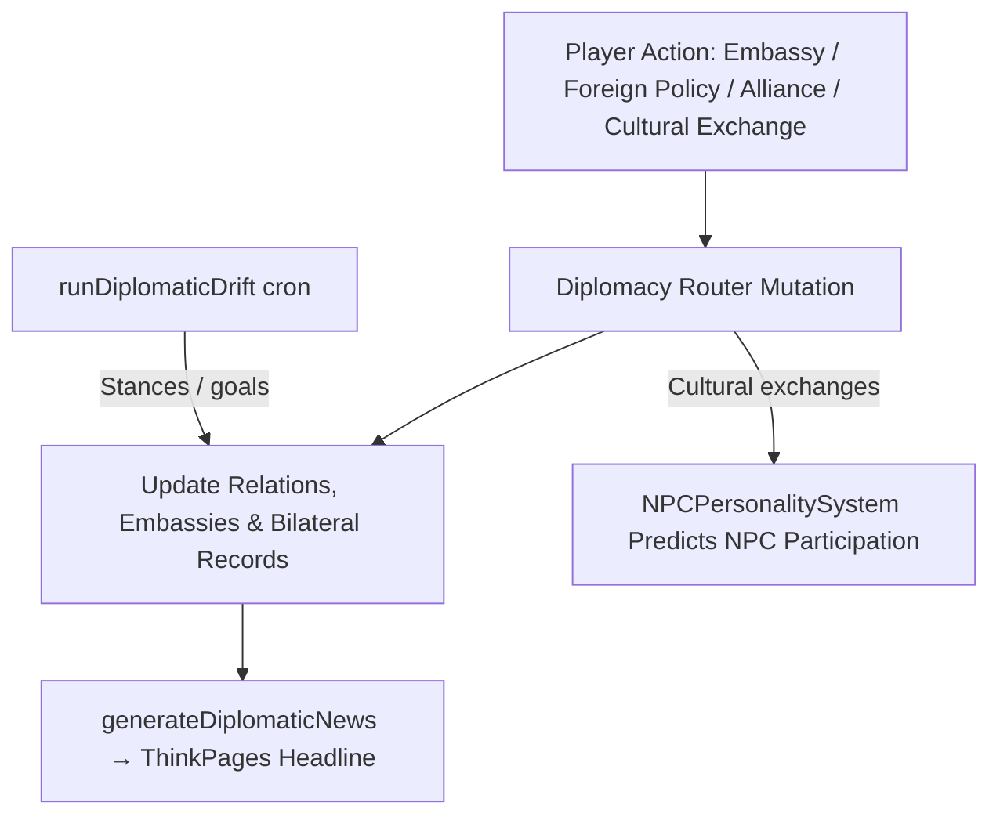

# 🏛️ MyCountry Diplomacy Domain

**Parent App Suite:** MyCountry Suite (`MYCOUNTRY_VERSION = 6`)  
**Engine:** Concord Living-World Simulation Engine (`CONCORD_ENGINE_VERSION = 2`)  
**Primary Action:** `ALLIED` | **Domain Accent:** Cyan Blue (`#06B6D4` / `--color-cyan-500`)  
**Route:** `/mycountry/diplomacy` (Diplomacy Domain) | **Status:** 🟡 Partial: see [SYSTEM_STATUS.md](SYSTEM_STATUS.md); embassies, stances, cultural exchange and consent-based proposals / alliance invites (Diplomacy Inbox) work  

The diplomacy domain handles international relations, embassy networks, cultural exchanges, multilateral alliances, foreign policy actions, diplomatic scenarios, and NPC reactions to cultural exchanges. Direct diplomatic communications route through **ThinkShare** (`/messages`).

---

## Architecture & Surfaces

### UI Surfaces
- `src/components/mycountry/shell/DomainSurface.tsx` (Diplomacy Domain) – Full-screen diplomacy view rendering `EmbassiesAndRelationsPanel`
- `src/components/mycountry/shell/rails/RelationsRail.tsx` – Relations context rail with fogged foreign intel (`src/lib/statecraft/diplo-intel.ts`)
- `src/components/mycountry/shell/DrillSheets.tsx` – Slide-over relations sheet
- `src/components/mycountry/domains/diplomacy/` – Embassy network (`embassy-network/`, `EmbassyCreatorSheet`, `EmbassyDetailSheet`), relations list, cultural exchange wizard/program, `DiplomaticEventsHub`, `ScenarioModal`, shared data
- `src/components/mycountry/domains/diplomacy/alliances/` – `AllianceDashboard`, `CollectiveActionsPanel` (alliance creation via `AllianceCreatorSheet`)
- `src/components/mycountry/domains/diplomacy/inbox/` – `DiplomacyInbox` (the owner-only **Inbox** tab of `EmbassiesAndRelationsPanel`), `useDiplomacyInboxCount`, and the `InboxCountPill` count badge shown on the Diplomacy entries of `shell/headers/UnifiedGlassCommandBar.tsx` and on the Inbox tab

### Backend Routers
- `src/server/api/routers/diplomacy/core/` (`diplomaticCore`) – Relationships, stances (`setDiplomaticGoal`), follows, shared data, diplomatic options
- `src/server/api/routers/diplomacy/embassies/` (`diplomaticEmbassies`) – Establish, close, reopen, delete, profile, establishment cost
- `src/server/api/routers/diplomacy/cultural/` (`diplomaticCultural`) – Cultural exchanges, artifacts, votes, scenarios, NPC responses
- `src/server/api/routers/diplomacy/policies/` (`diplomaticPolicies`) – Foreign policy actions and alliances (create, invite, leave, collective actions, votes)
- `src/server/api/routers/diplomaticScenarios/` – Scenario templates and player choices
- `src/server/api/routers/npcPersonalities/` – NPC personality admin CRUD and assignment
- `src/server/api/routers/thinkpages/` & `src/server/api/routers/messages/` – ThinkShare unified messaging

---

## Data Models

Defined in `prisma/schema/diplomacy.prisma`:
- `DiplomaticRelation`: Bilateral relationship (`relationship` label, `strength` 0–100, `status`, per-side goals/stances)
- `Embassy`: Diplomatic mission with level, budget, influence, and reputation
- `EmbassyMission`: Mission records (cost, influence/reputation rewards) — no player-facing mission procedure is currently exposed
- `CulturalExchange` (+ participants, artifacts, scenarios, outcomes, votes): Bilateral cultural programs
- `ForeignPolicyAction`, `BilateralTrade`, `Alliance` (+ members, actions, votes, documents)
- `DiplomaticEvent`: Timestamped historical record of treaties, expulsions, summits, and sanctions

---

## Core Diplomatic Engines

```mermaid
graph TD
    A[Player Action: Embassy / Foreign Policy / Alliance / Cultural Exchange] --> B[Diplomacy Router Mutation]
    B --> C[Update Relations, Embassies & Bilateral Records]
    B -->|Cultural exchanges| D[NPCPersonalitySystem Predicts NPC Participation]
    C --> E[generateDiplomaticNews → ThinkPages Headline]
    F[runDiplomaticDrift cron] -->|Stances / goals| C
```

### 1. Relation Drift & Stances (`src/lib/diplomacy/drift-cron.ts`)
Each side can set a diplomatic goal ("stance") via `diplomaticCore.setDiplomaticGoal`; the scheduled `runDiplomaticDrift` job nudges relationship strength toward those goals. `src/lib/diplomacy/relation-bands.ts` maps raw strength to qualitative standing bands (shown on embassy cards), and `relative-development.ts` labels economic asymmetry between partners.

### 2. NPC Personality-Driven Auto-Response (`src/lib/diplomacy/npc-personality.ts`)
Computes 8 core traits (Assertiveness, Cooperativeness, Economic Focus, Cultural Openness, Risk Tolerance, Ideological Rigidity, Militarism, Isolationism) mapping to 6 behavioral archetypes. Today it predicts NPC participation in cultural exchanges (`diplomaticCultural.getNPCCulturalResponses`, `src/lib/diplomacy/npc-cultural-participation.ts`). See [NPC AI](./npc-ai.md).

### 3. Consent-based proposals & the Diplomacy Inbox
Cooperative foreign-policy actions (`free_trade`, `military_alliance`; `COOPERATIVE_FP_TYPES` in `src/lib/diplomacy/proposal-lifecycle.ts`) and alliance invites need the other side's consent. Hostile actions (`embargo`, `sanction`, `blockade`) are unilateral and enacted immediately.

| Step | Foreign-policy proposal (`ForeignPolicyAction`) | Alliance invite (`AllianceMember`) |
|---|---|---|
| Issue | `proposeForeignPolicyAction` → `status: "proposed"`, no effects yet | `inviteMember` (founder/leader) → inactive row, `status: "invited"`, records `invitedByCountryId` + `invitedAt` |
| Incoming list (target's owner) | `getForeignPolicyProposals` | `getAllianceInvites` (includes `invitedBy`) |
| Outgoing list (proposer's owner) | `getOutgoingForeignPolicyProposals` | `getOutgoingAllianceInvites` |
| Answer (target's owner) | `respondToForeignPolicyProposal` → `active` (effects applied) or `declined` | `respondToAllianceInvite` → member (`active`) or `declined` |
| Withdraw (proposer's owner) | `withdrawForeignPolicyProposal` → `withdrawn` | `withdrawAllianceInvite` → `withdrawn` |

- **Authorisation:** lists, answers and withdrawals go through `assertCountryWriteAccess` on the relevant country (target for answers, proposer for withdrawals). Invites issued before `invitedByCountryId` existed are treated as issued by the alliance's active founder/leaders.
- **Expiry:** pending items expire `PROPOSAL_TTL_DAYS` = 14 real days after issue (`createdAt` for proposals; `invitedAt`, falling back to `updatedAt`, for invites). Expiry is lazy: lists (including the public `getActiveForeignPolicies`) hide stale items, the inbox lists also mark them `expired`, answering or withdrawing a stale item marks it `expired` and fails with "…expired on YYYY-MM-DD without an answer", and a stale item no longer blocks a fresh proposal/invite. The `diplomatic-drift` cron also sweeps all stale items (`expireStaleDiplomaticProposals`, reported as `proposalsExpired` / `invitesExpired`) when that job is enabled. Every list result carries `expiresAt`.
- **Notifications** (`policies/notify.ts`, via `notificationAPI.create`, keyed on the owner's Clerk user id, `href: /mycountry/diplomacy`, gated by the `onDiplomaticEvent` notification toggle): the target's owner is notified when a proposal or invite arrives; the proposer's owner (for legacy invites, the alliance's founder/leaders) when it is accepted or declined. Failures are logged and never fail the mutation. Withdrawals and expiry send no notification.
- **UI:** the Inbox tab lists Incoming items with Accept / Decline and Outgoing items with their pending status, time left and Withdraw, with loading, empty and error (retry) states. It opens automatically once when something is waiting. Proposals are made from another nation's profile actions menu; invites from `AllianceDashboard`.

### 4. Unified Messaging (ThinkShare)
Diplomatic channels are `ThinkshareConversation` / `DiplomaticChannel` records carrying security classifications (`PUBLIC` → `TOP_SECRET`), message signatures, and encryption flags.

---

## Known Gaps

- **Proposal outcomes are not kept as history in the inbox.** Outgoing lists show pending items only; the proposer learns of an accept/decline through the notification. Expiry and withdrawal are not notified.
- **Proposing still uses the acting country** (`ctx.user.countryId`) rather than an explicit country id, so a player who owns several countries proposes as whichever one they are currently acting as.
- **Shared data is synthesised** and the cultural-exchange analysis shows randomised percentages in the UI.
- Embassy missions and upgrades were deleted (plan 312); no mission is playable.

---

## Related Documentation

- [NPC AI & Personality System](./npc-ai.md)
- [Crisis Events Management](./crisis-events.md)
- [Social & Collaboration System](./social.md)
- [MyCountry Command Suite](./mycountry.md)
- [API Reference: Diplomacy Routers](../reference/api-complete.md#intelligence--diplomacy)
