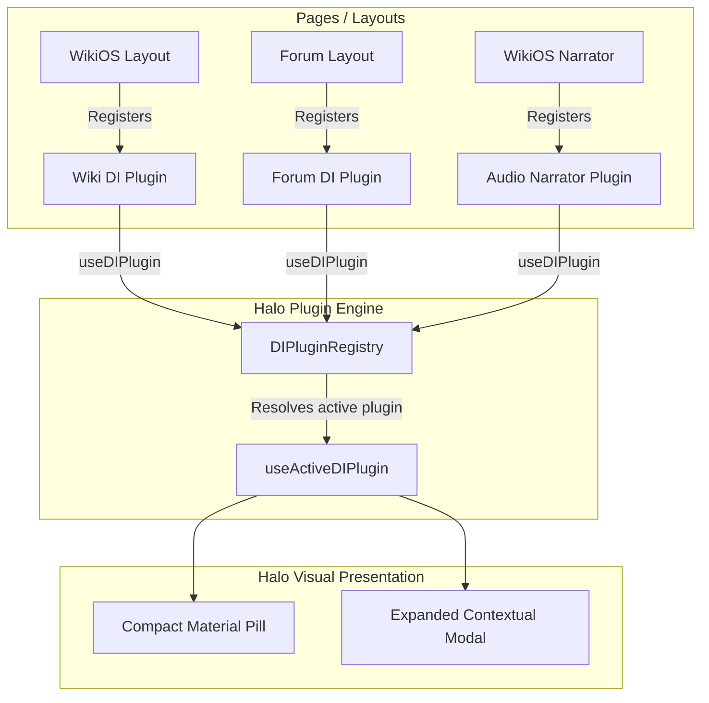

# Halo Plugin System

**Last updated:** August 2026  
**Status:** Production Ready (Beta) — Halo v4  
**Hierarchy:** Core Feature System (`HALO_VERSION = 4` in Version Registry). Global contextual overlay and wayfinding suite.

> **Naming & Identifiers:** **Halo** is the canonical brand name (formerly "Dynamic Island"). Code identifiers intentionally retain the `DI*` prefix (`src/components/halo/`, `useDIPlugin`, `types.ts`, `DIPlugin`, `DIAction`, `DIBadge`) to prevent wide merge churn across active branches.

Halo is the central interactive overlay element for IxStates. To support diverse application contexts (WikiOS, Forum, MyCountry, Onoma Lab) without hardcoded route branching, the system employs a **plugin-driven external store architecture**.

---

## Architecture Overview

Pages or layouts register their custom plugins on mount. Halo uses `useSyncExternalStore` in `src/components/halo/plugin-context.tsx` to ensure thread-safe concurrent reactivity across React 19 rendering paths, resolving dynamically to the active plugin with the highest priority.



---

## Core Interfaces (`src/components/halo/types.ts`)

### `DIPlugin`
```typescript
export interface DIPlugin {
  id: string;                                                        // Unique identifier (e.g. "wiki", "forum", "narrator")
  priority?: number;                                                 // Priority weight (highest priority active plugin renders)
  center?: React.ReactNode;                                          // Custom component replacing the default clock/greeting
  actions?: DIAction[];                                              // Action buttons on the pill's right rail
  expandedViews?: Record<string, React.ComponentType<DIViewProps>>;    // Modal components rendered when expanded
  badge?: DIBadge;                                                   // Colored status dot or pulsing activity badge
  accentColor?: string;                                              // Underline accent border color
  stickyLabel?: string;                                              // Wayfinding label shown when sticky
}
```

### `DIAction` & `DIBadge`
```typescript
export interface DIAction {
  id: string;
  icon: React.ComponentType<{ className?: string }>;
  label: string;
  onClick: () => void;
  badge?: number; // Notification count badge
}

export interface DIBadge {
  color: string;
  pulse?: boolean;
}
```

---

## Active Reference Plugins (`src/components/halo/plugins/`)

### 1. WikiDIPlugin (`WikiDIPlugin.tsx`)
- **Article Mode**: Displays current wiki breadcrumbs, article word count, and enables click-to-expand to open the rich `WikiView` modal.
- **Root/Special Mode**: Renders `WikiProfileButton` which pops open user contribution stats and recent edit history.

### 2. ForumDIPlugin (`ForumDIPlugin.tsx`)
- Displays current thread/category breadcrumbs.
- Activates an animated orange pulsing badge (`#f97316`) when unread forum alerts are detected.

### 3. Audio Narrator Plugin (Onoma / WikiOS)
- **Pill-Center Equalizer**: Renders a live bouncing waveform visualizer during Kokoro TTS playback.
- **Scrubber & Controls**: In expanded view, provides interactive playhead seeking, skip/pause triggers, and section-by-section heading jumps.

---

## Nesting Safety & HTML Compliance

- **Click-to-Expand Containers**: If a plugin supplies `expandedViews`, Halo automatically wraps the center component in a click-to-expand `<button>`.
- **Interactive Centers**: If a plugin's `center` contains its own interactive buttons or popover triggers (e.g. `WikiProfileButton`), `expandedViews` must be omitted (`undefined`), allowing Halo to render `center` directly without generating invalid nested `<button>` elements in the DOM.

---

## Related Documentation

- [WikiOS System Guide](./wikios.md)
- [Onoma Voice & Speech Guide](./onoma-voice-guide.md)
- [Forum Integration](./forum.md)
- [Facet Design System](../reference/facet-design-system.md)
