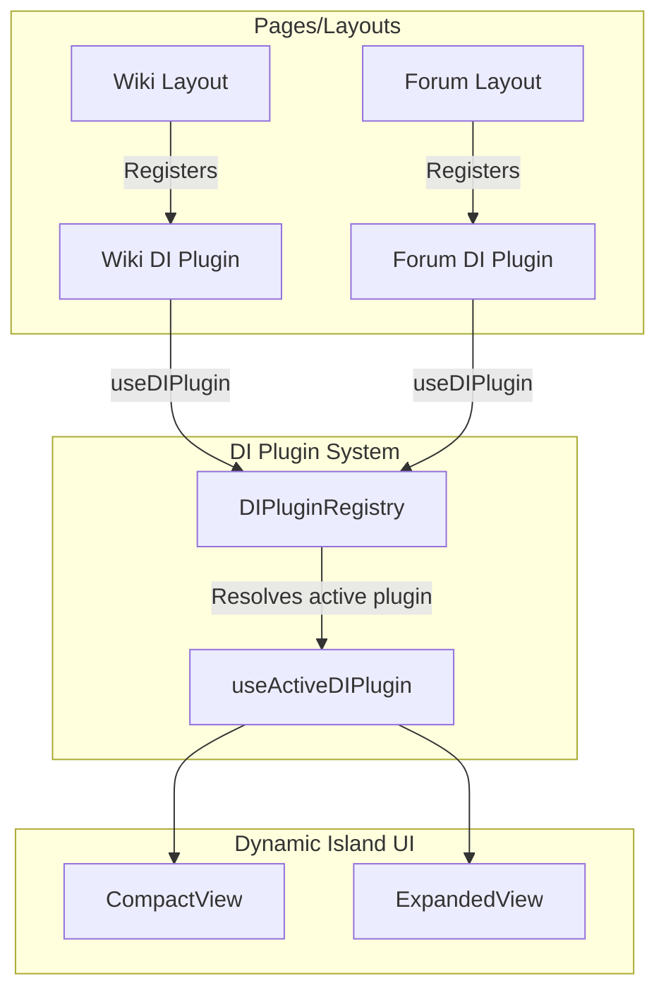

# Dynamic Island Plugin System

The Dynamic Island (DI) is the central, interactive user interface element for the IxStats platform. To support multiple application contexts (such as WikiOS, Forums, and MyCountry) without bloating the core DI codebase with path-specific conditional checks, the system implements a **plugin-driven architecture**.

---

## Architecture Overview

Instead of checking the current pathname or using hardcoded switches internally, the Dynamic Island reads its layout, actions, expanded views, and custom styling from a centralized plugin context. Pages or layouts register their plugins on mount, and the DI dynamically resolves to the active plugin with the highest priority.



---

## Core Interfaces

The core interfaces are defined in [types.ts](file:///ixwiki/public/projects/ixstats/src/components/DynamicIsland/types.ts).

### `DIPlugin`

A plugin registration object contains optional configurations to override or inject content into the DI.

```typescript
export interface DIPlugin {
  id: string;                                                      // Unique plugin ID (e.g. "wiki", "forum", "mycountry")
  priority?: number;                                               // Priority value (higher priority wins if multiple are registered)
  center?: React.ReactNode;                                        // Renders in place of the default clock/greeting
  actions?: DIAction[];                                            // Extra action buttons on the pill's right-hand side
  expandedViews?: Record<string, React.ComponentType<DIViewProps>>;  // Custom expanded modal views
  badge?: DIBadge;                                                 // Dot indicator badge on the pill
  accentColor?: string;                                            // Underline accent border color (visible when sticky)
  stickyLabel?: string;                                            // Wayfinding text label shown in sticky mode
}
```

### `DIAction`

Represents a button that will be rendered on the right side of the compact pill next to the default Search and Bell buttons.

```typescript
export interface DIAction {
  id: string;
  icon: React.ComponentType<{ className?: string }>;
  label: string;
  onClick: () => void;
  badge?: number;                                                  // Numerical notification count badge on the button
}
```

### `DIBadge`

Displays a small colored dot on the pill itself (often pulsing to denote real-time activity).

```typescript
export interface DIBadge {
  color: string;
  pulse?: boolean;
}
```

---

## State Management and Lifecycle

The DI plugin state is managed in [plugin-context.tsx](file:///ixwiki/public/projects/ixstats/src/components/DynamicIsland/plugin-context.tsx) using an external store pattern (`useSyncExternalStore`) to guarantee thread safety and reactivity across React 19's concurrent rendering paths.

### 1. Registration

Any page or layout can hook into the Dynamic Island using the `useDIPlugin` hook.

```typescript
import { useDIPlugin } from "~/components/DynamicIsland/plugin-context";
import { MyCustomView } from "./MyCustomView";

export function MyPageLayout({ children }) {
  useDIPlugin({
    id: "my-plugin",
    priority: 10,
    center: <span className="text-xs">My Context Title</span>,
    expandedViews: { main: MyCustomView },
    accentColor: "#10b981", // emerald
    stickyLabel: "My Page",
  });

  return <>{children}</>;
}
```

### 2. Active Plugin Resolution

The `useActiveDIPlugin` hook retrieves all registered plugins and selects the one with the highest `priority`. If multiple plugins are active, the highest priority plugin wins. If no plugin is registered, the Dynamic Island falls back to the default platform state (clock, greeting popover, and standard search).

---

## Interactive Elements and Nesting Safety

When designing a plugin's `center` component, be mindful of HTML validation rules:
- **Clickable Plugins**: If a plugin defines `expandedViews`, the DI automatically wraps the `center` component in a click-to-expand `<button>`. Clicking the center of the pill will switch the view mode to `plugin:<firstViewKey>` (e.g. `plugin:wiki`).
- **Interactive Centers**: If a plugin's `center` itself contains interactive elements (such as `WikiProfileButton` which triggers a `<Popover>`), the plugin should **not** provide `expandedViews`. When `expandedViews` is undefined or empty, the DI renders the `center` directly without wrapping it in a `<button>`, avoiding illegal nested interactive elements in the DOM.

---

## Reference Implementations

### 1. WikiDIPlugin

Located in [WikiDIPlugin.tsx](file:///ixwiki/public/projects/ixstats/src/components/DynamicIsland/plugins/WikiDIPlugin.tsx). The Wiki plugin adapts dynamically to whether the user is viewing a specific article:

- **Article view**: Displays the article breadcrumbs and enables click-to-expand to open the custom `WikiView` expanded modal.
- **Root/Special view**: Displays a custom `WikiProfileButton` which pops open the wiki user profile stats and recent article history, and disables the expanded modal.

```typescript
export function WikiDIPlugin() {
  const { articleTitle } = useWikiContext();

  const plugin = useMemo(
    () => ({
      id: "wiki",
      priority: 10,
      center: articleTitle ? <WikiBreadcrumb /> : <WikiProfileButton />,
      expandedViews: articleTitle ? { wiki: WikiView } : undefined,
      accentColor: "#3b82f6",
      stickyLabel: "Wiki",
    }),
    [articleTitle]
  );

  useDIPlugin(plugin);
  return null;
}
```

### 2. ForumDIPlugin

Located in [ForumDIPlugin.tsx](file:///ixwiki/public/projects/ixstats/src/components/DynamicIsland/plugins/ForumDIPlugin.tsx). The Forum plugin displays the thread or forum room breadcrumbs and activates a pulsing orange badge whenever there are unread forum alerts.

```typescript
export function ForumDIPlugin() {
  const { unreadAlerts } = useForumContext();

  const plugin = useMemo(
    () => ({
      id: "forum",
      priority: 10,
      center: <ForumBreadcrumb />,
      expandedViews: { forum: ForumView },
      accentColor: "#f97316",
      stickyLabel: "Forum",
      badge: unreadAlerts > 0 ? { color: "#f97316", pulse: true } : undefined,
    }),
    [unreadAlerts]
  );

  useDIPlugin(plugin);
  return null;
}
```
