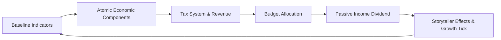

# 🏛️ MyCountry Economy Domain & Fiscal Engine

**Parent App Suite:** MyCountry Suite (`MYCOUNTRY_VERSION = 5`)  
**Engine:** Statecraft Simulation Engine (`MYCOUNTRY_ENGINE_VERSION = 4`)  
**Primary Action:** `SIMULATE` | **Domain Accent:** Emerald Green / Amber Gold  
**Route:** `/mycountry` (Economy Domain) | **Status:** 📀 Gold Master (100% Ready)  

The Economy system models macroeconomic output, 42-tax bracket fiscal policy, sector performance, labor dynamics, trade flows, and long-range statistical projections.

---

## Architecture & Surface Integration

### UI Surfaces
- `src/components/mycountry/DomainSurface.tsx` (Economy Domain) – Macroeconomic overview, sector distribution, fiscal surplus/deficit, and trade balances
- `src/components/mycountry/DrillSheets.tsx` – Slide-over economic policy sheet and tax structure editor
- `src/components/economy/` – Macro indicators, GDP trend charts, sector composition donuts, growth projections
- `src/components/modals/metric-details/` – BaseMetricDetailsModal system for GDP, Labor, Debt, Government Spending deep dives
- `src/components/analytics/TrendRiskAnalytics.tsx` – Multi-indicator risk analysis visualizations

### Backend Routers
- `src/server/api/routers/economics/` (`index.ts`, `indicators.ts`, `projections.ts`, `history.ts`) – Country indicators, forecast series, and historical growth points
- `src/server/api/routers/atomicEconomic.ts` – Economic policy component catalog and impact modifiers
- `src/server/api/routers/economicComponents/` – Component CRUD and synergy matching
- `src/server/api/routers/economicArchetypes/` – 12+ macro templates (Free Market, Nordic, Developmental State, etc.)
- `src/server/api/routers/taxSystem/` & `src/server/api/routers/atomicTax.ts` – 42 tax components, bracket calculations, and revenue models
- `src/server/api/routers/formulas.ts` – Calculation utility endpoints
- `src/server/api/routers/resources.ts` & `src/server/api/routers/transport.ts` – Resource endowments and transport infrastructure

---

## Data Models

Defined across `prisma/schema/economy.prisma`:
- `EconomicIndicator`: Current snapshot of GDP, GDP per capita, growth rate, inflation, unemployment, Gini coefficient
- `EconomicHistory`: Immutable time-series data points recording macroeconomic progress
- `EconomicProjection`: 5–10 year forecasts factoring active policies, synergies, and trade network multipliers
- `TaxPolicy`: Configured progressive income, corporate, consumption, and wealth tax structures
- `LaborMetric`: Workforce participation, sector breakdowns, minimum wage, and unionization rates
- `TradeBalance`: Import/export flows, tariffs, and bilateral trade agreements

---

## Core Economic Loops

1. **Growth Computation**: Evaluates tier-based growth caps, diminishing returns ($>\$60\text{k}$), active policy multipliers, and embassy trade bonuses.
2. **Fiscal Balancing**: Computes total revenue against department budgets, calculating national surplus/deficit and debt-to-GDP accumulation.
3. **Vault Integration**: Economic health and budget weights feed directly into the daily dividend calculation (`vaultService.earnCredits`), rewarding sound economic management.
4. **Legibility & Auditing**: Any stat adjustment is logged to the persistent `CountryChangeLogTimeline`, making all growth auditable.

---

## Related Documentation

- [Economic & Statistical Calculations](./calculations.md)
- [IxCredits Economy & Earning Architecture](./ixcredits.md)
- [Builder System](./builder.md)
- [MyCountry Command Suite](./mycountry.md)
- [API Reference: Economics Routers](../reference/api-complete.md#economics-router)
