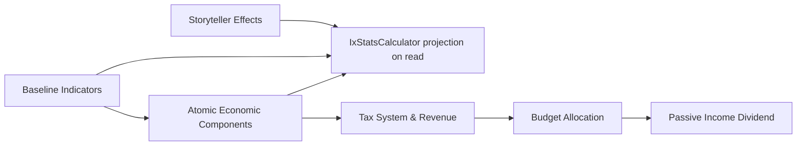

# 🏛️ MyCountry Economy Domain & Fiscal Engine

**Last updated:** 2026-09-30

**Parent App Suite:** MyCountry Suite (`MYCOUNTRY_VERSION = 6`)  
**Engine:** Statecraft Simulation Engine (`MYCOUNTRY_ENGINE_VERSION = 4`)  
**Primary Action:** `SIMULATE` | **Domain Accent:** Amber Gold (MyCountry; status colours only otherwise)  
**Route:** `/mycountry/economy` (Economy Domain) | **Status:** 🟡 Partial: see [SYSTEM_STATUS.md](SYSTEM_STATUS.md); economy decisions largely do not reach the headline stats  

The Economy system models macroeconomic output, fiscal policy built from 42 atomic tax components, sector performance, labor dynamics, trade flows, and long-range statistical projections.

---

## Architecture & Surface Integration

### UI Surfaces
- `src/components/mycountry/shell/DomainSurface.tsx` → `EconomyDrillDown.tsx` (Economy Domain) – Budget management dashboard, infrastructure maintenance, fiscal and trade consoles
- `src/components/mycountry/shell/DrillSheets.tsx` – Slide-over economy sheet (same `EconomyDrillDown`)
- `src/components/mycountry/shell/FiscalPolicyConsole.tsx` + `fiscal/` – Tax rates, revenue projections, fiscal insights
- `src/components/mycountry/shell/TradeCommerceConsole.tsx` + `trade-commerce/` – Tariffs, trade partners, trade impact
- `src/components/mycountry/domains/economy/` – Atomic economic component library and metric modals
- `src/components/mycountry/shared/modals/metric-details/` – `BaseMetricDetailsModal` system for GDP, Population, Labor, Debt, Demographics, Government Spending deep dives
- `src/app/countries/[slug]/modeling/` – Public what-if modeling engine (`EconomicModelingEngine`)

### Backend Routers
- `src/server/api/routers/economics/` (`builder.ts`, `config.ts`, `fiscal.ts`, `profile.ts`) – Economy builder state, economy configuration, fiscal system and economic profile updates
- `src/server/api/routers/historical/` – Historical growth points (`HistoricalDataPoint`)
- `src/server/api/routers/economicComponents/` – Admin component CRUD and synergy records
- `src/server/api/routers/economicArchetypes/` – Archetype CRUD/usage; 20 built-in presets (10 modern + 10 historical) live in `src/lib/economy/archetypes/`
- `src/server/api/routers/taxSystem/` – Tax system records, bracket calculations, and revenue analysis; the 42 atomic tax components are defined in `src/lib/government/tax/atomic-tax-components.ts`
- `src/server/api/routers/formulas.ts` – Calculation utility endpoints
- `src/server/api/routers/resources.ts` & `src/server/api/routers/transport.ts` – Resource endowments and transport infrastructure

---

## Data Models

Defined across `prisma/schema/economy.prisma` (selection):
- `EconomicProfile`, `LaborMarket`, `FiscalSystem`, `IncomeDistribution`, `GovernmentBudget`, `Demographics`: Per-country economy configuration
- `EconomicIndicator`: Snapshot of GDP, GDP per capita, growth rate, inflation, unemployment
- `HistoricalDataPoint` / `VitalityHistory`: Time-series records for trend charts
- `EconomicModel`, `SectoralOutput`, `PolicyEffect`: Modeling scenarios and projections
- `TaxSystem`, `TaxCategory`, `TaxBracket`, `TaxExemption`, `TaxDeduction`, `TaxPolicy`, `TaxCalculation`: Tax structure
- `EconomicComponent`, `TaxComponent`, `CrossBuilderSynergy`, `EconomicArchetype`: Atomic components and presets
- Trade: `BilateralTrade` (in `prisma/schema/diplomacy.prisma`)

---

## Core Economic Loops

```mermaid
graph LR
    A[Baseline Indicators] --> B[Atomic Economic Components]
    B --> G[IxStatsCalculator projection on read]
    A --> G
    S[Storyteller Effects] --> G
    B --> C[Tax System & Revenue]
    C --> D[Budget Allocation]
    D --> E[Passive Income Dividend]
```

There is no growth tick and no loop back into the baseline. Headline population and GDP are a projection computed on read by `IxStatsCalculator` (`src/lib/economy/calculations.ts`, `countries/economy.ts`) from the baseline, `baselineDate`, the adjusted growth inputs and `StorytellerEffect` rows. The `stat-progression` cron job (`src/server/cron/stat-progression.ts`, every 6 h at :23, off unless listed in `CRON_ENABLED_JOBS`; schedule override `cronSchedule_statProgression`) persists that same projection into the stored `current*` columns (population, GDP per capita, total GDP, tiers, densities, `lastCalculated`) for every country, so rankings, vitality and passive income read the numbers MyCountry shows. It walks countries in id-cursor batches of 50, skips a country whose stored stats already match (relative tolerance 1e-6, same tiers), never writes a `baseline*` column, and writes one `HistoricalDataPoint` per country per IxTime month (skipped when the month already has one, so reruns are idempotent). The admin `forceRecalculation` (`admin/system.ts`) runs the same job with every country written, under the same `stat-progression` job lock. The projection itself is shared through `projectCountryStats` / `projectedStatsUpdate` in `src/server/shared/country-helpers.ts`. `countries.getByIdWithEconomicData` still synthesises its 5-year history when fewer than 5 points exist; that stops once the job has written 5 months of points. Tax rates (`economics.updateFiscalSystem`), budget allocation and the fiscal calculators do not feed GDP growth. The tax to budget to dividend chain above is a separate reporting path.

1. **Growth Computation**: Evaluates tier-based growth caps, diminishing returns ($>\$60\text{k}$), active policy multipliers, and embassy trade bonuses.
2. **Fiscal Balancing** (reference calculation): Computes total revenue against department budgets, calculating national surplus/deficit and debt-to-GDP accumulation.
3. **Vault Integration**: Economic health and budget weights (`BudgetVaultCalculator`, `src/lib/economy/budget-vault-calculator.ts`) feed the passive-income cron (`passive-income-distribution-cron.ts` → `vaultService.earnCreditsOnce`), rewarding sound economic management.
4. **Decisions → GDP**: Growth directives (`intent.commit`) add a `gdp_level_adjustment` effect worth the growth their modifier would add at a 3% reference rate over 1 IxTime year (`growthModifierToLevelShift`). National-issue consequences on GDP, GDP per capita, population and GDP growth (`actualGdpGrowth`) become `gdp_level_adjustment` / `population_level_adjustment` effects (`src/lib/national-issues/projection-effects.ts`); see [calculations](./calculations.md#level-effects-national-issue-consequences-and-directives).
5. **Legibility & Auditing**: Stat adjustments routed through `CountryEventSpine` are logged to `CountryChangeLog` and surfaced in the MyCountry canon feed (`mycountry.getCanonFeed`).

---

## Related Documentation

- [Economic & Statistical Calculations](./calculations.md)
- [IxCredits Economy & Earning Architecture](./ixcredits.md)
- [Builder System](./builder.md)
- [MyCountry Command Suite](./mycountry.md)
- [API Reference: Economics Routers](../reference/api-complete.md#government--economics)
