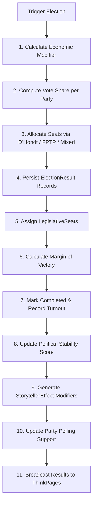

# 🏛️ MyCountry Politics, Elections & Legislature Domain

**Parent App Suite:** MyCountry Suite (`MYCOUNTRY_VERSION = 5`)  
**Engine:** Statecraft Simulation Engine (`MYCOUNTRY_ENGINE_VERSION = 4`)  
**Primary Action:** `ELECT` | **Domain Accent:** Imperial Purple / Amber Gold  
**Route:** `/mycountry` (Politics Domain) | **Status:** 📀 Gold Master (100% Ready)  

Elections, political parties, and legislature management form the parliamentary governance simulation layer of MyCountry. Sovereign states configure unicameral/bicameral chambers, manage political parties, and simulate elections with algorithmic D'Hondt or FPTP seat allocations.

---

## Overview

| Feature | Description |
| :--- | :--- |
| **Political Parties** | Create and manage parties with ideology spectrum, colors, leadership, and polling support ratings |
| **Legislature Config** | Unicameral/bicameral chambers, 10–1,000 seats, configurable term lengths, and voting thresholds |
| **Electoral Systems** | D'Hondt proportional representation, First-Past-The-Post (FPTP), or Mixed-Member allocation |
| **Election Simulation** | 11-step algorithmic vote tally with economic modifiers, charisma swings, and random variance |
| **Hemicycle Visualizer** | Interactive SVG parliament seat chart rendered dynamically from `LegislativeSeat` records |
| **Government Impact** | Election decisiveness updates political stability, democracy index, and economic growth modifiers |

---

## Key Files & Routers

### Router
- `src/server/api/routers/elections/` (`index.ts`, `parties.ts`, `legislature.ts`, `simulation.ts`) – Split tRPC router with 13 procedures for full political lifecycle management

### UI Components
- `src/components/executive/politics/PoliticsOverview.tsx` – Main politics and parliamentary dashboard
- `src/components/executive/politics/PartyManager.tsx` – Party creation, ideology spectrum positioning, and polling editor
- `src/components/executive/politics/LegislatureConfig.tsx` – Chamber type, seat count, and electoral system setup
- `src/components/executive/politics/ElectionSimulator.tsx` – Interactive election trigger with outcome review
- `src/components/executive/politics/ParliamentHemicycle.tsx` – Hemicycle seat visualization with party colors and tooltip breakdowns
- `src/components/executive/politics/LegislaturePanel.tsx` – Seat distribution tables and coalition indicators
- `src/components/executive/politics/CabinetPanel.tsx` – Ministerial appointments and department allocations

### Pages
- `src/app/mycountry/politics/page.tsx` – Politics sub-page within MyCountry
- `src/app/help/mycountry/politics/page.tsx` – Player help guide

---

## 11-Step Simulation Algorithm

1. **Economic Modifier**: GDP growth boosts incumbents (up to $+10\%$), recession penalizes (up to $-15\%$).
2. **Per-Party Vote Share**: Base support $\pm$ economic modifier $\pm$ charisma swing ($\pm 5\%$) $\pm$ random variance ($\pm 7.5\%$).
3. **Seat Allocation**: D'Hondt (proportional), FPTP (plurality), or Mixed (50/50).
4. **Result Persistence**: Writes per-candidate vote tallies and seats won to `ElectionResult`.
5. **Seat Assignment**: Updates individual `LegislativeSeat` records with winning party IDs.
6. **Margin Calculation**: Computed from top-two party vote percentages.
7. **Status Update**: Election marked `completed` with voter turnout and margin recorded.
8. **Stability Shift**: Decisive victory boosts stability ($+0.05$); fragmented/hung parliament reduces it ($-0.05$ to $-0.10$).
9. **Storyteller Effects**: Generates economic growth modifier based on election certainty.
10. **Polling Sync**: Updates `PoliticalParty.currentSupport` to match realized vote share.
11. **Auto-News Broadcast**: Publishes full election bulletin to ThinkPages via the diplomatic news generator.

---

## Database Models

Defined in `prisma/schema/government.prisma`:
- `PoliticalParty`: Name, abbreviation, ideology (`far_left` to `far_right`), color, leader, `currentSupport`
- `Legislature`: Chamber type, total seats, electoral system, term length
- `LegislativeSeat`: Seat index, chamber, assigned party ID
- `Election`: Type, scheduled date, completed date, status, turnout, margin
- `ElectionCandidate`: Candidate name, party affiliation, district
- `ElectionResult`: Candidate votes, percentage, seat outcome

---

## Related Documentation

- [MyCountry Command Suite](./mycountry.md)
- [Government Components & Synergies](../SYNERGY_REFERENCE.md)
- [Social & Collaboration System](./social.md)
- [API Reference: Elections Router](../reference/api-complete.md#elections-router)
