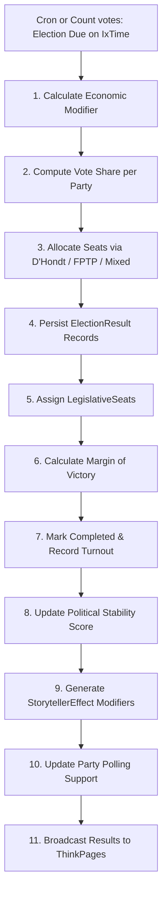

# 🏛️ MyCountry Politics, Elections & Legislature Domain

**Parent App Suite:** MyCountry Suite (`MYCOUNTRY_VERSION = 6`)  
**Engine:** Statecraft Simulation Engine (`MYCOUNTRY_ENGINE_VERSION = 4`)  
**Primary Action:** `ELECT` | **Domain Accent:** Imperial Purple / Amber Gold  
**Route:** `/mycountry/politics` (Politics Domain) | **Status:** 🟡 Partial: the full loop works (setup → first election → seated parties → bills), but elections resolve only when the `elections` cron is enabled or the owner counts a due election (see [SYSTEM_STATUS.md](SYSTEM_STATUS.md))  

Elections, political parties, and legislature management form the parliamentary governance simulation layer of MyCountry. Sovereign states configure unicameral/bicameral (or custom multi-chamber) legislatures, manage political parties, table Bills, and have elections resolved on the IxTime clock with D'Hondt, FPTP, or mixed seat allocation.

## Election lifecycle (MC-2)

`src/lib/government/election-lifecycle.ts` connects setup to a seated chamber:

1. **Scheduling** (`ensureUpcomingElection`). Once a country has a legislature and at least `MIN_ELECTION_PARTIES` (2) active parties, it gets an upcoming election. The first one is held `FIRST_ELECTION_DELAY_IX_DAYS` (30) IxTime days after setup. This is called by:
   - `configureLegislature`. The chamber's seats are recreated vacant, so this call is a *snap* one: any upcoming election further out than the 30-day window is pulled forward and renamed "Snap Election".
   - `createParty`, and `updateParty` when a party is re-activated.
   - The `elections` cron sweep, for every legislature with no election queued. This covers nations set up before MC-2 and any follow-up that is missing.
2. **Candidates** (`syncElectionCandidates`). When the polls close, every active party of the country is put on the ballot as one list candidate: its leader's name, or "<party> list" if it has no leader. Charisma is left at the neutral default. Candidates of parties that have gone inactive are dropped.
3. **Resolution** (`resolveElection`). The election is claimed (`upcoming` → `voting`) so the cron and the owner's button cannot count it twice. It is then counted with the shared `simulateElectionCore`, which seats `LegislativeSeat.partyId` by vote share. Finally the next general election is queued one term later, never in the past. If the election cannot resolve (fewer than 2 parties) or throws, the claim is released back to `upcoming` and a later pass retries.
4. **Bills.** With seats carrying parties, `legislation.holdVote` / `previewBillVote` tally real voting blocs through `lib/statecraft/{legislative-vote,whip}.ts`.

Elections resolve in two ways:
- The `elections` cron (`processDueElections`, every 10 minutes), which does nothing unless `elections` is listed in `CRON_ENABLED_JOBS`.
- `elections.resolveDueElection` (the **Count votes** button). It is owner-only and counts only an election that is already due on the IxTime clock, so there is no early vote and no re-roll.

The politics surface (`ElectionStatusCard`, fed by `elections.getElectionStatus`) shows the lifecycle state:
- the setup that is missing;
- "First election scheduled for <IxTime date>", or "polls have closed";
- the last result;
- seats held versus vacant.

Chambers with a non-elected selection method (appointed, sortition, …) are still seated by the vote count; the simulation does not yet treat them differently.

---

## Overview

| Feature | Description |
| :--- | :--- |
| **Political Parties** | Create and manage parties with ideology spectrum, colors, leadership, and polling support ratings |
| **Legislature Config** | Unicameral/bicameral/custom chambers, 10–10,000 seats, 1–10 year terms, and lore-first selection methods (elected, appointed, sortition, hereditary, ex-officio, corporatist) |
| **Electoral Systems** | D'Hondt proportional representation, First-Past-The-Post (FPTP), or Mixed-Member allocation |
| **Election Simulation** | 11-step algorithmic vote tally with economic modifiers, charisma swings, and random variance (cron-driven, `src/lib/government/election-simulation.ts`) |
| **Hemicycle Visualizer** | Interactive SVG parliament seat chart rendered dynamically from `LegislativeSeat` records |
| **Government Impact** | Election decisiveness updates political stability and creates an economic growth `StorytellerEffect` |
| **Bills & Power Brokers** | `legislation` router (`proposeBill`, `previewBillVote` fogged whip count, `holdVote`) and `elections.getPowerBrokers` |

---

## Key Files & Routers

### Router
- `src/server/api/routers/elections/` (`index.ts`, `elections.ts`, `parties.ts`, `legislature.ts`, `brokers.ts`) – 11 procedures: `getElections`, `getElectionStatus`, `resolveDueElection`, `getCurrentParliament`, `getLegislature`, `configureLegislature`, `getParties`, `createParty`, `updateParty`, `deleteParty`, `getPowerBrokers`
- `src/server/api/routers/legislation.ts` – Bills (`getBills`, `proposeBill`, `previewBillVote`, `holdVote`)
- `src/lib/government/election-lifecycle.ts` – Scheduling, candidates and claim-then-resolve (shared by the cron and `resolveDueElection`)
- `src/lib/government/election-cron.ts` / `election-simulation.ts` – Cron driver (resolve due elections, then sweep for unscheduled legislatures) and the shared simulation core

### UI Components
- `src/components/mycountry/shell/PoliticsDrillDown.tsx` & `rails/PoliticsRail.tsx` – Politics domain surface and context rail
- `src/components/executive/politics/PartyManager.tsx` – Party creation, ideology spectrum positioning, and polling editor
- `src/components/executive/politics/LegislatureConfig.tsx` – Chamber type, seat count, and electoral system setup
- `src/components/executive/politics/BillsPanel.tsx` / `PowerBrokersPanel.tsx` – Bills with fogged vote projection; power broker standings
- `src/components/executive/politics/ParliamentHemicycle.tsx` – Hemicycle seat visualization with party colors and tooltip breakdowns
- `src/components/executive/politics/LegislaturePanel.tsx` – Seat distribution tables and coalition indicators
- `src/components/executive/politics/ElectionStatusCard.tsx` – Election lifecycle state above the politics tabs (next/first election date, Count votes, last result, seats held)
- `src/components/executive/politics/CabinetPanel.tsx` – Ministerial appointments and department allocations

### Pages
- `src/app/mycountry/politics/page.tsx` – Politics sub-page within MyCountry
- `src/content/help/mycountry/politics.md` – Player help guide (served at `/help/mycountry/politics`)

---

## 11-Step Simulation Algorithm

```mermaid
graph TD
    A[Cron or Count votes: Election Due on IxTime] --> B[1. Calculate Economic Modifier]
    B --> C[2. Compute Vote Share per Party]
    C --> D[3. Allocate Seats via D'Hondt / FPTP / Mixed]
    D --> E[4. Persist ElectionResult Records]
    E --> F[5. Assign LegislativeSeats]
    F --> G[6. Calculate Margin of Victory]
    G --> H[7. Mark Completed & Record Turnout]
    H --> I[8. Update Political Stability Score]
    I --> J[9. Generate StorytellerEffect Modifiers]
    J --> K[10. Update Party Polling Support]
    K --> L[11. Broadcast Results to ThinkPages]
```

1. **Economic Modifier**: GDP growth boosts the incumbent (the party holding the most seats going in) by up to $+10\%$, and recession penalizes it by up to $-15\%$. Other parties move by half the modifier in the opposite direction. A first election has no incumbent, so the economy moves nobody.
2. **Per-Party Vote Share**: Base support $\pm$ economic modifier $\pm$ charisma swing ($\pm 5\%$) $\pm$ random variance ($\pm 7.5\%$).
3. **Seat Allocation**: D'Hondt (proportional), FPTP (plurality), or Mixed (50/50).
4. **Result Persistence**: Writes per-candidate vote tallies and seats won to `ElectionResult`.
5. **Seat Assignment**: Updates individual `LegislativeSeat` records with winning party IDs.
6. **Margin Calculation**: Computed from top-two party vote percentages.
7. **Status Update**: Election marked `completed` with voter turnout and margin recorded.
8. **Stability Shift**: By margin of victory: > 15 → $+0.05$; > 5 → $+0.02$; > 2 → $-0.05$; otherwise $-0.10$.
9. **Storyteller Effects**: Generates economic growth modifier based on election certainty.
10. **Polling Sync**: Updates `PoliticalParty.currentSupport` to match realized vote share.
11. **Auto-News Broadcast**: Publishes full election bulletin to ThinkPages via the diplomatic news generator.

---

## Database Models

Defined in `prisma/schema/government.prisma`:
- `PoliticalParty`: Name, abbreviation, ideology (`far_left` to `far_right`), color, leader, `currentSupport`
- `Legislature`: Chamber type, total seats, electoral system, term length
- `LegislativeSeat`: Seat index, chamber, assigned party ID
- `Election`: Type, scheduled date, completed date, status, turnout, margin
- `ElectionCandidate`: Candidate name, party affiliation, district
- `ElectionResult`: Candidate votes, percentage, seat outcome

---

## Related Documentation

- [MyCountry Command Suite](./mycountry.md)
- [Government Components & Synergies](../reference/synergies.md)
- [Social & Collaboration System](./social.md)
- [API Reference](../reference/api-complete.md)
