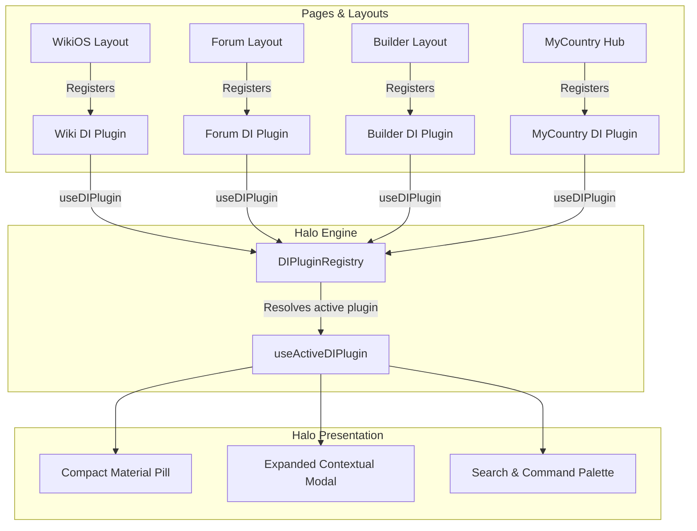

# Halo System & Command Palette Architecture

**Last updated:** August 2026  
**Status:** Production Ready — Halo v5  
**Hierarchy:** Core Feature System (`HALO_VERSION = 5` in Version Registry). Global contextual overlay, wayfinding suite, and executive command palette.

> **Naming & Identifiers:** **Halo** is the canonical brand name (formerly "Dynamic Island"). Code identifiers intentionally retain the `DI*` prefix (`src/components/halo/`, `useDIPlugin`, `types.ts`, `DIPlugin`, `DIAction`, `DIBadge`) to prevent wide merge churn across active branches.

Halo is the central interactive overlay element and command center for IxStates. It operates as both a persistent status capsule and a modal command palette, adapting contextually across all application domains (MyCountry, WikiOS, Forum, Vault, Labs, and Builder).

---

## Directory & Views Architecture

All presentation views are organized under `src/components/halo/views/`, while contextual integrations are registered under `src/components/halo/plugins/`. All files strictly adhere to the `≤700` line architecture ceiling.

```
src/components/halo/
├── index.tsx                 # Root Halo shell, gesture handling, and public exports
├── halo-registry.ts          # Canonical platform command & feature catalog
├── hooks.ts                  # State management, keyboard shortcuts, and search engine
├── plugin-context.tsx        # React 19 concurrent external store for plugins
├── types.ts                  # DIPlugin, DIAction, DIBadge, SearchResult interfaces
├── HaloTourContext.tsx       # Onboarding and visual wayfinding guide
├── HaloTourTooltip.tsx       # Tooltip callouts for Halo controls
├── plugins/                  # Contextual domain plugins
│   ├── BuilderDIPlugin.tsx   # Nation builder progress and validation tracker
│   ├── ForumDIPlugin.tsx     # Thread breadcrumbs and unread discussion badges
│   ├── MyCountryDIPlugin.tsx # Executive stats, alert pulses, and quick action grid
│   └── WikiDIPlugin.tsx      # Reading progress, TOC navigation, and user profile
└── views/                    # Modular Halo expanded and modal views
    ├── index.ts              # Barrel export for all views
    ├── CompactView.tsx       # Primary collapsed capsule with action rail & badge
    ├── ExpandedView.tsx      # View mode switcher and modal container
    ├── SearchView.tsx        # Command palette search and entity lookup
    ├── NotificationsView.tsx # Unified Alert Center and direct message tray
    ├── SettingsView.tsx      # Theme, audio, and platform preferences
    ├── MyCountryView.tsx     # National executive vitality KPIs
    ├── MyCountryActionsView.tsx # 1-click executive decision shortcuts
    ├── ForumView.tsx         # Category navigation and thread stash
    ├── WikiView.tsx          # Article outline, reading tools, narrator player
    ├── WikiProfileView.tsx   # User profile, contribution stats, scratchpad
    ├── NavTray.tsx           # Mobile-optimized bottom navigation tray
    ├── builder/              # Nation builder specific modals
    │   ├── BuilderView.tsx
    │   └── BuilderProgressView.tsx
    └── tray/                 # Alert Center sub-components
        ├── types.ts
        ├── NotificationRow.tsx
        └── MessageTrayItem.tsx
```

---

## Command Palette & Search Engine

Halo features a command palette accessible via `⌘K` or by tapping the search icon.

### 1. Multi-Domain Catalog (`src/components/halo/halo-registry.ts`)
The registry provides comprehensive coverage across eight platform domains:
- **Statecraft**: Executive Command (`/mycountry`), Directives (`/mycountry/executive`), Policy Studio (`/mycountry/editor`), Diplomacy (`/mycountry/diplomacy`), Defense (`/mycountry/defense`), Intelligence (`/mycountry/intelligence`), Fiscal Policy (`/mycountry/economy`), Politics (`/mycountry/politics`), and Map Editor (`/mycountry/map-editor`).
- **Vault**: Trading Cards (`/vault/cards`), Pack Openings (`/vault/packs`), Marketplace (`/vault/marketplace`), Crafting (`/vault/crafting`), Lore Gallery (`/vault/lore-gallery`), and NS Decks (`/vault/ns-deck`).
- **Geography**: Interactive Map (`/maps`), Country Directory (`/countries`), Leaderboards (`/leaderboards`), and Nation Builder (`/builder`).
- **Knowledge**: Wiki Main Page (`/wiki/Main_Page`), Recent Changes (`/wiki/recent-changes`), Random Wiki (`#random-wiki`), Create Article (`/wiki/new`), and Lore Stashes (`/stashes`).
- **Community**: Messages (`/messages`), ThinkPages Social (`/thinkpages`), ThinkTanks (`/thinktanks`), Forum (`/forum`), New Thread (`/forum/new-thread`), and Achievements (`/achievements`).
- **Sports**: MyLeague Standings (`/myleague`) and MyClub Squad Roster (`/myclub`).
- **Labs**: Onoma Linguistics (`/labs/onoma`), Vexel Flags (`/labs/vexel`), Map Pipeline (`/labs/map-pipeline`), Sandbox (`/labs/sandbox`), and Design Bible (`/labs/design-bible`).
- **System**: Theme toggles, audio controls, compact mode, notifications, settings, and changelog.

### 2. Search Indexing & Keyword Aliases
Each entry contains an array of search keywords and synonyms. Queries match against title, description, category, and keywords in a single normalized lookup pass:
- Typing `"military"`, `"army"`, `"fleet"`, or `"war"` matches **National Defense & Readiness**.
- Typing `"booster"`, `"unbox"`, or `"gacha"` matches **Open Card Packs**.
- Typing `"dark mode"`, `"light mode"`, or `"appearance"` matches **Toggle Dark/Light Theme**.
- Typing `"sfx"`, `"audio"`, `"mute"`, or `"volume"` matches **Toggle Audio & Sound Effects**.

### 3. In-Palette System Execution
System actions execute instantly via hook callbacks without requiring full-page navigation:
- `toggle-theme`: Toggles light, dark, and system color schemes.
- `toggle-sound`: Toggles Cuelume UI audio effects on or off.
- `toggle-compact`: Switches between standard and high-density layouts.
- `mark-all-read`: Clears unread alert badges and notification counters.
- `reload-data`: Refreshes platform telemetry.
- `random-wiki`: Jumps to a random encyclopedia article.
- `random-country`: Selects and loads a random world nation.

### 4. Icon Design Standards
Icons use a curated combination of `iconoir-react` and `react-icons/gi`. Generic sparkle icons (`Sparkles`) are strictly prohibited in favor of domain-accurate iconography (`Crown`, `GiWaxSeal`, `EditPencil`, `GiShieldBash`, `GiCoins`, `GiCapitol`).

---

## Physical Motion & Spring Physics

Motion transitions across capsule expansion, tray reveals, and modal transforms utilize Apple critically damped spring physics:

```typescript
export const HALO_SPRING = {
  type: "spring",
  stiffness: 420,
  damping: 38,
  mass: 0.8,
};
```

---

## Plugin Architecture Overview

Pages and layouts register their custom plugins on mount. Halo uses `useSyncExternalStore` in `src/components/halo/plugin-context.tsx` for concurrent reactivity across React 19 rendering paths:



---

## Core Interfaces (`src/components/halo/types.ts`)

### `DIPlugin`
```typescript
export interface DIPlugin {
  id: string;                                                        // Unique identifier (e.g. "wiki", "forum", "mycountry")
  priority?: number;                                                 // Priority weight (highest priority active plugin renders)
  center?: React.ReactNode;                                          // Custom component replacing the default clock/greeting
  actions?: DIAction[];                                              // Action buttons on the pill's right rail
  expandedViews?: Record<string, React.ComponentType<DIViewProps>>;    // Modal components rendered when expanded
  badge?: DIBadge;                                                   // Colored status dot or pulsing activity badge
  accentColor?: string;                                              // Underline accent border color
  stickyLabel?: string;                                              // Wayfinding label shown when sticky
}
```

### `DIAction` & `DIBadge`
```typescript
export interface DIAction {
  id: string;
  icon: React.ComponentType<{ className?: string }>;
  label: string;
  onClick: () => void;
  badge?: number; // Notification count badge
}

export interface DIBadge {
  color: string;
  pulse?: boolean;
}
```

---

## Related Documentation

- [MyCountry Design & Statecraft Guide](./mycountry.md)
- [WikiOS System Guide](./wikios.md)
- [Forum Integration](./forum.md)
- [Cards & Vault System](./cards.md)
- [Facet Design System](../reference/facet-design-system.md)
