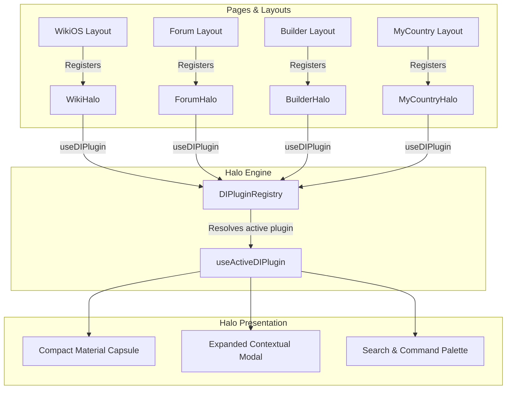

# 🎯 Halo — Facet UI Contextual Overlay & Command Palette

**Parent Platform Layer:** Facet UI Design System (`FACET_VERSION = 2` / `HALO_VERSION = 5`)  
**Subsystems:** Contextual Floating Capsule, `Cmd+K` Command Palette, Unified Notification Tray, Plugin Registry  
**Primary Action:** `NAVIGATE` | **Domain Accent:** Universal Slate / Context-Adaptive  
**Status:** 📀 Gold Master (100% Ready)  

> **Facet UI Architecture:** **Halo** (contextual overlay & command palette) and **Cuelume** (audio-tactile haptic feedback) are first-class interactive primitives of the **Facet UI Design System**. Plugin components follow the `<Name>Halo` naming convention (e.g., `WikiHalo`, `ForumHalo`, `MyCountryHalo`, `BuilderHalo`, `SportsLiveHalo`). Code identifiers intentionally retain the `DI*` prefix (`src/components/halo/`, `useDIPlugin`, `types.ts`, `DIPlugin`, `DIAction`, `DIBadge`) to prevent wide merge churn across active branches.

Halo is the central interactive overlay element and command center for IxStates. It operates as both a persistent status capsule and a modal command palette, adapting contextually across all application domains (MyCountry, WikiOS, Forum, Vault, Labs, and Builder).

---

## Directory & Views Architecture

All core system views are strictly isolated under `src/components/halo/views/`, while domain-specific overlays live in isolated plugin modules under `src/components/halo/plugins/<plugin-name>/`. All files strictly adhere to the `≤700` line architecture ceiling.

```
src/components/halo/
├── index.tsx                     # Root Halo shell, gesture handling, and public exports
├── halo-registry.ts              # Canonical platform command & feature catalog
├── hooks.ts                      # State management, keyboard shortcuts, and search engine
├── plugin-context.tsx            # React 19 concurrent external store for plugins
├── types.ts                      # DIPlugin, DIAction, DIBadge, SearchResult interfaces
├── HaloTourContext.tsx           # Onboarding and visual wayfinding guide
├── HaloTourTooltip.tsx           # Tooltip callouts for Halo controls
├── views/                        # Core Halo system views ONLY
│   ├── index.ts                  # Barrel export for base views
│   ├── CompactView.tsx           # Primary collapsed capsule with action rail & badge (React.memo)
│   ├── ExpandedView.tsx          # View mode switcher and modal container (React.memo)
│   ├── SearchView.tsx            # Command palette search and entity lookup (React.memo)
│   ├── NotificationsView.tsx     # Unified Alert Center and direct message tray (React.memo)
│   ├── SettingsView.tsx          # Theme, audio, and platform preferences (React.memo)
│   ├── NavTray.tsx               # Mobile-optimized bottom navigation tray (React.memo)
│   └── tray/                     # Alert Center sub-components
│       ├── types.ts
│       ├── NotificationRow.tsx
│       └── MessageTrayItem.tsx
└── plugins/                      # Domain-specific Halo plugins
    ├── index.ts                  # Unified barrel export for all plugins
    ├── _template/                # Developer starter template for new plugins
    │   ├── TemplateHalo.tsx      # Plugin registration component
    │   ├── index.ts              # Plugin barrel export
    │   └── views/                # Modal views
    │       ├── index.ts
    │       └── TemplateView.tsx
    ├── mycountry/                # MyCountry executive plugin
    │   ├── MyCountryHalo.tsx     # Executive KPIs & quick actions registration
    │   ├── index.ts
    │   └── views/
    │       ├── index.ts
    │       ├── MyCountryView.tsx
    │       └── MyCountryActionsView.tsx
    ├── forum/                    # Forum discussion plugin
    │   ├── ForumHalo.tsx         # Thread breadcrumbs & alert count registration
    │   ├── index.ts
    │   └── views/
    │       ├── index.ts
    │       └── ForumView.tsx
    ├── wiki/                     # WikiOS encyclopedia plugin
    │   ├── WikiHalo.tsx          # Reading progress & narrator player registration
    │   ├── types.ts              # Voice labels, reading sessions, local drafts
    │   ├── index.ts
    │   ├── components/           # WikiNarratorPlayer, WikiWorkspaceTab, WikiSearchDropdown, PlayPauseMorph
    │   │   └── index.ts
    │   └── views/
    │       ├── index.ts
    │       ├── WikiView.tsx
    │       └── WikiProfileView.tsx
    ├── builder/                  # Nation Builder plugin
    │   ├── BuilderHalo.tsx       # Step tracker & manual save registration
    │   ├── index.ts
    │   └── views/
    │       ├── index.ts
    │       ├── BuilderView.tsx
    │       └── BuilderProgressView.tsx
    └── sports/                   # Live match activity plugin
        ├── SportsLiveHalo.tsx    # Deterministic IxTime live match scoreboard
        └── index.ts
```

---

## Standard Plugin Template

Every Halo plugin is a self-contained module in `src/components/halo/plugins/<feature>/`:

1. **`<Name>Halo.tsx`**: Calls `useDIPlugin(pluginConfig)` to mount capsule center content, action buttons, accent color, and custom modal views.
2. **`views/`**: Contains modal expanded components (e.g. `MyCountryView.tsx`, `ForumView.tsx`, `WikiView.tsx`).
3. **`components/`** (optional): Contains sub-widgets (e.g. narrator player, search dropdown, morph toggles).
4. **`types.ts`** (optional): Contains domain-specific types.
5. **`index.ts`**: Clean barrel export exporting `<Name>Halo`, views, and backwards-compatible aliases (`*DIPlugin`).

To create a new plugin, developers copy `src/components/halo/plugins/_template/` into their feature directory and mount `<FeatureHalo />` in their route layout.

---

## Command Palette & Search Engine

Halo features a command palette accessible via `⌘K` or by tapping the search icon.

### 1. Multi-Domain Catalog (`src/components/halo/halo-registry.ts`)
The registry provides comprehensive coverage across eight platform domains:
- **Statecraft**: Executive Command (`/mycountry`), Directives (`/mycountry/executive`), Policy Studio (`/mycountry/editor`), Diplomacy (`/mycountry/diplomacy`), Defense (`/mycountry/defense`), Intelligence (`/mycountry/intelligence`), Fiscal Policy (`/mycountry/economy`), Politics (`/mycountry/politics`), and Map Editor (`/mycountry/map-editor`).
- **Vault**: Trading Cards (`/vault/cards`), Pack Openings (`/vault/packs`), Marketplace (`/vault/marketplace`), Crafting (`/vault/crafting`), Lore Gallery (`/vault/lore-gallery`), and NS Decks (`/vault/ns-deck`).
- **Geography**: Interactive Map (`/maps`), Country Directory (`/countries`), Leaderboards (`/leaderboards`), and Nation Builder (`/builder`).
- **Knowledge**: Wiki Main Page (`/wiki/Main_Page`), Recent Changes (`/wiki/recent-changes`), Random Wiki (`#random-wiki`), Create Article (`/wiki/new`), and Lore Stashes (`/stashes`).
- **Community**: Messages (`/messages`), ThinkPages Social (`/thinkpages`), ThinkTanks (`/thinktanks`), Forum (`/forum`), New Thread (`/forum/new-thread`), and Achievements (`/achievements`).
- **Sports**: MyLeague Standings (`/myleague`) and MyClub Squad Roster (`/myclub`).
- **Labs**: Onoma Linguistics (`/labs/onoma`), Vexel Flags (`/labs/vexel`), Map Pipeline (`/labs/map-pipeline`), Sandbox (`/labs/sandbox`), and Design Bible (`/labs/design-bible`).
- **System**: Theme toggles, audio controls, compact mode, notifications, settings, and changelog.

### 2. Search Indexing & Keyword Aliases
Each entry contains an array of search keywords and synonyms. Queries match against title, description, category, and keywords in a single normalized lookup pass:
- Typing `"military"`, `"army"`, `"fleet"`, or `"war"` matches **National Defense & Readiness**.
- Typing `"booster"`, `"unbox"`, or `"gacha"` matches **Open Card Packs**.
- Typing `"dark mode"`, `"light mode"`, or `"appearance"` matches **Toggle Dark/Light Theme**.
- Typing `"sfx"`, `"audio"`, `"mute"`, or `"volume"` matches **Toggle Audio & Sound Effects**.

### 3. In-Palette System Execution
System actions execute instantly via hook callbacks without requiring full-page navigation:
- `toggle-theme`: Toggles light, dark, and system color schemes.
- `toggle-sound`: Toggles Cuelume UI audio effects on or off.
- `toggle-compact`: Switches between standard and high-density layouts.
- `mark-all-read`: Clears unread alert badges and notification counters.
- `reload-data`: Refreshes platform telemetry.
- `random-wiki`: Jumps to a random encyclopedia article.
- `random-country`: Selects and loads a random world nation.

### 4. Icon Design Standards
Icons use a curated combination of `iconoir-react` and `react-icons/gi`. Generic sparkle icons (`Sparkles`) are strictly prohibited in favor of domain-accurate iconography (`Crown`, `GiWaxSeal`, `EditPencil`, `GiShieldBash`, `GiCoins`, `GiCapitol`).

---

## 3-Mode Navigation Architecture & Halo Coordination

Halo operates in synergy with the platform's **Unified 3-Mode Navigation Architecture** driven by `useNavigationScroll`:

```
┌─────────────────────────────────────────────────────────────────────────────┐
│ Mode 1: DEFAULT (Global Scroll-Hide & Morph)                                │
│ • Standard pages: Home, MyCountry, Dashboard, Vault, ThinkPages, Forum,     │
│   Countries, Admin, Sports, Settings, Changelog, Studio.                    │
│ • Sits in top anchor zone (<50px). Morphs tabs inwards (40px → 100px).     │
│ • Scroll down hides with cubic-bezier / spring; scroll up reveals instantly.│
│ • Halo pill stays sticky (8px), auto-collapsing to 200x36px after 1200ms.   │
├─────────────────────────────────────────────────────────────────────────────┤
│ Mode 2: HIDDEN (Immersion & Canvas Focus)                                   │
│ • Canvas & focus surfaces: /messages, /builder, /mycountry/editor,          │
│   /wiki/*, /blurbs/*                                                        │
│ • Starts with navbar translated out of view (translateY(-100%)).           │
│ • Reveals smoothly on upward scroll (>10px) or top-edge hover (<=16px).    │
│ • Dedicated domain Halo (WikiHalo, BuilderHalo) remains active and floating.│
├─────────────────────────────────────────────────────────────────────────────┤
│ Mode 3: MAPS (Chromeless Standalone Exception)                              │
│ • Maps & spatial workflows: /maps.                                          │
│ • Global <Navigation /> returns null; MapDynamicIsland handles controls.    │
└─────────────────────────────────────────────────────────────────────────────┘
```

---

## Dynamic Repulsion Physics & Presentation Continuity

When secondary sub-headers, editor toolbars, or filter strips sit beneath the floating Halo:

$$\text{repulsionProgress} = \text{clamp}\left(\frac{\text{scrollY}}{56}, 0, 1\right)$$

1. **Center Branding Glide**: Sub-header center brands glide upward (`y: -repulsionProgress * 40px`), scale (`1 - repulsionProgress * 0.1`), and fade (`opacity: 1 - repulsionProgress`) to clear space for the collapsing Halo pill.
2. **Seamless Action Tuck**: Right-rail action buttons slide inward directly beneath the floating Halo capsule.
3. **Ambient Refraction Glow**: A subtle blue/purple radial glow appears during transition (`0 0 (1 - repulsionProgress) * 12px`).
4. **Desktop Sticky Rails**: Desktop sidebars use `lg:sticky lg:top-20` (80px) to guarantee a 16px buffer beneath the 64px floating navbar without overlapping.

---

## Physical Motion & Spring Physics

Motion transitions across capsule expansion, tray reveals, and modal transforms utilize Apple critically damped spring physics:

```typescript
export const HALO_SPRING = {
  type: "spring",
  stiffness: 420,
  damping: 38,
  mass: 0.8,
};
```

---

## Plugin Architecture Overview

Pages and layouts register their custom plugins on mount. Halo uses `useSyncExternalStore` in `src/components/halo/plugin-context.tsx` for concurrent reactivity across React 19 rendering paths:



---

## Core Interfaces (`src/components/halo/types.ts`)

### `DIPlugin` & `DIViewProps`
```typescript
export interface DIPlugin<F = unknown, C = unknown> {
  id: string;                                                        // Unique identifier (e.g. "wiki", "forum", "mycountry")
  priority?: number;                                                 // Priority weight (highest priority active plugin renders)
  center?: React.ReactNode;                                          // Custom component replacing the default clock/greeting
  actions?: DIAction[];                                              // Action buttons on the pill's right rail
  expandedViews?: Record<string, React.ComponentType<DIViewProps<F, C>>>; // Modal components rendered when expanded
  badge?: DIBadge;                                                   // Colored status dot or pulsing activity badge
  accentColor?: string;                                              // Underline accent border color
  stickyLabel?: string;                                              // Wayfinding label shown when sticky
  filter?: F;                                                        // Context filter state (e.g. BuilderFilterState)
  context?: C;                                                       // Domain context (e.g. Live match trace)
}

export interface DIViewProps<F = unknown, C = unknown> {
  onClose: () => void;
  onSwitchMode?: (mode: ViewMode) => void;
  filter?: F;
  context?: C;
}
```

### `DIAction` & `DIBadge`
```typescript
export interface DIAction {
  id: string;
  icon: React.ComponentType<{ className?: string }>;
  label: string;
  onClick: () => void;
  badge?: number; // Notification count badge
}

export interface DIBadge {
  color: string;
  pulse?: boolean;
}
```

---

## Decoupled Global Components

Under clean modular boundaries:
- **`ToastBanner`** lives in `src/components/ui/ToastBanner.tsx` and is consumed by `src/stores/toastQueueStore.tsx`, removing notification toast styling out of the Halo capsule component tree.
- **`PlayPauseMorph`** lives in `src/components/halo/plugins/wiki/components/PlayPauseMorph.tsx` as a private subcomponent of the Wiki Narrator player.

---

## Related Documentation

- [MyCountry Design & Statecraft Guide](./mycountry.md)
- [WikiOS System Guide](./wikios.md)
- [Forum Integration](./forum.md)
- [Cards & Vault System](./cards.md)
- [Facet Design System](../reference/facet-design-system.md)
