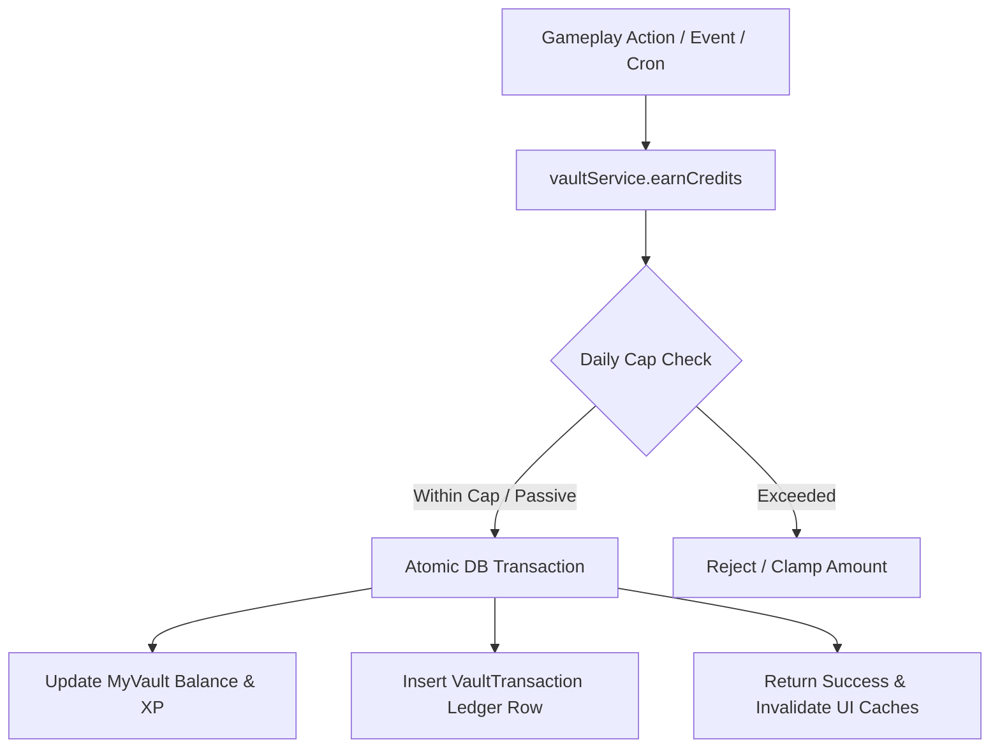

# IxCredits (IxC) Virtual Currency Engine

**Last updated:** August 2026  
**Status:** Production Ready (Beta)  
**Hierarchy:** Currency & Earning Engine of **IxVault** (`IXVAULT_VERSION = 2`).

IxCredits (IxC) are the universal virtual currency powering the IxStates platform economy. Players earn IxC through gameplay actions (managing nations, diplomacy, responding to crises, social contributions, and achievement milestones) and spend them on card packs, crafting, marketplace trading, and platform customizations.

---

## Vault Architecture & Ledger Models

Defined in `prisma/schema/cards.prisma`:

### `MyVault`
| Field | Type | Description |
| :--- | :--- | :--- |
| `credits` | Float | Spendable balance |
| `lifetimeEarned` | Float | All-time earned credits |
| `lifetimeSpent` | Float | All-time spent credits |
| `vaultLevel` | Int | Progression tier (1,000 XP per level) |
| `vaultXp` | Int | Experience points (1 XP per 1 IxC earned) |
| `loginStreak` | Int | Consecutive daily logins |
| `todayEarned` | Float | Credits earned today (resets at midnight UTC) |

### `VaultTransaction`
Immutable ledger recording every balance change with `vaultId`, `credits`, `balanceAfter`, `type` (`VaultTransactionType`), `source`, `metadata` (JSON audit trail), and `createdAt`.

---

## Earning IxCredits



### 1. Passive Income (`EARN_PASSIVE`) — No Daily Cap
Distributed daily at midnight UTC via `src/lib/passive-income-cron.ts`:
$$\text{Daily Dividend} = (\text{BaseRate} + \text{PopulationBonus} + \text{GrowthBonus}) \times \text{BudgetMultiplier}$$
- $\text{BaseRate} = (\text{GDP per Capita} / 10000) \times \text{TierMultiplier}$
- $\text{PopulationBonus} = (\text{Population} / 1\text{M}) \times 0.01$
- $\text{GrowthBonus} = \text{BaseRate} \times 0.1$ (if GDP growth $> 3\%$)
- $\text{BudgetMultiplier}$: 0.8×–2.0× derived from department budget allocations.

### 2. Active Gameplay (`EARN_ACTIVE`) — 100 IxC Daily Cap
- **Login Streak**: 1 to 7 IxC daily (scales day 1 to 7+)
- **Achievement Unlocks**: 5 to 100 IxC based on rarity (Common: 5, Legendary: 100)
- **Diplomatic Actions**: 15 IxC for new embassy, 12 IxC for cultural exchange
- **Scenario & Crisis Responses**: 5 to 20 IxC based on severity and risk choices

### 3. Social Contributions (`EARN_SOCIAL`) — 50 IxC Daily Cap
- 1 IxC per original ThinkPages post (max 5/day)

---

## Spending IxCredits

- **Card Packs (`SPEND_PACKS`)**: Basic (15 IxC), Premium (35 IxC), Elite (75 IxC), Themed (50 IxC), Seasonal (60 IxC), Event (100 IxC)
- **Card Crafting & Evolution (`SPEND_CRAFT`)**: Fusion (250–10,000 IxC), Rarity Evolution (200–4,000 IxC)
- **Marketplace & Trading (`SPEND_MARKET`)**: Listing fee (5 IxC), auction success fee (10% on sales $>100$ IxC), P2P credit transfers
- **Boosts & Cosmetics (`SPEND_BOOST`, `SPEND_COSMETIC`)**: Reserved for theme customizations

---

## Developer Integration Patterns

### Non-Blocking Error Strategy
Earning failures must **never** block primary gameplay actions:
```typescript
try {
  const earnResult = await vaultService.earnCredits(
    ctx.auth.userId,
    10,
    "EARN_ACTIVE",
    "CUSTOM_ACTION",
    ctx.db,
    { actionId: input.id }
  );
  if (earnResult.success) creditsEarned = 10;
} catch (error) {
  console.error("[Router] Non-blocking earning failure:", error);
}
```

### Client React Hooks (`src/hooks/vault/`)
- `useVaultBalance()` – Reads current balance, XP, level, and today's earnings
- `useEarnCredits()` – Optimistic mutation for awarding credits with toast updates
- `useDailyBonus()` – Daily login streak claim mutation

---

## Related Documentation

- [MyVault System Guide](./myvault.md)
- [IxCards System Guide](./cards.md)
- [API Reference: Vault Router](../reference/api-complete.md#vault-router)
