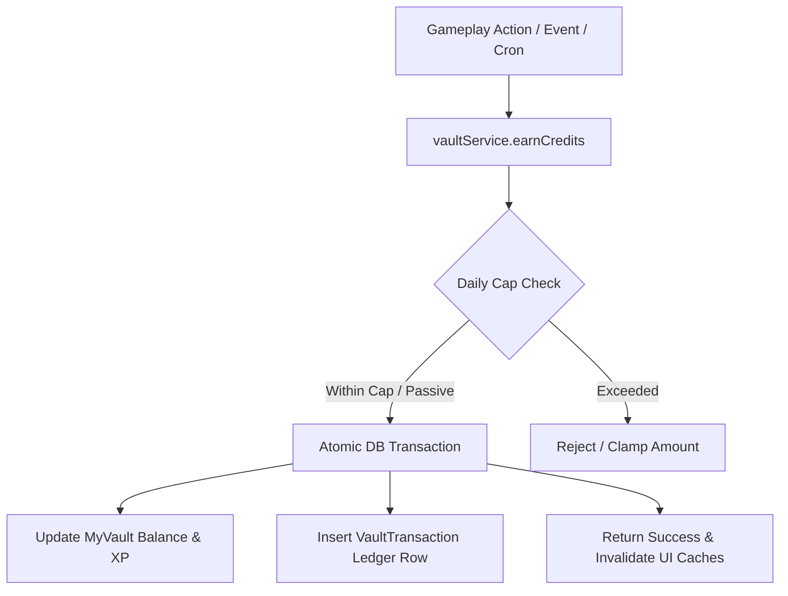

# IxCredits (IxC) Virtual Currency Engine

**Last updated:** September 2026  
**Status:** Release Candidate (platform 1.4.0 "Lobster Crosby")  
**Hierarchy:** Currency & Earning Engine of **IxVault** (`IXVAULT_VERSION = 2`).

IxCredits (IxC) are the universal virtual currency powering the IxStates platform economy. Players earn IxC through gameplay actions (managing nations, diplomacy, responding to crises, social contributions, and achievement milestones) and spend them on card packs, crafting, marketplace trading, and platform customizations.

---

## Vault Architecture & Ledger Models

Defined in `prisma/schema/cards.prisma`:

### `MyVault`
| Field | Type | Description |
| :--- | :--- | :--- |
| `credits` | Float | Spendable balance |
| `lifetimeEarned` | Float | All-time earned credits |
| `lifetimeSpent` | Float | All-time spent credits |
| `vaultLevel` | Int | Progression tier (`floor(vaultXp / xpPerLevel) + 1`; `xpPerLevel` defaults to 1,000) |
| `vaultXp` | Int | Experience points (1 XP per 1 IxC earned) |
| `loginStreak` | Int | Consecutive daily logins |
| `todayEarned` | Float | Credits earned today (reset lazily on the first read/earn after midnight UTC) |

### `VaultTransaction`
Immutable ledger recording every balance change with `vaultId`, `credits`, `balanceAfter`, `type` (a `VaultTransactionType` value stored as a string: `EARN_PASSIVE`, `EARN_ACTIVE`, `EARN_CARDS`, `EARN_SOCIAL`, `EARN_BONUS`, `REFUND`, `SPEND_*`, `ADMIN_ADJUSTMENT`), `source`, `metadata` (JSON audit trail), an optional unique `idempotencyKey`, and `createdAt`.

---

## Earning IxCredits


```mermaid
graph TD
    A[Gameplay Action / Event / Cron] --> B[vaultService.earnCredits]
    B --> C{Daily Cap Check}
    C -->|Within Cap / Passive| D[Atomic DB Transaction]
    C -->|Exceeded| E[Reject / Clamp Amount]
    D --> F[Update MyVault Balance & XP]
    D --> G[Insert VaultTransaction Ledger Row]
    D --> H[Return Success & Invalidate UI Caches]
```

### 1. Passive Income (`EARN_PASSIVE`) — No Daily Cap
Distributed daily by the `passive-income` job (`src/lib/economy/passive-income-distribution-cron.ts`, scheduled in `src/server/cron/jobs.ts`), with missed days back-filled on vault reads by `catchUpPassiveIncome()` (`src/lib/vault/vault-passive-income.ts`). Each user/day is idempotent (`passive:<userId>:<YYYY-MM-DD>`):
$$\text{Daily Dividend} = (\text{BaseRate} + \text{PopulationBonus} + \text{GrowthBonus}) \times \text{BudgetMultiplier}$$
- $\text{BaseRate} = (\text{GDP per Capita} / 10000) \times \text{TierMultiplier}$ (Extravagant 3.5, Very Strong 3.0, Strong 2.5, Developed 2.0, Healthy 1.5, Developing 1.0, Impoverished 0.5)
- $\text{PopulationBonus} = (\text{Population} / 1\text{M}) \times 0.01$
- $\text{GrowthBonus} = \text{BaseRate} \times 0.1$ (if GDP growth $> 3\%$)
- $\text{BudgetMultiplier}$: typically 0.8×–2.0×, derived from department budget allocations (`src/lib/economy/budget-vault-calculator.ts`).
- A purchased Passive Yield Boost store perk multiplies the result by $(1 + \text{yieldBoost})$.
- **Which nation pays:** one dividend per account, computed from its primary nation, which is the earliest-created nation it owns (`resolveDividendCountryId`, `src/lib/vault/dividend-nation.ts`). It never follows the active nation, so switching nations before the payout changes nothing. An account that owns no nation but acts as one (a legacy link, or a system-owner override) is paid from that nation. The vault dashboard and the MyCountry vault widget project the same nation's dividend.

### 2. Active Gameplay (`EARN_ACTIVE`) — 100 IxC Daily Cap
- **Login Streak** (`vault.claimDailyBonus`): 1 to 7 IxC daily (`min(streak, maxStreakBonus)`)
- **Combined Daily Claim** (`vault.claimCombinedDailyClaim`): choose a randomized credit roll (10–10,000 IxC before the cap) or a random card of the day. The claim dialog (`DailyRewardProvider.tsx`) describes the roll as paid up to the daily earning cap (the 100 IxC active cap always applies). It auto-opens at most once per user per UTC day (tracked in `localStorage`); after that it stays available from the sidebar "Daily reward" row and the Vault dashboard's `DailyRewardStatus` until claimed
- **Diplomatic Actions**: 15 IxC for new embassy, 12 IxC for cultural exchange
- **Diplomatic Scenario Responses**: 10 IxC base, +5 for high-stakes scenarios, +0/2/5/8 by choice risk (10–23 IxC)

### 3. Social Contributions (`EARN_SOCIAL`) — 50 IxC Daily Cap
- 1 IxC per original ThinkPages post (max 5/day)

### 4. Metagame Bonuses (`EARN_BONUS`) — Uncapped
Granted through `grantBonus()` (`src/lib/vault/vault-bonus.ts`), outside the daily caps and the `isEarningEnabled` gate; amounts are admin-tunable (`vault_bonus_*` SystemConfig):
- **Achievement Unlocks** (one-time each): Common 100, Uncommon 250, Rare 500, Epic 1,000, Legendary 2,500 IxC. Account-level achievements (tenure, achievement count, own ThinkPages posts, card collection) unlock without a country; see [achievements.md](./achievements.md)
- **New Player** 5,000 IxC, **Wiki Country Import** 2,500 IxC, **Loreward** win 2,500 IxC
- **New Player bonus is an IxnayID bonus.** `grantNewPlayerBonus()` pays it when the account is created (`UserManagementService.getOrCreateUser`), with no country needed. Accounts that predate this get it the first time they open the Vault (`vault.getBalance`; switch off with `NEW_PLAYER_BONUS_ON_VAULT_OPEN` in `vault-bonus.ts`). Every path (sign-up, Vault open, the country builder and realm claims) uses the source `bonus:new_player` with `oneTime`, so the ledger check plus the idempotency key `bonus:new_player:<User.id>` pay it once per account: whichever path runs first pays, and the rest are no-ops
- **NS Deck Import**: 50 IxC per newly imported card, capped at 5,000 IxC, paid **once per nation, whichever account imports it** (`onceKey` on the nation name, `ns-import/decks.ts`)

Both caps are configurable (`activeDailyCap`, `socialDailyCap`); an earn that would exceed the remaining allowance is clamped.

---

## Spending IxCredits

- **Card Packs**: `pack-service.ts` spends through `spendCreditsTx` with type `SPEND_PACKS`, so the ledger's kill switch and idempotency apply to packs. Per-pack `priceCredits` (seeded range 100–15,000 IxC; see [cards.md](./cards.md#pack-tiers))
- **Card Crafting & Evolution (`SPEND_CRAFT`)**: Fusion (250–10,000 IxC), Rarity Evolution (200–4,000 IxC)
- **Marketplace & Trading (`SPEND_MARKET`)**: Listing fee (5 IxC standard, 10 IxC featured; 50% refunded if no bids), marketplace fee (10% on sales $>100$ IxC), P2P credit transfers
- **Boosts & Cosmetics (`SPEND_BOOST`, `SPEND_COSMETIC`)**: Vault Shop items. The seed script `scripts/setup/seed-vault-items.ts` (not run by `db:seed`) creates profile glows, frames and badges (including seasonal ones), card capacity boosts, an archetype proposal token (no consumer yet), a MyClub team licence token and a MyLeague franchise pass. It has no lore request token and no passive yield boost item, although the passive-income code reads a yield boost if one exists

---

## Developer Integration Patterns

### Non-Blocking Error Strategy
Earning failures must **never** block primary gameplay actions:
```typescript
try {
  const earnResult = await vaultService.earnCredits(
    ctx.auth.userId,
    10,
    "EARN_ACTIVE",
    "CUSTOM_ACTION",
    ctx.db,
    { actionId: input.id }
  );
  if (earnResult.success) creditsEarned = 10;
} catch (error) {
  console.error("[Router] Non-blocking earning failure:", error);
}
```

### Client React Hooks (`src/hooks/vault/`)
- `useVaultBalance()` – Reads current balance, XP, level, today's earnings, and premium multiplier
- `useVaultStats()` – Aggregate vault statistics
- `useCollections()` / `useRecentActivity()` – Collection list and recent ledger activity

There is no client-side earn hook: credits are only awarded server-side. Daily claims call `api.vault.claimDailyBonus` / `claimCombinedDailyClaim` directly (e.g. `DailyRewardProvider`).

---

## Related Documentation

- [MyVault System Guide](./myvault.md)
- [IxCards System Guide](./cards.md)
- [API Reference: IxVault (Cards & Credits)](../reference/api-complete.md)
