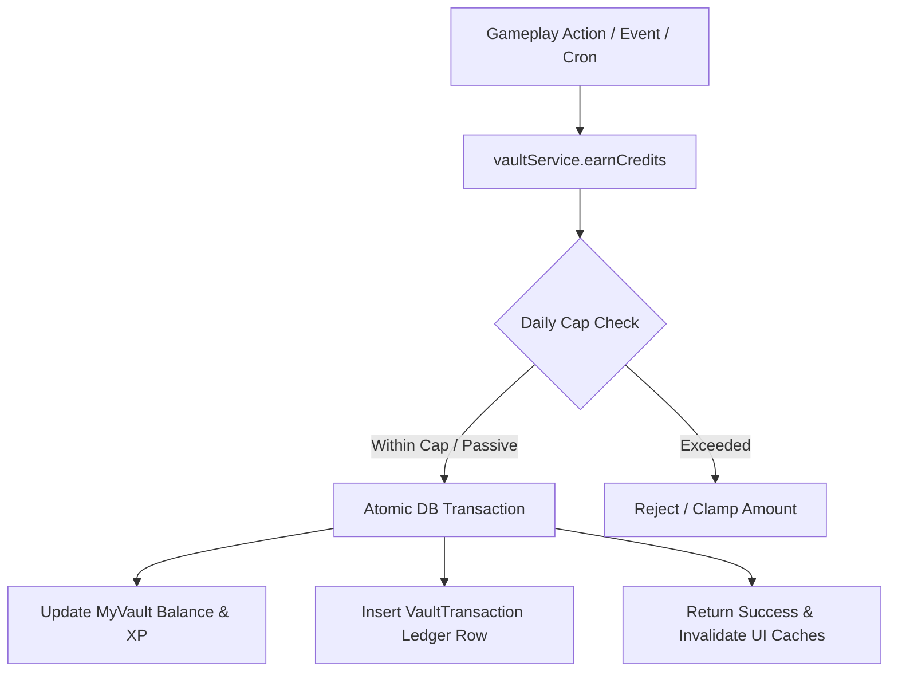

# IxCredits (IxC) Virtual Currency Engine

**Last updated:** 2026-10-20  
**Status:** Release Candidate (platform 1.5.0 "Lobster Crosby")  
**Hierarchy:** Currency & Earning Engine of **IxVault** (`IXVAULT_VERSION = 3`).

IxCredits (IxC) are the universal virtual currency powering the IxStates platform economy. IxCredits are **pure metagame**: players earn IxC through platform activity (wiki edits, ThinkPages and forum posts, card activity, Lorewards, achievement unlocks and the daily reward) and spend them on card packs, marketplace trading and platform customizations. Nothing in the Vault economy reads a country, and no country action writes a ledger row; the one exception is the nation card royalty described under [Card sales](#card-sales-and-trades). Design: [the Vault hub spec](../specs/2026-10-14-vault-collectathon-hub-design.md).

---

## Vault Architecture & Ledger Models

Defined in `prisma/schema/cards.prisma`:

### `MyVault`
| Field | Type | Description |
| :--- | :--- | :--- |
| `credits` | Float | Spendable balance |
| `lifetimeEarned` | Float | All-time earned credits |
| `lifetimeSpent` | Float | All-time spent credits |
| `vaultLevel` | Int | Progression tier (`floor(vaultXp / xpPerLevel) + 1`; `xpPerLevel` defaults to 1,000) |
| `vaultXp` | Int | Experience points (1 XP per 1 IxC earned) |
| `loginStreak` | Int | Consecutive daily logins |
| `todayEarned` | Float | Credits earned today (reset lazily on the first read/earn after midnight UTC) |

### `VaultTransaction`
Immutable ledger recording every balance change with `vaultId`, `credits`, `balanceAfter`, `type` (a `VaultTransactionType` value stored as a string: `EARN_PASSIVE`, `EARN_ACTIVE`, `EARN_CARDS`, `EARN_SOCIAL`, `EARN_BONUS`, `REFUND`, `SPEND_*`, `ADMIN_ADJUSTMENT`, and `SPEND_EXCHANGE` / `EARN_EXCHANGE`, which only old rows carry now: the IxCredits and Sovereigns conversion was removed and nothing writes them), `source`, `metadata` (JSON audit trail), an optional unique `idempotencyKey`, and `createdAt`.

---

## Earning IxCredits


```mermaid
graph TD
    A[Gameplay Action / Event / Cron] --> B[vaultService.earnCredits]
    B --> C{Daily Cap Check}
    C -->|Within Cap / Passive| D[Atomic DB Transaction]
    C -->|Exceeded| E[Reject / Clamp Amount]
    D --> F[Update MyVault Balance & XP]
    D --> G[Insert VaultTransaction Ledger Row]
    D --> H[Return Success & Invalidate UI Caches]
```

### 1. The Vault dividend (`EARN_PASSIVE`) — no daily cap
One payout per user per UTC day, written at midnight UTC by the `vault-dividend` cron job (`src/server/cron/vault-dividend-cron.ts`, registered in `src/server/cron/jobs.ts`; schedule override key `cronSchedule_vaultDividend`). It replaced the country dividend (`passive-income` job, `vault-passive-income.ts`, `dividend-nation.ts`, the budget multiplier and the missed-day catch-up on vault reads), which were deleted. The maths is one pure module, `src/lib/vault/vault-dividend.ts` (`DIVIDEND` holds the rates); `src/server/modules/vault/vault-dividend-settle.ts` loads the inputs and writes the row.

| Part | Rule | Cap |
|---|---|---|
| Collection interest | 0.25% of card deck value per day (retired cards and Loreward trophy cards excluded) | 25 |
| Wiki | The Lorewards engine's score for the user's previous day, 1 credit per 80 points | 30 |
| ThinkPages and forum | 2 per human ThinkPages post (auto-generated posts and reposts excluded) or visible forum post or reply | 20 |
| Cards | 2 per pack opened, 5 per completed trade, 3 per listing sold | 20 |
| Streak | Activity parts (wiki, posts, cards) × 0.05 per login-streak day, up to 10 days, so at most +50% of the activity | |
| Store upgrade | Total × (1 + `yieldBoost`) from owned upgrades | |
| Total | | 150 |

- **Who is paid:** vaults with at least one input above zero and a computed total above zero. No country lookup anywhere.
- **Wiki scoring:** `scoreDailyWikiOS` (`enrichAll` option) scores every candidate, and a user's wiki figure is the sum of their (page, day) scores. Each candidate (one name's edits to one page that day) is credited from its scored revisions themselves (`scoredEditsAccount`, from the `authorIds` scoring carries): one WikiOS account on all of them, that account, even when someone else holds a link for the name; none on any (all mirrored from MediaWiki), the account holding the name's approved old IxWiki name claim (`ownerOfName`, an exact match on the normalized name); mixed, no one. A MediaWiki editor under an unclaimed name earns no wiki part. The Wallet has no claim prompt.
- **Idempotency:** key `dividend:<userId>:<yyyy-mm-dd>`; type `EARN_PASSIVE`, source `VAULT_DIVIDEND`, label "Vault dividend". The row's `metadata` stores `{ day, lines, inputs }` (each part's amount and figures), which the statement expands (`parseDividendMetadata`).
- **Missed days:** each run settles yesterday, then any unsettled day among the 7 before it, from that day's own activity. A day counts as settled once any dividend row exists for it, so a payout that failed alone is not retried. Deck value and the streak are read at settle time, not as of the missed day.
- **Start day:** the first run writes the SystemConfig row `vault_dividend_started_on`; no earlier day is ever settled, so deploy night does not back-pay days. Clear that row to re-start.
- **Admin:** the cron and tuning widgets point at `vault-dividend`. The store item effect `yieldBoost` is labelled "Dividend boost".

### 2. Active Gameplay (`EARN_ACTIVE`) — 100 IxC Daily Cap
- **Combined Daily Claim** (`vault.claimCombinedDailyClaim`): choose a randomized credit roll (10–10,000 IxC before the cap) or a random card of the day. The claim dialog (`DailyRewardProvider.tsx`) describes the roll as paid up to the daily earning cap (the 100 IxC active cap always applies). It auto-opens at most once per user per UTC day (tracked in `localStorage`); after that it stays available from the sidebar "Daily reward" row and the Wallet's `DailyRewardStatus` until claimed
- Removed: diplomatic action rewards (embassies, cultural exchanges), diplomatic scenario responses, the per-post ThinkPages reward and the forum action reward. No country action pays IxCredits any more.

### 3. Social contributions (`EARN_SOCIAL`)
Nothing pays `EARN_SOCIAL` now. ThinkPages and forum posts are paid through the dividend's posts part. The type, its 50 IxC cap (`socialDailyCap`) and its label stay so old statement rows read correctly.

### 4. Metagame Bonuses (`EARN_BONUS`) — Uncapped
Granted through `grantBonus()` (`src/lib/vault/vault-bonus.ts`), outside the daily caps and the `isEarningEnabled` gate; amounts are admin-tunable (`vault_bonus_*` SystemConfig) in `/admin/cards` → Economy (Bonuses, and the Loreward payout grid):
- **Achievement Unlocks** (one-time each): Common 100, Uncommon 250, Rare 500, Epic 1,000, Legendary 2,500 IxC. Account-level achievements (62 of the 114 active ones: tenure, wiki, community, cards, Lorewards and others) unlock without a country; see [achievements.md](./achievements.md)
- **New Player** 5,000 IxC.
- **Loreward payouts** by contest and place, for entries from `LOREWARD_PAYOUT_START` (2026-10-15) on: daily 500 winner / 150 runner-up, weekly 1,500 / 400, monthly 4,000 / 1,000 (`LOREWARD_PAYOUTS` in `vault-bonus.ts`; a `vault_bonus_loreward_<type>_<winner|runner_up>` SystemConfig row overrides a cell, set in `/admin/cards` → Economy → Loreward payouts). Keys `bonus:loreward:<entryId>` (winner, unchanged) and `bonus:loreward:<entryId>:runner-up`. Entries before the start keep what was paid; the single `vault_bonus_loreward` setting is gone. Weekly and monthly runner-ups are not recorded in the Lorewards data today, so only recorded places pay. Each place also mints a trophy card (see [cards.md](./cards.md#loreward-trophy-cards)), which pays nothing. Payouts run inside every Lorewards sync (`settleLorewardPlaces`, `src/lib/lorewards/settle.ts`): the bot webhook, the hourly OOL backfill, the daily full sync, the admin **Pay now** (Admin, Bot, Lorewards and `/admin/cards` → Economy → Loreward payouts; `lorewards.payNow`) and the claim hook when a name claim is approved. Each place pays exactly once, whoever holds it (`contestPlacePaid`, under the contest-place lock 7332), so a re-run or a re-approval pays nothing twice. A place pays the account of the name's approved claim, or the WikiOS account behind a `wikios>` name. With bonuses off or the ledger refusing, nothing is paid, trophy cards are still minted and given, and the next sync pays the places. A revoked claim keeps what it was paid.
- **Removed:** the Wiki Country Import bonus (it fired on country founding).
- **New Player bonus is an IxnayID bonus.** `grantNewPlayerBonus()` pays it when the account is created (`UserManagementService.getOrCreateUser`), with no country needed. Accounts that predate this get it the first time they open the Vault (`vault.getBalance`; switch off with `NEW_PLAYER_BONUS_ON_VAULT_OPEN` in `vault-bonus.ts`). Country creation and realm claims no longer trigger it. The source is `bonus:new_player` with `oneTime`, so the ledger check plus the idempotency key `bonus:new_player:<User.id>` pay it once per account
- **NS Deck Import**: 50 IxC per newly imported card, capped at 5,000 IxC, paid **once per nation, whichever account imports it** (`onceKey` on the nation name, `ns-import/decks.ts`)

Both caps are configurable (`activeDailyCap`, `socialDailyCap`); an earn that would exceed the remaining allowance is clamped. The dividend, bonuses and card earnings are outside them.

### Card sales and trades
- Selling a card pays the seller the price less the market fee (`EARN_CARDS`): `card_sale_auction`, `card_sale_buyout` or `card_sale_listing` (`settleCardSaleTx`, `src/lib/cards/market/settle-sale.ts`). The buyer's side is `SPEND_MARKET`: `auction_bid_reserve` (a held bid; `auction_bid_refund` gives it back when the bidder is outbid or an admin cancels), `card_purchase_buyout` or `card_purchase_listing`.
- A trade's IxC move as one leg each way (`P2P_TRADE`, `src/lib/cards/market/credit-leg.ts`): the payer is charged the amount (`SPEND_MARKET`) and the receiver gets it less the market fee (`EARN_CARDS`). Card-for-card trades pay no fee.
- **The market fee** is the house rake (`card_system_auction_rake_pct`, default 10%) on an amount over the sale fee threshold (`card_economy_sale_fee_threshold`, 100 IxC), in whole IxC rounded down (`saleFee`, `src/lib/cards/market/fees.ts`). It applies to auction sales and buyouts, listing sales and each trade leg.
- **The nation card royalty** (`nation_card_royalty`, `EARN_CARDS`; `src/lib/cards/market/royalty.ts`): 2% of the amount (`card_economy_royalty_pct`), paid out of the market fee, so it creates no credits and a deal under the threshold pays none. It goes to the owner of each nation a sold or traded NATION card shows, split evenly, and only when that owner is not the buyer or the seller; there is no fallback recipient. It is the only place a country feeds the Vault. See [cards.md](./cards.md#fees-and-the-royalty).

---

## Spending IxCredits

- **Card Packs**: `pack-service.ts` spends through `spendCreditsTx` with type `SPEND_PACKS`, so the ledger's kill switch and idempotency apply to packs. Per-pack `priceCredits` (seeded range 100–15,000 IxC; see [cards.md](./cards.md#pack-tiers))
- **Card Crafting (`SPEND_CRAFT`, source `card_craft`)**: a craft spends the card's rarity floor in IxC, plus its realm's dust (dust is not IxC and has its own ledger; see [cards.md](./cards.md#dust-and-crafting))
- **Marketplace & Trading (`SPEND_MARKET`)**: the listing fee of a fixed-price listing (`listing_fee`) or an auction (`auction_listing_fee`), 5 IxC standard and 10 IxC featured by default (`card_economy_listing_fee`, `card_economy_listing_fee_featured`) and stored on the row; 50% of the stored fee comes back as a `REFUND` (`listing_fee_refund`, `auction_fee_refund`; `card_economy_listing_refund_pct`) when a listing is cancelled or expires, or an auction is cancelled or ends with no bids. Also purchases, bids and buyouts, and a trade's IxC (see [Card sales and trades](#card-sales-and-trades))
- **Boosts & Cosmetics (`SPEND_BOOST`, `SPEND_COSMETIC`)**: Store items. An admin revoke (`adminRevokeStoreItem`) keeps the purchase rows in the ledger, amounts untouched, marked `revokedAt` / `revokedByUserId` in their metadata; ownership counts (`countStorePurchases`) skip revoked rows, the item is unequipped, and a zero-credit `ADMIN_ADJUSTMENT` row records the revoke. Nothing is refunded. The seed script `scripts/setup/seed-vault-items.ts` (not run by `db:seed`) creates profile glows, frames and badges (including seasonal ones), card capacity boosts, a MyClub team licence token and a MyLeague franchise pass. It has no lore request token and no dividend boost item, although the dividend reads a `yieldBoost` effect if an owned item has one

---

## Developer Integration Patterns

### Non-Blocking Error Strategy
Earning failures must **never** block primary gameplay actions:
```typescript
try {
  const earnResult = await vaultService.earnCredits(
    ctx.auth.userId,
    10,
    "EARN_ACTIVE",
    "CUSTOM_ACTION",
    ctx.db,
    { actionId: input.id }
  );
  if (earnResult.success) creditsEarned = 10;
} catch (error) {
  console.error("[Router] Non-blocking earning failure:", error);
}
```

### Client React Hooks (`src/hooks/vault/`)
- `useVaultBalance()` – Reads current balance, XP, level, today's earnings, and premium multiplier
- `useVaultStats()` – The card count and deck value

There is no client-side earn hook: credits are only awarded server-side. The daily claim calls `api.vault.claimCombinedDailyClaim` directly (`DailyRewardProvider`); a card claim returns the minted copy's face (`cardFace`).

---

## Related Documentation

- [MyVault System Guide](./myvault.md)
- [IxCards System Guide](./cards.md)
- [API Reference: IxVault (Cards & Credits)](../reference/api-complete.md)
