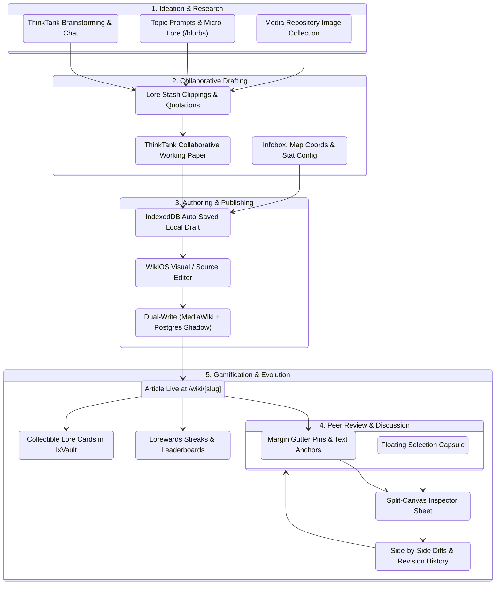

# The Complete Lore Lifecycle in IxStates: Ideation to Canon

**Document Version:** 1.0.0  
**Last Updated:** August 2026  
**Status:** Canonical System Guide  
**Subsystems Involved:** ThinkTanks (`/thinktanks`), Lore Stashes (`/stashes`), Blurbs (`/blurbs`), WikiOS (`/wiki`), Commons Repository (`/wiki/repository`), Lorewards (`/wiki/lorewards`), IxVault (`/vault`)  
**Design Foundations:** Apple Design (`/apple-design`), Emil Kowalski Design Engineering (`/emil-design-eng`), Facet Glass Physics  

---

## 1. System Overview

In IxStates, worldbuilding is an active, collaborative ecosystem. Lore does not start in a vacuum on an empty wiki page; it evolves through a multi-stage lifecycle bridging brainstorming groups, research stashes, dynamic simulation placeholders, instant authoring tools, contextual split-canvas markup, and gamified vault rewards.

```
┌──────────────────────────────────────────────────────────────────────────────────────────────────┐
│                                    THE IXSTATES LORE LIFECYCLE                                   │
│                                                                                                  │
│   [ 1. IDEATE ] ──────► [ 2. DRAFT ] ──────► [ 3. PUBLISH ] ──────► [ 4. REVIEW ] ──────► [ 5. REVISE ] │
│   ThinkTanks &          Working Papers &       WikiOS Instant         Split-Canvas           Revisions & │
│   Lore Stashes          Media Repository       Editor Bridge          Inspector & Pins       Lorewards   │
└──────────────────────────────────────────────────────────────────────────────────────────────────┘
```

---

## 2. Lifecycle Architecture & State Machine



---

## 3. Detailed Stage Breakdown

### Stage 1: Ideation & Research (The Seed)
* **Active Routes:** `/thinktanks`, `/stashes`, `/blurbs`, `/wiki/repository`
* **Workflow:**
  1. **Collaborative Brainstorming**: Writers discuss historical events, cultural movements, or geopolitical pacts in a **ThinkTank** chat channel.
  2. **Clipping & Research**: While reading existing articles, users select text to reveal the **Origin-Aware Selection Capsule** and click `📑 Stash` to save quotes, map coordinates, and factbook figures into a dedicated, color-coded **Lore Stash** collection (e.g. *"Northern War Research"*).
  3. **Visual Asset Curation**: Sourcing coats of arms, battle maps, flags, and photographs from the **Commons Repository** (`/wiki/repository`).
  4. **Micro-Lore Prompts**: Responding to Topic-Tuesday writing prompts in `/blurbs`, linking initial concepts.

---

### Stage 2: Collaborative Drafting (The Workshop)
* **Active Routes:** ThinkTank Papers Tab (`CollaborativeDoc`), `/stashes`
* **Workflow:**
  1. **Working Paper Collaboration**: Team members co-author long-form text in a shared ThinkTank collaborative document with live version history.
  2. **Data Placeholders**: Embedding live national simulation tags (e.g. `{{MyCountry:GDP}}`, `{{CountryData:population}}`, map coordinate pills) so the article stays synchronized with game engine data.
  3. **Local-First Draft Storage**: Automatic offline persistence via IndexedDB (`draft-store.ts`) ensures zero loss of work if a tab is accidentally closed.

---

### Stage 3: Authoring & Instant Publishing (The Synthesis)
* **Active Routes:** WikiOS Editor Bridge (`WikiEditBridge` at `/wiki/[slug]/edit` or in-place modal)
* **Workflow:**
  1. **Visual & Source Editing**:
     - Switch seamlessly between the WYSIWYG rich text editor and the **CodeMirror 6** wikitext source editor.
     - Insert templates using modular dialogs (`InfoboxCountryModal`, `BusinessStatsModal`, `MapCoordsModal`).
  2. **1-Click Publishing**:
     - Saves through a resilient **dual-write pipeline**: writes canonically to MediaWiki while immediately updating the local PostgreSQL shadow (`WikiArticle` & `WikiRevision`).
     - Triggers instant cache warmup and announces the publication with rich previews on **ThinkPages** social feeds.

---

### Stage 4: Reading, Discourse & Markup (The Living Article)
* **Active Routes:** `/wiki/[slug]` with the **Split-Canvas Inspector**
* **Workflow:**
  1. **Ambient Spatial Reading**: As readers explore the article, **Margin Gutter Pins** glow beside paragraphs and infobox sections that have open notes or debates.
  2. **Contextual Text Markup**: Selecting any text reveals the **Origin-Aware Selection Capsule**:
     ```
              ┌───────────────────────────────────────────────────┐
              │  [🟡 🟢 🔵]  │  💬 Comment  │  📑 Stash  │  🔗 Link  │
              └─────────────────────────┬─────────────────────────┘
                                        ▼
     "The treaty established a demilitarized frontier along the river..."
     ```
  3. **Slide-Over Inspector Workspace**: Clicking a gutter pin or pressing hotkey `T` slides out the **Split-Canvas Inspector**:
     - **💬 Discussions**: Structured threads anchored to specific headings to resolve historical ambiguities or suggest revisions.
     - **✏️ Markup**: Highlighting passages and proposing exact replacement wikitext.
     - **📑 Stash**: Personal and team bookmark management.
  4. **Hold-to-Resolve**: Once editors agree on a clarification, they hold the `[ Hold to Resolve ]` button (with progress fill animation) to close the thread and update the text.

---

### Stage 5: Gamification, Evolution & Canonization (The Legacy)
* **Active Routes:** `/wiki/lorewards`, `/vault`, `/wiki/history/[slug]`, `/wiki/diff`
* **Workflow:**
  1. **Lorewards Scoring**: The automated scoring engine evaluates the article based on prose quality, structural completeness, citations, and reader engagement, awarding daily/weekly medals and streak increments.
  2. **IxVault Lore Cards**: Outstanding articles unlock collectible **Lore Cards** that can be minted, traded, or slotted into national government portfolios to provide passive economic or diplomatic boosts.
  3. **Continuous Revision History**: Revisions are tracked with high-resolution visual diffs (`/wiki/diff`), allowing rollbacks and transparent audit trails as world lore evolves.

---

## 4. Apple Design & Design Engineering Touchpoints

| Phase | Apple Interaction Principle | Tactile Implementation in WikiOS |
| :--- | :--- | :--- |
| **Ideation** | Direct Manipulation & Restraint | 1-click selection capsule (`scale(0.95) -> 1.0`) with zero unnecessary menus |
| **Drafting** | Spatial Consistency & Safety | Seamless IndexedDB draft persistence with zero-lag live preview |
| **Publishing** | Feedback & Predictability | Sub-300ms transition with instant `soundEffects.success()` audio feedback |
| **Review** | Fluid Continuity & Translucency | Slide-over inspector (`backdrop-filter: blur(24px)`) that never hides the article |
| **Resolution** | Forgiveness & Tactile Commits | 1.2s progressive hold-to-resolve with interruptible release fallback |

---

## 5. Cross-System Data Flow

```
[ ThinkTank Working Paper ]
             │ (Export Draft)
             ▼
[ WikiEditBridge (Visual/Source) ] ──► [ Dual-Write (MediaWiki + Postgres) ]
                                                       │
                                                       ▼
                                            [ WikiArticle (Postgres) ]
                                                       │
                         ┌─────────────────────────────┼─────────────────────────────┐
                         ▼                             ▼                             ▼
              [ Split-Canvas Inspector ]     [ Lorewards Scoring ]         [ IxVault Lore Cards ]
              (Discussions & Markup)         (Daily/Weekly Medals)         (Prestige & Trade)
```
