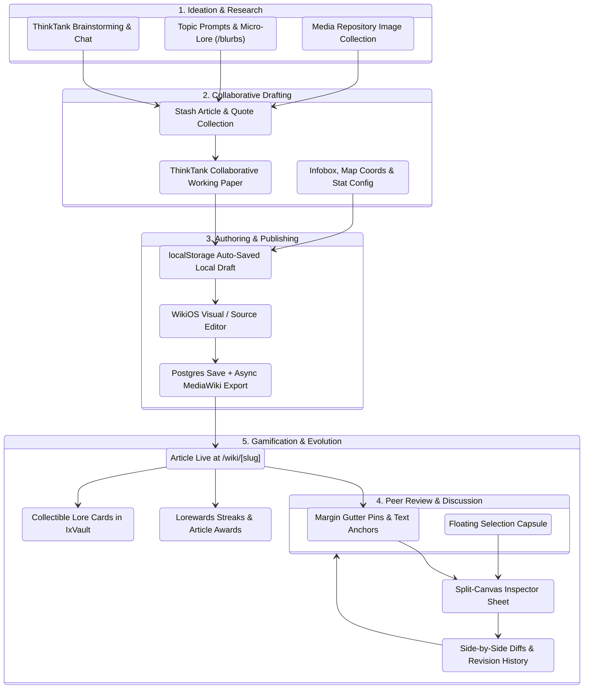

# 📖 The Complete Lore Lifecycle in IxStates: Ideation to Canon

**Document Version:** 1.4.0  
**Last Updated:** September 2026  
**Status:** Canonical System Guide  
**Subsystems Involved:** ThinkTanks (`/thinktanks`), Stash System (`/stashes`), Sovereign Feed (`/dashboard`), WikiOS (`/wiki`), Margin (`/wiki/[slug]?margin=threads`), Image Repository (`/util/repository`), Lorewards (`/util/lorewards`), Vault (`/vault`)  
**Design Foundations:** Apple Design (`/apple-design`), Emil Kowalski Design Engineering (`/emil-design-eng`), Facet Design System (`/facet-design-system`)  

---

## 1. System Overview

In IxStates, worldbuilding is an active, collaborative ecosystem. Lore does not start in a vacuum on an empty wiki page; it evolves through a multi-stage lifecycle bridging brainstorming groups, research stashes, dynamic simulation placeholders, instant authoring tools, contextual split-canvas markup, and gamified vault rewards.

```
┌──────────────────────────────────────────────────────────────────────────────────────────────────┐
│                                    THE IXSTATES LORE LIFECYCLE                                   │
│                                                                                                  │
│   [ 1. IDEATE ] ──────► [ 2. DRAFT ] ──────► [ 3. PUBLISH ] ──────► [ 4. REVIEW ] ──────► [ 5. REVISE ] │
│   ThinkTanks &          Working Papers &       WikiOS Canvas          Margin Inspector &     Revisions & │
│   Stash System          Image Repository       Editor Bridge          Gutter Pins            Lorewards   │
└──────────────────────────────────────────────────────────────────────────────────────────────────┘
```

---

## 2. Lifecycle Architecture & State Machine


```mermaid
stateDiagram-v2
    direction TB
    
    state "1. Ideation & Research" as Phase1 {
        ThinkTankChat: ThinkTank Brainstorming & Chat
        BlurbsPrompt: Topic Prompts & Micro-Lore (/blurbs)
        Stash: Stash Article & Quote Collection
        Repository: Media Repository Image Collection
        
        ThinkTankChat --> Stash
        BlurbsPrompt --> Stash
        Repository --> Stash
    }
    
    state "2. Collaborative Drafting" as Phase2 {
        WorkingDoc: ThinkTank Collaborative Working Paper
        TemplateConfig: Infobox, Map Coords & Stat Config
        LocalDraft: localStorage Auto-Saved Local Draft
        
        Stash --> WorkingDoc
        WorkingDoc --> LocalDraft
        TemplateConfig --> LocalDraft
    }
    
    state "3. Authoring & Publishing" as Phase3 {
        VisualEditor: WikiOS Visual / Source Editor
        MediaWikiSave: Postgres Save + Async MediaWiki Export
        ArticleLive: Article Live at /wiki/[slug]
        
        LocalDraft --> VisualEditor
        VisualEditor --> MediaWikiSave
        MediaWikiSave --> ArticleLive
    }
    
    state "4. Peer Review & Discussion" as Phase4 {
        Inspector: Split-Canvas Inspector Sheet
        GutterPins: Margin Gutter Pins & Text Anchors
        SelectionPill: Floating Selection Capsule
        
        ArticleLive --> GutterPins
        GutterPins --> Inspector
        SelectionPill --> Inspector
    }
    
    state "5. Gamification & Evolution" as Phase5 {
        WikiAwards: Lorewards Streaks & Article Awards
        LoreCards: Collectible Lore Cards in IxVault
        RevisionSync: Side-by-Side Diffs & Revision History
        
        Inspector --> RevisionSync
        ArticleLive --> WikiAwards
        ArticleLive --> LoreCards
        RevisionSync --> Phase4
    }
```

---

## 3. Detailed Stage Breakdown

### Stage 1: Ideation & Research (The Seed)
* **Active Routes:** `/thinktanks`, `/stashes`, `/blurbs`, `/util/repository`
* **Workflow:**
  1. **Collaborative Brainstorming**: Writers discuss historical events, cultural movements, or geopolitical pacts in a **ThinkTank** chat channel.
  2. **Clipping & Research**: While reading existing articles, users select text to reveal the **Origin-Aware Selection Capsule** and click `📑 Stash` to save the quote into a color-coded **Stash** collection (e.g. *"Northern War Research"*).
  3. **Visual Asset Curation**: Sourcing coats of arms, battle maps, flags, and photographs from the **Commons Repository** (`/util/repository`).
  4. **Micro-Lore Prompts**: Responding to Topic-Tuesday writing prompts in `/blurbs`, linking initial concepts.

---

### Stage 2: Collaborative Drafting (The Workshop)
* **Active Routes:** ThinkTank Papers Tab (`ThinktankPapersTab`), `/stashes`
* **Workflow:**
  1. **Working Paper Collaboration**: Team members co-author long-form text in a shared ThinkTank collaborative document with live version history.
  2. **Data Placeholders**: Embedding live national simulation tags (e.g. `{{MyCountry:GDP}}`, `{{CountryData:population}}`, map coordinate pills) so the article stays synchronized with game engine data.
  3. **Local-First Draft Storage**: Automatic persistence in `localStorage` (`src/lib/wiki-os/editor/draft-store.ts`, keys `wikios_draft:<source>:<title>`) keeps work if a tab is accidentally closed.

---

### Stage 3: Authoring & Instant Publishing (The Synthesis)
* **Active Routes:** WikiOS Editor Bridge (`WikiEditBridge` at `/wiki/<title>?action=edit` or in-place modal)
* **Workflow:**
  1. **Visual & Source Editing**:
     - Switch between the Plate visual editor and the **CodeMirror 6** wikitext source editor.
     - Insert templates from the slash menu or modular dialogs (`InfoboxCountryModal`, `CountryStatsModal`, `BusinessStatsModal`, `MapCoordsModal`).
  2. **1-Click Publishing**:
     - Saves to PostgreSQL first (`ArticleRepository.saveArticle` → `WikiArticle` & `WikiRevision`, link graph, media registry), then mirrors the edit to classic MediaWiki in the background (a `WikiMirrorJob` outbox row written in the same transaction, applied by `services/mirror-worker.ts`).
     - Purges the Cloudflare edge cache for the page; wiki activity appears in the dashboard feed (`WikiFeedCard`).

---

### Stage 4: Reading, Discourse & Markup (The Living Article)
* **Active Routes:** `/wiki/[slug]` with the **Split-Canvas Inspector**
* **Workflow:**
  1. **Ambient Spatial Reading**: As readers explore the article, **Margin Gutter Pins** glow beside paragraphs and infobox sections that have open notes or debates.
  2. **Contextual Text Markup**: Selecting any text reveals the **Origin-Aware Selection Capsule**:
     ```
              ┌─────────────────────────────────────────────────────────────┐
              │  [6 colors] │ Comment │ Suggest │ Stash │ Share │ Copy      │
              └──────────────────────────────┬──────────────────────────────┘
                                             ▼
     "The treaty established a demilitarized frontier along the river..."
     ```
  3. **Slide-Over Inspector Workspace**: Clicking a gutter pin or pressing hotkey `T` (or `I`) slides out the **Split-Canvas Inspector**:
     - **💬 Threads**: Structured threads anchored to specific headings; replies can carry a suggested replacement.
     - **✏️ Markup**: Highlights and notes on passages.
     - Stashing is done from the selection capsule; the drawer has no Stash tab.
  4. **Hold-to-Resolve**: Once editors agree on a clarification, they hold the `[ Hold to Resolve ]` button (with progress fill animation) to close the thread. Article text is edited separately in the editor.

---

### Stage 5: Gamification, Evolution & Canonization (The Legacy)
* **Active Routes:** `/util/lorewards`, `/vault`, `/util/history/[slug]`, `/util/diff`
* **Workflow:**
  1. **Lorewards Scoring**: The scoring engine (`src/lib/lorewards/scoring.ts`) weighs bytes added, prose ratio, edit depth, new-article novelty, inbound-link importance, and cross-country collaboration. Daily/weekly/monthly results and streaks are synced from the Discord Lorewards bot.
  2. **IxVault Lore Cards**: Wiki articles can be turned into collectible **Lore Cards** (`lore-cards` router) that are collected and traded in IxVault. *(Slotting cards into government portfolios for passive boosts is not implemented.)*
  3. **Continuous Revision History**: Revisions are tracked with visual diffs (`/util/diff`), allowing rollbacks and transparent audit trails as world lore evolves.

---

## 4. Apple Design & Design Engineering Touchpoints

| Phase | Apple Interaction Principle | Tactile Implementation in WikiOS |
| :--- | :--- | :--- |
| **Ideation** | Direct Manipulation & Restraint | 1-click selection capsule (`scale(0.95) -> 1.0`) with zero unnecessary menus |
| **Drafting** | Spatial Consistency & Safety | localStorage draft persistence with live preview |
| **Publishing** | Feedback & Predictability | Sub-300ms transition with instant save feedback |
| **Review** | Fluid Continuity & Translucency | Slide-over inspector (`backdrop-filter: blur(24px)`) that never hides the article |
| **Resolution** | Forgiveness & Tactile Commits | 0.9s progressive hold-to-resolve with interruptible release fallback and `soundEffects.success()` |

---

## 5. Cross-System Data Flow

```
[ ThinkTank Working Paper ]
             │ (Export Draft)
             ▼
[ WikiEditBridge (Visual/Source) ] ──► [ Postgres Save + Async MediaWiki Export ]
                                                       │
                                                       ▼
                                            [ WikiArticle (Postgres) ]
                                                       │
                         ┌─────────────────────────────┼─────────────────────────────┐
                         ▼                             ▼                             ▼
              [ Split-Canvas Inspector ]     [ Lorewards Scoring ]         [ IxVault Lore Cards ]
              (Discussions & Markup)         (Daily/Weekly Medals)         (Prestige & Trade)
```
