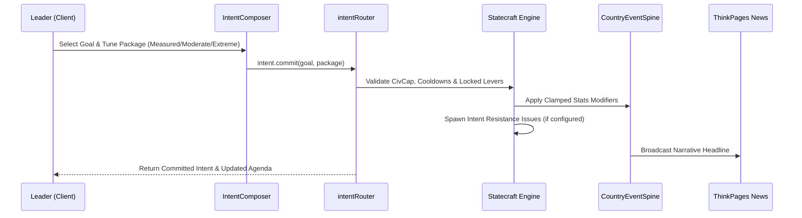

# 🏛️ MyCountry Suite — Executive Simulation & Governance

**Parent App Suite:** MyCountry Suite (`MYCOUNTRY_VERSION = 5`)  
**Engine:** Statecraft Simulation Engine (`MYCOUNTRY_ENGINE_VERSION = 4`)  
**Primary Action:** `GOVERN` | **Domain Accent:** Amber Gold (`#F59E0B` / `--color-amber-500`)  
**Route:** `/mycountry` | **Status:** 📀 Gold Master (100% Ready)  

The MyCountry Suite provides sovereign leaders with an executive command environment. Built around the single-page **Command Surface** architecture, it unifies decision-making, foreign relations, macroeconomic planning, and legislative governance into an action-first workflow.

> **Active Public Domains:** **Identity**, **Economy**, **Politics**, and **Diplomacy**.  
> *(Defense & Intelligence modules are currently in developer preview and gated from public navigation).*

---

## Single Production Command Surface Architecture

MyCountry has fully unified around the single production **Command Surface** (`CommandSurface.tsx`), removing all legacy multi-page tab switches and fragmented war rooms.

```
┌────────────────────────────────────────────────────────────────────────┐
│               COMMAND SURFACE (src/components/mycountry/)              │
├───────────────────────────────────┬────────────────────────────────────┤
│ 1. Header & Actions Strip         │ Compact StateSeal, Name, Leader,   │
│    CommandNavToggle.tsx           │ Primary "Declare Directive" CTA    │
├───────────────────────────────────┼────────────────────────────────────┤
│ 2. Telemetry Standing Bands       │ Approval, Stability, CivCap Bands  │
│    StandingBands.tsx              │ Vitality Rings & Composite Scores  │
├───────────────────────────────────┼────────────────────────────────────┤
│ 3. Main Action Feed               │ Realtime Agenda, Horizon Strip,    │
│    ExecutiveAgenda.tsx            │ Crisis Priority Hero, Issue Briefs │
├───────────────────────────────────┼────────────────────────────────────┤
│ 4. Domain Command Surfaces        │ Full-page modes for Diplomacy,     │
│    DomainSurface.tsx              │ Defense, Politics, and Economy     │
├───────────────────────────────────┼────────────────────────────────────┤
│ 5. Slide-Over Drill Sheets        │ Deep policy tuning, legislature    │
│    DrillSheets.tsx                │ config, and relations inspection   │
└───────────────────────────────────┴────────────────────────────────────┘
```

### Key Component Architecture
- `CommandSurface.tsx` – Master viewport wrapper and shell orchestration
- `ExecutiveHome.tsx` – Action-first dashboard housing telemetry and priority issues
- `ExecutiveAgenda.tsx` – 7-day IxTime horizon calendar and commitment tree
- `ExecutiveOpportunityHero.tsx` – Spotlight hero prioritizing critical national crises
- `DomainSurface.tsx` – Specialized domain view for Diplomacy, Defense, Politics, Economy
- `DomainContextRail.tsx` – Contextual KPI trends and event activity logs
- `DrillSheets.tsx` – Slide-over sheets for deep parameter adjustment
- `IssueDetailBrief.tsx` – 4-branch issue resolution brief modal
- `ExecutiveConsole.tsx` – Directive package composer and diff preview console
- `CommitmentsAgendaRail.tsx` – Active directive rollout tree rail

---

## Statecraft Engine & Directives Architecture

A foundational rule of the platform:
- **Frontend (UI)**: **Directives** is the universal user-facing brand across all UI components, buttons, and dialogs (`"Declare Directive"`, `"Tune Custom Directive"`, `"Executive Directives Agenda"`).
- **Backend (Engine)**: The **Statecraft Simulation Engine** (`src/lib/statecraft-*.ts`, `src/server/api/routers/intent.ts`) powers intent parsing, power broker alignments, civil capacity throughput, and recon research.



### Civil Service Capacity (CivCap)
- Directives and active policies consume CivCap (`Allocated / Total`).
- Reactive policies (created in response to issues or broker requests) receive a **25% CivCap upkeep discount** and **15% maintenance discount**.
- Over-extended CivCap activates **Information Fog**, masking exact numeric effects and presenting qualitative bands (*"Mild Positive"*, *"Strong Negative"*).

---

## Grounded Issue Generator & Delegation Engine

The National Issues engine (`src/lib/national-issues-engine.ts`, `src/server/api/routers/national-issues/`) generates real-time decisions:

1. **Focused Grounding**: `buildCountrySnapshot` resolves live PostGIS `ST_Touches` neighbors, active cabinet ministers, capital city, and trade partners to dynamically inject real names (`{{neighborName}}`, `{{ministerName}}`, `{{capitalCity}}`) into issue templates.
2. **4-Branch Issue Brief Resolution**:
   - `1a. Delegate`: Consumes 15 CivCap to hand off non-urgent issues to the civil service for 5 game days.
   - `1b. Resolve Brief`: Direct action picking one of the evaluated response options.
   - `1c. Set Cabinet Meeting`: Schedules deliberation (+7 IxTime days) to bypass slot cooldowns.
   - `1d. Make Directive`: Promotes the issue directly into the `IntentComposer` to draft a formal national directive.
3. **Intent ↔ Issues Resistance Rhythm**: Committing extreme directives can spawn linked resistance issues, requiring leaders to manage political pushback before completing national goals.

---

## Cabinet Meetings & Decisions Subsystem

- Managed via `src/server/api/routers/quickactions/meetings.ts` and `src/components/executive/MeetingDetailModal.tsx`.
- Finalizing a meeting automatically completes the associated `ActivitySchedule`, recording strategic, budget, or policy decisions and logging consequences through the `CountryEventSpine`.

---

## Vitality Tracking & Governance Ledger

- **Server-Side Computation**: `calculateVitalityScores` in `src/server/shared/mycountry-helpers.ts` computes Economic Vitality, Population Wellbeing, Diplomatic Standing, and Governmental Efficiency. Clients cannot forge vitality numbers.
- **Time-Series Snapshots**: Periodic `VitalitySnapshot` records provide historical trend charts.
- **Country Change Log Timeline**: Every stat modification is permanently recorded in an immutable ledger, ensuring total transparency against unearned stat inflation ("Burg's Guardrail").

---

## Related Documentation

- [Design Philosophy & Statecraft PRDs](./mycountry-design-philosophy-and-prds.md)
- [Community Feedback Audit](./community-feedback-audit.md)
- [Economic Calculations Guide](./calculations.md)
- [Diplomacy System Guide](./diplomacy.md)
- [API Reference: MyCountry & Intent Routers](../reference/api-complete.md#mycountry-router)
