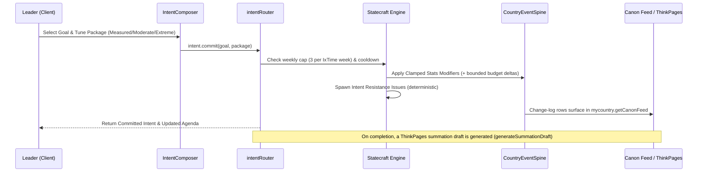

# 🏛️ MyCountry Suite — Executive Simulation & Governance

**Parent App Suite:** MyCountry Suite (`MYCOUNTRY_VERSION = 6`)  
**Engine:** Statecraft Simulation Engine (`MYCOUNTRY_ENGINE_VERSION = 4`)  
**Primary Action:** `GOVERN` | **Domain Accent:** Amber Gold (`#F59E0B` / `--color-amber-500`)  
**Route:** `/mycountry` | **Status:** see [SYSTEM_STATUS.md](SYSTEM_STATUS.md); the command surface is live, but Politics, Diplomacy, Economy and National Issues are 🟡 Partial (loops below)  

The MyCountry Suite provides sovereign leaders with an executive command environment. Built around the single-page **Command Surface** architecture, it unifies decision-making, foreign relations, macroeconomic planning, and legislative governance into an action-first workflow.

> **Open to every player:** **Overview/Executive**, **Economy**, **Politics**, and **Diplomacy** (`src/lib/auth/ability.ts`).  
> *(**Defense** — which also serves `/mycountry/intelligence` — and the **Map Editor** are premium-gated: locked behind `PremiumPreviewFrame`. The sidebar-hiding rule (hidden for non-premium users unless an admin enables the teaser via `api.admin.getNavigationSettings`) lives in `MyCountrySidebarNav`, which is imported only as a type and never rendered, so that gating is not active.)*

---

## Single Production Command Surface Architecture

MyCountry has fully unified around the single production **Command Surface** (`CommandSurface.tsx`), removing all legacy multi-page tab switches and fragmented war rooms.

```
┌────────────────────────────────────────────────────────────────────────┐
│            COMMAND SURFACE (src/components/mycountry/shell/)           │
├───────────────────────────────────┬────────────────────────────────────┤
│ 1. Header & Actions Strip         │ Compact StateSeal, Name, Leader,   │
│    headers/UnifiedGlassCommandBar │ Primary "Declare Directive" CTA    │
├───────────────────────────────────┼────────────────────────────────────┤
│ 2. Telemetry Standing Bands       │ Approval, Stability, Directive Slots│
│    StandingBands.tsx              │ Vitality Rings & Composite Scores  │
├───────────────────────────────────┼────────────────────────────────────┤
│ 3. Main Action Feed               │ Realtime Agenda, Horizon Strip,    │
│    ExecutiveHome.tsx              │ Crisis Priority Hero, Issue Briefs │
├───────────────────────────────────┼────────────────────────────────────┤
│ 4. Domain Command Surfaces        │ Full-page modes for Diplomacy,     │
│    DomainSurface.tsx              │ Defense, Politics, and Economy     │
├───────────────────────────────────┼────────────────────────────────────┤
│ 5. Slide-Over Drill Sheets        │ Deep policy tuning, legislature    │
│    DrillSheets.tsx                │ config, and relations inspection   │
└───────────────────────────────────┴────────────────────────────────────┘
```

### Key Component Architecture
All under `src/components/mycountry/shell/` unless noted.
- `CommandSurface.tsx` – Master viewport wrapper and shell orchestration
- `ExecutiveHome.tsx` – Action-first dashboard housing telemetry and priority issues
- `ExecutiveAgenda.tsx` – 7-day IxTime horizon calendar and commitment tree
- `ExecutiveOpportunityHero.tsx` – Spotlight hero prioritizing critical national crises
- `DomainSurface.tsx` – Specialized domain view for Diplomacy, Defense, Politics, Economy
- `DomainContextRail.tsx` – Contextual KPI trends and event activity logs
- `DrillSheets.tsx` – Slide-over sheets for deep parameter adjustment
- `shared/headers/IssueDetailBrief.tsx` – 4-branch issue resolution brief modal
- `ExecutiveConsole.tsx` – Directive package composer and diff preview console (wraps `shared/primitives/IntentComposer.tsx`)
- `rails/` – Per-domain context rails (`EconomyRail`, `PoliticsRail`, `RelationsRail`, `DefenseRail`)
- `MyCountryRouter.tsx` / `MyCountrySidebarNav.tsx` – Single-page section router and nav (the component is not rendered today; only its `MyCountrySection` type is used)

---

## Statecraft Engine & Directives Architecture

A foundational rule of the platform:
- **Frontend (UI)**: **Directives** is the universal user-facing brand across all UI components, buttons, and dialogs (`"Declare Directive"`, `"Tune Custom Directive"`, `"Executive Directives Agenda"`).
- **Backend (Engine)**: The **Statecraft Simulation Engine** (`src/lib/statecraft/*.ts`, `src/lib/intent/*.ts`, `src/server/api/routers/intent.ts`) powers intent parsing, power broker alignments, civil capacity throughput, and recon research.


```mermaid
sequenceDiagram
    participant Player as Leader (Client)
    participant UI as IntentComposer
    participant Router as intentRouter
    participant Engine as Statecraft Engine
    participant Ledger as CountryEventSpine
    participant Feed as Canon Feed / ThinkPages

    Player->>UI: Select Goal & Tune Package (Measured/Moderate/Extreme)
    UI->>Router: intent.commit(goal, package)
    Router->>Engine: Check weekly cap (3 per IxTime week) & cooldown
    Engine->>Ledger: Apply Clamped Stats Modifiers (+ bounded budget deltas)
    Engine->>Engine: Spawn Intent Resistance Issues (deterministic)
    Ledger->>Feed: Change-log rows surface in mycountry.getCanonFeed
    Router-->>Player: Return Committed Intent & Updated Agenda
    Note over Router,Feed: On completion, a ThinkPages summation draft is generated (generateSummationDraft)
```

### Civil Service Capacity (CivCap)
- CivCap usage (`Allocated / Total`, `national-issues/player.ts`, `policies/crud.ts`) sums government staffing, pending recon, delegated (dismissed) issues (15 each) and active **policies** (`policy.civCapCost`). Directives do not consume CivCap: `intent.ts` neither stores nor consumes `civCapCost`; directives are limited by the 3-per-IxTime-week cap and cooldown.
- The third Standing Band is directive slots used this IxTime week (`intent.getStatus`), not CivCap. Approval and Stability read the stored country values and fall back to hard-coded defaults.
- Reactive policies (created in response to issues or broker requests) receive a **25% CivCap upkeep discount** and **15% maintenance discount**.
- Over-extended CivCap (or government effectiveness below 45%) raises **Information Fog** warnings in the policy creator (`PolicyReconBanner.tsx`: *"Preview estimates may be inaccurate"*, *"Detail Tracking Obscured"*). Numeric effects are not yet masked into qualitative bands.

---

## Grounded Issue Generator & Delegation Engine

The National Issues engine (`src/lib/national-issues/`, `src/server/api/routers/national-issues/`) generates real-time decisions:

1. **Focused Grounding**: `buildCountrySnapshot` (`country-snapshot.ts`, `neighbors.ts`) resolves live PostGIS `ST_Touches` neighbors, active cabinet ministers, capital city, and trade partners to dynamically inject real names (`{{neighborName}}`, `{{ministerName}}`, `{{capitalCity}}`) into issue templates.
2. **4-Branch Issue Brief Resolution**:
   - `1a. Delegate`: `nationalIssues.dismiss` — consumes 15 CivCap to hand off non-urgent issues to the civil service for 5 IxTime days.
   - `1b. Resolve Brief`: Direct action picking one of the evaluated response options.
   - `1c. Set Cabinet Meeting`: `quickActions.createMeeting` schedules a cabinet meeting on next week's agenda.
   - `1d. Make Directive`: Promotes the issue directly into the `IntentComposer` to draft a formal national directive.
3. **Intent ↔ Issues Resistance Rhythm**: Committing extreme directives can spawn linked resistance issues, requiring leaders to manage political pushback before completing national goals.
4. **Consequences** (`src/lib/national-issues/consequences.ts`): approval, stability and the other `Country` / `GovernmentStructure` / `InternalStabilityMetrics` fields are written through `CountryEventSpine` (bounded, logged to `CountryChangeLog`); `publicApproval` and `stabilityScore` land in the columns the Standing bands read. A stability consequence is skipped when the country has no `InternalStabilityMetrics` row yet. GDP, GDP-growth and population consequences become StorytellerEffects the economy projection applies (see [calculations](./calculations.md#level-effects-national-issue-consequences)) and so move the headline GDP; consequences with no faithful mapping are dropped from the log and the recon preview.

---

## Cabinet Meetings Subsystem

- Scheduling via `src/server/api/routers/quickactions/meetings.ts` (`createMeeting`, which also writes an `ActivitySchedule` row) and `src/server/api/routers/meetings/` (`createMeeting`, `getMeetings`, `addAgendaItem`, `recordAttendance`, officials). UI: `src/components/executive/actions/MeetingScheduler.tsx`.
- Meetings are **schedule-only today**: the complete/decide/implement mutations were deleted as zero-caller procedures (plans 312/332), so meeting outcomes are not yet recorded or routed through the `CountryEventSpine`.

---

## Vitality Tracking & Governance Ledger

- **Server-Side Computation**: `calculateVitalityScores` in `src/server/shared/mycountry-helpers.ts` computes Economic Vitality, Population Wellbeing, Diplomatic Standing, and Governmental Efficiency. Clients cannot forge vitality numbers, but the inputs are the stored `current*` values, which do not progress on their own. "Diplomatic Standing" reads fields that do not exist on `Country` (`globalDiplomaticInfluence`, `tradeRelationshipStrength`, `allianceStrength`, `diplomaticTensions`) via `(country as any)`, so it always evaluates to the fallback constant (70). "Governmental Efficiency" is the economic tier score times 0.8 and ignores government structure.
- **Trend History**: Trend charts read `HistoricalDataPoint` rows (`api.historical.getCountryHistory`). The `VitalitySnapshot` model exists but nothing writes it yet.
- **Country Change Log**: Stat changes routed through `CountryEventSpine.recordCountryEvent` (`src/lib/activity/event-spine.ts` — issues, intents, policy maintenance) are written to `CountryChangeLog` and surfaced on the overview via `mycountry.getCanonFeed` ("Burg's Guardrail"). Not every mutating action goes through the spine yet.

---

## Multi-nation ownership and other notes

- Ownership is realm-scoped (`src/server/modules/realms/realms.ownership.ts`, `maxNationsPerUser` per realm, `users.setActiveNation`, `PlayAsNation.tsx`). The builder creates only in the default realm and is one nation per account; `countries.createCountry` silently returns the user's existing nation (`countries/management/create.ts`) instead of creating another. `users.createCountry` (`users/country-linking.ts`, marked legacy) is a second creation path with no UI.
- Two gameplay flags default off: `ISSUES_ENFORCE_DEADLINES` and `ISSUES_AWARD_CREDITS`. Issue content comes from `data/national-issues-config.json`.
- Stat surfaces mix projections and stored values: MyCountry shows the projection, while rankings, vitality and passive income read the stored `current*` columns. The `stat-progression` cron job persists the projection into those columns (see [economy](./economy.md)); until it is enabled in `CRON_ENABLED_JOBS` they move only on the admin recalculation.
- Other statecraft code: `src/lib/statecraft/stability-formulas.ts` (used by `security/stability.ts`), `calendar.ts` and `growth-calculations.ts`.

---

## Related Documentation

- [Design Philosophy & Statecraft PRDs](./mycountry-design-philosophy-and-prds.md)
- [Community Feedback Audit](./community-feedback-audit.md)
- [Economic Calculations Guide](./calculations.md)
- [Diplomacy System Guide](./diplomacy.md)
- [API Reference: MyCountry & Intent Routers](../reference/api-complete.md#operations)
