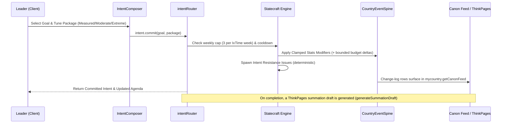

# 🏛️ MyCountry Suite — Executive Simulation & Governance

**Parent App Suite:** MyCountry Suite (`MYCOUNTRY_VERSION = 6`)  
**Engine:** Statecraft Simulation Engine (`MYCOUNTRY_ENGINE_VERSION = 4`)  
**Primary Action:** `GOVERN` | **Domain Accent:** Amber Gold (`#F59E0B` / `--color-amber-500`)  
**Route:** `/mycountry` | **Status:** see [SYSTEM_STATUS.md](SYSTEM_STATUS.md); the command surface is live, but Politics, Diplomacy, Economy and National Issues are 🟡 Partial (loops below)  

The MyCountry Suite provides sovereign leaders with an executive command environment. Built around the single-page **Command Surface** architecture, it unifies decision-making, foreign relations, macroeconomic planning, and legislative governance into an action-first workflow.

> **Open to every player:** **Overview/Executive**, **Economy**, **Politics**, and **Diplomacy** (`src/lib/auth/ability.ts`).  
> *(**Defense** — which also serves `/mycountry/intelligence` — and the **Map Editor** are premium-gated: locked behind `PremiumPreviewFrame`. The sidebar-hiding rule (hidden for non-premium users unless an admin enables the teaser via `api.admin.getNavigationSettings`) lives in `MyCountrySidebarNav`, which is imported only as a type and never rendered, so that gating is not active.)*

---

## Single Production Command Surface Architecture

MyCountry has fully unified around the single production **Command Surface** (`CommandSurface.tsx`), removing all legacy multi-page tab switches and fragmented war rooms.

```
┌────────────────────────────────────────────────────────────────────────┐
│            COMMAND SURFACE (src/components/mycountry/shell/)           │
├───────────────────────────────────┬────────────────────────────────────┤
│ 1. Header (large title)           │ Flag + country name, leader/gov't  │
│    headers/UnifiedGlassCommandBar │ footnote, Profile/Edit, primary    │
│                                   │ "Declare Directive" + slot status  │
├───────────────────────────────────┼────────────────────────────────────┤
│ 2. National Standing (vitals)     │ Population, GDP, Approval,         │
│    StandingBands.tsx              │ Stability, CivCap + 4 vitality     │
│                                   │ rings (full width)                 │
├───────────────────────────────────┼────────────────────────────────────┤
│ 3. Overview body                  │ Priority hero, agenda inbox,       │
│    ExecutiveHome.tsx              │ recent activity; rail: World       │
│                                   │ Census, Territory map              │
├───────────────────────────────────┼────────────────────────────────────┤
│ 4. Domain Command Surfaces        │ Full-page modes for Diplomacy,     │
│    DomainSurface.tsx              │ Defense, Politics, and Economy     │
├───────────────────────────────────┼────────────────────────────────────┤
│ 5. Slide-Over Drill Sheets        │ Deep policy tuning, legislature    │
│    DrillSheets.tsx                │ config, and relations inspection   │
└───────────────────────────────────┴────────────────────────────────────┘
```

### Overview layout & design (Facet / Apple HIG)
The overview reads top to bottom as one hierarchy, on an 8pt spacing rhythm (24px between cards):
1. **Header** (`headers/UnifiedGlassCommandBar.tsx`) — large title (flag + country name), a footnote line (leader · government type · economic tier) and a quiet toolbar: Profile and Edit (icon-only on phones, 44px targets) and the one primary action, **Declare Directive**. Under it, one line of directive status: "N of 3 directives left this week" or "Next directive in …" while on cooldown (`intent.getStatus`). On the overview the header also lists the four domains (Diplomacy, Defense, Politics, Economy & Budget); on a domain page or in the directive console it becomes a `FacetTabs` section switcher (MyCountry tone).
2. **National standing** (`StandingBands.tsx`) — full-width vitals: Population (tap for the exact figure), GDP, Approval, Stability, CivCap (with a used/capacity meter), then the four vitality rings. The "Vitality" button opens the breakdown. The country's flag sits behind the card as a circular watermark bleeding off the top-right corner (`FlagWatermark.tsx`).
3. **Priority** (`ExecutiveOpportunityHero.tsx`) — the one thing most worth the leader's attention, dismissible for the session, with the priority's own glyph as a faint fine-stroke watermark in the bottom-right corner.
4. **Agenda** (`ExecutiveAgenda.tsx`) and **Recent activity** (`ExecutiveRecordFeed.tsx`) in the main column; **World Census** and **Territory** in the rail.

**Agenda inbox.** The agenda is an inbox, not a calendar. Items are derived from live state (`agenda/deriveAgendaItems.ts`): open national issues (an issue's deadline is folded into its row), active directives and upcoming elections. Each row shows an unread dot and the source glyph, the title (bold while unread), a one-line preview after the source label, and a relative time ("2h ago", from when the item arrived) or deadline pressure ("Overdue", "Due soon", "Upcoming") — never a calendar date, weekday or "today". Urgent items (critical/high issues, urgency over 70, a deadline within two IxDays or past, an election within seven IxDays) carry a flag and form the **Needs action** mailbox. Mailboxes are a `SegmentedControl` — All · Needs action · Issues · Directives · Elections, with counts — showing only mailboxes that have items. Order: overdue, due soon, flagged, then newest. Opening an item (the `AgendaEventActionDialog`: suggested directive, issue brief or details) marks it read; the dialog also offers **Mark as unread**, **Snooze a day**, **Snooze a week** and **Done**, and on touch rows swipe (read/unread right; snooze or done left, full swipe = done). **Mark all as read** sits in the header next to the unread count. Snoozed and done items collapse into a "Show N snoozed and M done" disclosure where they can be moved back to the inbox. Read/done/snooze flags live in this browser per country (`localStorage` key `ixstats:agenda-inbox:<countryId>`, `agenda/inboxState.ts`, synced across tabs); each flag is tied to a version of the item (issue severity + deadline, directive tier, election status + scheduled time), so an item that escalates or moves comes back unread, snoozes expire in real time and come back unread, and flags for items that no longer exist are pruned. A directive you declared starts read; an issue you have viewed on the server starts read. With nothing waiting the card shows **Inbox zero** with Declare Directive.

**World Census.** The rail card shows the five ranks where the nation stands out most (`sortCensusByRelevance`: best rank percentile first, then the better absolute position, then the headline order Total GDP → GDP per capita → Population → Approval → Stability → GDP growth → Diplomatic standing → Infrastructure → Debt → Income equality), as compact plain `FacetRow`s, with the rest behind a **See N more / See less** disclosure (`aria-expanded`, `aria-controls`).

Rules the overview follows:
- **Real data only.** Domain tiles show a real figure when one exists (Politics: stability; Economy: GDP growth from `calculatedStats.gdpGrowth`; Diplomacy: items awaiting an answer) and otherwise a plain description, never a placeholder number. The priority hero skips a card whose figure is missing (defense readiness, embassy counts). The agenda lists only open national issues, active directives and upcoming elections; the fixed sample events it used to show are gone, and an empty inbox says what lands there and offers Declare Directive.
- **Facet primitives, not a local kit.** The header is the shell (`FacetContainer` depth 1); each section (National standing, Priority, Agenda, Recent activity, World Census, Territory) is a `FacetCard` at depth 2 with a `FacetCardHeader` (plain `h2` + footnote) and `FacetCardContent`. Rows, vitals tiles, lists and empty states inside a card are depth-3 `FacetContainer`s with `surface="solid"`, so blur never stacks. Actions are `<Button>` (ghost toolbar, outline domain tiles, ghost list rows, secondary/default card actions); captions are `<Eyebrow>`; the agenda's mailboxes are a `SegmentedControl` and its rows, like the census rows, are plain `FacetList`/`FacetRow`s; census ranks, the unread count and ledger deltas are `<Badge>`s; a wiki-parse result is an `<Alert>`.
- **Colour means something.** The MyCountry gold (`--facet-mycountry`) is reserved for the one primary action (**Declare Directive** in the header, `MYCOUNTRY_PRIMARY_ACTION` in `status-tone.ts`) and for meaningful status: directives, unread agenda items (the tint dot and count), a top-three census rank, the CivCap meter. Critical items use `text-destructive`, warnings orange; everything else, including the four domains, is a plain iconoir glyph in `text-muted-foreground` (no pastel icon tiles, no per-domain palette). `STATUS_TEXT` in `status-tone.ts` holds the mapping. Theme tokens throughout, no `dark:` overrides. Loading states use `<Skeleton>` shaped like the final rows.
- **Light identity flair, restored from the pre-Facet overview (c5c6b382).** The flag as a circular corner watermark on National standing (`FlagWatermark`: ~14% opacity, `mix-blend-luminosity` so it reads as a muted monochrome imprint, `blur-[1px]`, fading toward the content with a CSS `mask-image`); a tint hairline along the header's top edge (`TintHairline`); the priority's glyph as a 160px, 4% watermark (`WatermarkGlyph`); fine-stroke architectural graphics behind the four domain tiles (`ActionCardGraphics.tsx`, strokes ≤1px, `text-label` at 5–8%, a gentle bloom on hover); and on each domain page's hero a tint glow top-right plus the domain glyph at 6% bottom-right. All of it is decorative: `aria-hidden`, `pointer-events-none`, `print:hidden`, behind `relative` content, one opacity for both themes (no `dark:` pairs), and fades use `mask-image`, not gradient classes. The full-width flag wash (`FlagBackdrop`) is gone.
- MyCountry has no private button/card kit: surfaces use the Facet primitives (`FacetCard`/`FacetContainer`, `Button`, `Badge`, `Toggle`, `FacetTabs`, `Eyebrow`). The old `surface-kit.tsx` was removed.
- **Domain pages and drill sheets follow the same rules.** `DomainSurface.tsx` opens with a depth-1 `FacetCard` (plain muted domain glyph, title, blurb, an outline `<Button>` for the domain directive with a gold glyph, over a tint glow and a watermark of the domain glyph); the rails (`rails/shared.tsx`: `RailCard`, `RailRow`, `DomainKpiGrid`, `DomainActivityCard`) are glass `FacetCard`s whose rows and KPI tiles are `surface="solid"`, with `<Badge>` counts and status colours from `status-tone.ts` (plus `success`). The Economy drill-down, Fiscal Policy and Trade & Commerce consoles also render inside `DrillSheets.tsx`, so every card in them is `surface="solid"`; the sheet is the only blurred surface (a Facet guard test pins exactly one `backdrop-blur` in `DrillSheets.tsx`). Sub-tabs use the shared `SectionTabBar` with its neutral active state. Tax and tariff sliders keep a small channel colour dot only where it keys the revenue-composition chart.

### Key Component Architecture
All under `src/components/mycountry/shell/` unless noted.
- `CommandSurface.tsx` – Master viewport wrapper and shell orchestration
- `ExecutiveHome.tsx` – Overview body: national standing, priority hero, agenda, recent activity, rail
- `ExecutiveAgenda.tsx` – Agenda inbox of open issues, active directives and upcoming elections, with read/done/snooze (`agenda/`: `deriveAgendaItems`, `inboxState`, `AgendaEventActionDialog`)
- `WorldCensusCard.tsx` – World Census rail card: top five ranks by relevance, the rest behind "See more"
- `FlagWatermark.tsx` – Decorative flag watermark, tint hairline and glyph watermark; `ActionCardGraphics.tsx` – domain tile watermarks
- `ExecutiveOpportunityHero.tsx` – Spotlight hero prioritizing critical national crises
- `DomainSurface.tsx` – Specialized domain view for Diplomacy, Defense, Politics, Economy
- `DomainContextRail.tsx` – Contextual KPI trends and event activity logs
- `DrillSheets.tsx` – Slide-over sheets for deep parameter adjustment
- `shared/headers/IssueDetailBrief.tsx` – 4-branch issue resolution brief modal
- `ExecutiveConsole.tsx` – The Directives page (`/mycountry/executive`); renders `directives/DirectivesWorkspace.tsx` (see [Directives page](#directives-page-mycountryexecutive))
- `rails/` – Per-domain context rails (`EconomyRail`, `PoliticsRail`, `RelationsRail`, `DefenseRail`)
- `status-tone.ts` – `STATUS_TEXT` (critical / warning / accent / neutral) and the one gold `MYCOUNTRY_PRIMARY_ACTION` class for `<Button>`
- `MyCountryRouter.tsx` / `MyCountrySidebarNav.tsx` – Single-page section router and nav (the component is not rendered today; only its `MyCountrySection` type is used)

---

## Statecraft Engine & Directives Architecture

A foundational rule of the platform:
- **Frontend (UI)**: **Directives** is the universal user-facing brand across all UI components, buttons, and dialogs (`"Declare Directive"`, `"Tune Custom Directive"`, `"Executive Directives Agenda"`).
- **Backend (Engine)**: The **Statecraft Simulation Engine** (`src/lib/statecraft/*.ts`, `src/lib/intent/*.ts`, `src/server/api/routers/intent.ts`) powers intent parsing, power broker alignments, civil capacity throughput, and recon research.


```mermaid
sequenceDiagram
    participant Player as Leader (Client)
    participant UI as IntentComposer
    participant Router as intentRouter
    participant Engine as Statecraft Engine
    participant Ledger as CountryEventSpine
    participant Feed as Canon Feed / ThinkPages

    Player->>UI: Select Goal & Tune Package (Measured/Moderate/Extreme)
    UI->>Router: intent.commit(goal, package)
    Router->>Engine: Check weekly cap (3 per IxTime week) & cooldown
    Engine->>Ledger: Apply Clamped Stats Modifiers (+ bounded budget deltas)
    Engine->>Engine: Spawn Intent Resistance Issues (deterministic)
    Ledger->>Feed: Change-log rows surface in mycountry.getCanonFeed
    Router-->>Player: Return Committed Intent & Updated Agenda
    Note over Router,Feed: On completion, a ThinkPages summation draft is generated (generateSummationDraft)
```

### Directives page (`/mycountry/executive`)
`CommandSurface` renders `ExecutiveConsole` → `src/components/mycountry/directives/DirectivesWorkspace.tsx`. Top to bottom:
1. **Header** — "Directives", one line on what a directive costs, and **Draft a custom policy** (`PolicyCreatorSheet`).
2. **Status strip** (`DirectiveStatusStrip.tsx`) — weekly slots left (or the IxTime countdown to the next slot, `intent.getStatus`), CivCap available with used/capacity and the directives' share (`policies.getPolicyReconContext`), and how many directives are in force (tap to open that view).
3. **Views** (`Tabs`, with arrow-key roving focus): **New directive**, **In force**, **History**.
   - **New directive** — the composer (`shared/primitives/IntentComposer.tsx`, parts in `shared/primitives/composer/`) as four steps (a "Step n of 4" eyebrow over each card):
     1. *Goal*: search or type a goal, or browse the presets (`composer/directive-presets.ts`, 8 domains) with domain filter toggles (`Toggle`). "Suggest one" picks a preset for the nation's weakest signal (crime → Security, low readiness → Defense, low approval → Social). A custom goal is used as typed; foreign-policy goals are refused by `classifyGoal` and the error is shown with "Change goal".
     2. *Approach*: Measured / Moderate / Extreme, plus Broker deal when the aligned broker is unlocked (`intent.suggest`). Each shows its CivCap cost, acceptance and whether it can raise resistance. The structural tier is not offered (it has no unlock check yet).
     3. *Projected impact*: the levers (budget notches, policy, statement), the stat effects in English with favourable/unfavourable colouring (`lib/intent/consequence-labels.ts`), the GDP level shift phased in over `GROWTH_EFFECT_YEARS` (`suggest` returns `gdpLevelShift` / `gdpEffectYears` per package), stakeholder acceptance, the aligned broker, and a resistance warning for moderate/extreme.
     4. *Review and declare*: goal, approach, CivCap held, available CivCap before → after (warns, but does not block, when it goes over capacity), weekly slots, and the follow-up link (`parentId`). Declare is disabled with the reason when slots are used up or the viewer is looking at another nation.
     After declaring, a confirmation card offers **View active directives**, **Build a follow-up** and **Declare another**. On `/mycountry/executive` the page stays put; when declared from the overview, the surface returns home with a toast.
   - **In force** — every `active` directive, newest first (`intent.getTree`). Each card shows its phase: *Executing* while inside the CivCap window (with the CivCap held and time left) or *In force* after it; a resistance meter (`intent.getLinkedIssues`); and actions: **Follow up**, **Abandon** (confirmation; releases CivCap, not the weekly slot), **Complete** (disabled until linked resistance issues are resolved, as `intent.updateStatus` enforces) and **Record** (the intent drill sheet). "Effects & resistance" expands the recorded effects, the levers pulled, and each resistance issue with a **Respond** button (the issue drill sheet).
   - **History** — completed, abandoned (and any draft) directives, filterable with `Toggle`s, 20 at a time, with the same expandable record and **Declare again**.
- **Visibility.** `intent.getTree` returns every directive (drafts and abandoned included) only to the nation's owner and privileged roles; other players and signed-out visitors get enacted directives only, with the package line items, CivCap and cooldown redacted. `nationalIssues.getHistory` is owner/privileged only. The public country profile reads `countries.getPublicRecord` (enacted directives and resolved issue outcomes); see `src/app/countries/README.md`.
- **Recorded effects** come from `intent.getOutcome`: the directive's `CountryChangeLog` rows (`sourceId` = the intent id, with before → after values) and its GDP `StorytellerEffect` (`createdBy: intent:<id>`). The page shows what was recorded, never a re-projection.
- Pure helpers (phases, labels, effect rows) live in `directives/directive-model.ts`; `DIRECTIVE_EXECUTION_WINDOW_MS` there mirrors `DIRECTIVE_CIVCAP_WINDOW_MS` (a test pins them together). The page is built from Facet primitives, not the shell kit: the workspace is the one glass `FacetContainer` (depth 1); the status strip, composer steps and empty states are depth-2 `FacetCard`s and the directive rows, approach options and effect/issue lists depth-3 `FacetContainer`s, all `surface="solid"` so blur never stacks. Actions are `<Button>` (the MyCountry amber only on the one primary action per surface: **Declare directive**, **View active directives**, **Declare a directive**), statuses `<Badge>`, captions `<Eyebrow>`, meters `<Progress>`, notes `<Alert>`, and Abandon confirms in an `AlertDialog`.

### Civil Service Capacity (CivCap)
- One function computes CivCap: `loadCivCapState` in `src/lib/government/civcap.ts`. The National Issues recon context (`national-issues/player.ts`), the policy recon context (`policies/crud.ts`, served as `policies.getPolicyReconContext`) and the Standing Band all use it.
  - Capacity is `calculateCivilServiceCapacity(currentPopulation, governmentEffectiveness)`. `currentPopulation` is the stored value, which does not progress on its own.
  - Used CivCap is the sum of five things. Government component staff, with 15% relief when the Technocrats broker is satisfied. 20 per in-progress recon. Active **policies** (`Policy.civCapCost`). Executing **directives**. Delegated (dismissed) issues, 15 each for 5 IxTime days.
  - Directives consume CivCap. `intent.commit` stores the package's cost on `Intent.civCapCost`: measured 5, moderate 12, extreme 25, broker 8, structural 10. The cost is held while the directive is `active` and was committed within the last IxTime week (`DIRECTIVE_CIVCAP_WINDOW_MS`). Completing or abandoning it releases the cost early. Directives are still also limited to 3 per IxTime week, with a cooldown: every directive committed in the last IxTime week uses a slot whatever its status now (drafts, `tier: "proposed"`, don't), so abandoning frees CivCap but not the slot. `intent.getStatus` is the one count the header line, status strip, composer and CivCap tooltip read. Committing is not blocked when CivCap is short, but over-capacity clouds recon and policy previews.
- The Standing Bands are Approval (`Country.publicApproval`), Stability (`InternalStabilityMetrics.stabilityScore`) and CivCap. Each shows "—" when its data is missing.
  - The CivCap band shows `used/capacity` and turns red when over capacity.
  - Its tooltip shows what is available, the breakdown, and the directive slots used this week (`intent.getStatus`).
- Reactive policies (created in response to issues or broker requests) receive a **25% CivCap upkeep discount** and **15% maintenance discount**.
- Over-extended CivCap (or government effectiveness below 45%) raises **Information Fog** warnings in the policy creator (`PolicyReconBanner.tsx`: *"Preview estimates may be inaccurate"*, *"Detail Tracking Obscured"*). Numeric effects are not yet masked into qualitative bands.

---

## Grounded Issue Generator & Delegation Engine

The National Issues engine (`src/lib/national-issues/`, `src/server/api/routers/national-issues/`) generates real-time decisions:

1. **Focused Grounding**: `buildCountrySnapshot` (`country-snapshot.ts`, `neighbors.ts`) resolves live PostGIS `ST_Touches` neighbors, active cabinet ministers, capital city, and trade partners to dynamically inject real names (`{{neighborName}}`, `{{ministerName}}`, `{{capitalCity}}`) into issue templates.
2. **4-Branch Issue Brief Resolution**:
   - `1a. Delegate`: `nationalIssues.dismiss` — consumes 15 CivCap to hand off non-urgent issues to the civil service for 5 IxTime days.
   - `1b. Resolve Brief`: Direct action picking one of the evaluated response options.
   - `1c. Set Cabinet Meeting`: `quickActions.createMeeting` schedules a cabinet meeting on next week's agenda.
   - `1d. Make Directive`: Promotes the issue directly into the `IntentComposer` to draft a formal national directive.
3. **Intent ↔ Issues Resistance Rhythm**: Committing extreme directives can spawn linked resistance issues, requiring leaders to manage political pushback before completing national goals.
4. **Consequences** (`src/lib/national-issues/consequences.ts`): approval, stability and the other `Country` / `GovernmentStructure` / `InternalStabilityMetrics` fields are written through `CountryEventSpine` (bounded, logged to `CountryChangeLog`); `publicApproval` and `stabilityScore` land in the columns the Standing bands read. When the country has no `InternalStabilityMetrics` row yet, a stability consequence first creates it from the stability formula (`ensureInternalStabilityMetrics`, `src/lib/statecraft/stability-store.ts`), and the Defense panel's recalculation carries event deltas forward instead of overwriting them (see [defense](./defense.md)). GDP, GDP-growth and population consequences become StorytellerEffects the economy projection applies (see [calculations](./calculations.md#level-effects-national-issue-consequences-and-directives)) and so move the headline GDP; consequences with no faithful mapping are dropped from the log and the recon preview.

---

## Cabinet Meetings Subsystem

- Scheduling via `src/server/api/routers/quickactions/meetings.ts` (`createMeeting`, which also writes an `ActivitySchedule` row) and `src/server/api/routers/meetings/` (`createMeeting`, `getMeetings`, `addAgendaItem`, `recordAttendance`, officials). UI: `src/components/executive/actions/MeetingScheduler.tsx`.
- Meetings are **schedule-only today**: the complete/decide/implement mutations were deleted as zero-caller procedures (plans 312/332), so meeting outcomes are not yet recorded or routed through the `CountryEventSpine`.

---

## Vitality Tracking & Governance Ledger

- **Server-Side Computation**: `src/server/shared/mycountry-helpers.ts` computes the four vitality scores. Clients cannot forge them. `calculateVitalityScores` (used by `mycountry.getCountryDashboard` and `getNationalSummary`) and `countries.getActivityRingsData` (used by the Standing Band rings) share the Diplomatic Standing and Governmental Efficiency helpers.
  - **Economic Vitality** and **Population Wellbeing** come from GDP per capita, growth, population growth and density. `getActivityRingsData` uses projected stats; the dashboard endpoints use the stored `current*` values, which do not progress on their own.
  - **Diplomatic Standing** (`scoreDiplomaticStanding`, tunables in `DIPLOMATIC_STANDING_WEIGHTS`) comes from the diplomatic record.
    - The base is the mean `DiplomaticRelation.strength`, or 50 when the country has no relations.
    - Bonuses: +2 per active embassy hosted or held abroad (capped at 20), +5 per active alliance membership (capped at 15), +3 per active or ratified `Treaty` naming the country's id (capped at 15).
    - Penalty: −8 per active embargo, sanction or blockade received (capped at 40). Alliance collective sanctions count through the per-member actions they create.
    - The result is clamped to 0–100. It is null (shown as "—") when the country has no relations, embassies, alliances, treaties or hostile actions.
    - The stored `Country.diplomaticStanding` column is no longer read; no gameplay writes it.
  - **Governmental Efficiency** is `GovernmentStructure.governmentEffectiveness`, which national issues and the government builder move. It is null without a government structure. The stored `Country.governmentalEfficiency` is no longer shown.
  - The overall score averages only the known scores. Rings with no data show "—", never 0.
- **World Census (rankings)**: `generateRankings` (`mycountry.getRankings`, cached for 10 minutes) ranks the country among nations in its **own realm** that have population and GDP.
  - There are ten categories: GDP per capita, total GDP, GDP growth, population, public approval, stability, diplomatic standing, infrastructure, debt-to-GDP and income equality (Gini). Lower is better for debt and Gini.
  - Each category gives realm, region and tier positions, a percentile and the country's value. A country with no value for a category is left out of that ranking. A trend is given only for the GDP and population categories.
  - The census uses stored values, so it moves when decisions change stored stats (approval, debt, infrastructure, stability) or diplomacy.
  - It is shown in the MyCountry rail (`WorldCensusCard.tsx`) and on the public country profile as its Country DNA (percentile radar and rank rows, via `useCountryProfileLayer`; see `src/app/countries/README.md`). `/leaderboards` is still achievements, not nation stats.
- **Trend History**: Trend charts read `HistoricalDataPoint` rows (`api.historical.getCountryHistory`). The `VitalitySnapshot` model exists but nothing writes it yet.
- **Country Change Log**: Stat changes routed through `CountryEventSpine.recordCountryEvent` (`src/lib/activity/event-spine.ts` — issues, intents, policy maintenance) are written to `CountryChangeLog` and surfaced on the overview via `mycountry.getCanonFeed` ("Burg's Guardrail"). Not every mutating action goes through the spine yet.

---

## Multi-nation ownership and other notes

- Ownership is realm-scoped (`src/server/modules/realms/realms.ownership.ts`). An account may own several nations. Per realm the limit is `min(realm cap, tier cap)`: the realm's `maxNationsPerUser` (default 1), and 1 for free accounts or 5 for MyCountry Premium (`realms.nation-cap.ts`). The builder, claims and admin assignment all enforce it. The builder founds nations in a chosen realm (see [builder](./builder.md#realm-and-nation-cap)). An admin assignment no longer releases the player's other nations in that realm.
- `User.countryId` is the nation the player acts as. It is switched with `users.setActiveNation`: "Play as" on `/r/[realm]`, the nation switcher in the nav user menu, or the owner's passport Realms tab (`NationSwitcher`, fed by `realms.myNations`). Country writes checked by `assertCountryWriteAccess` accept any nation the player owns, not only the active one. `countryOwnerProcedure` routes still act on the active nation, and some routers still compare `ctx.user.countryId` directly.
- The daily dividend is paid once per account from its primary nation (the earliest-created nation it owns), never from the active one (`src/lib/vault/dividend-nation.ts`).
- `users.createCountry` (`users/country-linking.ts`, marked legacy) is a second creation path with no UI.
- Two gameplay flags default off: `ISSUES_ENFORCE_DEADLINES` and `ISSUES_AWARD_CREDITS`. Issue content comes from `data/national-issues-config.json`.
- Stat surfaces mix projections and stored values: MyCountry shows the projection, while rankings, vitality and passive income read the stored `current*` columns. The `stat-progression` cron job persists the projection into those columns (see [economy](./economy.md)); until it is enabled in `CRON_ENABLED_JOBS` they move only on the admin recalculation.
- Other statecraft code: `src/lib/statecraft/stability-formulas.ts` (used by `security/stability.ts`), `calendar.ts` and `growth-calculations.ts`.

---

## Related Documentation

- [Design Philosophy & Statecraft PRDs](./mycountry-design-philosophy-and-prds.md)
- [Community Feedback Audit](./community-feedback-audit.md)
- [Economic Calculations Guide](./calculations.md)
- [Diplomacy System Guide](./diplomacy.md)
- [API Reference: MyCountry & Intent Routers](../reference/api-complete.md#operations)
