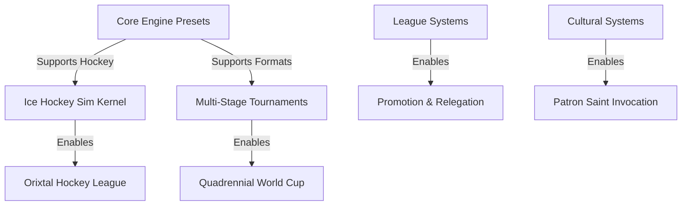

# MyLeague Lore Integration: Top 5 Features Proposal
**Author**: Antigravity AI  
**Date**: June 11, 2026  
**Status**: Proposal  
**Target Directory**: `/plans`  

This document presents the top 5 high-impact features designed to bridge the gaps between our rich in-world sports lore (WAFF World Cup, Caphirian Imperial League, and Ice Hockey/LHL) and the `MyLeague` simulation engine. Each feature is designed to fit directly into the existing modular monolith architecture of **IxStates** using [sports.prisma](file:///ixwiki/public/projects/ixstats/prisma/schema/sports.prisma) and [resolver.ts](file:///ixwiki/public/projects/ixstats/src/lib/sports/resolver.ts).

---

## Proposed Roadmap Overview



---

## Feature 1: Ice Hockey Simulation Preset (`hockey` preset)

### 1. Concept & Gameplay Loop
Instead of running hockey games through the standard soccer loop, the resolver will branch onto a native `hockey` preset. This introduces periods, faceoffs, power plays, fight majors, and goalie pulling.

### 2. Technical Implementation
* **Time Increments**: Replace the 6 soccer intervals with **three 20-minute periods** (t = 20, 40, 60).
* **Roster Vectorization**: Adjust the player weights to support line shifts (Line 1, Line 2, Defense Pair 1, Defense Pair 2, Goalie).
* **State Modifiers in `resolver.ts`**:
  ```typescript
  interface HockeyMatchState {
    period: 1 | 2 | 3;
    homePowerPlayActive: boolean;
    awayPowerPlayActive: boolean;
    homeGoaliePulled: boolean;
    awayGoaliePulled: boolean;
    penaltyMinutes: Record<string, number>; // player -> remaining penalty mins
  }
  ```
* **Engine Rules**:
  1. **Goalie Pulling**: At `t >= 58` minutes, if the trailing team is down by 1 or 2 goals, trigger `goaliePulled = true`. This increases their offensive rating vector by `+15` (6-on-5 skater advantage) but increases the opponent's scoring probability by `50%` (empty-net goal risk).
  2. **Fight Major Events**: A `5%` chance of a fight event. Two opposing players are assessed 5-minute majors, entering the penalty box.
  3. **Power Plays**: If a minor penalty occurs, the opponent gains a 5-on-4 power play state, applying a `+10` offense modifier to the attacking team and `-8` defense modifier to the defending team.
  4. **Draw Resolution**: If tied at 60 mins, simulate a 5-minute 3-on-3 overtime. If still tied, trigger a shootout (seeded, individual player shot vs. goalie ratings).

---

## Feature 2: Caphirian "Golden Box" & Multi-Stage Tournament Formats

### 1. Concept & Gameplay Loop
Extend the tournament structures in the database and engine to support multi-stage play:
* **WAFF World Cup**: 32-team Group Stage (8 groups of 4, single round-robin) -> Top 2 advance -> 16-team single-elimination bracket.
* **Caphirian Imperial League**: 16-team double round-robin (30 matches) -> Top 4 enter the "Golden Box" postseason knockout to determine the champion.

### 2. Technical Implementation
* **Database Schema Expansion** in [sports.prisma](file:///ixwiki/public/projects/ixstats/prisma/schema/sports.prisma):
  ```prisma
  model SportsSeason {
    // ... current fields
    stages       Json?     // Array of stage configs (e.g. [{stage: 1, type: "group"}, {stage: 2, type: "bracket"}])
    activeStage  Int       @default(1)
  }
  ```
* **Field Config Projection**: In the `fieldConfig` column of the `League` model, define the transition criteria:
  ```json
  {
    "stages": [
      {
        "id": 1,
        "type": "round_robin",
        "teams": 16,
        "advancement": {
          "count": 4,
          "criteria": "points",
          "nextStageId": 2
        }
      },
      {
        "id": 2,
        "type": "golden_box",
        "teams": 4,
        "format": "double_elimination"
      }
    ]
  }
  ```
* **Scheduling Engine**: The `startSeason` and `simulateMatchDay` procedures will check `activeStage`. When all games in stage 1 are resolved, the system calculates standings, filters the top 4 teams, generates the postseason "Golden Box" schedule, and transitions `activeStage` to 2.

---

## Feature 3: Tiered Promotion & Relegation Systems

### 1. Concept & Gameplay Loop
Simulate a realistic league pyramid by linking domestic leagues (e.g. *Caphirian Imperial League* $\leftrightarrow$ *Caphirian Second League* or *Ligue Yonderre* $\leftrightarrow$ *Ligue 2*) and swapping teams at season boundaries.

### 2. Technical Implementation
* **Database Linkage**: Add a `tier` field and an optional `parentLeagueId` to the `SportsLeague` model:
  ```prisma
  model SportsLeague {
    id              String        @id @default(cuid())
    tier            Int           @default(1) // 1 = top division, 2 = second division
    parentLeagueId  String?       // link to superior tier league
    relegationCount Int           @default(3) // number of teams relegated
    promotionCount  Int           @default(3) // number of teams promoted
  }
  ```
* **Season Boundary Transitions**:
  During the `advanceSeason` cron/trigger in [server.mjs](file:///ixwiki/public/projects/ixstats/server.mjs):
  1. Retrieve the final standings of the Division 1 league and its child Division 2 league.
  2. Select the lowest $R$ teams from Division 1 standings and the highest $P$ teams from Division 2 standings.
  3. Swap their `leagueId` fields in the `SportsTeam` database table:
     ```typescript
     await prisma.$transaction([
       prisma.sportsTeam.updateMany({
         where: { id: { in: relegatedTeamIds } },
         data: { leagueId: division2Id }
       }),
       prisma.sportsTeam.updateMany({
         where: { id: { in: promotedTeamIds } },
         data: { leagueId: division1Id }
       })
     ]);
     ```
  4. Write a notification bulletin to the league news feed documenting the transfers.

---

## Feature 4: Invocation of the Patron Saints (Spiritual Modifiers)

### 1. Concept & Gameplay Loop
Bring cultural depth to Caphirian clubs. Before matches, managers can invoke their club's designated Patron Saint to grant temporary spiritual modifiers or swing match outcomes. These blessings are dynamic, in-match simulation shifts that are fully wired into the **Storyteller** system.

### 2. Technical Implementation
* **Data Model**: Extend `SportsTeam` metadata to include the designated Patron Saint (e.g., *Saint Rais*, *Saint Inonsia*, *Saint Magador*).
* **Ritual Invocation API**:
  Add a tRPC mutation: `invokePatronSaint(teamId: string, saintName: string)`:
  * Consumes 5 Influence points or 100₷ from the club's balance.
  * Dynamically creates a `StorytellerEffect` in the database (stored in the `DmInputs` table) targeting the team's country with `inputType: "sports_saint_blessing"`, `value: 5.0` (denoting a +5 ratings boost), a duration of `1` tick, and a customized description referencing the saint's invocation.

* **Match Resolution Integration**:
  In `resolveMatch()`, the engine reads all active `StorytellerEffect` rows for the match day:
  ```typescript
  // resolver.ts
  // Fetch active Storyteller modifiers for the team's associated nation/country
  const activeEffects = await prisma.storytellerEffect.findMany({
    where: {
      countryId: args.homeTeam.nationId,
      inputType: "sports_saint_blessing",
      isActive: true,
    }
  });

  if (activeEffects.length > 0) {
    const totalBoost = activeEffects.reduce((acc, effect) => acc + effect.value, 0);
    
    // Modify the Mulberry32 seed slightly to inject spiritual momentum
    adjustedSeed = args.seed + 1047; 
    
    // Add dynamic ratings boost
    homeTeamRating.overall += totalBoost;
    homeTeamRating.form += totalBoost * 2;
    
    trace.push({
      t: 0,
      type: "tactic_shift",
      description: `Ceremonial: The home crowd echoes the Invocation of ${args.homeTeamModifiers.saintName}. Blessings descend upon the pitch!`,
      team: "home"
    });
  }
  ```

* **Divine Derby**: If both teams have active saintly blessings, increase the match `volatility` metric to `0.95` (extreme upset variance) and trigger high-intensity commentaries in `MatchTickerSim`.

### 3. Storyteller System Wiring (Bidirectional)
To ensure all events are fully synchronized with the global storytelling canvas:
1. **Storyteller $\rightarrow$ Sports Simulation**:
   Game Masters can post global/national `StorytellerEffect` events (e.g. `inputType: "sports_saint_blessing"`, `national_morale_boost`, or `sports_scandal`) via the `/admin/storyteller/` or `/dm-dashboard/` panels.
   - For example, if a GM posts a `sports_scandal` StorytellerEffect on Burgundie with a `value: -8.0`, the simulation automatically applies a `-8` coaching and form penalty to all Burgundian clubs for that season.
2. **Sports Simulation $\rightarrow$ Storyteller Timeline**:
   When a saint is invoked or a historic match outcome occurs (e.g., an underdog winning the Cup or a derby match with extreme volatility), the match resolver writes a new `StorytellerEffect` of type `special_event` with `isActive: true` back into the database.
   - This propagates immediately into the national news feed, causing the sports outcome to show up on the nation's political/economic event distribution timeline (such as the `EventDistributionCard` and the economy charts).
   - Storytellers and other players can monitor these saintly actions on the global Storyteller Dashboard in real-time.


---

## Feature 5: Quadrennial World Cups & ThinkPages Bulletins

### 1. Concept & Gameplay Loop
Automate international football and hockey cycles. Every 4 seasons, the simulation pauses domestic leagues, drafts national squads from the registry based on player citizenship, runs the World Cup tournament, and writes media bulletins.

### 2. Technical Implementation
* **The Draft System**:
  At the end of a quadrennial season (`seasonNumber % 4 === 0`), search the `SportsPlayer` table and group active players by their `citizenship` country code:
  * For each nation, select the top 11 players by overall rating (`overall`).
  * If a nation has fewer than 11 active players, auto-generate registry fill-in players matching the nation's average ELO.
* **Tournament Execution**:
  * Execute a 32-team World Cup simulation using the **Multi-Stage Tournament** framework.
  * Resolve matches sequentially, calculating ELO rating shifts on national player nodes.
* **ThinkPages News Feed**:
  Use the existing `SportsNews` account to publish summaries at the end of each round:
  ```typescript
  // Post highlights
  await prisma.thinkPost.create({
    data: {
      userId: sportsNewsAccountId,
      content: `🏆 WAFF WORLD CUP FINALS: Yonderre humbles Caphiria 3-2 at Raiovar Stadium! Joanus Charpentier wins the golden boot! #WAFF2026 #WorldCup`,
    }
  });
  ```
* **Trophy Card Minting**:
  Mint a unique, tradeable *Championship Trophy Card* into the winning national manager's Vault (`MyVault`) to complete the economic loop.
