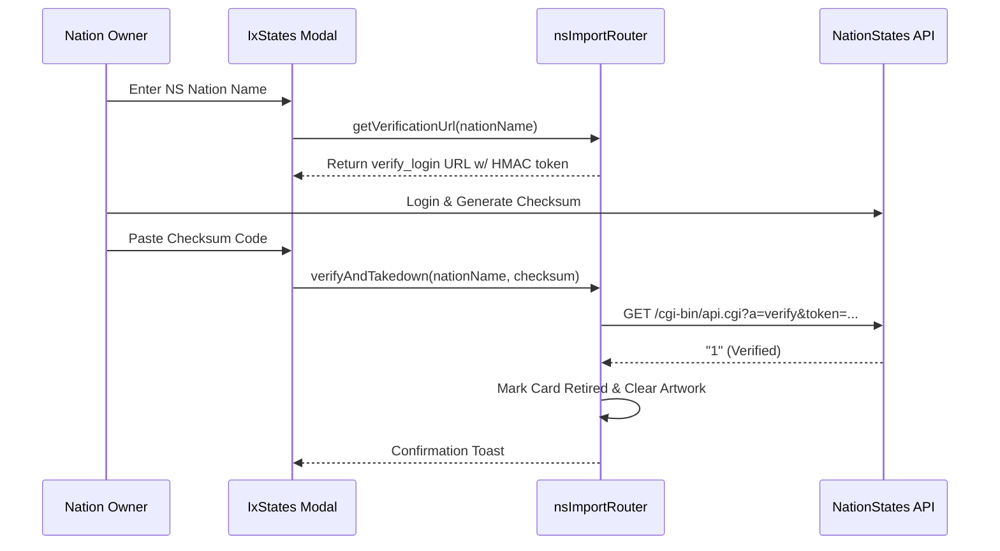

# NationStates Integration

**Last updated:** August 2026  
**Status:** Production Ready (Beta) — Phase 2 Implementation  
**Hierarchy:** Sub-system of IxCards / IxVault (`IXVAULT_VERSION = 2`).

The NationStates (NS) integration allows users to import their existing NationStates card collections and synchronize NS cards into the IxStates card ecosystem. It operates in strict compliance with NationStates API rate limits, daily dump guidelines, and copyright policies.

---

## Architecture & Features

- **Daily Card Dump Sync**: Automated ingestion of daily XML dumps (`cardlist_S{season}.xml.gz`) via `ns-sync-processor.ts`.
- **Collection Import**: Verify NS nation ownership via site-specific HMAC-MD5 token checksums and import deck cards into `CardOwnership`.
- **Streaming Image Proxy (`/api/proxy-ns-image`)**: In-memory proxy serving nation flag artwork with standard browser caching (`max-age=86400`), avoiding persistent binary disk writes.
- **Attribution Footer (`NationStatesAttribution.tsx`)**: Pinned footer inside `CardDetailsModal` displaying clear fan-site attribution copy and a takedown trigger.
- **Self-Service Takedown Verification**: Nation owners verify identity via HMAC-MD5 token to retire their card and clear artwork immediately.
- **Rate Limit Compliance**: Enforces an 800ms+ request spacing and exponential backoff on HTTP 429 responses.

---

## Verification & Takedown Protocol

---

## Routers & Files
- `src/server/api/routers/ns-import/` (`index.ts`, `sync.ts`, `import.ts`, `takedown.ts`)
- `src/app/api/proxy-ns-image/route.ts` – In-memory image proxy
- `src/components/cards/display/NationStatesAttribution.tsx` – Attribution footer
- `src/components/modals/CardTakedownVerificationModal.tsx` – Takedown dialog

---

## Related Documentation

- [IxCards System Guide](./cards.md)
- [MyVault System Guide](./myvault.md)
- [API Reference: NS Import Router](../reference/api-complete.md#ns-import-router)
