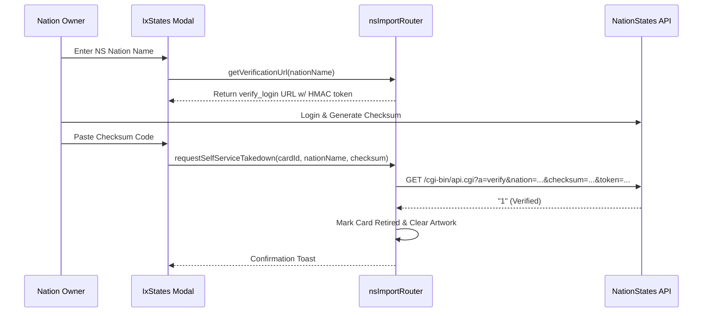

# NationStates Integration

**Last updated:** September 2026  
**Status:** Release Candidate (platform 1.4.0)  
**Hierarchy:** Sub-system of IxCards / IxVault (`IXVAULT_VERSION = 2`).

The NationStates (NS) integration allows users to import their existing NationStates card collections and synchronize NS cards into the IxStates card ecosystem. It operates in strict compliance with NationStates API rate limits, daily dump guidelines, and copyright policies.

---

## Architecture & Features

- **Card Dump Sync**: Admin-triggered region syncs (`nsImport.fetchRegionCards`, `/admin/cards` NS Import Suite) that ingest the per-season Trading Cards dump (`cardlist_S{season}.xml.gz`, published once per season, not daily) via `processRegionCardsFromDump()` in `src/lib/nationstates/sync-processor.ts`. There is no scheduled sync job.
- **Collection Import**: Verify NS nation ownership (`nsImport.requestVerification` → `checkVerification`, backed by `NSVerification`) and import deck cards into `CardOwnership` (`nsImport.importDeck`, `/vault/import`); imports earn an `EARN_BONUS` of 50 IxC per card (cap 5,000).
- **Streaming Image Proxy (`/api/proxy-ns-image`)**: Server-side proxy restricted to nationstates.net / Wikimedia hosts, 24h cache, and a placeholder redirect when NS blocks the request — no persistent binary disk writes.
- **Attribution Footer (`NationStatesAttribution.tsx`)**: Pinned footer inside `CardDetailsModal` displaying clear fan-site attribution copy and a takedown trigger.
- **Self-Service Takedown Verification**: Nation owners verify identity via HMAC-MD5 token to retire their card and clear artwork immediately.
- **Rate Limit Compliance**: `nsApiClient` (`src/lib/nationstates/api-client.ts`) spaces all outgoing requests by at least 800ms (NS limit: 50 requests / 30s); dump downloads retry with backoff (`withRetry`).

---

## Verification & Takedown Protocol

```mermaid
sequenceDiagram
    participant User as Nation Owner
    participant App as IxStates Modal
    participant Router as nsImportRouter
    participant NSApi as NationStates API

    User->>App: Enter NS Nation Name
    App->>Router: getVerificationUrl(nationName)
    Router-->>App: Return verify_login URL w/ HMAC token
    User->>NSApi: Login & Generate Checksum
    User->>App: Paste Checksum Code
    App->>Router: requestSelfServiceTakedown(cardId, nationName, checksum)
    Router->>NSApi: GET /cgi-bin/api.cgi?a=verify&nation=...&checksum=...&token=...
    NSApi-->>Router: "1" (Verified)
    Router->>Router: Mark Card Retired & Clear Artwork
    Router-->>App: Confirmation Toast
```

---

## Routers & Files
- `src/server/api/routers/ns-import/` (`index.ts`, `verification.ts`, `decks.ts`, `cards.ts` [takedowns, hide/restore, CTE filter], `sync.ts` [admin region syncs])
- `src/lib/nationstates/` (`api-client.ts`, `sync-processor.ts`, `import-service.ts`, `sync-monitor.ts`)
- `src/app/api/proxy-ns-image/route.ts` – Image proxy
- `src/components/cards/display/NationStatesAttribution.tsx` – Attribution footer
- `src/components/cards/display/CardTakedownVerificationModal.tsx` – Takedown dialog (also `src/app/settings/_components/modals/NSTakedownModal.tsx`)
- `src/components/cards/display/nationstates-api.md` – Reference copy of the upstream NationStates API documentation

---

## Related Documentation

- [IxCards System Guide](./cards.md)
- [MyVault System Guide](./myvault.md)
- [API Reference: IxVault (Cards & Credits)](../reference/api-complete.md)
