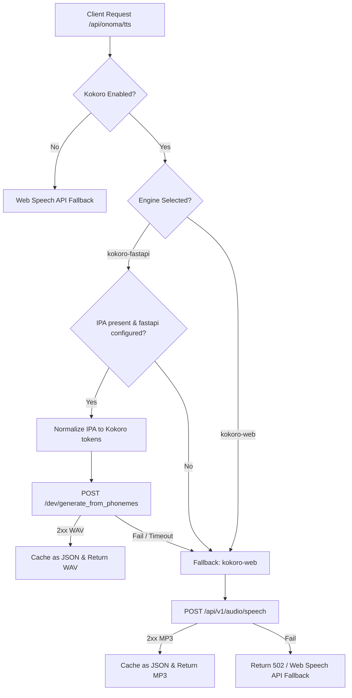

# Onoma Voice Guide — Kokoro Phoneme Integration

**Last updated:** August 2026  
**Status:** Production Ready (Beta) — Onoma Voice v2  
**Hierarchy:** Sub-system of Onoma (`ONOMA_VERSION = 4`), powering WikiOS article narration and name pronunciation.

This document covers the architecture, configuration, testing, and operation of the Onoma natural voice system, powered by `kokoro-fastapi` and `kokoro-web`.

---

## 1. System Architecture

The TTS synthesis pipeline operates on a **deterministic-first, fallback-safe** model:



### Key Components
1. **Linguistic Normalization** (`src/lib/onoma/kokoro-phonemes.ts`): Translates raw IPA to Kokoro-compliant English phonemes, remapping known letters (e.g. `r -> ɹ`, `x -> k`, `c -> k`, `g -> ɡ`) and silently removing unsupported characters to prevent voice distortion.
2. **Double-Engine Cache** (`src/app/api/onoma/tts/route.ts`): Cache keys are hashed with the active engine name. Audio is stored as structured JSON objects `{ d: "base64_data", ct: "audio/wav" | "audio/mpeg" }`.

---

## 2. Dynamic Island (Halo) Narrator Integration

The WikiOS article narrator bridges its audio state with Halo:
1. **Pill-Center Equalizer**: Collapsed Halo renders a live bouncing audio waveform out-of-sync using Tailwind animation offsets, with a quick Play/Pause toggler.
2. **Timeline Progressive Scrubber**: In expanded view, the scrubber track represents audio playback progress (`activeBlock / totalBlocks * 100`).
3. **Interactive Seeking**: Dragging the playhead seeks audio playback directly, and clicking section ticks triggers heading-level narrator jumps.

---

## 3. Local Development & Docker Configuration

```bash
# Start primary phoneme-native engine (kokoro-fastapi)
docker run -d --name kokoro-fastapi -p 8880:8880 ghcr.io/remsky/kokoro-fastapi-cpu:latest

# Start fallback engine (kokoro-web)
docker run -d --name kokoro-web -p 8888:8888 -e KW_SECRET_API_KEY="mysecret" ghcr.io/eduardolat/kokoro-web:latest
```

---

## Related Documentation

- [Onoma Brand Guide](./onoma-brand-guide.md)
- [Halo Plugin System](./dynamic-island.md)
- [WikiOS System Guide](./wikios.md)
