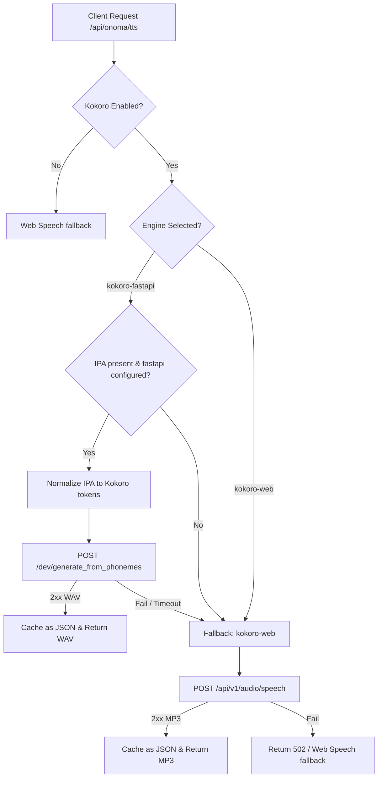

# Onoma Voice Guide — Kokoro Phoneme Integration

This document covers the architecture, configuration, testing, and operation of the Onoma natural voice system (Onoma System v2), powered by `kokoro-fastapi` and `kokoro-web`.

---

## 1. System Architecture

The TTS synthesis pipeline operates on a **deterministic-first, fallback-safe** model:



### Key Components:
1. **Linguistic Normalization** ([kokoro-phonemes.ts](file:///home/jxsig/projects/ixstats/src/lib/onoma/kokoro-phonemes.ts)): Translates raw IPA to Kokoro-compliant English phonemes, remapping known letters (e.g. `r -> ɹ`, `x -> k`, `c -> k`, `g -> ɡ`) and silently removing unsupported characters to prevent voice artifact distortion.
2. **Double-Engine Cache** ([route.ts](file:///home/jxsig/projects/ixstats/src/app/api/onoma/tts/route.ts)): The cache keys are hashed with the active engine name. Audio files are saved as structured JSON objects: `{ d: "base64_data", ct: "audio/wav" | "audio/mpeg" }` to allow transparent rendering of both formats while keeping compatibility with legacy entries.

---

## 2. Admin & Developer Features

### 📡 Live Engine Health Checks
The admin panel automatically pings endpoints on both engines every 30 seconds:
- **`kokoro-fastapi`**: Pings `/` (GET) to verify container is up.
- **`kokoro-web`**: Pings `/api/v1/audio/voices` to verify API is active.
Reachability indicators (`● Reachable` / `○ Unreachable`) are displayed next to the active engine select dropdown in [OnomaAdminPanel.tsx](file:///home/jxsig/projects/ixstats/src/app/admin/_components/OnomaAdminPanel.tsx).

### 🎛️ Per-Culture Voice Blending
You can define mixed-weight voice models in the per-culture dropdowns of the admin config:
1. Select **Custom Blend...** from the voice dropdown.
2. An input field will appear below it.
3. Enter your weight formula (e.g., `af_heart*0.6+am_adam*0.4`). Both fastapi and web engines support this mixing notation to compose distinct cultural accents.

### 💡 IPA G2P Suggestions
In the custom pronunciation editor on generated name cards:
- Click the **Suggest IPA** button.
- The server will query fastapi's `/dev/phonemize` endpoint and load the G2P phonemes (wrapped as a candidate `/ipa/` string) into your input field.

### ⚠️ Dropped-Token Warnings
When rule builders or custom overrides use sounds the engine cannot pronounce, the UI displays an amber warning showing exactly which characters will be omitted (e.g., `(dropped: ç, ɸ)`).

---

## 3. User Settings & Voice Sandbox
A dedicated **Settings** panel is accessible to all users via the gear/sliders button in the top-right corner of the Onoma Lab workspace. It contains:
- **Personal Voice Preferences**: Allows users to select their own personal default voice and adjust the speed multiplier override. These values are saved to browser `localStorage` and automatically apply to all naming card playbacks.
- **Interactive Sandbox**: A testing area where users can type any name, select a voice, suggest an IPA transcription, inspect normalized phonemes and dropped tokens, and hear the synthesized audio.
- **Browser Data Manager**: Provides options to export/backup all conlang data (definitions, rules, and overrides) as a JSON file, import a backup JSON file, or wipe all conlang rules from this browser.

---

## 4. Local Development & Testing

### A. Run the Containers
Ensure you have the CPU-optimized Kokoro container(s) running locally:

```bash
# Start the primary phoneme-native engine (kokoro-fastapi)
docker run -d --name kokoro-fastapi -p 8880:8880 ghcr.io/remsky/kokoro-fastapi-cpu:latest

# Start the fallback engine (kokoro-web)
docker run -d --name kokoro-web -p 8888:8888 -e KW_SECRET_API_KEY="mysecret" ghcr.io/eduardolat/kokoro-web:latest
```

### B. Configure in Admin UI
Navigate to the administration panel (`/admin` via the Halo/Dynamic Island settings gear) and configure:
1. **Engine**: `Phoneme-native (kokoro-fastapi)`.
2. **kokoro-fastapi URL**: `http://localhost:8880` (or `http://kokoro-fastapi:8880` in production stacks).
3. **Base URL**: `localhost:8888` (for the fallback container).
4. **API Key**: `mysecret`.
5. Click **Save Kokoro**. Check the health labels to verify both are reachable.

---

## 4. CLI Audition & Oracle Scripts

### 🎤 Audition Script
To compare how name pronunciations sound across different rendering modes (raw text, respelled English, joined text, or phoneme-native WAV):

```bash
# Set base environment vars
export KOKORO_BASE_URL=http://localhost:8888
export KOKORO_API_KEY="mysecret"
export KOKORO_FASTAPI_URL=http://localhost:8880

# Run the audition harness
bunx tsx scripts/onoma/audition-voice.ts
```
Outputs will be written to `scratch/onoma-audition/` containing both `.mp3` and `.wav` variations for comparative analysis.

### 🔮 Vocab Oracle Script
To pull the absolute set of supported phoneme tokens from the live fastapi container:

```bash
export KOKORO_FASTAPI_URL=http://localhost:8880
bunx tsx scripts/onoma/kokoro-vocab-oracle.ts
```
The output can be copied directly into the `KOKORO_VALID_TOKENS` constant in `src/lib/onoma/kokoro-phonemes.ts` to refine the allowlist.

## 5. Dynamic Island (Halo) Narrator Integration
The WikiOS article narrator bridges its audio state with the global Dynamic Island (Halo) context:
1. **Pill-Center Equalizer**: When playing, the collapsed Dynamic Island shows a mini bouncing audio waveform out-of-sync using Tailwind animation offsets, plus a quick Play/Pause toggler.
2. **Timeline Progressive Scrubber**: In expanded view, the scrubber track represents audio playback progress (`activeBlock / totalBlocks * 100`) rather than simple scroll percent.
3. **Interactive Seeking**: Dragging the playhead seeks audio playback directly, and clicking section ticks triggers heading-level audio narrator jumps.
4. **Overlay Controls**: Dedicated skip, pause, and play buttons are injected directly under the "Audio Narrator" section of the expanded Dynamic Island.

---

## 6. Engine Architecture & Resilience Updates

- **High Latency/CPU Timeouts**: Generating long paragraphs on CPU-based containers can take over 15 seconds. The API proxy timeout is configured to **60 seconds** (`60000ms`) to accommodate full-article paragraph synthesis.
- **Theme Compliance**: All player bars, inputs, voice selects, speed controllers, and sandbox tools are fully theme-compliant, adapting dynamically to Light, Dark, and Sepia CSS rules.
- **React Hook Health**: Hook calls (`useQuery`, `useState`, `useEffect`) execute unconditionally at the top of the narrator player component to strictly satisfy React's Rules of Hooks.
- **Alert Avoidance**: Connection timeouts or network failures to local/remote Kokoro containers are caught gracefully and logged via `console.warn` instead of `console.error`. This enables seamless silent fallback to local browser SpeechSynthesis without triggering environment error alarms.

---

## 7. Troubleshooting

- **No sound / 503 error**: Ensure **Enable Kokoro Voice** is checked in the admin dashboard and that the base URLs do not contain leading/trailing slash formatting errors.
- **Audio sounds clipped**: Check the *Dropped-Token Warnings* in the Studio to see if sounds are being ignored. Add a custom rule in the **IPA Studio** to map unrecognized letters to standard English sounds (e.g. `c -> k` or `r -> ɹ`).
- **Mixed content warning**: Ensure base URLs use HTTPS if the platform is deployed in a secure production SSL context.
