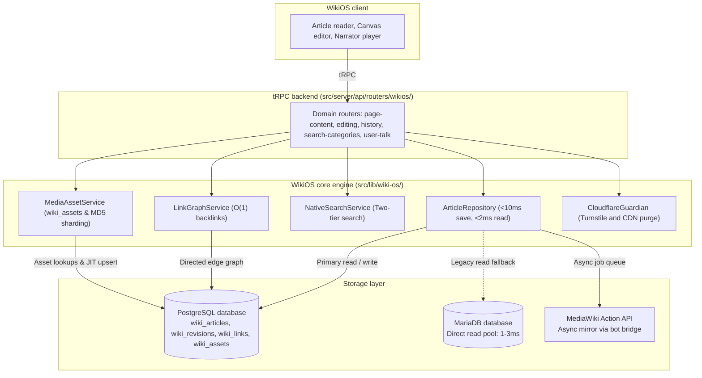

# WikiOS native architecture

Status: Release candidate (Plan 170 & Plan 191 complete)  
Package: `src/lib/wiki-os/` (`@wikios/core`)  
Runtime: TypeScript 7.0, Next.js 16 App Router  

WikiOS is the knowledge engine and structured worldbuilding platform for IxStates. PostgreSQL is the primary database for article content (4,685+ articles), append-only revisions, directed link graphs (48,200+ edges), taxonomies, and 7,555+ media assets (`wiki_assets`). Reads take under 2ms and writes take under 10ms.

---

## Architectural highlights

- **PostgreSQL primary storage.** Writes commit in under 10ms directly to `wiki_articles` and `wiki_revisions`.
- **Pre-compiled HTML.** `contentHtml` serves reads directly from database indexes in under 2ms.
- **Relational link graph (`wiki_links`).** Stores directed edges for backlink queries in under 1ms and identifies red links without extra lookups.
- **Native Media & Asset Engine (`MediaAssetService`).** Manages 7,555+ media files in `wiki_assets` with MD5 shard paths, automated dimensions extraction, JIT auto-registration, and immutable caching (`Cache-Control: public, max-age=31536000, immutable`).
- **Direct MariaDB read pool (`getIxWikiPool()`).** Connects directly to MariaDB on port 3306 or 13306 for unmigrated pages, history, and categories with zero HTTP overhead.
- **Global bot bridge (`WikiOS-Bridge`).** `MediaWikiExportWorker` queues upstream edits asynchronously and patches `rev_actor` and `rc_actor` for accurate author attribution.
- **Cloudflare edge defense (`src/lib/wiki-os/guardian/`).** Turnstile verification and non-blocking Cloudflare Zone edge cache purges on save.
- **Canvas visual editor (`CANVAS_VERSION = 1`).** Block-based editor with bidirectional translation between visual blocks and wikitext.

---

## System topology



---

## Directory layout (`src/lib/wiki-os/`)

```
src/lib/wiki-os/
├── index.ts                   # Root barrel export
├── config.ts                  # Configuration and DEFAULT_MEDIAWIKI_URL
├── types.ts                   # Nominal contracts
├── auth.ts                    # User identity and role resolution
├── use-wiki-auth.ts           # React client hook for authentication
├── storage.ts                 # Context and country resolution
│
├── core/                      # PostgreSQL domain services
│   ├── article-repository.ts  # CRUD repository (<2ms read, <10ms write)
│   ├── link-graph-service.ts  # Directed link graph engine
│   ├── native-search-service.ts # Two-tier search service
│   ├── parser-functions.ts    # ParserFunctions evaluator (#if, #switch, #expr)
│   └── category-service.ts    # Recursive category tree queries
│
├── guardian/                  # Security and CDN management
│   └── cloudflare-guardian.ts # Turnstile and edge CDN cache purges
│
├── adapters/                  # External service adapters
│   ├── mediawiki/             # MediaWiki compatibility layer
│   │   ├── write-service.ts   # Action API write gateway and actor attribution
│   │   ├── sync-worker.ts     # Asynchronous background mirror queue
│   │   └── bridge/            # MariaDB direct connector and federated readers
│   │       ├── mysql-pool.ts  # Connection pool
│   │       ├── mysql-reader.ts # Raw MariaDB queries
│   │       └── dispatchers.ts # Multi-source dispatchers
│   └── ixstates/              # Game simulation adapters
│       ├── unified-parser.ts  # Infobox indicator parser
│       └── cache-service.ts   # Database-native wiki cache
│
├── transformers/              # Content transformers
│   ├── html-transformer.ts    # HTML post-processor (Infobox, TOC, Notices)
│   ├── infobox-parser.ts      # Template tokenizer
│   └── media-theme.ts         # Theme switcher
│
├── templates/                 # Template registry
├── editor/                    # Visual canvas and draft store
└── migration/                 # Ingestion engine
```

---

## Features

### Reading

| Feature | Description |
|---|---|
| Article rendering | Server-side HTML transformation with infobox extraction, TOC generation, notice separation |
| Sticky TOC | Right-side table of contents with scroll-spy highlighting |
| Floating TOC pill | Compact mobile table of contents |
| Link previews | Hover any wiki link to view intro snippet |
| Image lightbox | Full-screen image viewer |
| Category breadcrumbs | Parent category hierarchy above article title |
| Infobox and map | Infobox tables displayed alongside embedded IxWorld map views |
| Client navigation | Page navigation handled via Next.js router without full reloads |
| Custom main page | Dashboard stats, featured article, category grid, country cards |
| Simulation embeds | Inline economic data blocks and country location maps |

### Editing

| Feature | Description |
|---|---|
| WikiOS Canvas | Dual-mode writing environment with visual block editing, source mode, live preview, and templates |
| Visual editor | ContentEditable WYSIWYG editor with headings, tables, images, templates, and links |
| Source editor | CodeMirror 6 editor with wikitext syntax highlighting and active line indicator |
| Action toolbar | Save, Cancel, and Preview action buttons |
| Keyboard shortcuts | `Ctrl+B` (bold), `Ctrl+I` (italic), `Ctrl+K` (link) |
| Template inserter | Template picker with parameter forms and preview |
| Image search | File search across local assets and Wikimedia Commons |
| Mode toggle | Switch between visual and source editor modes |
| Edit summary | Summary input field and minor edit checkbox |
| Rollback | Revert to previous revisions in a single transaction |

### Margin and discussions

WikiOS Margin replaces standalone talk pages with an inspector docked to the reader.

| Feature | Description |
|---|---|
| Split-canvas drawer | Slide-over panel docked to the right margin |
| Discussion threads | Section-anchored and page-wide threads with author roles and reply trees |
| Text markup | Multi-color text highlights with jump-to-text navigation |
| Stash integration | Quote clips and personal bookmark management from the reader |
| Selection capsule | Context menu on text selection with Highlight, Discuss, and Stash actions |
| Gutter pins | Margin indicators showing discussions and annotations next to headings and paragraphs |
| Hold-to-resolve | Hold action button to resolve discussions or record consensus |
| Legacy route bridge | Navigating to `/wiki/[slug]/talk` redirects to `/wiki/[slug]?margin=threads` |

### Stash (Collections)

| Feature | Description |
|---|---|
| Collections | Up to 25 color-coded, named collections |
| One-click stash | Stash button on every article and inside Margin drawer |
| Annotations | Text highlights on saved articles with color tags and comments |
| Notes | Text notes attached to saved articles |
| Organization | Drag and move items across collections |

### Lorewards (Contribution scoring)

| Feature | Description |
|---|---|
| Daily awards | Scored daily winner and runner-up based on edit size and quality |
| Leaderboards | Filterable by daily, weekly, monthly, and all-time periods |
| Streak calendar | Calendar heatmap showing consecutive contribution days |
| User stats | Total wins, runner-up finishes, bytes contributed, current and longest streaks |
| Scoring engine | Evaluates bytes added, prose ratio, edit depth, and topic importance |

### Search

| Feature | Description |
|---|---|
| Full-text search | PostgreSQL `tsvector` queries across article content and infoboxes |
| Snippet highlights | Results include context snippets with match markers |
| Namespace filter | Filter by articles, categories, or templates |
| Spotlight overlay | `Cmd+K` palette with trigram typo-tolerant search |

---

## API endpoints

### WikiOS router (`src/server/api/routers/wikios/`)

**Reader:**
`getArticleHtml`, `getWikitext`, `getEditorHtml`, `getIntroResolved`, `getSections`, `search`, `getRecentChanges`, `getRandomPage`, `getSiteStats`, `getHistory`, `getDiff`, `getRevisionContent`, `getBacklinks`, `getCategoryMembers`, `getUserContribs`, `getUserInfo`

**Editor:**
`previewWikitext`, `htmlToWikitext`, `saveArticle`, `saveWikitext`, `revertToRevision`, `rollback`

**Templates:**
`searchTemplates`, `getTemplateData`, `getTemplatePreview`, `syncTemplates`

**Stash:**
`getStashes`, `createStash`, `updateStash`, `deleteStash`, `reorderStashes`, `stashPage`, `unstashPage`, `isStashed`, `getStashItems`, `moveItem`, `updateItemNote`, `addAnnotation`, `updateAnnotation`, `deleteAnnotation`, `getAnnotations`
