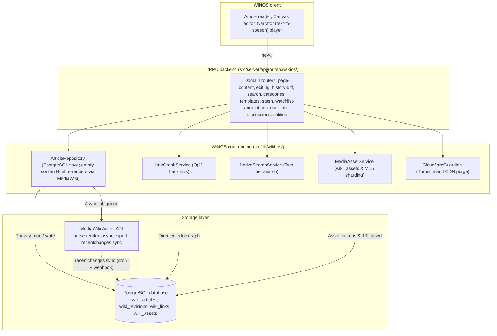

# WikiOS native architecture

Status: Release candidate (Plan 170 & Plan 191 complete)  
Package: `src/lib/wiki-os/` (in-repo module, imported as `~/lib/wiki-os`; not a published package)  
Runtime: TypeScript 7.0, Next.js 16 App Router  

WikiOS is the knowledge engine and structured worldbuilding platform for IxStates. PostgreSQL is the primary database for article content (4,685+ articles), append-only revisions, directed link graphs (48,200+ edges), taxonomies, and 7,555+ media assets (`wiki_assets`). Saves commit to PostgreSQL first (target under 10ms); rendering still goes through MediaWiki (see below).

---

## Architectural highlights

- **PostgreSQL primary storage.** Writes commit in under 10ms directly to `wiki_articles` and `wiki_revisions`.
- **`contentHtml` cache.** `contentHtml` is served when present, but `ArticleRepository.saveArticle` writes an empty string unless the caller supplies HTML, so the next read re-renders through MediaWiki `action=parse`; reads also call MediaWiki for author data (cached). There is no measured sub-2ms, no-PHP read path.
- **Relational link graph (`wiki_links`).** Stores directed edges for indexed backlink queries and identifies red links without extra lookups.
- **Native Media & Asset Engine (`MediaAssetService`).** Manages 7,555+ media records in `wiki_assets` (pointers to images on ixwiki.com; `md5Hash` hashes the filename, not the content) with MD5 shard paths, automated dimensions extraction, JIT auto-registration, and immutable caching (`Cache-Control: public, max-age=31536000, immutable`).
- **No direct MariaDB connection.** The MariaDB pool (`mysql-pool.ts` / `mysql-reader.ts`) was removed on 2026-08-25 (`80eee985d`). Bridge reads are PostgreSQL (`bridge/pg-*.ts`) plus the MediaWiki HTTP Action API.
- **Inbound recent-changes sync.** `services/auto-sync-service.ts` (`runAutoSyncCycle`) pulls edits made directly on classic MediaWiki into PostgreSQL, from the `wiki-recentchanges` cron job and the `/api/wikios/inbound-sync` webhook.
- **Outbound mirror (`services/mirror-worker.ts`, plan 407).** A durable outbox (`wiki_mirror_jobs`, written in the same transaction as the edit, move, delete, undelete or protection) applied per title in order by the dedicated `WikiOSMirror` bot: revisions go through `action=import` with `assignknownusers=1`, so MediaWiki credits the real author; failures back off and end `dead` after 8 attempts for an administrator to requeue.
- **Multi-wiki reader.** `?source=iiwiki|althistory` opens another wiki's page read-only (Sept 2026).
- **Article sanitizer (`src/lib/utils/sanitize-html.ts`, plan 415).** `sanitizeWikiArticleHtml` keeps the tags and attributes MediaWiki's own Sanitizer allows (legacy `{| border=1 bgcolor=… |}` tables, `<font>`, `<center>`, `<del>`/`<ins>`, ruby, `<bdo>`, `<data>`, list `type`/`start`/`reversed`) and blocks scripts, frames, forms, event handlers and `javascript:`/`data:` URLs. A `<style>` stays only when it is TemplateStyles' own (`data-mw-deduplicate`), and then as CSS scoped under `.wikios-article` by `scope-template-styles.ts`: `.mw-parser-output` is rewritten to the article root, only `@media` at-rules survive, and `@import`, non-`https:`/relative `url()`, `expression()`, `behavior` and `-moz-binding` are stripped; anything the splitter cannot read with certainty is dropped.
- **Cloudflare edge defense (`src/lib/wiki-os/guardian/`).** Turnstile verification and non-blocking Cloudflare Zone edge cache purges on save.
- **Canvas visual editor (`CANVAS_VERSION = 1`).** Plate-based block editor (Plan 206) with a WikiAST ↔ wikitext converter (Plans 205/208) and lossless template serialization (Plan 301).

---

## System topology


```mermaid
flowchart TD
    subgraph "WikiOS client"
        UI["Article reader, Canvas editor, Narrator (text-to-speech) player"]
    end

    subgraph "tRPC backend (src/server/api/routers/wikios/)"
        Routers["Domain routers: page-content, editing, history-diff, search, categories, templates, stash, watchlist-annotations, user-talk, discussions, utilities"]
    end

    subgraph "WikiOS core engine (src/lib/wiki-os/)"
        Repo["ArticleRepository (PostgreSQL save; empty contentHtml re-renders via MediaWiki)"]
        LinkGraph["LinkGraphService (O(1) backlinks)"]
        Search["NativeSearchService (Two-tier search)"]
        Media["MediaAssetService (wiki_assets & MD5 sharding)"]
        Guardian["CloudflareGuardian (Turnstile and CDN purge)"]
    end

    subgraph "Storage layer"
        PG[("PostgreSQL database\nwiki_articles, wiki_revisions, wiki_links, wiki_assets")]
        MediaWiki["MediaWiki Action API\nparse render, async export, recentchanges sync"]
    end

    UI -->|"tRPC"| Routers
    Routers --> Repo
    Routers --> LinkGraph
    Routers --> Search
    Routers --> Media
    Routers --> Guardian

    Repo -->|"Primary read / write"| PG
    LinkGraph -->|"Directed edge graph"| PG
    Media -->|"Asset lookups & JIT upsert"| PG
    Repo -->|"Async job queue"| MediaWiki
    MediaWiki -.->|"recentchanges sync (cron + webhook)"| PG
```

---

## Directory layout (`src/lib/wiki-os/`)

```
src/lib/wiki-os/
├── index.ts                   # Root barrel export
├── config.ts                  # The one config object (`wikiosConfig`) and the URL helpers (plan 415)
├── types.ts                   # Nominal contracts
├── auth.ts                    # User identity and role resolution
├── use-wiki-auth.ts           # React client hook for authentication
├── storage.ts                 # Context and country resolution
│
├── page-ref.ts                # Page reference (title + wiki source) helpers
│
├── core/                      # PostgreSQL domain services
│   ├── article-repository.ts  # CRUD repository (PostgreSQL save and read)
│   ├── link-graph-service.ts  # Directed link graph engine
│   ├── native-search-service.ts # Two-tier search service
│   ├── media-asset-service.ts # wiki_assets registry (+ blurhash-service.ts)
│   ├── wiki-ast.ts            # IxWiki AST block model (+ wiki-ast-guards.ts)
│   └── category-service.ts    # Recursive category tree queries
│
├── guardian/                  # Security and CDN management
│   └── cloudflare-guardian.ts # Turnstile and edge CDN cache purges
│
├── adapters/                  # External service adapters
│   ├── mediawiki/             # MediaWiki compatibility layer
│   │   ├── write-service.ts   # The mirror bot's Action API calls (typed errors, XML import upload)
│   │   ├── csrf-cache.ts      # The mirror bot's login and CSRF token (no anonymous fallback)
│   │   ├── parsoid.ts         # action=parse / Parsoid render and conversions
│   │   └── bridge/            # PostgreSQL readers and federated HTTP readers
│   │       ├── pg-reader.ts   # Articles/wikitext (+ pg-search, pg-activity, pg-taxonomy, pg-site)
│   │       ├── http-reader.ts # IIWiki / AltHistory HTTP adapter with circuit breaker
│   │       ├── batch-reader.ts # Batched lookups
│   │       └── dispatchers.ts # Multi-source dispatchers
│   └── ixstates/              # Game simulation adapters
│       ├── unified-parser.ts  # Infobox indicator parser
│       └── cache-service.ts   # Database-native wiki cache
│
├── transformers/              # Content transformers
│   ├── html-transformer.ts    # HTML post-processor (Infobox, TOC, Notices)
│   ├── infobox-parser.ts      # Template tokenizer
│   └── media-theme.ts         # Theme switcher
│
├── templates/                 # Template registry, presets, tiered preview cache
├── editor/                    # Draft store, local cache, template wikitext parsing
├── wikitext/                  # Wikitext parser/serializer (links, lists, tables, templates)
└── services/                  # auto-sync-service.ts (recent-changes inbound sync)
```

---

## Features

### Reading

| Feature | Description |
|---|---|
| Article rendering | Server-side HTML transformation with infobox extraction, TOC generation, notice separation |
| Sticky TOC | Right-side table of contents with scroll-spy highlighting |
| Floating TOC pill | Compact mobile table of contents |
| Link previews | Hover any wiki link to view intro snippet |
| Image lightbox | Full-screen image viewer |
| Category breadcrumbs | Parent category hierarchy above article title |
| Infobox and map | Infobox tables displayed alongside embedded IxWorld map views |
| Client navigation | Page navigation handled via Next.js router without full reloads |
| Custom main page | Dashboard stats, featured article, category grid, country cards |
| Simulation embeds | Inline economic data blocks and country location maps |

### Editing

| Feature | Description |
|---|---|
| WikiOS Canvas | Dual-mode writing environment with visual block editing, source mode, live preview, and templates |
| Visual editor | Plate (`platejs`) block editor with headings, tables, images, atomic template/infobox blocks, and links |
| Source editor | CodeMirror 6 editor with wikitext syntax highlighting and active line indicator |
| Action toolbar | Save, Cancel, and Preview action buttons |
| Keyboard shortcuts | `Ctrl+B` (bold), `Ctrl+I` (italic), `Ctrl+K` (link) |
| Template insertion | Slash-command menu with template presets (Plan 207), TemplateData-driven parameter forms (Plan 302), and tiered preview cache (Plan 303) |
| Image search | File search across local assets and Wikimedia Commons |
| Mode toggle | Switch between visual and source editor modes |
| Edit summary | Summary input field and minor edit checkbox |
| Rollback | Reads the revision history, then saves the old revision as a new one via `saveArticle` (two steps, not one transaction; no cache purge) |

### Margin and discussions

WikiOS Margin is an inspector docked to the reader, on top of MediaWiki-style talk pages: `Talk:<title>` and every `<ns> talk:` page are ordinary wikitext pages (the reader's Page / Discussion tabs link the pair, "Add topic" opens the editor on a new section), and Margin stays an extra anchored layer on the subject page.

| Feature | Description |
|---|---|
| Split-canvas drawer | Slide-over panel docked to the right margin |
| Discussion threads | Section-anchored and page-wide threads with author roles and reply trees |
| Text markup | Multi-color text highlights with jump-to-text navigation |
| Stash integration | Quote clips and personal bookmark management from the reader |
| Selection capsule | Context menu on text selection with Highlight, Discuss, and Stash actions |
| Gutter pins | Margin indicators showing discussions and annotations next to headings and paragraphs |
| Hold-to-resolve | Hold action button to resolve discussions or record consensus |
| Legacy route bridge | Navigating to `/wiki/<title>/talk` redirects to the talk page `/wiki/Talk:<title>` (unless a page named `<title>/talk` exists); `/wiki/<title>?margin=threads` still opens Margin on the subject page |

### Stash (Collections)

| Feature | Description |
|---|---|
| Collections | Up to 25 color-coded, named collections |
| One-click stash | Stash button on every article and inside Margin drawer |
| Annotations | Text highlights on saved articles with color tags and comments |

### Lorewards (Contribution scoring)

| Feature | Description |
|---|---|
| Daily awards | Scored daily winner and runner-up based on edit size and quality |
| Leaderboards | Filterable by daily, weekly, monthly, and all-time periods |
| Streak calendar | Calendar heatmap showing consecutive contribution days |
| User stats | Total wins, runner-up finishes, bytes contributed, current and longest streaks |
| Scoring engine | Evaluates bytes added, prose ratio, edit depth, and topic importance |

### Search

| Feature | Description |
|---|---|
| Full-text search | PostgreSQL `tsvector` queries across article content and infoboxes |
| Snippet highlights | Results include context snippets with match markers |
| Namespace filter | Filter by articles, categories, or templates |
| Spotlight overlay | `Cmd+K` palette; title search is a case-insensitive `contains` (not trigram, no GIN index) |

---

## API endpoints

### WikiOS router (`src/server/api/routers/wikios/`)

**Page content** (`page-content.ts`):
`getArticleHtml`, `getWikitext`, `getIntro`, `getInfobox`, `getSectionContent`, `getPageImages`, `getArticleThumbnails`, `getArticleAuthors`, `checkPageExists`, `getMissingPages`, `resolveWikiPlaceholders`, `getForumThreadPreview`, `downloadFile`

**History** (`history-diff.ts`):
`getHistory`, `getDiff`, `getRevisionContent`

**Search** (`search.ts`):
`search`, `searchArticles`, `searchPages`, `searchFiles`, `searchBusinesses`, `advancedSearch`, `getRecentChanges`, `getRandomPage`, `getSiteStats`

**Categories** (`categories.ts`):
`getCategories`, `getCategoryMembers`, `getCategoryTotalCounts`, `getParentCategories`, `getSubcategories`, `searchCategories`, `autocompleteCategories`

**Editor** (`editing.ts`):
`previewWikitext`, `saveWikitext`, `uploadFile`, `revertToRevision`, `rollback`, `restoreArticle`

**Templates** (`templates.ts`):
`searchTemplates`, `getTemplateData`, `getTemplatePreview`

**Stash** (`stash.ts`):
`getStashes`, `createStash`, `updateStash`, `deleteStash`, `stashPage`, `unstashPage`, `isStashed`, `getStashItems`

**Watchlist and annotations** (`watchlist-annotations.ts`):
`getWatchlist`, `getWatchlistFeed`, `isPageWatched`, `watchPage`, `unwatchPage`, `markAllWatchedVisited`, `addAnnotation`, `deleteAnnotation`, `getAnnotations`

**Users** (`user-talk.ts`):
`getUserInfo`, `getUserContribs`, `getAuthorProfile`, `getBacklinks`

**Discussions** (`discussions.ts`):
`getArticleMarginData`, `createThread`, `postComment`, `resolveThread`, `deleteThread`

**Maintenance** (`utilities.ts`):
`getOrphanArticles`, `getDeadEndArticles`, `getBrokenRedirects`, `getLongestArticles`, `getShortestArticles`, `getArchivedArticles`, `getAuditLogs`, `getHealthTelemetry`
