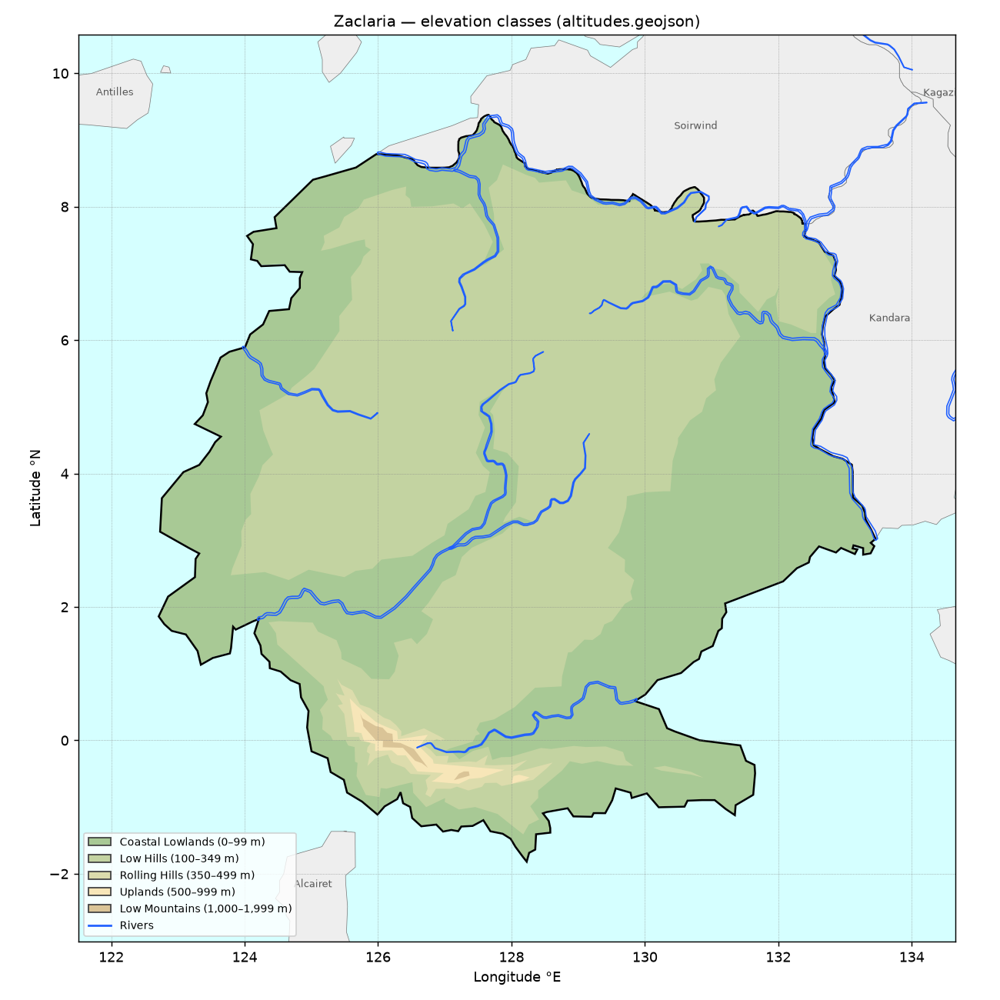
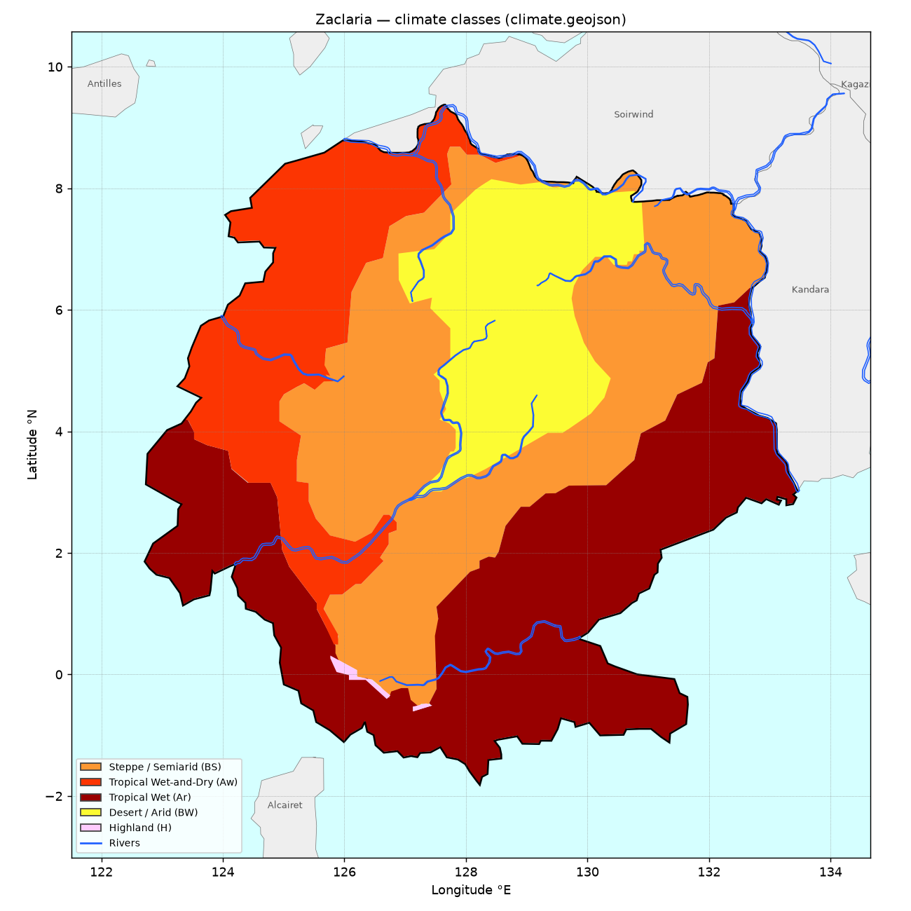
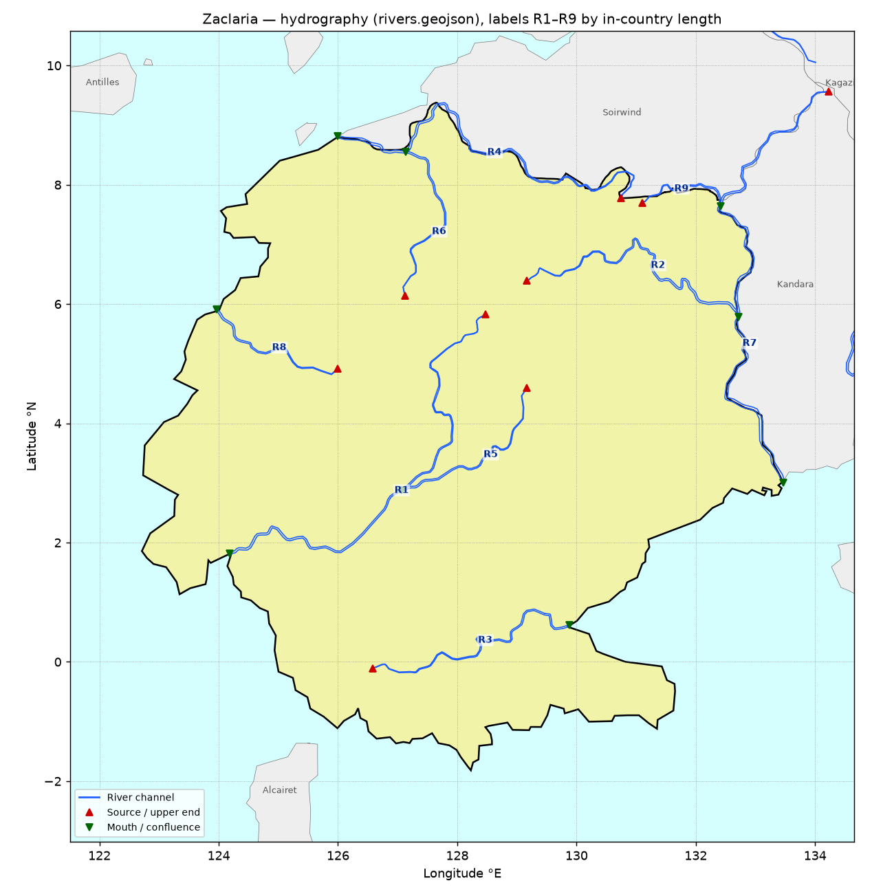

# Zaclaria — Physical Geography Report

**Terrain · Topography · Water Systems · Climate · Borders & Coast**

Everything in this report is measured directly from the IxEarth map GeoJSON layers in
`scripts/archive/geojson_dumps/geojson_sanitized/` (`political`, `altitudes`, `climate`, `rivers`,
`lakes`, `icecaps`). No modelled values are included — no temperatures, rainfall figures, biomes,
arable-land estimates or habitability scores, because none of those exist in the source data.

- Raw numbers: [`zaclaria-physical-geography.json`](./zaclaria-physical-geography.json)
- Maps: [`zaclaria-maps/`](./zaclaria-maps/)
- Reproduce: `python3 scripts/archive/gis_tools/zaclaria_physical_report.py out.json`, then
  `python3 scripts/archive/gis_tools/zaclaria_physical_maps.py out.json` (requires `shapely`, `pyproj`, `matplotlib`)

---

## 0. What the source actually contains, and how it was read

Every feature in every layer has only three properties: `id`, `ixmap-subgroup` and `fill`. The
Zaclaria feature is `{"id": "Zaclaria", "ixmap-subgroup": null, "fill": "#f1f4a8"}`.

The only information is **geometry plus a fill colour**. Elevation and climate classes are the fill
colours, translated with the legend the codebase already uses (`src/lib/maps/elevation-config.ts` and
the climate colour map in `scripts/archive/gis_tools/country-geo-report.ts`). Elevation is stored as
**banded classes, not spot heights**, so the source cannot give an exact highest point. It can only
say which band the highest ground falls in.

The layers are a traced SVG, and that affects how they have to be measured:

| Issue in source | How it was handled |
|---|---|
| `altitudes` and `climate` polygons overlap and stack. Later features are drawn on top of earlier ones, so summed areas come to more than 100%. | Painter's order: the visible class at a point is the last feature in file order that covers it. |
| Some features cross the antimeridian and have a wrapped part spanning −180°…+180°. These draw false horizontal bands across the map. One such band runs through Zaclaria at about 0.3°S–0.9°S. | Parts whose bounding box is wider than 180° were dropped. This affects **Metzetta** (political) and climate features `path6612` and `path6575`. |
| Each river is a **closed outline**: a thin polygon about 2–4 km wide that traces both banks. | Channel length = outline length ÷ 2. The source and mouth are the outline's two hairpin tips. |
| The political outline runs slightly past the drawn coastline in places. | This leaves 2,739 km² (0.29%) with no elevation class and 2,855 km² (0.30%) with no climate class. |

Areas are geodesic on the WGS84 ellipsoid. A 2 km snapping tolerance is used to match shared borders.

---

## 1. Territory & shape

| Metric | Value |
|---|---|
| Area | **946,589 km²** (365,480 sq mi) |
| Geometry | One polygon with 516 vertices. No holes, no exclaves, no islands. |
| Perimeter | 5,312 km |
| Bounding box | 122.7117°E – 133.4576°E, 1.8187°S – 9.3746°N |
| North–south extent | 1,238 km |
| East–west extent (at mid-latitude) | 1,194 km |
| Longest straight span | 1,271 km, from the western cape (1.858°N 122.712°E) to 7.263°N 132.828°E |
| Northernmost point | 9.375°N 127.637°E (Soirwind border tip) |
| Southernmost point | 1.819°S 128.229°E (southern cape) |
| Easternmost point | 133.458°E, 3.021°N (the R7 river mouth at the Kandara border) |
| Westernmost point | 122.712°E, 1.858°N (western cape) |
| Centroid | 3.917°N 127.996°E |
| Pole of inaccessibility (farthest point from any border or coast) | 3.776°N 127.999°E, **400 km** from the edge |
| Farthest point from open sea | 5.270°N 128.622°E, 448 km from the nearest sea (north coast, 9.33°N) |
| Compactness (Polsby–Popper) | 0.422 |
| Convex-hull fill ratio | 0.845 |

Zaclaria is a broad, roughly equidimensional block that **straddles the equator**. 84,289 km²
(8.9%) lies south of 0°, all of it in the southern lobe below the central massif. It has three
peninsular lobes:

- a western cape near 1.8°N 122.7°E
- a south-eastern shoulder reaching about 131.7°E at about 1°S
- a southern point near 1.8°S 128.2°E

---

## 2. Borders & coastline

| Neighbour | Shared border | Direction (from centroid to border midpoint) | Border extent | Border that follows a river |
|---|---|---|---|---|
| **Soirwind** | 988 km | NNE | 125.96–132.40°E, 7.72–9.37°N | 670 km (**68%**), along R4 and R9 |
| **Kandara** | 671 km | ENE | 132.38–133.46°E, 2.90–7.74°N | 652 km (**97%**), along R7 (with R2 and R9 joining it) |
| **Total land border** | **1,659 km** | | | 1,322 km (80%) |
| **Coastline** | **3,657 km** (68.8% of the perimeter) | | | |

Most of the land border is drawn along rivers. The Kandara border is almost entirely the course of
river R7. The Soirwind border follows R4 in the west and R9 in the east.

**Coastline by the direction it faces** (the side the sea is on):

| SW | S | NW | W | SE | N | E | NE |
|---|---|---|---|---|---|---|---|
| 708 km | 695 km | 540 km | 523 km | 469 km | 336 km | 302 km | 85 km |

The coast faces mainly south and west. The north-east has almost no coast because that side is
closed off by Soirwind and Kandara. The ratio of coastline to area is 3.86 m of coast per km².

**Other countries within 400 km across water:**

| Country | Distance | Direction |
|---|---|---|
| Alcairet | 47 km | SSW |
| Sacatia | 229 km | N |
| Kagazi | 259 km | NE |
| Antilles | 261 km | NW |
| Tapakdore | 362 km | S |

> **Metzetta is not a real neighbour.** Its political feature has wrapped antimeridian parts that
> cross Zaclaria's territory. Without them it does not touch Zaclaria. An earlier report listed it
> as a neighbour.

---

## 3. Terrain & topography

### 3.1 Elevation classes

| Class (fill) | Area km² | Share | Contiguous patches (≥1 km²) | Where |
|---|---|---|---|---|
| Coastal Lowlands 0–99 m (`#a8c995`) | 406,888 | **42.98%** | 1 main body (406,886) plus 1 speck | A continuous ring around the whole coast, with long arms inland |
| Low Hills 100–349 m (`#c3d3a1`) | 519,448 | **54.88%** | 1 main body (519,009) plus 1 knoll (438) | The interior plateau, 123.79–132.85°E, 1.41°S–8.63°N |
| Rolling Hills 350–499 m (`#dcdcac`) | 9,563 | 1.01% | 1 | Central-southern massif, 125.37–128.62°E, 0.85°S–0.93°N |
| Uplands 500–999 m (`#f7e6b8`) | 6,156 | 0.65% | 2 (5,914 + 241) | Massif core, 125.57–127.90°E, plus an outlier at 0.57°S 128.13°E |
| Low Mountains 1,000–1,999 m (`#dac497`) | 1,797 | **0.19%** | 2 (1,613 + 183) | Summit areas, 125.73–126.75°E, 0.41°S–0.40°N, plus 0.56°S 127.21°E |
| Mid Mountains 2,000 m and above | 0 | 0% | — | Not present |

- **Highest ground:** the Low Mountains band (1,000–1,999 m). The main summit area is 1,613 km²
  centred on **0.004°S 126.122°E**, on the equator. A second summit area of 183 km² is at 0.562°S
  127.210°E. The source contains no ground above 2,000 m.
- **Lowest ground:** sea level, along the whole 3,657 km coast.
- **Area above 350 m:** 17,516 km² (1.85%). Everything else is below 350 m.

### 3.2 Landforms

1. **The Southern (Equatorial) Massif.** This is the only raised area in the country. It forms a
   single enclosed island of higher ground inside the Low Hills, 17,516 km² in total, running about
   360 km WNW–ESE between 125.4°E and 128.6°E along the equator. It rises in nested rings:
   Rolling Hills (9,563 km²), then Uplands (6,156 km²), then two Low-Mountain summit areas
   (1,797 km²). The western summit is the larger and higher. The massif's edge is 32 km from
   the south coast, and the summits are 56 km from it. R3 rises on its eastern flank.
2. **The Interior Hill Plateau.** A single 519,009 km² body of Low Hills (100–349 m) takes up the
   centre and north. It is highest in share between 4°N and 8°N, where it covers 64–82% of the
   land, and between 126°E and 129°E, where it covers 70–81%. It does not reach the sea anywhere.
   A lowland rim separates it from the coast all the way round. The narrowest point is about
   10 km, on the south coast at 0.68°S 126.31°E.
3. **The Coastal Lowland Ring.** One continuous 406,886 km² lowland (0–99 m) runs the full length
   of the coast. It is widest in:
   - the **west**: 122–124°E is more than 97% lowland
   - the **east and south-east**: 131–134°E is 73–97% lowland
   - the **far north**: 8–10°N is 72–97% lowland, along the R4 valley

   Within 25 km of the coast, 94.9% of the land is lowland. Within 100 km it is 77.5%.
4. **The Central Lowland Corridor.** The lowland ring reaches deep into the plateau along the R1
   and R5 valleys. It reaches **4.08°N 127.80°E, 437 km from the sea**, where it opens into an
   interior lowland basin around 3–5°N and 127–129°E. The north–south transect below crosses this
   basin between 4.2°N and 3.3°N. This corridor almost splits the Low Hills into a western lobe
   and a north-eastern lobe.
5. **A south-eastern knoll.** A detached 438 km² patch of Low Hills rises out of the south-eastern
   lowlands at 130.12–130.88°E, about 0.46°S.

### 3.3 Transects

**North to south along 128.0°E (through the centroid):**

| km from north coast | Lat | Terrain | Climate |
|---|---|---|---|
| 76 | 8.79°N | Coastal Lowlands | Aw |
| 101 | 8.56°N | Low Hills | BS |
| 202–580 | 7.65–4.23°N | Low Hills | **BW (desert)** |
| 580–680 | 4.23–3.32°N | Coastal Lowlands (interior basin) | BW |
| 680–706 | 3.32–3.09°N | Low Hills | BW, then BS |
| 706–882 | 3.09–1.50°N | Low Hills | BS |
| 882–1008 | 1.50–0.36°N | Low Hills | Ar |
| 1008–1084 | 0.36°N–0.32°S | Coastal Lowlands (R3 valley) | Ar |
| 1109 | 0.55°S | Rolling Hills (eastern massif) | Ar |
| 1134–1210+ | 0.78–1.46°S | Low Hills, then Coastal Lowlands | Ar |

**West to east along 3.92°N:**

| km | Lng | Terrain | Climate |
|---|---|---|---|
| 49 | 123.05°E | Coastal Lowlands | Ar |
| 122 | 123.71°E | Coastal Lowlands | Aw |
| 195 | 124.36°E | Low Hills | Aw |
| 316 | 125.46°E | Low Hills | BS |
| 584 | 127.87°E | Coastal Lowlands (interior basin) | BW |
| 632 | 128.30°E | Low Hills | BW |
| 754 | 129.40°E | Low Hills | BS |
| 875 | 130.49°E | Coastal Lowlands | BS |
| 924 to coast | 130.93°E onward | Coastal Lowlands | Ar |

### 3.4 Terrain by latitude and longitude band (share of land in each band)

| Latitude band | Land km² | Coastal Lowlands | Low Hills | Rolling Hills | Uplands | Low Mountains | Ar | Aw | BS | BW | H |
|---|---|---|---|---|---|---|---|---|---|---|---|
| −2° to −1° | 10,960 | 75.2% | 19.5% | – | – | – | 94.6% | – | – | – | – |
| −1° to 0° | 73,329 | 54.8% | 28.5% | 8.7% | 5.9% | 1.3% | 92.1% | – | 5.9% | – | 1.2% |
| 0° to 1° | 66,012 | 46.7% | 44.1% | 4.8% | 2.7% | 1.3% | 67.4% | 1.1% | 29.9% | – | 1.2% |
| 1° to 2° | 91,864 | 55.4% | 43.8% | – | – | – | 64.1% | 11.8% | 23.3% | – | – |
| 2° to 3° | 112,579 | 57.2% | 41.7% | – | – | – | 56.7% | 10.9% | 31.2% | 0.1% | – |
| 3° to 4° | 128,302 | 50.8% | 49.0% | – | – | – | 38.0% | 11.0% | 42.5% | 8.3% | – |
| 4° to 5° | 114,381 | 36.0% | 64.0% | – | – | – | 13.6% | 18.5% | 40.6% | 27.1% | – |
| 5° to 6° | 112,114 | 32.9% | 67.4% | – | – | – | 7.3% | 25.2% | 42.6% | 24.9% | – |
| 6° to 7° | 101,332 | 23.2% | 76.8% | – | – | – | 1.1% | 21.2% | 41.6% | 36.2% | – |
| 7° to 8° | 97,119 | 18.1% | 82.2% | – | – | – | – | 34.6% | 27.7% | 38.1% | – |
| 8° to 9° | 36,962 | 71.6% | 29.4% | – | – | – | – | 70.1% | 25.7% | 5.0% | – |
| 9° to 10° | 1,634 | 96.8% | – | – | – | – | – | 100.0% | – | – | – |

| Longitude band | Land km² | Coastal Lowlands | Low Hills | Rolling Hills | Uplands | Low Mountains | Ar | Aw | BS | BW | H |
|---|---|---|---|---|---|---|---|---|---|---|---|
| 122° to 123° | 3,688 | 97.4% | – | – | – | – | 97.4% | – | – | – | – |
| 123° to 124° | 42,272 | 97.2% | 2.1% | – | – | – | 68.7% | 30.5% | – | – | – |
| 124° to 125° | 75,485 | 57.2% | 42.3% | – | – | – | 33.6% | 65.4% | 0.4% | – | – |
| 125° to 126° | 112,887 | 37.4% | 58.7% | 2.1% | 1.2% | 0.4% | 18.6% | 56.8% | 24.1% | – | 0.4% |
| 126° to 127° | 120,182 | 22.0% | 71.6% | 3.0% | 2.4% | 0.9% | 9.3% | 24.6% | 64.6% | 0.6% | 0.8% |
| 127° to 128° | 127,382 | 26.4% | 70.0% | 2.1% | 1.3% | 0.1% | 16.9% | 10.3% | 51.6% | 20.8% | 0.2% |
| 128° to 129° | 121,848 | 18.0% | 80.9% | 0.8% | 0.2% | – | 35.3% | 0.8% | 17.8% | 45.9% | – |
| 129° to 130° | 111,481 | 34.6% | 65.2% | – | – | – | 43.2% | – | 14.3% | 42.3% | – |
| 130° to 131° | 99,521 | 56.4% | 43.2% | – | – | – | 42.5% | – | 42.0% | 15.2% | – |
| 131° to 132° | 77,272 | 76.6% | 23.0% | – | – | – | 46.5% | – | 53.0% | – | – |
| 132° to 133° | 50,491 | 73.3% | 26.3% | – | – | – | 66.6% | – | 33.0% | – | – |
| 133° to 134° | 4,080 | 97.2% | – | – | – | – | 97.2% | – | – | – | – |

---

## 4. Climate

The climate layer uses Trewartha classes, identified by their fill colours.

| Class (fill) | Area km² | Share | Patches | Extent | Reaches the coast? |
|---|---|---|---|---|---|
| **Tropical Wet (Ar)** (`#980000`) | 318,681 | **33.67%** | 1 main (318,678) plus 1 speck | 122.72–133.45°E, 1.81°S–6.36°N | Yes: the entire south, south-east and east coast |
| **Steppe / Semiarid (BS)** (`#fd9833`) | 307,906 | **32.53%** | 1 main (306,351) plus 2 (1,488 and 66) | 124.93–132.96°E, 0.51°S–8.68°N | No (0.9% of the 100 km coastal belt) |
| **Tropical Wet-and-Dry (Aw)** (`#fc3502`) | 170,082 | **17.97%** | 1 | 123.26–128.88°E, 0.49°N–9.37°N | Yes: the west and north-west coast |
| **Desert / Arid (BW)** (`#fcfc33`) | 145,389 | **15.36%** | 8: core 134,129 plus 7,979, 1,562, 560, 524, 493, 83, 58 | Core 127.2–130.94°E, 2.93–8.15°N | No. Entirely interior. |
| **Highland (H)** (`#fecbfe`) | 1,677 | 0.18% | 2 (1,445 and 232) | 125.77–127.45°E, 0.61°S–0.31°N | No |

### 4.1 How the climate zones are arranged

The climate map is **concentric, from humid coast to arid core**:

- **Humid coast.** 97% of the land within 25 km of the sea is tropical humid: 73.5% Ar and 23.4% Aw.
  The south and east coasts are Tropical Wet (Ar). The west and north-west coasts are Tropical
  Wet-and-Dry (Aw). The Ar/Aw boundary reaches the west coast at about 4°N 123.3°E.
- **Semi-arid ring.** A continuous belt of steppe (BS) wraps around the interior. It is widest in
  the west-centre (126–128°E, where it covers 52–65% of the land) and the north-east (131–132°E,
  53%). It reaches south as a tongue to the northern flank of the massif at about 0.5°S.
- **Desert core.** The main desert block is 134,129 km², centred at **5.58°N 128.86°E**. It runs
  about 580 km north–south, from 2.93°N to 8.15°N. At 128–130°E, BW covers 42–46% of the land. It
  reaches the Soirwind border at about 8°N but is at least 130 km from the sea everywhere. Seven
  smaller desert outliers sit around its southern and eastern edge, the largest being 7,979 km² at
  5.89°N 127.62°E.
- **Highland (H).** This class appears only on the summits of the Southern Massif. 1,448 of its
  1,677 km² coincide exactly with the Low Mountains elevation band.
- **Latitude gradient.** Aridity increases northward and away from the equator: Ar falls from 92%
  of the land at 1°S–0° to 0% at 7°N. BW rises from 0% south of 2°N to 38% at 7–8°N. At the very
  north tip (8–10°N) the pattern reverses to Aw, because of the northern lowland coast.

### 4.2 Climate by elevation (km²)

| Climate \ Elevation | Coastal Lowlands | Low Hills | Rolling Hills | Uplands | Low Mountains | Total |
|---|---|---|---|---|---|---|
| Tropical Wet (Ar) | 231,722 | 75,104 | 7,497 | 4,195 | 162 | 318,680 |
| Tropical Wet-and-Dry (Aw) | 100,545 | 69,485 | 1 | – | – | 170,031 |
| Steppe / Semiarid (BS) | 65,927 | 238,026 | 2,064 | 1,722 | 167 | 307,906 |
| Desert / Arid (BW) | 8,629 | 136,760 | – | – | – | 145,389 |
| Highland (H) | – | – | – | 228 | 1,448 | 1,676 |

The three largest combinations:

- **Steppe on Low Hills:** 25.2% of the country
- **Tropical Wet on Coastal Lowlands:** 24.5%
- **Desert on Low Hills:** 14.4%

The desert is almost entirely on the plateau, with 94% of it on Low Hills. The 8,629 km² of desert
lowland is the floor of the interior basin at the head of the Central Lowland Corridor.

---

## 5. Water systems

### 5.1 Summary

| Metric | Value |
|---|---|
| Rivers touching Zaclaria | **9**, all with fill `#6f95ff`. None has a name in the source, so they are labelled R1–R9 below by length inside Zaclaria. |
| Total channel length inside Zaclaria | **3,729 km** |
| Drainage density | 3.94 km per 1,000 km² |
| Rivers reaching the sea | 5: R1, R3, R4, R7, R8 |
| Tributaries (end at another river) | 4: R2 and R9 join R7; R5 joins R1; R6 joins R4 |
| Lakes | **None.** The nearest is `path5321` (1,891 km²), 723 km east at 2.67°N 139.96°E. |
| Ice caps / glaciers | **None.** The nearest is 6,947 km away. |
| Farthest point from any river | 2.659°N 130.986°E, 256 km. This is the rain-forest lowland of the south-east, which has no drawn rivers. |

### 5.2 River catalogue

| | Source ID | Channel length (total) | Length inside Zaclaria | Source (upper end) | Lower end | General flow | Sinuosity | Drawn width | Also in |
|---|---|---|---|---|---|---|---|---|---|
| **R1** | `path4976` | 887 km | 885 km | 5.83°N 128.48°E, Low Hills, BW | **Sea** at 1.81°N 124.19°E (SW coast) | SW | 1.36 | 2.5 km | — |
| **R2** | `path4965` | 582 km | 574 km | 6.40°N 129.17°E, Low Hills, BW | Joins **R7** at 5.78°N 132.72°E (Kandara border) | E | 1.46 | 2.6 km | Kandara |
| **R3** | `path5006` | 496 km | 494 km | 0.11°S 126.58°E, **Uplands (massif)**, BS | **Sea** at 0.61°N 129.88°E (SE coast) | ENE | 1.32 | 2.2 km | — |
| **R4** | `path4967` | 786 km | 413 km | 7.77°N 130.75°E, Low Hills, BW | **Sea** at 8.81°N 125.99°E (NW coast) | WNW | 1.47 | 2.9 km | Soirwind (border river) |
| **R5** | `path4977` | 360 km | 360 km | 4.60°N 129.17°E, Low Hills, BW | Joins **R1** at 2.87°N 127.06°E | SW | 1.19 | 2.2 km | — |
| **R6** | `path4968` | 349 km | 349 km | 6.14°N 127.12°E, Low Hills, BW | Joins **R4** at 8.55°N 127.13°E | N | 1.31 | 2.1 km | — |
| **R7** | `path4964` | 977 km | 332 km | 9.56°N 134.23°E (Kandara), Rolling Hills, Ar | **Sea** at 3.00°N 133.46°E (E coast, border mouth) | S | 1.34 | 3.9 km | Kandara and Soirwind (border river) |
| **R8** | `path4993` | 294 km | 291 km | 4.91°N 125.99°E, Low Hills, BS | **Sea** at 5.90°N 123.97°E (W coast) | WNW | 1.18 | 2.4 km | — |
| **R9** | `path4966` | 196 km | 31 km | 7.70°N 131.10°E, Low Hills, BS | Joins **R7** at 7.64°N 132.42°E | E | 1.35 | 1.9 km | Soirwind and Kandara (border river) |

Sinuosity is channel length divided by the straight-line distance from source to lower end. Drawn
width is outline area divided by channel length. It measures the map stroke, not the real river.
Source and lower end were identified from the two tips of each river outline: a tip within 5 km of
another river is a confluence, and otherwise the tip nearer the sea is the lower end.

### 5.3 River systems

1. **R1–R5 system (south-west).** This is the largest system entirely inside Zaclaria, with 1,245 km
   of channel. R1 rises in the desert core at 5.83°N 128.48°E. It flows SSW down the Central
   Lowland Corridor, where 779 km of its course is in lowland, and turns west to reach the sea on
   the south-west coast at 1.81°N 124.19°E. R5 rises further east in the desert (4.60°N 129.17°E)
   and joins R1 at 2.87°N 127.06°E. R1 crosses every climate zone from desert to rain forest:
   383 km BW, 131 km BS, 260 km Aw, 110 km Ar.
2. **R4–R6 system (north).** R4 rises at 7.77°N 130.75°E and flows WNW for 786 km. Much of its
   course forms the Soirwind border before it reaches the sea at 8.81°N 125.99°E. R6 rises in the
   desert at 6.14°N 127.12°E and flows due north to join it.
3. **R7 system (east).** R7 rises in Kandara's hills at 9.56°N 134.23°E and flows south for 977 km.
   Its lower course is the Zaclaria–Kandara border, and it reaches the sea at Zaclaria's easternmost
   point (3.00°N 133.46°E). Two tributaries join it from Zaclaria: R2, which drains the north-east
   desert and steppe eastwards, and R9 along the Soirwind border. R7 is the widest river drawn near
   Zaclaria (3.9 km stroke).
4. **R3 (south).** This is the only river from the Southern Massif. It rises in the Uplands band
   (500–999 m, 0.11°S 126.58°E) and runs ENE for 496 km through rain-forest lowland to the
   south-east coast at 0.61°N 129.88°E.
5. **R8 (west).** A short 294 km coastal river from the western plateau edge to the west coast.

### 5.4 Where the rivers are

**Most rivers rise in the dry interior.** Seven of the nine sources are in desert (R1, R2, R4, R5,
R6) or steppe (R8, R9). Only R3 rises on the massif, and R7 rises outside the country.

| River density (km of channel per 1,000 km²) | |
|---|---|
| Desert / Arid (BW) | **6.47** |
| Tropical Wet-and-Dry (Aw) | 5.01 |
| Steppe / Semiarid (BS) | 3.73 |
| Tropical Wet (Ar) | 2.47 |
| Highland (H) | 0 |

| By elevation | |
|---|---|
| Coastal Lowlands | **6.65** |
| Low Hills | 1.91 |
| Rolling Hills | 1.88 |
| Uplands | 0.80 |
| Low Mountains | 0 |

- The rain-forest south-east has the fewest drawn rivers, and the desert has the most.
- Channels are concentrated in the lowland valleys.
- No drawn river crosses the Low Mountain summits.
- There are no endorheic (inland-draining) rivers. Every river ends at the sea or at another river
  that reaches the sea.

---

## 6. Quick reference

| | |
|---|---|
| Area | 946,589 km² |
| Coast / land border | 3,657 km / 1,659 km (Soirwind 988, Kandara 671) |
| Dominant terrain | Low Hills 100–349 m (54.9%) and Coastal Lowlands 0–99 m (43.0%) |
| Highest band | Low Mountains 1,000–1,999 m, 1,797 km², summit at about 0.00°S 126.12°E |
| Land above 350 m | 1.85% |
| Dominant climate | Tropical Wet Ar (33.7%) ≈ Steppe BS (32.5%), then Aw (18.0%) and BW (15.4%) |
| Arid land (BS + BW) | 453,295 km² (47.9%) |
| Humid tropical land (Ar + Aw) | 488,763 km² (51.6%) |
| Rivers | 9, with 3,729 km of channel in-country. 5 reach the sea. |
| Lakes / ice | None / none |
| Hemisphere | Mostly northern: 8.9% is south of the equator |

---

## 7. Differences from the earlier `zaclaria-geo-report.json`

The earlier automated report, `scripts/reports/zaclaria-geo-report.json`, disagrees with this one in
several places. It read the same files without the corrections described in section 0:

| Metric | Earlier report | This report | Why |
|---|---|---|---|
| Area | 950,753 km² | 946,589 km² | Spherical (turf) versus WGS84 ellipsoid |
| Coastal Lowlands / Low Hills | 62.9% / 35.3% | 43.0% / 54.9% | The earlier report ignored the stacking order of the altitude layer |
| Climate shares | BS 36.9, Ar 26.9, BW 22.3, Aw 13.8 | Ar 33.7, BS 32.5, Aw 18.0, BW 15.4 | Stacking order, plus a wrapped band at about 0.5°S |
| Neighbours | Soirwind, Kandara, **Metzetta** | Soirwind, Kandara | The Metzetta contact is an antimeridian artifact |
| River length | 6,275 km | 3,729 km | Rivers are double-bank outlines, so the earlier figure counted each bank |
| Coastline | 4,407 km | 3,657 km | Border matching |
| Temperature, precipitation, biomes, arable land, habitability | Present | **Omitted** | Modelled from generic per-class constants, not present in the GeoJSON |
