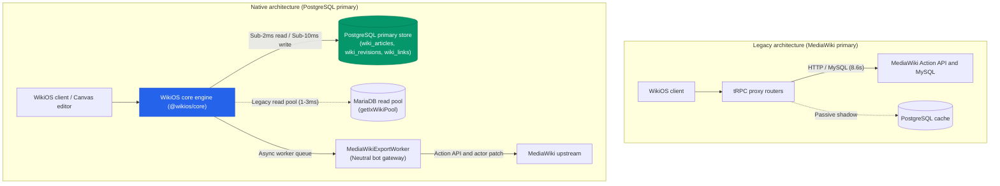
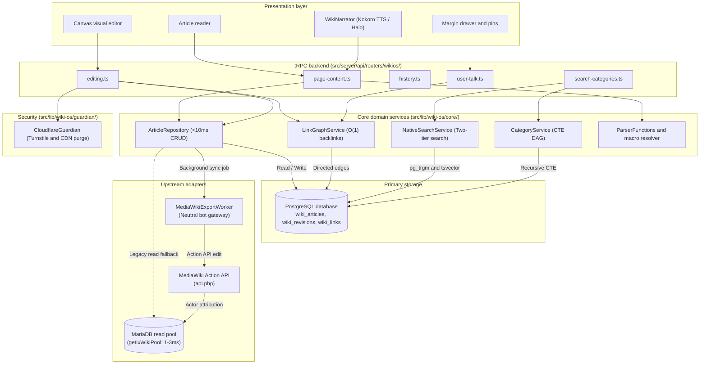

# WikiOS core engine (`src/lib/wiki-os/`)

Status: Decoupled native knowledge engine  
Package: `@wikios/core`  
Runtime: TypeScript 7.0, Bun 1.4  
Platform: IxStates 1.4.0 Ogma (RC-1)  

---

## Purpose and architectural vision

`src/lib/wiki-os/` contains the standalone core of WikiOS, the knowledge and worldbuilding engine for IxStates.

WikiOS previously operated as a proxy client over an external MediaWiki instance. Under the decoupled architecture (Plan 170), PostgreSQL is the primary database for articles, revisions, link graphs, and categories. Reads take under 2ms and atomic writes take under 10ms. MediaWiki runs in the background as a headless converter and compatibility layer.



---

## Dual-layer storage model

WikiOS splits document storage into two layers for readers and editors.

1. **`contentHtml` (Read layer).** Pre-compiled HTML with infoboxes, table of contents, notices, and simulation macros baked in. Reads query PostgreSQL indexes directly. No runtime regex parsing or Parsoid HTTP hops. Latency is under 2ms.
2. **`contentJson` (Edit layer).** Structured block AST containing typed nodes (paragraph, heading, infobox, table, image, wikilink). The visual Canvas editor mounts this AST directly with zero parser delay.
3. **`wikitext` (Compatibility layer).** Serialized on save for background MediaWiki mirroring, bots, and raw exports.

```
Content pipeline:

Read path (< 2ms):
Browser ◄── (contentHtml from index) ── PostgreSQL (wiki_articles)

Write path (< 10ms):
Canvas editor ──► Compile HTML and extract links ──► PostgreSQL transaction
                                                            │
                                        (Async background)  ▼
                                                    MediaWikiExportWorker
                                                            │
                                                            ▼
                                                    Action API + MariaDB actor
```

---

## System topology



---

## Subsystems and data models

### Relational directed link graph (`wiki_links`)
Internal links are stored as directed edges in `wiki_links`.
- Querying `SELECT sourceArticleId FROM wiki_links WHERE targetSlug = :slug` resolves in under 1ms.
- Links where `targetArticleId IS NULL` render as red links with create triggers without extra network requests.
- Renaming an article cascades across `wiki_links`, keeping citations valid.
- The margin drawer uses the graph to display inbound links, outbound references, and co-cited pages.

### Two-tier search engine
Search uses PostgreSQL indexes instead of the MediaWiki search API.
- **Tier 1 (Autocomplete, <1.5ms).** Trigram similarity (`pg_trgm`) and prefix matching handle misspellings and live keystroke lookup in the `Cmd+K` palette.
- **Tier 2 (Full-text search, <3.5ms).** Weighted `tsvector` queries rank title (1.0), summary and infobox keys (0.4), headings (0.2), and body text (0.1). Server generates context snippets with `ts_headline()`.

### Direct MariaDB read pool (`mysql-reader.ts`)
Legacy unmigrated pages, history, recent changes, and categories are read directly through the MariaDB connection pool (`getIxWikiPool()`) on port 3306 or 13306. These queries run in 1 to 3ms without HTTP requests.

### Asynchronous bot bridge (`write-service.ts`, `sync-worker.ts`)
When a user edits a page, WikiOS writes to PostgreSQL immediately. A background worker (`MediaWikiExportWorker`) then mirrors the edit upstream through MediaWiki `api.php` using the neutral bot account (`WikiOS-Bridge`). The worker updates `rev_actor` in `revision` and `rc_actor` in `recentchanges` so the edit is attributed to the user rather than the bot.

### Migration pipeline (`migration/`)
The migration engine reads MediaWiki SQL dumps (`.sql`) and XML exports (`.xml`) via streaming tokenizers with constant memory use. It extracts infobox fields, builds the directed link graph, and generates the category hierarchy during import.

### Security and CDN defense (`guardian/`)
`CloudflareGuardian` verifies Turnstile tokens, checks Zero-Trust client credentials for automation, and fires non-blocking cache purges against Cloudflare Zone endpoints when articles are modified. Heuristic rules reject mass blanking (>70% text deletion) and script injection.

### Dynamic simulation macros (`template-resolver.ts`)
Wikitext macros like `{{CountryData:Name|field}}` and `{{BusinessData:Name|field}}` are evaluated in a single batch query against active game tables in under 2ms.

### Margin and annotations
The margin drawer (`WikiMarginDrawer.tsx`) opens alongside the article. Users can highlight text to start discussion threads or save excerpts to Stash collections.

---

## Directory layout

```
src/lib/wiki-os/
├── index.ts                   # Root barrel export
├── config.ts                  # Configuration and DEFAULT_MEDIAWIKI_URL
├── types.ts                   # Domain types
├── auth.ts                    # User identity and role resolution
├── use-wiki-auth.ts           # React client hook for auth
├── storage.ts                 # Context and country resolution
│
├── core/                      # PostgreSQL domain services
│   ├── index.ts               # Core barrel export
│   ├── domain-types.ts        # Nominal types and Block AST schema
│   ├── article-repository.ts  # CRUD repository (<2ms read, <10ms write)
│   ├── link-graph-service.ts  # Directed link graph engine
│   ├── native-search-service.ts # Two-tier search service
│   ├── parser-functions.ts    # ParserFunctions evaluator (#if, #switch, #expr)
│   └── category-service.ts    # Category hierarchy and membership queries
│
├── guardian/                  # Security and CDN management
│   ├── index.ts               # Guardian barrel export
│   └── cloudflare-guardian.ts # Turnstile and Cloudflare cache purges
│
├── adapters/                  # External adapters and background sync
│   ├── index.ts               # Adapters barrel export
│   ├── mediawiki/             # MediaWiki compatibility layer
│   │   ├── index.ts           # MediaWiki barrel export
│   │   ├── parsoid.ts         # Parsoid HTML and wikitext converter
│   │   ├── write-service.ts   # Action API write gateway and actor patch
│   │   ├── timestamp.ts       # Timestamp conversion helper
│   │   ├── sync-worker.ts     # Background export queue
│   │   └── bridge/            # MariaDB direct pool and external readers
│   │       ├── mysql-pool.ts  # Connection pool
│   │       ├── mysql-reader.ts # Raw MariaDB queries
│   │       ├── http-reader.ts # External readers for IIWiki and AltHistory
│   │       ├── dispatchers.ts # Multi-source dispatchers
│   │       ├── types.ts       # Row and cache types
│   │       └── index.ts       # Bridge barrel export
│   └── ixstates/              # Simulation adapters
│       ├── index.ts           # IxStates barrel export
│       ├── unified-parser.ts  # Infobox indicator parser
│       ├── infobox-mapper.ts  # Column mappings for Country model
│       ├── lore-card-generator.ts # Collectible card scorer
│       ├── ixworld-mapper.ts  # Latitude and longitude parser
│       ├── eligible-country-service.ts # Category resolution for active nations
│       ├── content-extractor.ts # Structured section parser
│       ├── content-analyzer.ts # Quality scoring
│       ├── entity-parser.ts   # Ministries and government official extractors
│       ├── roster-parser.ts   # Cabinet and leader roster parsers
│       ├── prose-generator.ts # Factbook generator
│       └── user-sync.ts       # Clerk to wiki user mapping
│
├── transformers/              # Content formatters
│   ├── index.ts               # Transformers barrel export
│   ├── html-transformer.ts    # HTML post-processor (Infobox, TOC, Notices)
│   ├── infobox-parser.ts      # Template tokenizer
│   ├── wikitext-diff.ts       # Visual diff calculator
│   ├── image-url.ts           # Image URL resolver
│   ├── url-compat.ts          # Route normalization
│   ├── fix-editor-images.ts   # Image sanitizer for editor
│   ├── safe-decode.ts         # URI decoder
│   ├── media-theme.ts         # Theme switcher (Light, Dark, Plinth)
│   ├── resolve-highres-image.ts # High-resolution thumbnail resolver
│   └── wikitext-parser.ts     # Zero-dependency markup parser
│
├── templates/                 # Template registry
│   ├── index.ts               # Templates barrel export
│   ├── template-resolver.ts   # Wikitext template provider
│   └── template-registry.ts   # TemplateData schemas
│
├── editor/                    # Visual editor support
│   ├── index.ts               # Editor barrel export
│   ├── draft-store.ts         # Local draft autosave store
│   └── wiki-embed-shared.ts   # Map and simulation embed definitions
│
└── migration/                 # Ingestion engine
    └── index.ts               # SQL and XML dump streaming parser
```

---

## Latency benchmarks

| Operation | Target latency | Mechanism |
| :--- | :--- | :--- |
| Article read (native) | < 2ms | Pre-compiled `contentHtml` query by `(source, title)` index |
| Legacy article read | 1 to 3ms | Direct MariaDB pool SQL query (`mysql-reader.ts`) |
| Spotlight autocomplete | < 1.5ms | Prefix match with PostgreSQL trigram index |
| Full-text search | < 3.5ms | PostgreSQL `tsvector` GIN query with `ts_headline` |
| Article write | < 10ms | PostgreSQL transaction with async worker dispatch |
| Backlink lookup | < 1ms | Indexed lookup on `wiki_links(targetSlug)` |
| Category DAG query | < 3ms | Recursive CTE traversing parent-child edges |
| Macro resolution | < 2ms | Batch query against in-memory simulation cache |

---

## Import standards

Import from the canonical path alias `~/lib/wiki-os`:

```typescript
// Recommended: Clean package imports
import { ArticleRepository, LinkGraphService, NativeSearchService } from "~/lib/wiki-os";
import { CloudflareGuardian } from "~/lib/wiki-os/guardian";
import { DEFAULT_MEDIAWIKI_URL, DEFAULT_USER_AGENT } from "~/lib/wiki-os/config";

// Prohibited: Direct HTTP calls or deleted paths
import { WikiApiClient } from "~/lib/wiki"; // Deleted path
fetch("https://ixwiki.com/api.php");        // Bypasses database and cache layers
```
