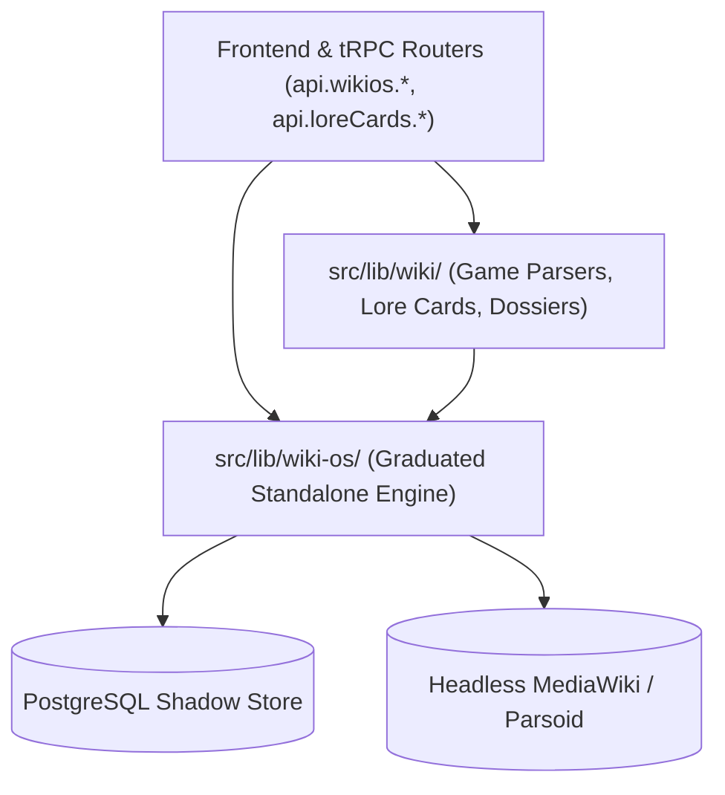

# IxStates Wiki Domain & Game Adapters (`src/lib/wiki/`)

**Architecture Status**: Host Application Extension & Game Adapters  
**Engine Dependency**: Consumes `src/lib/wiki-os/` ( WikiOS Engine)

---

## 1. Distinction Between `src/lib/wiki-os` and `src/lib/wiki`

| Aspect | `src/lib/wiki-os/` (WikiOS Engine) | `src/lib/wiki/` (IxStates Game Adapters) |
|---|---|---|
| **Role** | Core wiki engine (reader, editor, storage, search, Parsoid). | IxStates-specific game domain logic, factbooks, and parsers. |
| **Dependencies** | Pure, standalone-capable. Zero game models. | Integrates `Country`, `Card`, `Economy`, `PointOfInterest`. |
| **Graduation** | Independent package (`@wikios/core`). | Belongs exclusively to the IxStates nation simulation platform. |

---

## 2. Directory Contents

```
src/lib/wiki/
├── config.ts                  # Re-exports canonical config from ~/lib/wiki-os/config
├── types.ts                   # Re-exports canonical types from ~/lib/wiki-os/types
├── bridge.ts                  # Re-exports canonical WikiBridge from ~/lib/wiki-os/bridge
├── image-url.ts               # Re-exports canonical image helpers from ~/lib/wiki-os/image-url
│
├── lore-card-generator.ts     # Parses wiki articles to generate IxVault collectible cards
├── eligible-country-service.ts# Walks category graphs to determine active nations
├── ixworld-mapper.ts          # Maps article geo-coordinates for interactive map pins
├── user-sync.ts               # Syncs MediaWiki contributor accounts to IxStates users
│
├── unified-parser.ts          # Extracts 80+ national indicators from wikitext into Country models
├── infobox-parser.ts          # Low-level wikitext infobox tokenizers
├── infobox-mapper.ts          # Maps infobox keys to Prisma schema columns
├── data-parser.ts             # Parses numeric economic and demographic statistics
├── entity-parser.ts           # Extracts organizations, cities, and landmarks
├── content-analyzer.ts        # Article quality scoring & rarity calculations
├── content-extractor.ts       # Section-specific text extractors
├── prose-generator.ts         # Generates national identity descriptions from parsed data
│
├── cache-service.ts           # Legacy WikiCache database model wrapper
└── legacy-service.ts          # Backward-compatibility wrappers for legacy country pages
```

---

## 3. Direction of Dependencies



**Rule**: `src/lib/wiki-os/` MUST NEVER import from `src/lib/wiki/`. All cross-boundary data flow goes from `src/lib/wiki/` into `src/lib/wiki-os/`.
